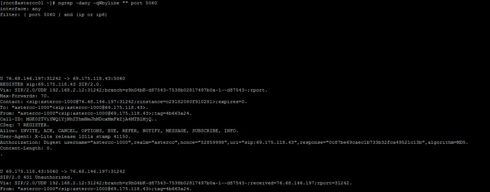
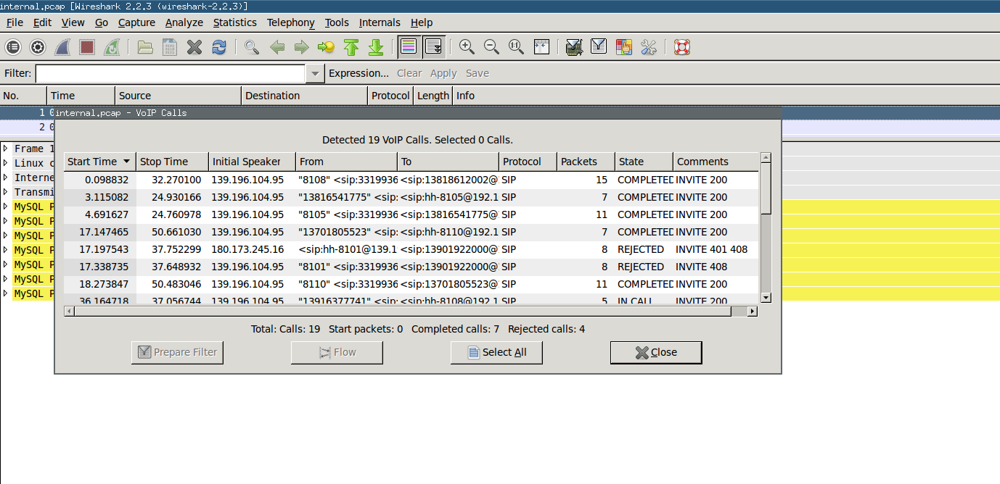
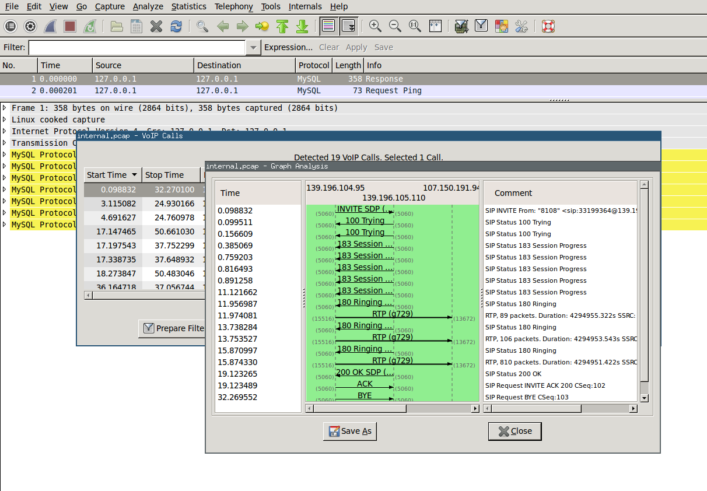
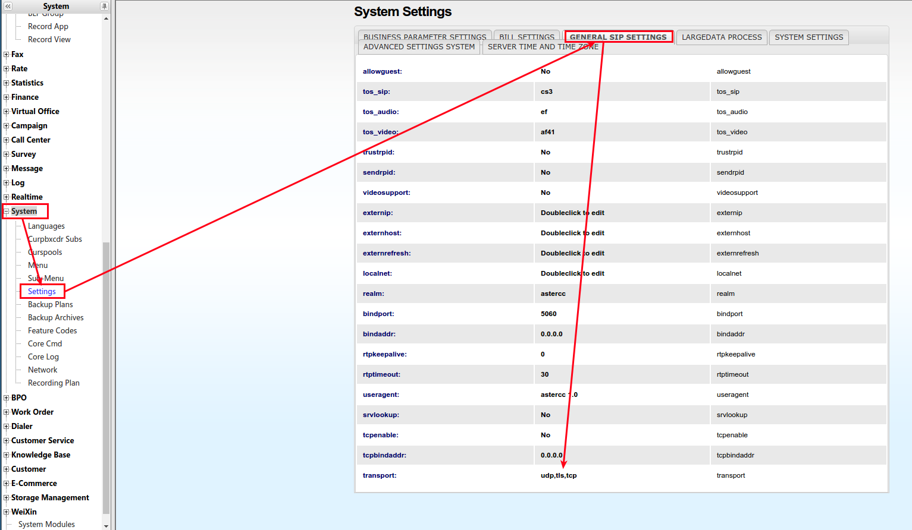
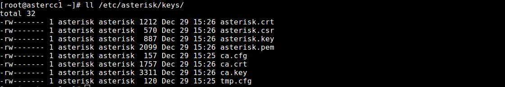
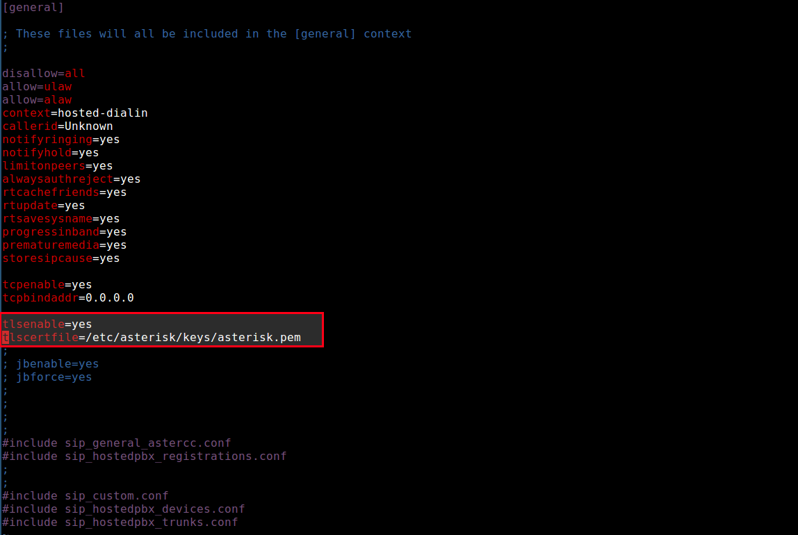
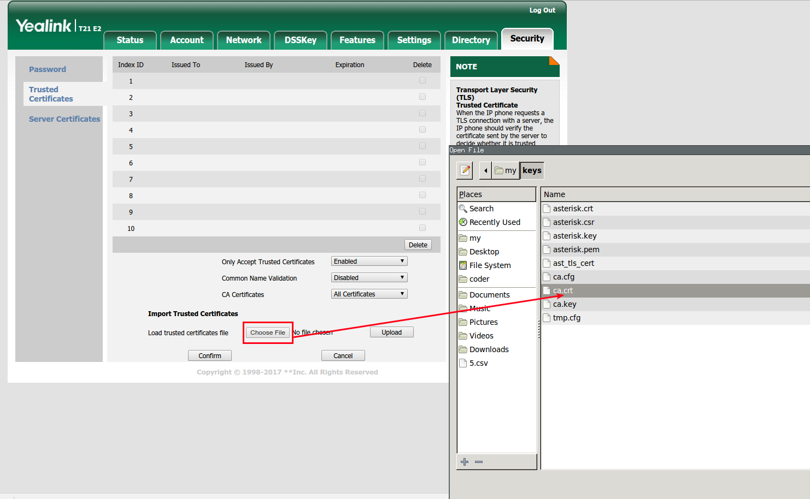
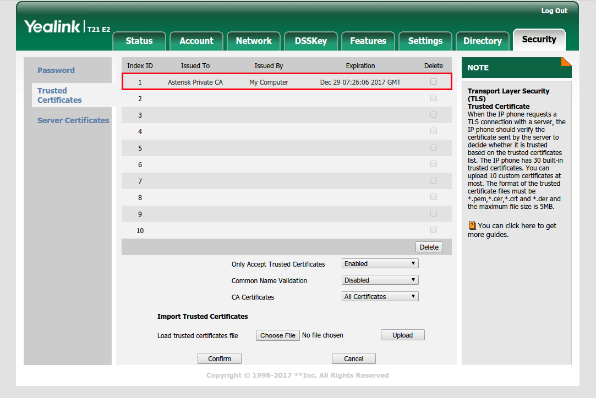
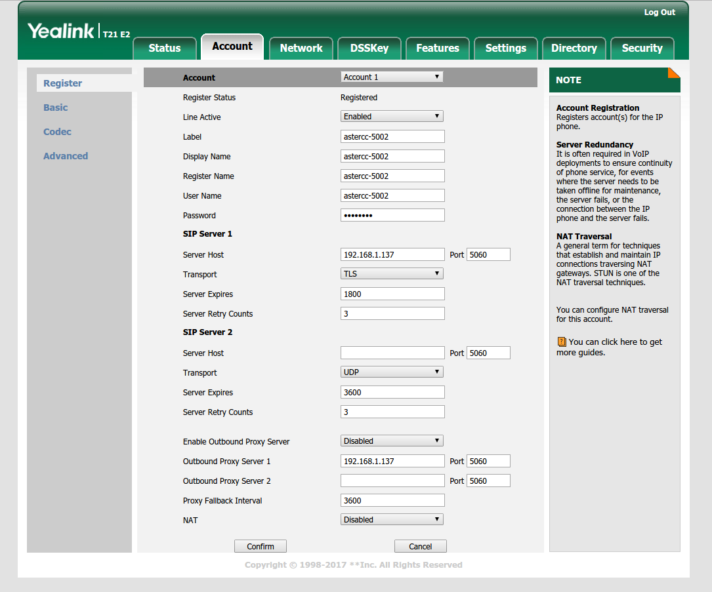

# Diagnóstico de red y VoIP

## Qué es

AsterCC corre sobre SIP — telefonía transmitida por red IP en vez de líneas dedicadas. Cuando algo falla a nivel de red (registro que no llega, audio cortado, llamadas que no conectan), hace falta ver el tráfico real, no solo lo que muestra la interfaz web. Esta página documenta las herramientas de diagnóstico de bajo nivel usadas para eso, más dos tareas de infraestructura relacionadas: replicar MySQL entre servidores y compartir archivos de grabación entre dos instancias de AsterCC.

!!! warning "Puede estar desactualizado"
    Estas guías provienen de la documentación original en inglés (~2018) y no tienen contraparte en la fuente china — nunca fueron traducidas ni revisadas contra versiones posteriores del sistema. Los comandos base (`tcpdump`, `ngrep`, `sip set debug`) siguen siendo válidos en Asterisk moderno, pero verifica versiones de paquetes antes de usarlos en producción.

## Cómo se usa

### Depuración de SIP con `ngrep`

`ngrep` es "grep para la red" — filtra tráfico en vivo por contenido, útil para ver mensajes SIP sin necesidad de abrir una captura completa.

```bash
yum install -y ngrep

# Ver todo el tráfico SIP (puerto 5060) de cualquier interfaz
ngrep -dany -qWbyline "" port 5060

# Acotar a un host específico
ngrep -dany -qWbyline "" port 5060 and host astercc.org

# Acotar a un dispositivo por su usuario SIP
ngrep -dany -qWbyline "astercc-1000" port 5060 and host astercc.org

# Solo paquetes REGISTER
ngrep -deth0 -qWbyline "^REGISTER" port 5060

# Guardar la captura a un archivo
ngrep -W byline -d eth0 port 5060 -O capture_file
```



!!! tip
    `ngrep` captura a un nivel anterior al firewall — si `ngrep` ve un paquete pero Asterisk no reacciona a él, el problema está en las reglas de `iptables`, no en la señalización SIP.

**Depuración nativa de Asterisk**, desde la consola (`asterisk -r`):

```
sip set debug on              # activa el volcado de mensajes SIP
sip set debug ip <ip>         # acota a una IP específica
sip set debug off             # desactiva
```


### Capturar y analizar una llamada completa con `tcpdump` + Wireshark

Para casos más complejos donde `ngrep` no alcanza, se captura el tráfico completo y se analiza offline:

```bash
yum install -y tcpdump

# Capturar todo el tráfico de cualquier interfaz a un archivo
tcpdump -i any -s 65535 -w internal.pcap
```

Con la captura corriendo, reproduce el problema (haz la llamada), luego `Ctrl+C` para detener. Descarga el archivo `.pcap` y ábrelo en [Wireshark](https://www.wireshark.org/download.html):

1. Ve a **Telephony → VoIP Calls** — Wireshark agrupa automáticamente los paquetes por llamada.

   

2. Selecciona una llamada y haz clic en **Flow** para ver un diagrama de la señalización SIP paso a paso.

   

3. Haz clic en cualquier paso del diagrama para ver el paquete IP correspondiente en detalle.

### Configurar SIP sobre TLS (registro cifrado)

Para que un teléfono IP se registre usando SIP sobre TLS en vez de UDP/TCP sin cifrar:

1. En **Sistema → Configuración → Configuración general de SIP**, agrega `tls` al campo **transporte** (separado por coma si ya hay otro protocolo). Recarga para aplicar.

   

2. Genera un certificado con el script de Asterisk:
   ```bash
   wget http://download3.astercc.org/ast_tls_cert
   chmod +x ast_tls_cert
   ./ast_tls_cert -C pbx.midominio.com -O "Mi Organización" -d /etc/asterisk/keys
   ```

   

3. Edita `sip.conf` para habilitar soporte TLS.

   

4. Sube el certificado de CA (`ca.crt`) al teléfono IP (ej. Yealink).

   
   

5. En el teléfono, cambia el transporte SIP a **TLS**.

   

6. Abre el puerto TCP 5060 en el firewall.

### Compartir grabaciones entre dos servidores con Samba

Escenario: un servidor AsterCC (B) necesita acceder a las grabaciones almacenadas en otro servidor AsterCC (A).

**En el servidor A (comparte el directorio):**
```bash
yum install samba
useradd sbu
smbpasswd -a sbu   # define una contraseña para este usuario
```

Agrega al final de `/etc/samba/smb.conf`:
```ini
[ccmonitor]
    path = /var/spool/asterisk/monitor
    comment = Home Directories
    browseable = no
    writable = yes
    create mask = 777
    directory mask = 777
    force user = asterisk
```

```bash
service smb restart
```

**En el servidor B (monta el directorio remoto):**
```bash
mount -t cifs -o username=sbu,password=<contraseña> //<ip-servidor-A>/ccmonitor /var/spool/asterisk/monitor
```

Para que el montaje persista tras reiniciar, agrega a `/etc/fstab`:
```
//<ip-servidor-A>/ccmonitor /var/spool/asterisk/monitor cifs defaults,username=sbu,password=<contraseña> 0 0
```

Verificar: `df -hT`. Desmontar: `umount //<ip-servidor-A>/ccmonitor`.

!!! tip
    Si el montaje no responde, revisa que los puertos de Samba estén abiertos en ambos sentidos: TCP 139/445 y UDP 137/138.

### Replicación maestro-esclavo de MySQL

Para sincronizar cambios de base de datos de un servidor "maestro" hacia uno o más servidores "esclavo" en tiempo real.

**En el maestro** (`my.cnf`):
```ini
log-bin=mysql-bin
server-id=1
binlog-do-db=ccupdate
binlog-ignore-db=mysql
```

**En el esclavo** (`my.cnf`):
```ini
server-id=2
replicate_wild_do_table=ccupdate.%
replicate_wild_ignore_table=mysql.%
```

**Crear cuenta de replicación en el maestro:**
```sql
GRANT REPLICATION SLAVE ON *.* TO 'master'@'<ip-esclavo>' IDENTIFIED BY '<contraseña>';
```

**Tomar un snapshot consistente del maestro:**
```sql
FLUSH TABLES WITH READ LOCK;
SHOW MASTER STATUS;  -- anota los valores de File y Position
```

Sin cerrar esa sesión (para no perder el lock), en otra shell:
```bash
mysqldump -p<password> --databases astercc10 > astercc10.sql
mysql -p<password> < astercc10.sql   # restaurar en el esclavo
```

**En el esclavo, apuntar al maestro y arrancar la replicación:**
```sql
CHANGE MASTER TO
  master_host='<ip-maestro>',
  master_user='master',
  master_password='<contraseña>',
  master_log_file='mysql-bin.000001',
  master_log_pos=<valor de Position>;

START SLAVE;
SHOW SLAVE STATUS\G
```

Replicación funcionando correctamente = `Slave_IO_Running: Yes` y `Slave_SQL_Running: Yes`, sin mensajes en `Last_IO_Error` ni `Last_SQL_Error`.

!!! warning
    Si el maestro usa MySQL 5.6+ y el esclavo una versión 5.5 o anterior, hay que forzar `binlog_checksum = NONE` en el maestro (`my.cnf` o `SET GLOBAL binlog_checksum = 'NONE';`) — de lo contrario la replicación falla por incompatibilidad de formato.

## Referencia rápida

| Necesito | Herramienta |
|---|---|
| Ver tráfico SIP en vivo | `ngrep` |
| Depuración nativa de Asterisk | `sip set debug on` desde la consola |
| Capturar y analizar una llamada completa | `tcpdump` + Wireshark |
| Registro cifrado de un teléfono IP | SIP sobre TLS |
| Compartir grabaciones entre servidores | Samba (CIFS) |
| Sincronizar bases de datos entre servidores | Replicación maestro-esclavo de MySQL |

---

## Fuentes

- `raw/en/how-to/how_to_use_ngrep_for_fast_sip_packet_analysis.txt`
- `raw/en/how-to/how_to_use_tcpdump_and_wireshark_to_debug_voip_calls.txt`
- `raw/en/how-to/how_to_set_sip_phone_uses_tls_to_register_the_astercc_system.txt`
- `raw/en/how-to/how_to_use_samba_share_files_between_linux_and_linux.txt`
- `raw/en/how-to/how_to_set_up_master_slave_replication_in_mysql.txt`
