# Gestión avanzada del call center

## Qué es

El menú **呼叫中心高级管理 / Call Center (Advanced)** agrupa un conjunto de utilidades de configuración que no pertenecen a un solo módulo de negocio, sino que dan soporte transversal a varios: campañas de marcación, oficina virtual/BPO y atención al cliente. Incluye: vínculo de aplicaciones externas (CRM propio) con el timbrado entrante, gestión de tareas internas del equipo, importación y exportación masiva de datos, turnos y horarios de agentes, motivos de pausa, formato de visualización de números telefónicos, código de área de un número, campos y categorías de campo genéricos del sistema, flujos de trabajo de aprobación, calificación de llamadas por el cliente, y gestión de enlaces reutilizables.

No cubre configuración de negocio en sí (eso vive en [Marcador y campañas](../modulos/marcador-y-campanas.md), [Oficina virtual / BPO](../modulos/oficina-virtual-bpo.md) o [Atención al cliente, mensajería y e-commerce](../modulos/atencion-cliente-mensajeria-ecommerce.md)), sino la maquinaria administrativa que esos módulos reutilizan.

## Cómo se usa

### Integración de aplicaciones externas (CRM propio)

Cuando el negocio ya tiene un sistema propio (tipo CRM) y quiere que AsterCC le envíe los eventos de llamada para mostrar la ficha del cliente automáticamente ("pantalla emergente"), se usan dos pantallas en conjunto:

**Gestión de aplicaciones de negocio** (`Business Apps`): define la aplicación externa —nombre, identificador único, equipo, grupo de agentes, URL de la aplicación (se embebe como pestaña dentro de la plataforma del agente), URL de eventos de llamada, número/nombre que se envía en la llamada saliente, si se abre por defecto, si se envían las credenciales de login del agente a la aplicación, si se usa el aviso emergente propio de la plataforma o el de la aplicación externa, y si el agente puede transferir a cualquier número o solo a contactos frecuentes.

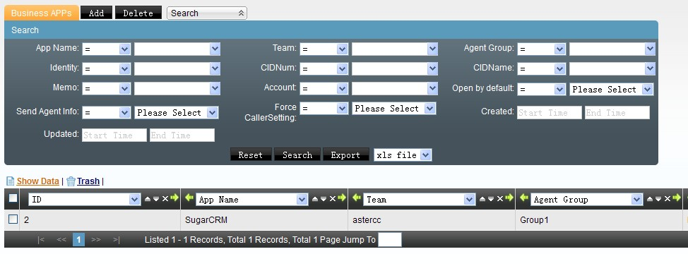

**Vínculo de aplicación entrante** (`App Binding`): asocia esa aplicación (o una tarea de campaña, atención al cliente u oficina virtual) a un DID, un troncal y/o un número que llama, para que el sistema sepa qué pantalla mostrarle al agente según por dónde entró la llamada. Los criterios de coincidencia (DID, DID de un grupo, troncal, número que llama) se pueden combinar; si hay varias reglas que podrían aplicar, gana la de mayor prioridad. También permite definir una **aplicación por defecto de grupo**, para cuando el agente marca directamente desde su extensión sin que haya pasado por un enrutamiento explícito.

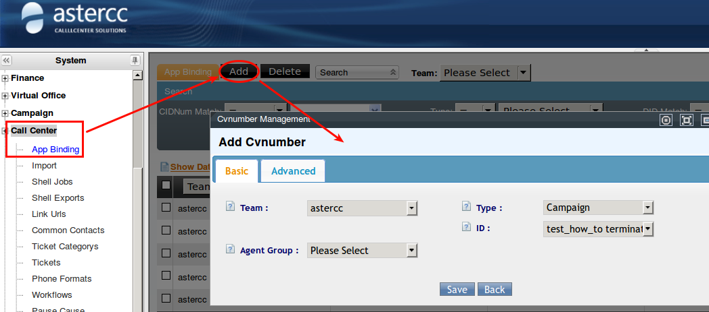

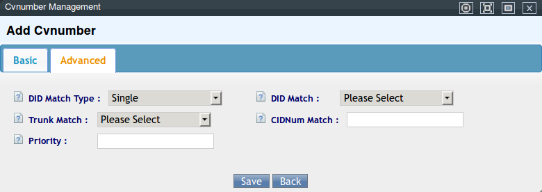

### Gestión de tareas internas del equipo

Distinta de las tareas de campaña de marcación: es un sistema simple de asignación y seguimiento de pendientes internos entre cuentas/equipos, con nivel de urgencia, adjuntos, historial de cambios y respuestas.

- **Categorías de tarea:** clasificación libre para ordenar las tareas (nombre + descripción).
- **Tareas:** cada tarea define título, categoría, nivel (general/importante/urgente/muy urgente), fecha de inicio prevista, contenido, adjunto, y a quién se asigna —equipo, y opcionalmente grupo y persona específica. Sin persona asignada, la tarea queda disponible para todo el equipo (o todo el grupo, si se eligió uno). Al abrir una tarea se ven cinco secciones: datos básicos, descripción original, archivos adjuntos, historial de cambios, y respuestas (donde se puede reasignar, tomar la tarea, o marcarla completa/a rehacer/cancelada). Cada cambio dispara un aviso a la otra parte (y, si está configurado, correo o mensaje interno).

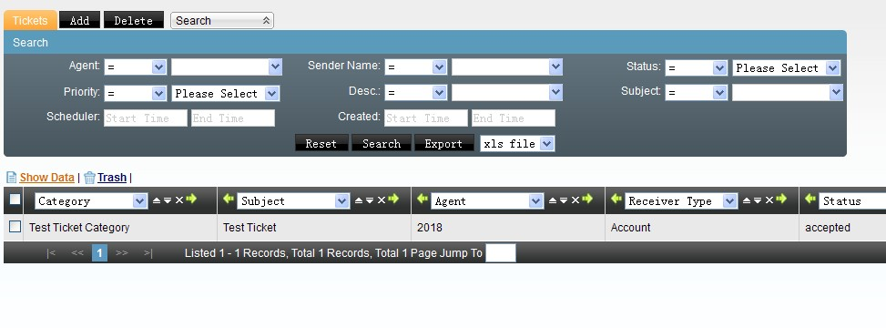

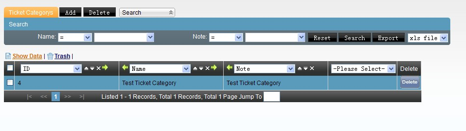

### Importación y exportación masiva de datos

**Importar datos:** sube un archivo CSV (recomendado, en UTF‑8) o XLS y lo dirige a una de las tablas del sistema: clientes individuales, clientes institucionales, lista de envío masivo (correo/SMS), lista negra de campañas, código de área, DID, lista negra o blanca de entrantes, u otras listas de clientes de campaña. El sistema intenta emparejar automáticamente las columnas del archivo con los campos de la tabla; los que no coincidan se ajustan a mano. Puede programarse la hora de ejecución y si se descarta la primera fila (encabezado).

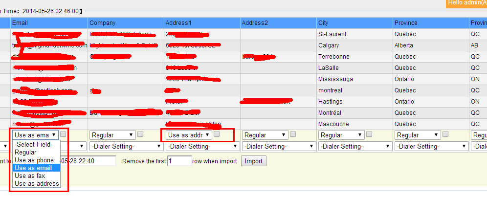

- **Importar y comenzar (`Import & Start`):** para inicializar de cero una tabla de clientes vacía (general o de una tarea puntual) sin configurar antes los campos personalizados uno por uno — el sistema crea los campos automáticamente a partir del encabezado del archivo. Detecta por convención de nombre los campos de teléfono (`phone_custom*`), correo (`email_custom*`), fax (`fax_custom*`) y dirección (`address_custom*`) para mostrarles el ícono correspondiente en la pantalla del agente. Solo aplica a una tabla que no tenga datos ni campos previos; ejecutarlo sobre una tabla con datos existentes los borra.
- **Diccionario de coincidencia de importación** (`Import Dict` / 导入数据匹配): como el chino admite varias formas de escribir el mismo valor (ej. "男" / "男士" para "masculino"), esta pantalla mapea esas variantes de texto libre a los ~11 valores fijos que espera la base de datos (sexo, estado civil, intención de compra, sí/no, etc.), para que la importación no pierda esos datos por no reconocer la variante exacta.
- **Gestión de planes de importación** (`Shell Import Jobs` / 计划管理): monitorea cada trabajo de importación creado — tabla destino, archivo subido, estado (pendiente/en curso/completo/error), total de filas, filas exitosas/fallidas/duplicadas, porcentaje de éxito, y descarga de los datos exitosos, fallidos, duplicados u originales. Un trabajo "en curso" no se puede eliminar ni descargar.
- **Gestión de archivos exportados** (`Shell Export`): lista los archivos generados por operaciones de exportación (descargables por SFTP desde `/var/www/html/asterCC/data/shellexport/`) y, por separado, las grabaciones exportadas en lote (en `/var/www/html/asterCC/data/monitor_download/`, con botón de descarga directa desde la web solo si el parámetro "Web Download Recording" está activado en Sistema → Configuración avanzada).

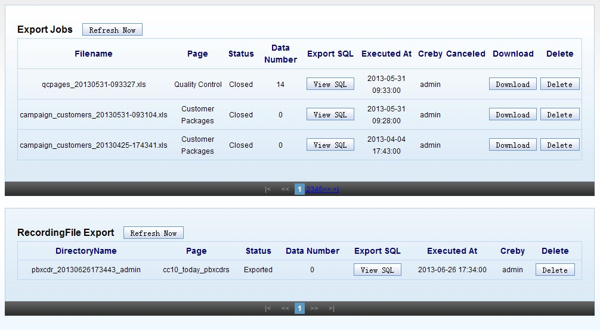

Al importar hacia una tarea con marcación predictiva habilitada, aparecen opciones adicionales: qué columna alimenta la lista de predictivo, prioridad y horario de marcación, si se limpia el agente asignado en registros duplicados, y qué hacer con duplicados respecto a la lista de predictivo (ignorar, importar todos, o ignorar solo los que ya tuvieron envío exitoso).

### Código de área (número que llama)

**Código de área / Área de número** (`Area Code`): asocia el prefijo de un número a país, provincia, ciudad y tipo de número (fijo, u operador móvil en China). Se puede dar de alta manualmente o importar en lote (ver importación de datos, tabla "código de área"). Con esta tabla poblada, la pantalla del agente muestra automáticamente el origen geográfico del número tanto en llamadas entrantes como en llamadas salientes de campaña. Incluye un botón para vaciar toda la tabla.

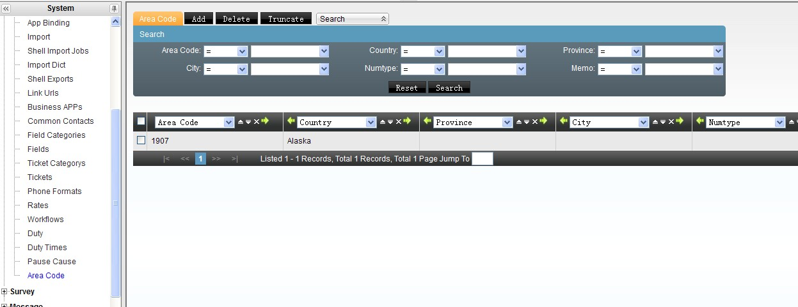

### Reglas de visualización de número telefónico

**Formato de teléfono** (`Phone Format`): el sistema guarda los números como una cadena de dígitos sin separadores (para uniformidad, sea que el dato venga de alta manual o de importación). Esta pantalla define reglas de formato solo para la *visualización* — no altera el dato guardado. Una regla usa `x`/`X` para cualquier dígito 0-9 y `z`/`Z` para cualquier dígito 1-9 en el patrón de entrada, y `#` en el patrón de salida por cada dígito, agregando el resto de caracteres (paréntesis, guiones, espacios) libremente. El sistema trae 4 reglas por defecto orientadas a números fijos de China continental.

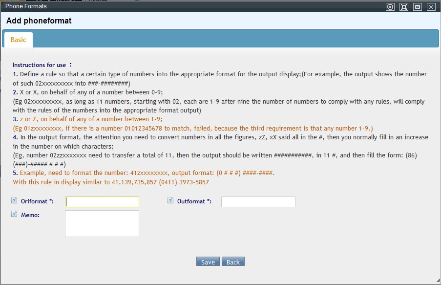

### Turnos y horarios de agentes

- **Gestión de franjas horarias** (`Duty Time`): define bloques de horario reutilizables (nombre, hora de inicio, hora de fin) por equipo, para usarlos al armar el calendario de turnos.

  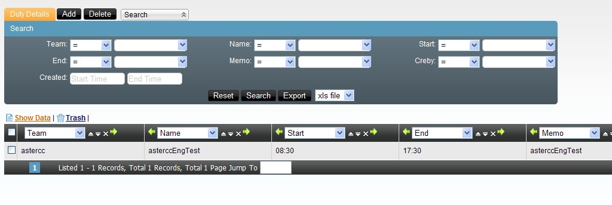

- **Gestión de turnos de agentes** (`Duty`): calendario visual donde se selecciona un conjunto de agentes y unos días (clic izquierdo) y se les asigna, por clic derecho, una de las franjas horarias definidas arriba. El propio agente puede ver su turno desde esta misma pantalla, y el jefe de grupo puede ver el de todo su grupo. Desde ahí el agente puede solicitar **cambio de turno** (elige con qué compañero del grupo intercambiar fecha) o **solicitud de permiso/ausencia** — ambas solicitudes se envían a aprobación a través de un flujo de trabajo (ver más abajo).

### Motivos de pausa

**Motivos de pausa** (`Pause Cause`): catálogo de razones que el agente debe elegir al pausarse (o que el jefe de grupo elige al forzar la pausa de un agente desde el monitor en tiempo real). El sistema no permite agregar ni eliminar motivos, solo editarlos: texto del motivo, equipo (vacío = disponible para todo el sistema), habilitado/deshabilitado, si requiere aprobación del jefe de grupo (el agente debe ingresar la cuenta y contraseña de un jefe de grupo para poder pausarse), y nota. Si el agente elige el motivo "Otro", se habilita un cuadro de texto libre. Cuando el jefe de grupo fuerza la pausa desde el monitor, no necesita volver a autenticarse aunque el motivo elegido normalmente requiera aprobación. El tiempo en cada motivo de pausa se contabiliza para reportes.

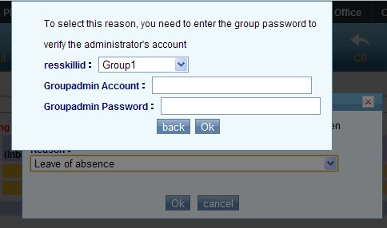

### Campos y categorías de campo del sistema

**Categorías de campo** y **Campos** (`Field Category` / `Field`): mecanismo genérico para definir las opciones de un campo de selección fija en pantallas que no tienen su propio editor de opciones — por ejemplo, el campo "Estado" de contactos frecuentes (ver abajo). Primero se crea la categoría con un identificador en inglés que el sistema ya reconoce por convención (ej. `contact_status`); luego, dentro de "Campos", se agregan los valores concretos de esa categoría (uno por registro).

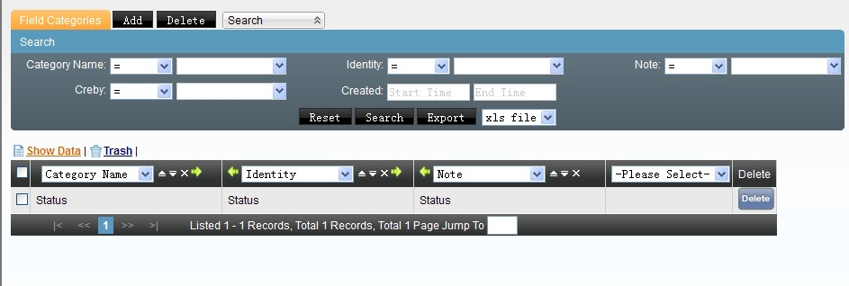

!!! note "No confundir con los campos personalizados de negocio"
    Esto es distinto de los **campos personalizados** de clientes/pedidos que se configuran por campaña, por usuario virtual (ver [Oficina virtual / BPO](../modulos/oficina-virtual-bpo.md#campos-personalizados-por-usuario-virtual)) o por ficha de cliente/institución (ver [Atención al cliente, mensajería y e-commerce](../modulos/atencion-cliente-mensajeria-ecommerce.md#gestion-de-clientes)). Estos últimos son de tipo texto/select/fecha/archivo/enlace y capturan datos de negocio; los de esta sección solo alimentan listas de opciones fijas de pantallas del propio sistema.

### Contactos frecuentes (agenda administrativa)

**Contactos frecuentes** (`Common Contacts`) se configura desde este menú de gestión avanzada, aunque su uso principal ya está documentado desde la perspectiva de oficina virtual en [Oficina virtual / BPO — Contactos frecuentes](../modulos/oficina-virtual-bpo.md#contactos-frecuentes-opcional): equipo, alcance (grupo/tipo de módulo/ID de módulo), nombre, teléfono, si el número se muestra al agente, descripción y un campo de estado libre. Lo específico de esta página de gestión avanzada es cómo se personaliza ese campo **Estado**: se define primero la categoría de campo con identificador `contact_status` (en Categorías de campo) y luego se agregan los valores concretos uno por uno (en Campos) — el mecanismo genérico descrito arriba.

### Flujos de trabajo (aprobaciones)

**Gestión de flujos de trabajo** (`Workflow`): define circuitos de aprobación reutilizables por varios procesos del sistema — por ejemplo, las solicitudes de cambio de turno o de permiso mencionadas en turnos de agentes pasan por un flujo de trabajo antes de confirmarse. Un flujo de trabajo tiene equipo, identificador único y descripción; dentro de él se agregan **nodos**, cada uno con un nodo superior (para armar una jerarquía de aprobación), tipo (aviso — solo notifica, sin bloquear— o revisión —requiere aprobación explícita—), tipo de validación (todos deben aprobar, o basta que apruebe una parte), y a quién se dirige el nodo (cuenta, grupo de cuentas, agente o grupo de agentes del equipo).

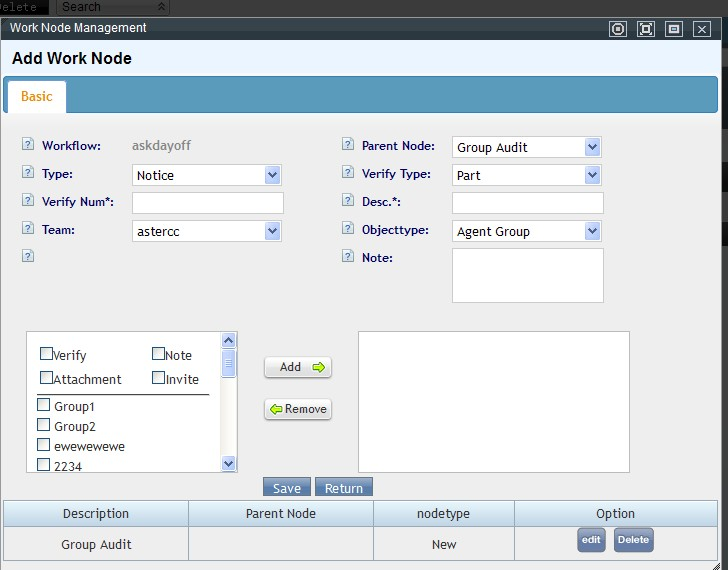

### Calificación de llamadas por el cliente

**Gestión de calificación** (`Rate` / 评分管理): si una cola tiene habilitada la calificación (ver glosario, [Cola / Grupo de agentes — Calificación del agente](../glosario.md)), al terminar la llamada —si el agente cuelga primero— el cliente recibe un IVR que le pide calificar el servicio con el teclado. Esta pantalla lista esas calificaciones recibidas, una por cada llamada calificada, con acceso directo al registro de llamada correspondiente. En la interfaz en español conviene acceder desde Reportes y estadísticas → Registro de calificación (mismo dato, ruta de menú distinta a la que muestran las capturas originales en chino/inglés).

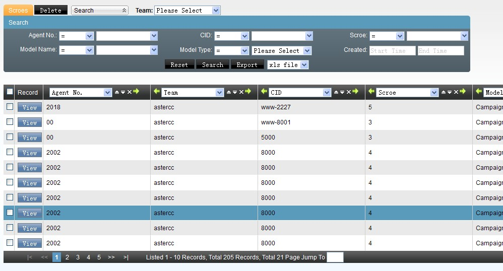

### Gestión de enlaces

**Gestión de enlaces** (`Link URLs`): registra URLs reutilizables para no tener que escribirlas cada vez que un módulo pide una dirección de pantalla emergente o de evento. Un enlace tiene equipo (vacío = disponible para cualquier equipo) y un tipo, que determina en qué selector de módulo puede reutilizarse después:

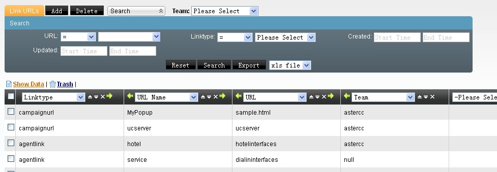

| Tipo de enlace | Dónde se reutiliza |
|---|---|
| Enlace de agente | Pantalla emergente por defecto de oficina virtual, enlace de trabajo de atención al cliente, enlace de aplicación de negocio |
| Enlace de administración | Página de gestión que ve el usuario virtual de oficina virtual |
| Enlace de evento | Dirección de envío de eventos de llamada (registro de llamadas) |
| Enlace de trabajo de grupo de agentes | Interfaz de trabajo personalizada de un grupo de agentes |
| Enlace de plan de marcación | Pantalla emergente de una tarea de campaña |
| Enlace de evento de telefonía de escritorio | Interfaz personalizada de eventos de un grupo de agentes |

## Referencia rápida

| Tarea | Dónde |
|---|---|
| Vincular un CRM propio a los eventos de llamada | Call Center (avanzado) → Aplicaciones de negocio |
| Enrutar una pantalla emergente por DID/troncal/número | Call Center (avanzado) → Vínculo de aplicación entrante |
| Asignar/seguir una tarea interna de equipo | Call Center (avanzado) → Tareas / Categorías de tarea |
| Importar clientes, DID, listas negras/blancas, código de área | Call Center (avanzado) → Importar datos |
| Inicializar campos de una tabla vacía desde un archivo | Importar datos → Importar y comenzar |
| Revisar el resultado de una importación | Call Center (avanzado) → Gestión de planes de importación |
| Descargar archivos/grabaciones exportados en lote | Call Center (avanzado) → Gestión de archivos exportados |
| Configurar geolocalización por prefijo de número | Call Center (avanzado) → Código de área |
| Formatear la visualización de números telefónicos | Call Center (avanzado) → Formato de teléfono |
| Definir bloques horarios y calendario de turnos | Call Center (avanzado) → Franjas horarias / Turnos de agentes |
| Editar catálogo de motivos de pausa | Call Center (avanzado) → Motivos de pausa |
| Definir opciones fijas de un campo del sistema (ej. estado de contacto) | Call Center (avanzado) → Categorías de campo / Campos |
| Configurar la agenda de contactos frecuentes | Call Center (avanzado) → Contactos frecuentes (ver también [Oficina virtual / BPO](../modulos/oficina-virtual-bpo.md#contactos-frecuentes-opcional)) |
| Crear un circuito de aprobación (turnos, permisos) | Call Center (avanzado) → Flujos de trabajo |
| Ver calificaciones que dejaron los clientes | Call Center (avanzado) → Gestión de calificación |
| Reutilizar una URL en varios módulos | Call Center (avanzado) → Gestión de enlaces |

---

## Fuentes

- `raw/zh/模块使用说明/呼叫中心高级管理.txt`
- `raw/zh/模块使用说明/呼叫中心高级管理/业务应用管理.txt`
- `raw/zh/模块使用说明/呼叫中心高级管理/任务管理.txt`
- `raw/zh/模块使用说明/呼叫中心高级管理/任务类别管理.txt`
- `raw/zh/模块使用说明/呼叫中心高级管理/号码归属地.txt`
- `raw/zh/模块使用说明/呼叫中心高级管理/呼入应用绑定.txt`
- `raw/zh/模块使用说明/呼叫中心高级管理/坐席排班管理.txt`
- `raw/zh/模块使用说明/呼叫中心高级管理/字段管理.txt`
- `raw/zh/模块使用说明/呼叫中心高级管理/字段类别管理.txt`
- `raw/zh/模块使用说明/呼叫中心高级管理/导入数据匹配.txt`
- `raw/zh/模块使用说明/呼叫中心高级管理/导出文件管理.txt`
- `raw/zh/模块使用说明/呼叫中心高级管理/工作流管理.txt`
- `raw/zh/模块使用说明/呼叫中心高级管理/常用联系人.txt`
- `raw/zh/模块使用说明/呼叫中心高级管理/排班时间段管理.txt`
- `raw/zh/模块使用说明/呼叫中心高级管理/数据导入.txt`
- `raw/zh/模块使用说明/呼叫中心高级管理/暂停原因管理.txt`
- `raw/zh/模块使用说明/呼叫中心高级管理/电话号码显示规则.txt`
- `raw/zh/模块使用说明/呼叫中心高级管理/计划管理.txt`
- `raw/zh/模块使用说明/呼叫中心高级管理/评分管理.txt`
- `raw/zh/模块使用说明/呼叫中心高级管理/链接管理.txt`
- `raw/en/module_manual/call_center.txt`
- `raw/en/module_manual/call_center/app_binding.txt`
- `raw/en/module_manual/call_center/area_code.txt`
- `raw/en/module_manual/call_center/business_app.txt`
- `raw/en/module_manual/call_center/common_contact.txt`
- `raw/en/module_manual/call_center/duty.txt`
- `raw/en/module_manual/call_center/duty_time.txt`
- `raw/en/module_manual/call_center/field.txt`
- `raw/en/module_manual/call_center/field_category.txt`
- `raw/en/module_manual/call_center/import.txt`
- `raw/en/module_manual/call_center/import_match.txt`
- `raw/en/module_manual/call_center/link_urls.txt`
- `raw/en/module_manual/call_center/pause_cause.txt`
- `raw/en/module_manual/call_center/phoneformat.txt`
- `raw/en/module_manual/call_center/rate.txt`
- `raw/en/module_manual/call_center/shellexport.txt`
- `raw/en/module_manual/call_center/shellimport.txt`
- `raw/en/module_manual/call_center/ticket.txt`
- `raw/en/module_manual/call_center/ticket_category.txt`
- `raw/en/module_manual/call_center/workflow.txt`
