# Documentación histórica — AsterCC 1.2 beta

!!! warning "Contenido obsoleto"
    Esta página resume el comportamiento documentado para la versión **1.2 beta** de AsterCC — una versión muy antigua del sistema, muy anterior a la actual. Se conserva únicamente por completitud histórica del wiki original: no describe el comportamiento vigente y no debe usarse como guía operativa. El comportamiento actual de estos mismos módulos (nombres de pantalla, campos, flujos de trabajo) puede diferir sustancialmente de lo aquí descrito. Para la documentación vigente de cada tema, consulta la sección [4. Módulos del sistema](../modulos/index.md) y la sección [6. Administración avanzada](index.md).

## Qué es

El namespace `raw/zh/历史文档/1.2_beta/` del wiki original agrupa 41 páginas que documentaban la versión 1.2 beta de AsterCC. Todos los temas que cubren ya están documentados con contenido actual en otras secciones del wiki en español (PBX, campañas outbound, clientes, FAQ, sistema, mensajería masiva, cuentas/permisos, encuestas, predictivo). Esta página no duplica ese contenido vigente: es un resumen breve, agrupado por tema, de qué describía cada documento histórico — sirve como referencia de auditoría de cobertura de fuentes, no como manual de uso.

!!! note "Capturas en chino"
    Las capturas de esta página provienen de la interfaz en chino de la versión 1.2 beta — no existe una fuente equivalente en inglés para esta documentación histórica. Se incluyen porque la estructura visual (formularios, tablas, paneles) sigue siendo reconocible aunque el texto no se entienda.

## Resumen por tema

### PBX y telefonía (1.2 beta)

- **Gestión de dispositivos/extensiones** (`pbx管理/分机管理.txt`): alta y edición de extensiones (SIP/IAX2/MGCP/DAHDI y "extensión externa"), campos obligatorios (número interno, cuenta y contraseña de registro, equipo, usuario, tipo de dispositivo, plantilla) y opcionales (número/nombre de origen, timeout, grabación, buzón de voz, anfitrión permitido, troncal de salida, alcance de "pickup", tono de retorno), más listas negra/blanca por extensión y el aviso de recarga tras guardar.
- **IVR / electrónica de voz** (`pbx高级管理/电脑话务.txt`): configuración de flujos IVR — voz de entrada, transferencia por fallo/timeout, tipos de destino (colgar, voz, IVR, cola, extensión, grupo de timbrado, buzón de voz, ocupado, fax), modo "obtener datos" vía webservice/HTTP con parámetros y variables globales, configuración de objetivos por tecla, y un caso de ejemplo completo con grabación, subida de audio y webservice de consulta.
- **Lista negra a nivel PBX** (`pbx高级管理/黑名单管理.txt`): números bloqueados por equipo/cuenta/extensión con estado activable.

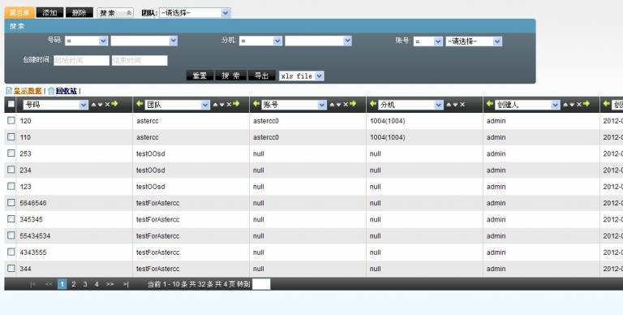

### Campañas outbound y marketing telefónico (1.2 beta)

- **Caso de uso completo — centro de llamadas outbound para ventas** (`业务应用系统/外呼营销/为企业建立一个外呼呼叫中心用于管理销售.txt`): flujo end-to-end — crear extensión, crear agente, asignarlo a un grupo de agentes, configurar softphone, crear paquete de clientes, definir resultados de llamada, crear y editar un plan de marcación, asignar tareas, trabajar desde la interfaz de agente y revisar reportes/reversión de datos.

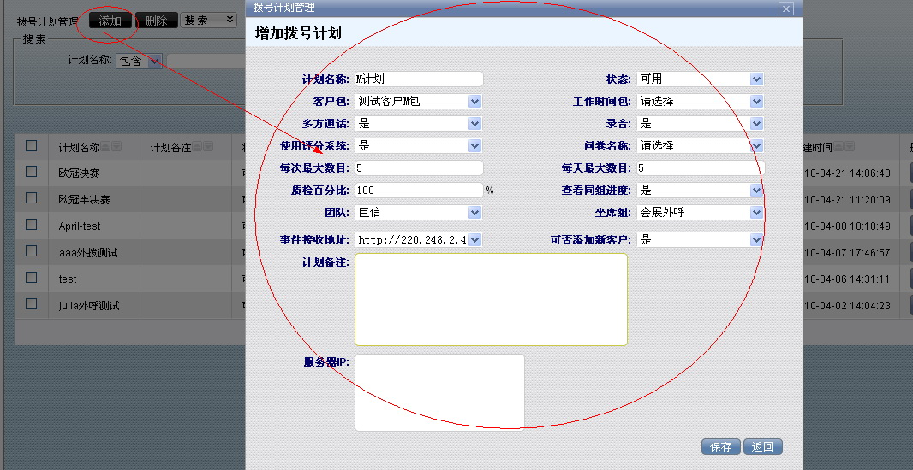
- **Cómo crear una tarea de concertación de citas outbound** (`如何建立一个外呼约访任务.txt`): guía de preparación completa — troncal, instalación de módulos, extensiones/agentes, grupo de agentes outbound, tarea de marketing, servidor de correo, plantilla de correo, catálogo de resultados de llamada, diccionario de importación, importación de datos y prueba desde la interfaz de agente.
- **Cómo definir campos personalizados e importar datos de clientes** (`如何设定自定义字段并导入客户资料.txt`): alta de campos personalizados (tipos input/select/text/datetime) en las tablas de clientes, importación de archivos csv/xls, coincidencia de diccionario para normalizar valores, gestión de planes de importación y configuración de qué campos ve/edita el agente.
- **Cómo configurar un filtro** (`如何设定过滤器.txt`): filtros de recuperación automática de números hacia la lista de predial, con programación tipo cron (minuto/hora/día/mes/semana) y condiciones sobre campos del cliente.
- **Cómo configurar el popup de entrada de una tarea outbound** (`如何设置外呼任务的呼入弹屏.txt`): vinculación de número llamante/DID a una tarea outbound para que, en llamadas entrantes relacionadas, se muestre el popup con los datos del cliente y su historial de contacto.

### Administración avanzada del centro de llamadas (1.2 beta)

- **Importación de datos** (`呼叫中心高级管理/数据导入.txt`): flujo de importación csv/xls paso a paso — selección de tabla destino, mapeo de columnas a campos, coincidencia de diccionario, marcado de campos para predial, fecha de ejecución, filas a descartar, y seguimiento del plan de importación.

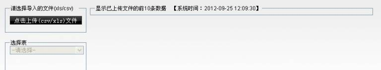

- **Gestión de calificación/puntuación** (`呼叫中心高级管理/评分管理.txt`): listado de puntuaciones de servicio obtenidas por los agentes en cada llamada, con acceso al detalle del registro de contacto.

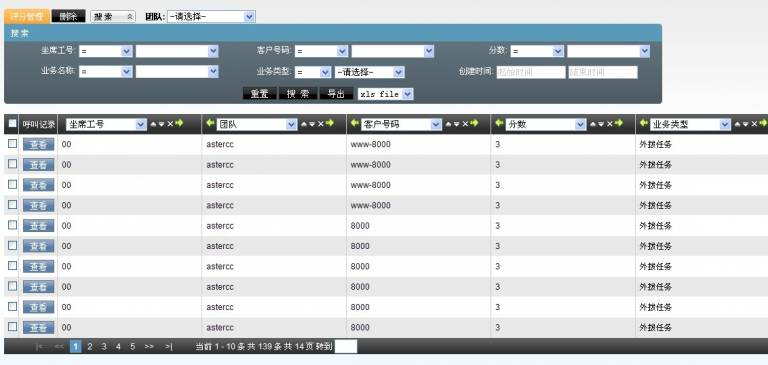

### Marketing outbound — operación (1.2 beta)

- **Gestión de resultados de llamada** (`外呼营销/呼叫结果管理.txt`): catálogo de resultados de llamada (por ejemplo "no contesta", "no le interesa") vinculados a estado de procesamiento del cliente, alcance por equipo/tarea y si aplican a llamadas contestadas o no.
- **Interfaz de agente outbound** (`外呼营销/坐席界面.txt`): las tres zonas de la pantalla de trabajo (lista de tareas, detalle de cliente, cuestionario), los tres modos de marcación (manual, vista previa, automático), pestañas de progreso (pendiente, en seguimiento, enviado como fallido/exitoso) y el flujo de registro de contacto y respuesta de encuesta.

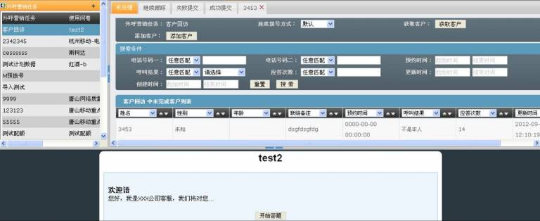
- **Tareas de marketing outbound** (`外呼营销/外呼营销任务.txt`): configuración extensa de una tarea — datos básicos (nombre, estado, prioridad, tipo de paquete de clientes, franja horaria, encuesta asociada), datos avanzados (modo de marcación, intervalo de reintento, porcentaje de calidad, límite de reintentos, control de reasignación de clientes), configuración avanzada de predial (concurrencia máxima, destino de conexión, tiempos estimados de timbrado/llamada/espera), edición de campos visibles para agente/backend, y asignación automática/manual de clientes a agentes.

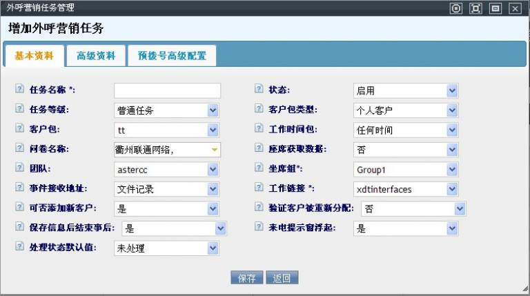
- **Reporte estadístico de marketing outbound** (`外呼营销/外呼营销统计报表.txt`): métricas por rango de fechas y agrupación (tarea o agente) — volumen de clientes llamados/contactados, tasa de contacto, número de llamadas, tasa de éxito, duración total y de conversación, tasas de reversión/seguimiento, resultados de control de calidad y desglose por resultado de llamada configurado.
- **Reversión de datos de cliente** (`外呼营销/客户数据回滚.txt`): comparación de la tabla derivada (paquete de clientes de una campaña) contra la tabla maestra para detectar discrepancias y decidir, registro por registro o en bloque, si actualizar la maestra con los cambios hechos durante la campaña.
- **Gestión de paquetes de clientes** (`外呼营销/客户集合包管理.txt`): creación de paquetes de clientes (derivados de la tabla maestra personal o empresarial) con clave única e índices configurables, adición/edición/exportación de clientes dentro del paquete.
- **Lista negra de no marcar** (`外呼营销/禁拨黑名单.txt`): importación de números a excluir de marcación a nivel sistema, equipo o tarea outbound específica, con búsqueda por prefijo de número.
- **Lista negra (outbound)** (`外呼营销/黑名单.txt`): números bloqueados por equipo, plan de marcación o agente específico, con alta/edición desde el panel.

### Gestión de clientes (1.2 beta)

- **Gestión de clientes individuales** (`客户管理/个人客户管理.txt`): tabla maestra de clientes personales, alta manual o por importación masiva.

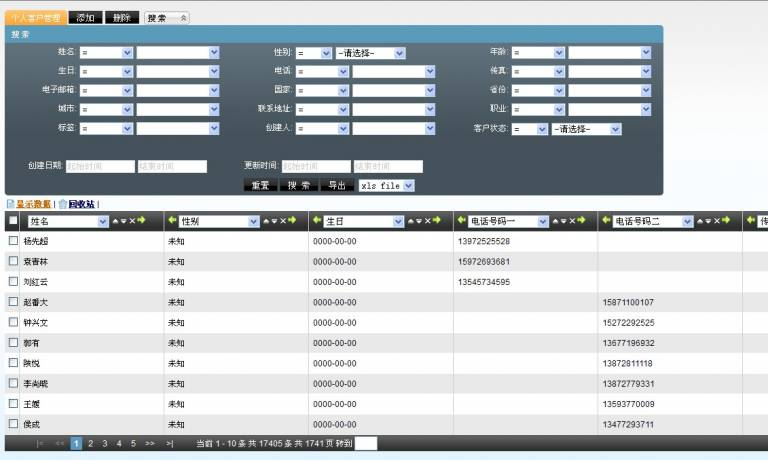
- **Gestión de clientes empresariales** (`客户管理/机构客户管理.txt`): equivalente a la anterior para clientes tipo empresa.
- **Campos personalizados de cliente** (`客户管理/自定义字段.txt`): alta de campos personalizados (input/select/text/upload/date/datetime) por equipo y paquete de clientes, con reglas sobre qué se puede modificar tras crearlos.

### FAQ (1.2 beta)

- **Cómo habilitar Google Maps** (`常见问题及解答/如何设置启用谷歌地图.txt`): obtención de una API key de Google Maps y su registro en Sistema → Configuración del sistema.

### Configuración del sistema (1.2 beta)

- **Configuración del sistema** (`系统设置/系统设置.txt`): 15 parámetros configurables de la época — expansión de áreas de búsqueda, filas por página, aviso adicional de tareas, popup de plataforma de agente, formato de exportación por defecto, restricción de login simultáneo, ruta FTP de archivos de voz, dominios separados de login de usuario/agente, método de envío de eventos (comet), idioma por defecto del sistema y de IVR entrante, modo de marcación, reinicio automático de servicio, límites diarios de SMS/email por destinatario, y bloque de facturación (activación, fecha de generación, ciclo, fecha de pago, interés).

### Mensajería masiva (1.2 beta)

- **Gestión de archivo de mensajes** (`群发信息管理/信息存档管理.txt`): consulta de solo lectura de mensajes archivados.
- **Gestión de plantillas de mensaje** (`群发信息管理/信息模版管理.txt`): plantillas de correo/SMS con variables de sustitución para notificación de tareas (`##taskid##`, `##title##`, etc.), tipo, uso, adjunto, idioma y contenido con instrucciones de conversión desde Word vía Gmail.
- **Gestión de avisos/anuncios** (`群发信息管理/公告管理.txt`): publicación de anuncios dirigidos a cuentas o agentes por tipo de cuenta, equipo y grupo.
- **Gestión de mensajes internos** (`群发信息管理/内部信息管理.txt`): bandeja de mensajes internos recibidos, con aviso emergente al llegar uno nuevo.
- **Envío de mensajes internos** (`群发信息管理/发送内部信息.txt`): composición y envío de mensajes internos a empleados, con soporte de plantilla.
- **Gestión de mensajes enviados** (`群发信息管理/已发信息管理.txt`): permite cambiar el estado de un mensaje ya enviado (de "éxito" a "nuevo") para reenviarlo; sin alta ni borrado.
- **Gestión de mensajes pendientes de envío** (`群发信息管理/待发信息管理.txt`): edición de título y estado de mensajes en cola, sin alta nueva.
- **Envío masivo de mensajes** (`群发信息管理/群发信息.txt`): importación de la tabla de destinatarios con campo "etiqueta" y variables `param0`...`param9`, y asistente de 5 pasos (método de envío, etiqueta, plantilla, vista previa, servidor SMTP) para lanzar el envío.

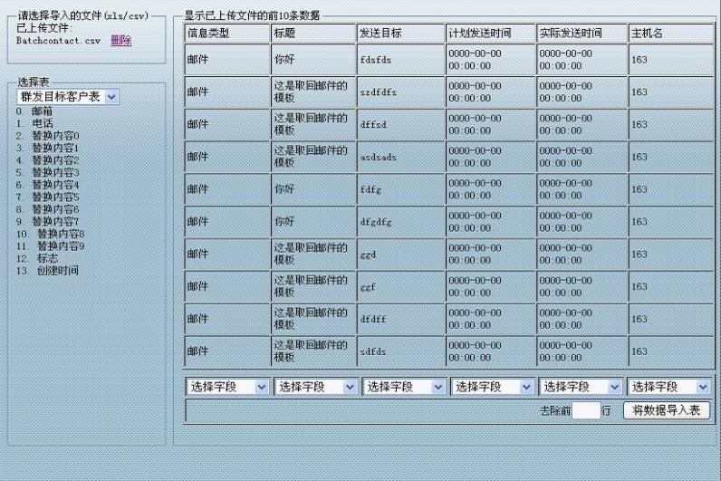
- **Servidor de correo** (`群发信息管理/邮件服务器.txt`): alta de servidores SMTP (host, puerto, usuario, remitente, SSL, contraseña, prueba de conexión) con un único servidor marcable como predeterminado.

### Cuentas y permisos (1.2 beta)

- **Gestión de grupos de agentes** (`账户和权限管理/坐席组管理.txt`): creación de grupos de agentes con equipo, cola asociada, enlace de trabajo personalizado, modo de trabajo (entrante/saliente/mixto/autoselección), restricción de marcación externa, permiso de transferencia a línea externa, tipo de turno, modo de gestión posterior a llamada (ACW), permisos por defecto del jefe de grupo (borrado de datos erróneos, monitoreo/susurro/intrusión, control de predial, turnos) y los cuatro modos de check-in (estático/dinámico × en línea/fuera de línea).

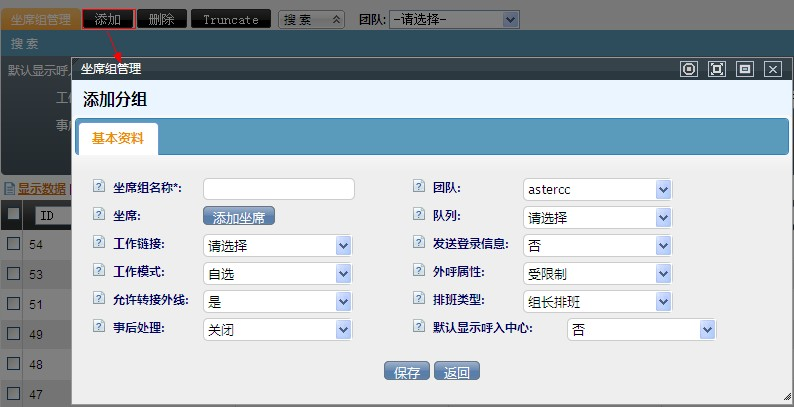

### Encuestas (1.2 beta)

- **Estadística de distribución de encuestas** (`问卷/问卷分布统计.txt`): estadística por tarea/encuesta de cuántos respondieron y con qué frecuencia se eligió cada opción, filtrable por control de calidad y estado de envío.
- **Gestión de encuestas** (`问卷/问卷管理.txt`): creación de encuestas con grupos de preguntas, tipos de pregunta (única, múltiple, combinada, texto), lógica condicional de salto/ocultamiento, relleno de texto dinámico (`[FILL]`), cuotas por pregunta/opción o por perfil de cliente, y vista previa de encuesta.

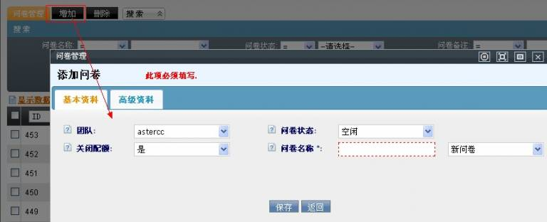
- **Plantillas de opciones de encuesta** (`问卷/问卷选项模板.txt`): plantillas reutilizables de conjuntos de opciones comunes (escalas de satisfacción, calificación numérica, género) para acelerar la creación de preguntas.

### Predial (predictivo) (1.2 beta)

- **Marcador (dialer)** (`预拨号/拨号器.txt`): panel del jefe de grupo para operar el marcador predictivo — estado de agentes por grupo de habilidad, arranque/parada de tareas de marcado, configuración simple (concurrencia máxima) y avanzada (límite de marcado simultáneo, intervalo, tasa de contacto esperada, tiempos promedio de timbrado/llamada/ACW), visualización y limpieza de la lista de marcado, y recuperación de datos desde el paquete de clientes hacia la lista de predial.

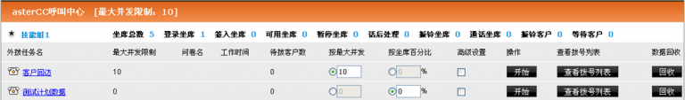
- **Configuración del marcador** (`预拨号/拨号器设置.txt`): los tres niveles de límite de concurrencia (licencia del sistema, equipo, tarea outbound) y la regla de marcado permitida por equipo (todas, solo por concurrencia, solo por agente).
- **Lista de predial** (`预拨号/预拨号列表.txt`): visualización de los números ya en la lista de predial de una tarea, recuperación de datos disponibles desde el paquete de clientes (selección manual o por condición de búsqueda) y configuración de filtros de recuperación automática.
- **Estadística de predial** (`预拨号/预拨号统计.txt`): generación y consulta de reportes diarios de predial por equipo, tarea y tipo de estadística.
- **Log de filtros de predial** (`预拨号/预拨号过滤器日志.txt`): bitácora de ejecución de los filtros de recuperación automática, consultable por tarea outbound.

## Fuentes

- `raw/zh/历史文档/1.2_beta/pbx管理/分机管理.txt`
- `raw/zh/历史文档/1.2_beta/pbx高级管理/电脑话务.txt`
- `raw/zh/历史文档/1.2_beta/pbx高级管理/黑名单管理.txt`
- `raw/zh/历史文档/1.2_beta/业务应用系统/外呼营销/为企业建立一个外呼呼叫中心用于管理销售.txt`
- `raw/zh/历史文档/1.2_beta/业务应用系统/外呼营销/如何建立一个外呼约访任务.txt`
- `raw/zh/历史文档/1.2_beta/业务应用系统/外呼营销/如何设定自定义字段并导入客户资料.txt`
- `raw/zh/历史文档/1.2_beta/业务应用系统/外呼营销/如何设定过滤器.txt`
- `raw/zh/历史文档/1.2_beta/业务应用系统/外呼营销/如何设置外呼任务的呼入弹屏.txt`
- `raw/zh/历史文档/1.2_beta/呼叫中心高级管理/数据导入.txt`
- `raw/zh/历史文档/1.2_beta/呼叫中心高级管理/评分管理.txt`
- `raw/zh/历史文档/1.2_beta/外呼营销/呼叫结果管理.txt`
- `raw/zh/历史文档/1.2_beta/外呼营销/坐席界面.txt`
- `raw/zh/历史文档/1.2_beta/外呼营销/外呼营销任务.txt`
- `raw/zh/历史文档/1.2_beta/外呼营销/外呼营销统计报表.txt`
- `raw/zh/历史文档/1.2_beta/外呼营销/客户数据回滚.txt`
- `raw/zh/历史文档/1.2_beta/外呼营销/客户集合包管理.txt`
- `raw/zh/历史文档/1.2_beta/外呼营销/禁拨黑名单.txt`
- `raw/zh/历史文档/1.2_beta/外呼营销/黑名单.txt`
- `raw/zh/历史文档/1.2_beta/客户管理/个人客户管理.txt`
- `raw/zh/历史文档/1.2_beta/客户管理/机构客户管理.txt`
- `raw/zh/历史文档/1.2_beta/客户管理/自定义字段.txt`
- `raw/zh/历史文档/1.2_beta/常见问题及解答/如何设置启用谷歌地图.txt`
- `raw/zh/历史文档/1.2_beta/系统设置/系统设置.txt`
- `raw/zh/历史文档/1.2_beta/群发信息管理/信息存档管理.txt`
- `raw/zh/历史文档/1.2_beta/群发信息管理/信息模版管理.txt`
- `raw/zh/历史文档/1.2_beta/群发信息管理/公告管理.txt`
- `raw/zh/历史文档/1.2_beta/群发信息管理/内部信息管理.txt`
- `raw/zh/历史文档/1.2_beta/群发信息管理/发送内部信息.txt`
- `raw/zh/历史文档/1.2_beta/群发信息管理/已发信息管理.txt`
- `raw/zh/历史文档/1.2_beta/群发信息管理/待发信息管理.txt`
- `raw/zh/历史文档/1.2_beta/群发信息管理/群发信息.txt`
- `raw/zh/历史文档/1.2_beta/群发信息管理/邮件服务器.txt`
- `raw/zh/历史文档/1.2_beta/账户和权限管理/坐席组管理.txt`
- `raw/zh/历史文档/1.2_beta/问卷/问卷分布统计.txt`
- `raw/zh/历史文档/1.2_beta/问卷/问卷管理.txt`
- `raw/zh/历史文档/1.2_beta/问卷/问卷选项模板.txt`
- `raw/zh/历史文档/1.2_beta/预拨号/拨号器.txt`
- `raw/zh/历史文档/1.2_beta/预拨号/拨号器设置.txt`
- `raw/zh/历史文档/1.2_beta/预拨号/预拨号列表.txt`
- `raw/zh/历史文档/1.2_beta/预拨号/预拨号统计.txt`
- `raw/zh/历史文档/1.2_beta/预拨号/预拨号过滤器日志.txt`
