# Call center de atención al cliente (inbound)

## Qué es

Caso de uso de referencia para armar un servicio de atención al cliente entrante: el cliente llama, el agente ve automáticamente su ficha (o el formulario de alta si es nuevo), y puede registrar el contacto, abrir un work order o vender un producto sin salir de la misma pantalla.

## Cómo se usa

### 1. Preparar la telefonía

1. Da de alta el [troncal](../modulos/pbx-y-telefonia.md#troncales-y-grupos-de-troncales) por el que entrarán las llamadas.
2. Crea el [grupo de agentes](../modulos/cuentas-equipos-permisos.md) que atenderá este servicio, con su cola asociada.
3. Si manejas más de una línea de negocio, da de alta un [DID](../modulos/pbx-y-telefonia.md#did-y-grupos-de-did) por línea, para poder distinguir a qué servicio corresponde cada llamada.
4. Crea la [ruta entrante](../modulos/pbx-y-telefonia.md#rutas-entrantes-y-salientes) que conecta ese DID (o el troncal directamente, si no usas DID) con la cola del paso 2.

### 2. Crear el servicio de atención al cliente

Sigue [4.10 Atención al cliente](../modulos/atencion-cliente-mensajeria-ecommerce.md#atencion-al-cliente-entrante) para dar de alta el servicio, apuntando al grupo de agentes recién creado.

### 3. Qué ve el agente al recibir la llamada

- **Cliente nuevo:** se abre el formulario de alta, mostrando el número que llama, su ubicación geográfica (si está cargada) y la hora de la llamada. El agente puede buscar primero si ese número ya pertenece a un cliente existente antes de crear uno duplicado — y de encontrarlo, vincular el número a ese cliente en lugar de crear uno nuevo.

  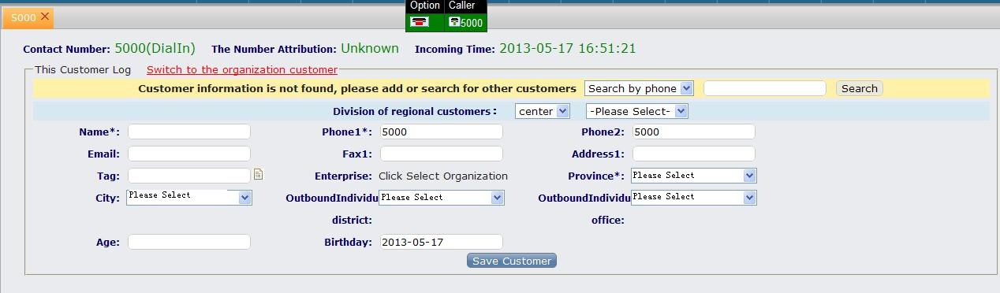

  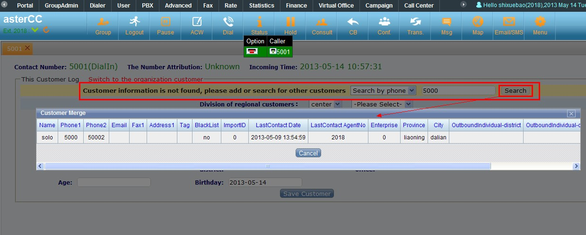

- **Cliente existente:** se abre directamente su ficha, con pestañas de **historial de contacto**, **work orders no completados**, **work orders completados recientemente** y **work orders completados históricos**.

  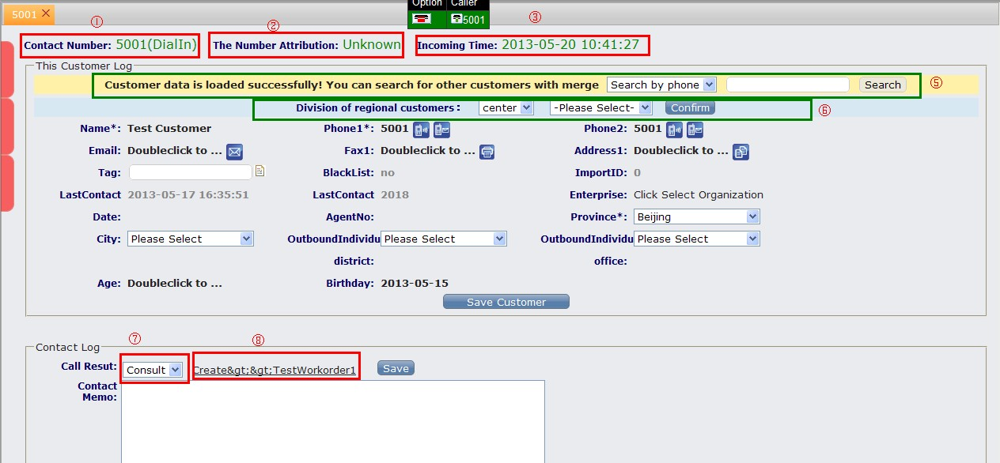
- En ambos casos, el agente registra el **motivo de la llamada** al finalizar — si ese motivo está vinculado a una plantilla de work order, aparece la opción de crear uno directamente desde ahí.

### 4. Combinar con otros módulos (opcional)

- **Work orders:** vincula un motivo de llamada a una plantilla de [work order](../modulos/base-conocimiento-work-orders.md#work-orders) para que el agente pueda escalar un caso a otro equipo sin salir de la pantalla de atención. La guía en inglés sobre el uso de work orders en el módulo de atención al cliente confirma este mismo flujo y agrega un detalle sobre llamadas perdidas: desde la pantalla de llamadas perdidas del servicio de atención al cliente, el líder de grupo también puede crear un work order directamente para un número que no se llegó a atender, sin depender de que exista un registro de contacto previo.

  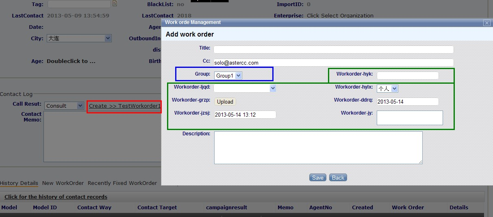

  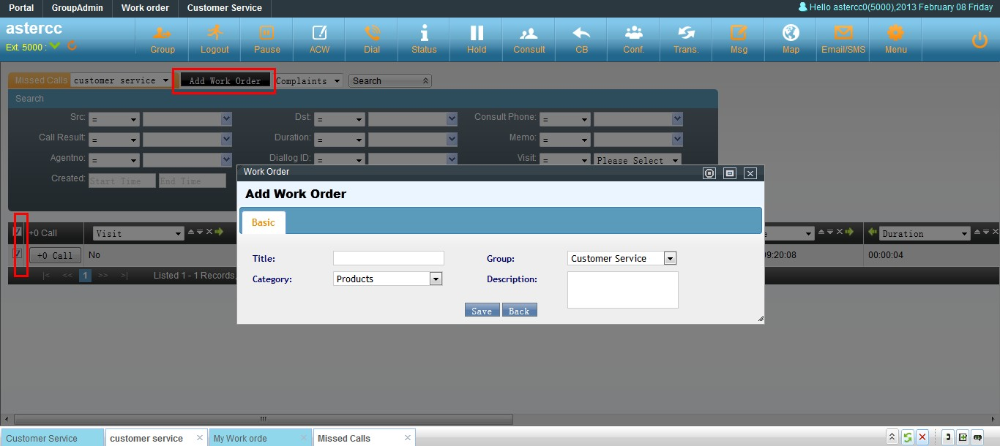

- **E-commerce:** si el servicio tiene un catálogo de [e-commerce](../modulos/atencion-cliente-mensajeria-ecommerce.md#e-commerce) vinculado, el agente puede buscar productos, armar un pedido, y guardarlo con los datos de envío precargados desde la ficha del cliente — incluyendo consultar el historial de compras del cliente bajo demanda.

  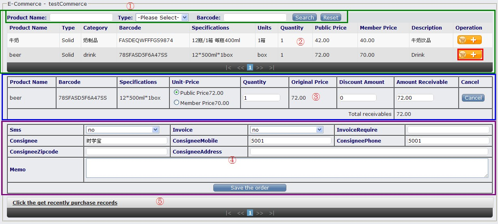

La guía en inglés de configuración del módulo de atención al cliente para llamadas entrantes describe el mismo flujo de esta sección y de la sección 2 (troncal → grupo de agentes → cola → DID opcional → servicio de atención al cliente → vínculo con work order/e-commerce), y agrega dos detalles no cubiertos arriba: el campo de "código de área" (o la importación de atribución numérica) que muestra al agente la ubicación geográfica del número que llama, y la posibilidad de vincular a un mismo número existente en vez de crear un cliente duplicado directamente desde el formulario de alta — se cita como fuente adicional de esta y la sección anterior.

### 5. Configurar cuentas, extensiones, grupo de timbrado y softphone desde cero

Si estás montando el servicio en un sistema nuevo, antes de crear la ruta entrante necesitas la base de telefonía funcionando. El flujo típico es:

1. **Cuenta:** en Cuentas, equipos y permisos → Gestión de cuentas, crea la cuenta que agrupará las extensiones. La opción "grabación forzada" en la cuenta obliga a grabar todas las llamadas de las extensiones que dependen de ella; si se deshabilita, la grabación queda a criterio de cada extensión.
2. **Extensión:** desde la misma cuenta (o desde PBX → Gestión de dispositivos) crea cada extensión SIP que usarán los agentes.
3. **Grupo de timbrado:** agrupa varias extensiones para decidir cómo suenan al recibir una llamada. Estrategias disponibles: **timbrado total** (suenan todas a la vez), **secuencial** (suenan una por una, en el orden en que se agregaron), **round robin** (reparte el turno de inicio entre las extensiones en cada llamada nueva), **incremental** (suma una extensión más al grupo que está sonando en cada ciclo sin respuesta) y **solo libres** (únicamente timbran las extensiones que no están ocupadas).
4. **Softphone (opcional para pruebas):** para probar sin hardware, instala un softphone SIP (p. ej. X-Lite) y registra la cuenta SIP usando el nombre de usuario, contraseña e IP interna configurados en la extensión.
5. **Troncal:** en PBX → Troncales crea la línea que conecta con el proveedor (SIP/IAX/analógica).
6. **Grupo de troncales:** si hay más de una troncal, agrúpalas — el orden de la lista define la prioridad de salida.
7. **DID:** en PBX → DID registra el número público que recibirán las llamadas entrantes.
8. **Ruta entrante:** conecta el DID (o la coincidencia de troncal) con el destino final: grupo de timbrado, cola, IVR, etc. La ruta solo aplica si coinciden **todas** las condiciones configuradas (DID, número llamante, troncal).

> Nota: el contenido original describe este flujo dos veces con pasos idénticos (creación de cuenta, extensión, grupo de timbrado, instalación de X-Lite y configuración SIP, troncal, grupo de troncales, DID y ruta entrante) — se fusionó en un solo procedimiento.

### 6. Caso completo: troncales con reglas de marcado, tarifas y grupos de troncal

Cuando la empresa tiene varias líneas para abaratar costos (por ejemplo, una troncal nacional y una internacional tipo VoIP), la elección de la troncal de salida se basa en reglas sobre el número marcado:

- **Regla de troncal por prefijo:** cada troncal puede llevar una regla que decide si se usa según el prefijo del número marcado (por ejemplo, prefijo `00` para llamadas internacionales) y permite añadir o quitar prefijos antes de marcar (útil cuando la central exige un `9` inicial para salir y hay que retirarlo antes de entregarlo a la troncal).
- **Facturación forzada:** si la troncal tiene "facturación forzada" en "sí", solo permite la llamada si el número coincide con una tarifa de extensión configurada — en ese caso no es necesario definir una regla de prefijo aparte, porque la tarifa ya filtra qué números pueden salir por esa troncal.
- **Tarifa por extensión:** se define por prefijo de número y asocia ese prefijo a una troncal y a un equipo, para poder calcular el costo de las llamadas salientes.
- **Grupo de troncales:** cuando hay varias troncales, se agrupan y el orden en la lista determina cuál se intenta primero; si la de mayor prioridad falla o está ocupada, el sistema pasa a la siguiente.
- **Asignación por equipo:** en la ficha del equipo se elige si usará una troncal específica o un grupo de troncales para sus llamadas salientes.
- **Tarjetas analógicas:** si el proveedor llega por línea analógica en vez de VoIP, hay que ubicar en qué puerto de la tarjeta está conectada la línea y confirmar la configuración de ese puerto en Gestión de tarjetas.
- **Pruebas recomendadas:** validar por separado (a) llamadas internas entre extensiones, (b) llamadas nacionales salientes y (c) llamadas internacionales salientes con el prefijo definido, para confirmar que cada una usa la troncal esperada.

Este mismo artículo describe el lado de entrada: cuando llega una llamada por la troncal conectada a la centralita, primero se define un módulo de IVR (computer telephony / IVR) con la voz "ingrese la extensión que desea marcar", y luego una ruta entrante que enlaza esa troncal con ese IVR. Según si la línea externa llega directo al equipo o pasa antes por otra central telefónica de la empresa, el usuario puede necesitar marcar la extensión una sola vez o hacerlo en dos pasos (primero el número que la central interna asigna al equipo, y luego la extensión dentro de AsterCC).

### 7. Enrutar llamadas según horario laboral (IVR con condición de tiempo)

Para separar el trato de llamadas dentro y fuera de horario de atención:

1. **Horario laboral y no laboral:** en PBX avanzado → Horarios, crea un rango (por ejemplo, lunes a viernes 9:00–17:00). Si el rango cruza la medianoche (p. ej. 17:00 a 09:00 del día siguiente), el sistema lo divide automáticamente en dos tramos (17:00:00–23:59:59 y 00:00:00–09:00:00). Para cubrir fin de semana completo se agrega un horario adicional de 00:00:00 a 23:59:59 para sábado y domingo.
2. **Paquete de horarios:** agrupa uno o más horarios (laborales o no laborales) en un solo paquete para poder referenciarlo desde el IVR.
3. **Grupos de timbrado por franja:** puedes crear un grupo de timbrado distinto para horario laboral y otro para no laboral, de forma que la asignación de agentes cambie automáticamente según la hora.
4. **Locuciones necesarias:** una locución de bienvenida para horario laboral (menú de opciones), otra para horario no laboral (aviso + opción de dejar mensaje), y locuciones de error como "la extensión no existe, intente de nuevo" o "se agotó el tiempo, hasta luego".

   > La generación de locuciones por texto a voz (TTS) mencionada en el material original ya no está soportada por el sistema — sube un archivo de audio grabado en su lugar (ver sección "Subir y configurar locuciones de voz" más abajo).

5. **IVR principal:** agrega la acción "contestar" y luego "reproducir y capturar dígitos", limitando la entrada a entre 1 y 4 dígitos si combinas opciones de un dígito (por ejemplo, `0` para operadora, `1` ventas, `2` soporte) con extensiones de varios dígitos.
6. **Sub-IVR de condición de tiempo:** dentro del flujo, agrega una acción de "verificación de horario" que evalúa el paquete de horarios y bifurca hacia el IVR de horario laboral o el de horario no laboral.
7. **Transferencias desde el IVR:**
   - Dígito `0` → extensión de recepción/consulta.
   - Dígito `1` → cola de ventas.
   - Dígito `2` → cola de soporte técnico.
   - Transferencia `default` (cualquier otro dígito) → intenta emparejar automáticamente con una extensión existente; si no existe, reproduce la locución de error y vuelve a pedir el dígito.
   - Fallo por tiempo de espera agotado → reproduce la locución de error correspondiente y transfiere a la extensión de respaldo (por ejemplo, la de recepción).
8. **Fuera de horario:** el IVR no laboral solo necesita "contestar" + "reproducir y capturar dígitos", con una transferencia final a buzón de voz sobre una extensión que tenga el buzón habilitado.

### 8. Transferir una llamada en curso

Existen dos modos de transferencia según cómo esté configurada la extensión: **modo extensión normal** y **modo agente**. Una extensión está en modo normal cuando su opción "modo agente" está deshabilitada, o cuando el agente asociado está en estado "cerrado sesión" (para poner un agente en modo dinámico/fuera de línea, edítalo desde Gestión de grupos de agentes). El modo agente solo admite transferencia, no "toma de llamada" (pickup).

**Con teclas de acceso rápido (hotkeys), en modo extensión normal:**

- `*51` — transferencia ciega (blind transfer): la extensión entrega la llamada a otra extensión y se retira de la llamada de inmediato, sin esperar a que conteste.
- `*52` — transferencia asistida (consulta): la extensión solo se retira de la llamada si la otra extensión efectivamente contesta; de lo contrario sigue en la llamada original.
- Tras marcar la tecla, el sistema anuncia "transfiriendo…" y hay que digitar de inmediato el número de la extensión destino.

**Con la tecla TRANSFER del teléfono físico:** se marca la tecla, se digita la extensión destino y se pulsa SEND. Si el teléfono hace transferencia ciega, la extensión debe tener `call-limit=1` en el detalle de dispositivo; si hace transferencia con confirmación previa (transferir y luego colgar), debe tener `call-limit=2`.

**En modo agente (extensión con "modo agente" habilitado y agente con sesión iniciada):**

- Hotkeys: `*54` transfiere consultando por número de agente (pide el legajo del agente destino); `*55` transfiere consultando por número/extensión libre (DID, extensión interna o línea externa).
- Desde la interfaz del agente: pulsar "Consultar", elegir "agente" (grupo + agente) o "número", pulsar "Llamar"; una vez que la otra parte contesta, pulsar "Transferir" para completar el traspaso. La sesión del agente termina automáticamente la llamada al confirmarse la transferencia.
- Para iniciar sesión desde un teléfono sin acceder a la interfaz web: marcar `*64`, indicar el número de cola a la que se ingresa (o `0#` para todas) seguido de `#`.

### 9. Personalizar la URL de pantalla emergente (popup)

La URL de pantalla emergente (popup) que ve el agente al recibir la llamada se controla desde **Gestión de enlaces** (PBX avanzado → Gestión de enlaces), no directamente en el servicio de atención al cliente:

1. Crea un enlace en Gestión de enlaces, indicando el equipo, un nombre identificador y el tipo de enlace. El tipo determina en qué módulos puede usarse: en el servicio de atención al cliente entrante solo pueden elegirse los tipos **enlace de agente** y **enlace de plan de marcado**.
2. En el servicio de atención al cliente (o en marketing outbound / oficina virtual, que también soportan enlaces personalizados), selecciona ese enlace en el campo "enlace de trabajo".
3. Cambiar la URL del enlace (por ejemplo, apuntarla a un sistema CRM propio) cambia de inmediato qué página se abre en la pantalla del agente para ese servicio, sin tocar la configuración del servicio en sí.

Esto permite reemplazar la pantalla emergente estándar del sistema por un CRM externo simplemente editando el enlace, sin duplicar la configuración del servicio de atención al cliente.

### 10. Caso completo: dar de alta un servicio de atención de llamadas entrantes por usuario/línea de negocio

Cuando se necesita distinguir entre varias líneas de negocio dentro del mismo call center, el flujo de referencia es:

1. Crear el **equipo** (agrupa agentes, colas, troncales de una misma unidad de negocio) y, dentro de él, la **cuenta**, la **extensión** y el **grupo de agentes**.
2. Crear el **agente** (usuario que inicia sesión en la aplicación de call center; distinto de la cuenta y la extensión).
3. Crear el **DID** de entrada y la **troncal**, dejando el contexto de la troncal en `hosted-dialin` si se configura manualmente.
4. Crear la **ruta entrante** que conecta el DID con la cola correspondiente.
5. Crear la **cola** personalizada asociada al DID, con su propia estrategia de timbrado, locución de bienvenida, tiempo de espera máximo y tiempo de espera por agente.
6. Dar de alta el **usuario de llamada entrante** (la línea de negocio en sí): incluye descripción del negocio, locución de bienvenida, datos de contacto y la opción "agregar cliente nuevo" (si está en "sí", cada llamante nuevo genera automáticamente un registro de cliente).
7. Crear el **vínculo de número llamante/llamado** (en Gestión avanzada de call center → Vínculo de número llamante/llamado): asocia el DID (o el número que llama) al usuario de llamada entrante correspondiente, para que el sistema sepa qué pantalla emergente y qué negocio mostrarle al agente según por dónde entró la llamada.
8. El agente inicia sesión, marca los grupos de cola a los que se une y pulsa "iniciar sesión" (check-in) antes de poder recibir llamadas de ese usuario entrante.

Este procedimiento es el equivalente, paso a paso desde cero, de lo descrito en la sección "1. Preparar la telefonía" y "2. Crear el servicio de atención al cliente" de este mismo artículo — útil como lista de verificación completa cuando se da de alta una línea de negocio nueva.

> La guía en inglés que configura asterCC para recibir llamadas entrantes presentadas a distintas colas de cliente describe este mismo flujo (equipo, cuenta, dispositivo, grupo de agentes, agentes, DID, troncal, ruta entrante, cola personalizada, inicio de sesión del agente) sin aportar pasos adicionales — se cita como confirmación.

### 11. Restricciones sobre el número marcado o llamante

El control de qué números pueden marcarse (o de quién puede llamar) no vive en un solo lugar — se reparte entre varios módulos, y todos deben cumplirse para que una llamada se complete:

- **Ruta de salida (ruta saliente):** define, por prefijo y longitud del número, hacia dónde se envía la llamada (troncal, grupo de timbrado, cola, IVR) y permite agregar o quitar un prefijo antes de marcar.
- **Troncal:** su regla puede restringir por número llamado y por número/nombre de quien llama, permitiendo o prohibiendo la coincidencia; además admite lista negra/blanca de números llamantes salientes en sus datos avanzados.
- **Grupo de troncales:** aplica una estrategia de selección (por orden, aleatoria, round robin) entre sus troncales y también admite lista negra/blanca de números llamantes salientes a nivel de grupo.
- **Cuenta:** su lista negra y lista blanca restringen qué números **entrantes** pueden comunicarse con esa cuenta.
- **Grupo de cuentas:** vincula un equipo a una troncal o grupo de troncales y, por esa vía, a una ruta de salida — es otro punto donde se termina aplicando (indirectamente) la restricción sobre el número llamado.

En la práctica, si una llamada saliente no se completa como se espera, conviene revisar estos cinco puntos en orden antes de asumir que el problema es de la troncal del proveedor.

### 12. Subir y configurar locuciones de voz

Los archivos de voz usados en IVR, música de espera, tonos de espera personalizados o buzón de voz se administran de forma centralizada:

1. **Grabar el audio:** con cualquier grabadora de sonido (formato soportado por el sistema: WAV 8000 KHz, 16 bit), o bien grabando directamente por teléfono (ver más abajo).
2. **Subir el archivo:** en PBX avanzado → Gestión de archivos de voz, sube el archivo grabado. Se puede restringir a un equipo específico o dejarlo disponible para todos los equipos si no se elige ninguno.
3. **Usarlo como locución de llamada:** en PBX avanzado → Gestión de locuciones de llamada, crea una locución con nombre y equipo, y luego asocia uno o varios de los archivos ya subidos — esta es la locución que después se selecciona desde el IVR, la ruta entrante, etc.
4. **Usarlo como música de espera:** en Gestión de música de espera, se puede seleccionar más de un archivo de voz; el sistema los reproduce en el orden elegido, uno tras otro.
5. **Aplicarlo a colas y a tono de llamada (ring-back) de un dispositivo:** la música de espera configurada arriba se selecciona luego desde la ficha de la cola; el mismo mecanismo aplica al tono de llamada personalizado configurable en los datos avanzados de un dispositivo.
6. **Aplicarlo en el IVR:** el destino de fallo del IVR (tiempo agotado, opción inválida) puede apuntar a una locución de llamada, a una cola o a una extensión, y el sistema reproduce automáticamente el archivo configurado en el módulo correspondiente.
7. **Grabar directamente por teléfono (alternativa a subir un archivo):** con el softphone registrado, marca `*63` y llama. El sistema pide grabar tras el tono y finalizar con `#`; luego ofrece escuchar (`1`), guardar (`2`) o regrabar (`3`). Al guardar, el archivo aparece de inmediato al inicio de la lista en Gestión de archivos de voz, listo para usarse igual que uno subido manualmente.

### 13. Configurar devolución de llamada (callback) cuando no hay agentes disponibles

Cuando la cola está saturada o es fuera de horario, en vez de perder la llamada se le puede ofrecer al cliente que el sistema lo llame de vuelta más tarde:

1. **Escenarios típicos:** el cliente espera en cola y decide no seguir esperando (usa un menú de la cola para pedir callback), el sistema detecta horario no laboral y ofrece callback desde el IVR correspondiente, o la llamada se pierde por tiempo de espera agotado en cola.
2. **IVR de devolución de llamada:** agrega la acción "reproducir y capturar dígitos" con una locución del tipo "todos los agentes están ocupados, para seguir esperando pulse 1, para solicitar devolución de llamada pulse 2, para dejar un mensaje pulse 3".
3. **Transferencias del IVR:**
   - Dígito `1` → transferir de vuelta a la misma cola, para que el cliente siga esperando su turno.
   - Dígito `2` → transferir a la acción "solicitar devolución de llamada", eligiendo si el destino es un servicio de atención al cliente entrante o una campaña de marketing outbound. Si el destino es una campaña, la notificación de la solicitud llega al grupo de agentes de esa campaña; si el destino es un servicio de atención al cliente, además hay que elegir a qué grupo de agentes de ese servicio (uno de atención al cliente puede tener más de un grupo asociado) le llega el aviso.
   - Dígito `3` → transferir a la aplicación de buzón de voz para dejar un mensaje.

   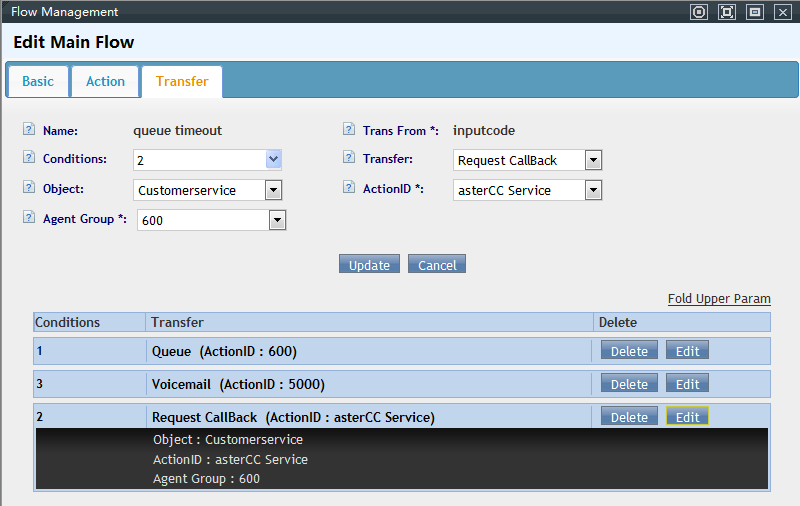

4. **Redirección desde la cola:** en la ficha de la cola, configura el "destino de fallo" como computer telephony (IVR) y selecciona el IVR de devolución de llamada creado arriba, para que el cliente caiga ahí automáticamente cuando se agota el tiempo máximo de espera en cola.
5. **Qué ve el agente:** cuando el cliente solicita devolución de llamada, el sistema registra el número con prioridad máxima en la lista de llamadas perdidas del grupo de agentes correspondiente y envía una notificación inmediata. Las solicitudes de devolución de llamada aparecen ordenadas antes que las llamadas perdidas comunes en esa misma lista, para que el agente las devuelva primero.

   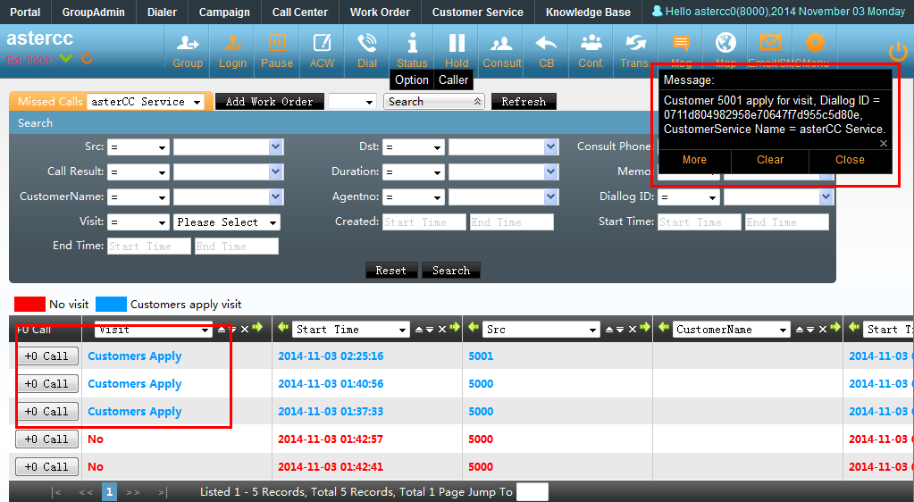

> La guía en inglés describe el mismo flujo con un ejemplo concreto: una cola de referencia (número 600) cuyo destino de fallo transfiere a un IVR con las opciones "1 = seguir esperando", "2 = solicitar devolución de llamada", "3 = dejar un mensaje" — el destino del dígito 2 puede ser tanto un servicio de atención al cliente como una campaña de marketing outbound, y el agente ve el aviso "gracias, le responderemos a la brevedad" reproducido al cliente que solicitó la devolución.

### 14. Escalar a un work order desde la atención entrante (detalle del flujo)

Ampliando lo indicado en "4. Combinar con otros módulos": el módulo de work orders puede usarse junto con el servicio de atención al cliente entrante (y también con marketing outbound) siguiendo este flujo:

1. **Tipos de work order:** en Gestión de work orders → Work order, se definen tipos con su propio flujo — un tipo puede quedar en manos de quien lo creó ("el creador retiene") o pasar directamente a un grupo para que el líder de grupo lo asigne ("fluye directo al grupo").

   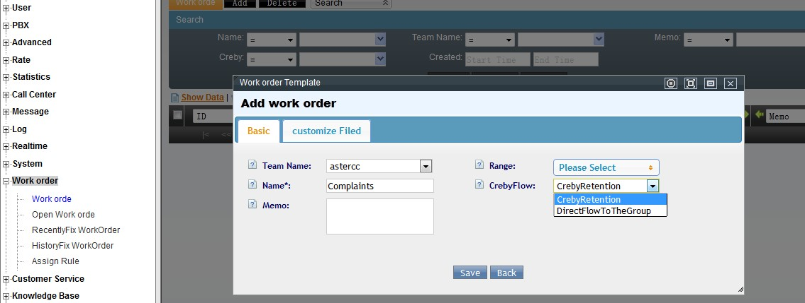

2. **Alcance:** cada tipo de work order define en qué grupos de agentes puede circular.
3. **Campos personalizados:** cada tipo admite campos propios adicionales a los estándar, para capturar datos específicos del negocio.
4. **Notificación por correo:** se puede definir una dirección de copia que reciba un correo cada vez que el work order cambia de estado.
5. **Vínculo con el resultado de llamada:** en la pantalla de atención al cliente entrante, el agente elige un resultado de llamada; si ese resultado tiene un tipo de work order vinculado, aparece de inmediato el enlace para crear el work order sin salir de la pantalla de la llamada.

   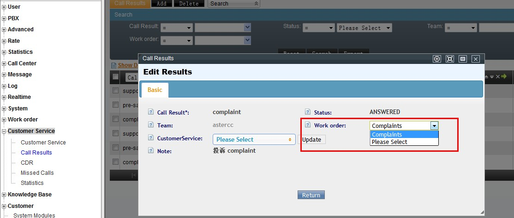

6. **Ciclo de vida:** el agente puede ver y gestionar sus propios work orders, con accesos rápidos para contactar al cliente (llamada, SMS, correo, fax); al marcarlo como resuelto, pasa a revisión del líder de grupo, quien decide si se cierra o se reasigna a otro grupo. El líder de grupo también puede asignar manualmente los work orders que llegaron sin asignar y crear work orders directamente.

   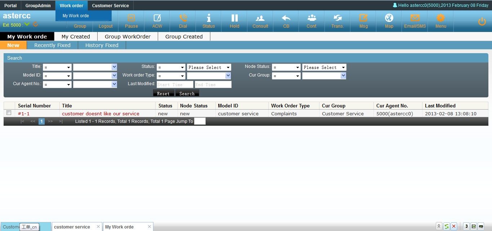

### 15. Filtrar clientes para reciclar a la lista de marcación

La función de **filtros** recicla periódicamente, hacia la lista de marcación, los registros de un paquete de clientes que cumplen ciertas condiciones — pensada originalmente para paquetes de marketing outbound, pero aplica igual a cualquier paquete de clientes compartido con atención al cliente entrante (por ejemplo, para volver a poner en cola de contacto a clientes que cumplieron cierta condición sin tener que exportar/reimportar manualmente). En Administración avanzada del call center → paquetes de clientes de campaña → Agregar filtro, cada filtro define:

- **Nombre y estado** (activo/inactivo).
- **Prioridad de marcación** que el filtro asigna al reciclar el número a la lista.
- **Campo de teléfono a marcar primero**, si el cliente tiene más de un número guardado.
- **Programación tipo cron** (minuto/hora/día/mes/día de semana) — por ejemplo, "al minuto 0 de cada hora", "a las 9:15 el día 1 de cada mes", o "al minuto 15 de cada hora, cada lunes de marzo" (día y semana no pueden combinarse en la misma regla).
- **Condiciones** sobre los campos del cliente (coincide, menor que, igual, mayor que, distinto), combinables con "y"/"o" — por ejemplo, reciclar todos los clientes con estado distinto de "cerrado con éxito" y distinto de "cerrado con error".

Un número que ya está en la lista de marcación no se vuelve a reciclar mientras siga ahí, para evitar duplicados. El filtro también puede lanzarse manualmente ("procesar ahora") en vez de esperar a su horario programado. El detalle de configuración paso a paso de una campaña de marketing saliente está fuera del alcance de esta página — ver [Marketing y marcación outbound](marketing-outbound.md).

### 16. Personalizar campos, registro de contacto e importar/exportar datos

Antes de que un dato "nuevo" del negocio pueda capturarse (ficha de cliente, bitácora de contacto, work order), hay que darlo de alta como campo personalizado:

- **Campos de la ficha de cliente:** ver [Campos personalizados](../modulos/atencion-cliente-mensajeria-ecommerce.md#campos-personalizados) — tipo de campo, a qué paquete de clientes aplica, visibilidad para el agente.
- **Campos del registro de contacto (bitácora de la llamada):** solo aplica si el paquete de clientes de la campaña asociada usa una tabla individual propia (no la tabla general de clientes) — requiere una versión mínima de sistema (núcleo 3.2 y módulo de campañas 2.7). Se agrega en tabla "Registro de contacto", tipo de campo `customer_field`, eligiendo de cuál campo de cliente toma el valor. El campo de nombre del registro de contacto se sincroniza **una sola vez**, en el momento en que se importa al cliente — después la bitácora de contacto y la ficha de cliente son tablas independientes, así que hay que editarlas por separado si el nombre cambia más adelante.

  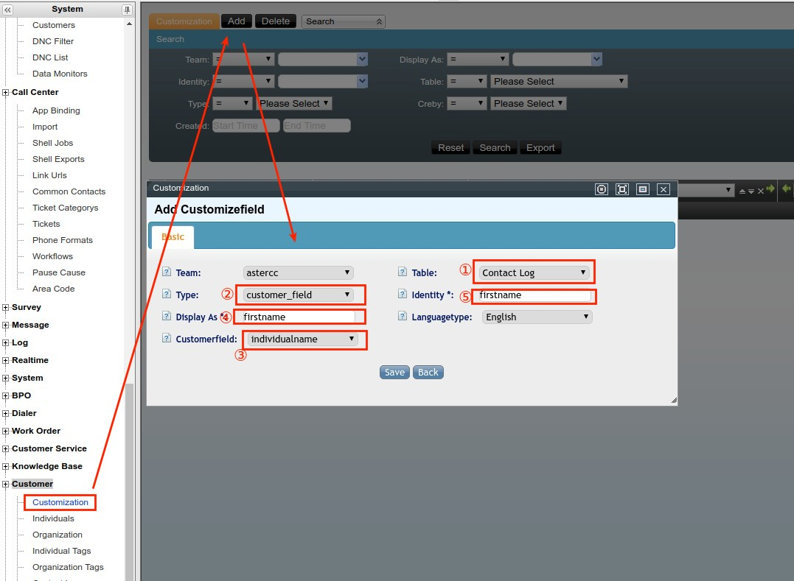
- **Campos de work order:** se agregan al crear o editar el tipo de work order (ver [Work Orders](../modulos/base-conocimiento-work-orders.md#work-orders)).

Una vez creados los campos que se necesiten, para cargar una base de clientes existente se usa [Importación y exportación masiva de datos](../administracion/gestion-avanzada-call-center.md#importacion-y-exportacion-masiva-de-datos):

1. Sube el archivo (CSV en UTF‑8 recomendado; si el archivo viene de una hoja de cálculo, puede requerir un paso de conversión de codificación con un editor de texto antes de subirlo).
2. Elige la tabla destino — paquete de clientes de campaña, tabla general de clientes, tabla de atributos de número (código de área), lista negra o lista de no llamar.
3. Empareja cada columna del archivo con un campo del sistema (incluyendo los campos personalizados recién creados); marca qué campos son solo de lectura para el agente, cuáles editables, y cuáles deben validarse contra el **diccionario de coincidencia** — útil cuando el mismo valor puede escribirse de varias formas en el archivo de origen (por ejemplo, variantes de texto libre para "masculino"/"femenino") y hay que mapearlas a los valores fijos que espera la base de datos para no perder esos registros.

  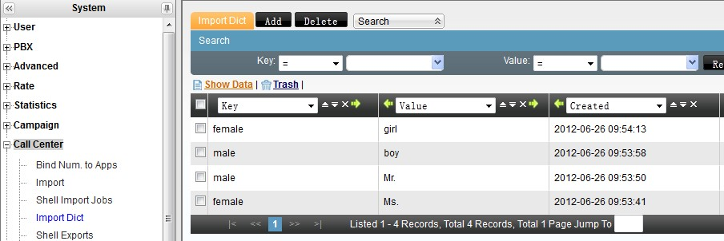
4. Si el paquete tiene marcador predictivo habilitado, además se elige qué columna alimenta la lista de marcación, con qué prioridad y horario.
5. Confirma la importación y revisa el avance en la gestión de planes de importación antes de darla por completa — un plan puede quedar en pendiente, en curso, completo o con error, y se puede descargar por separado lo importado con éxito, lo fallido y lo duplicado.

Para exportar datos hacia afuera del sistema (por ejemplo, para un reporte externo), existe tanto exportación inmediata desde la pantalla de búsqueda como exportación programada en segundo plano — esta última pensada para lotes grandes, ya que bloquea la tabla mientras exporta y por eso conviene programarla fuera del horario de trabajo de los agentes.

### 17. Panorama de funciones típicas de agente y supervisor

Resumen de funciones transversales que un agente y su supervisor usan en cualquier servicio de atención al cliente (entrante, saliente u oficina virtual) — el detalle técnico completo de cada una vive en el módulo correspondiente:

- **Pantalla emergente (screen-pop):** al recibir la llamada, el sistema muestra automáticamente el negocio configurado (atención al cliente, campaña, oficina virtual) según de dónde vino la llamada — cola, ruta directa a extensión, o grupo de timbrado. Ver sección 9 de este artículo y [Plataforma de trabajo del agente](../modulos/plataforma-del-agente.md).
- **Modo de trabajo:** solo entrante, solo saliente, ambos, o autoselección entre los tres — se define por grupo de agentes. Ver [Grupos de agentes](../modulos/cuentas-equipos-permisos.md#grupos-de-agentes).
- **Pausa y ACW (after-call work):** tras colgar, el agente puede entrar automáticamente en ACW (tiempo para completar datos antes de la próxima llamada) según la regla configurada (al timbrar, solo si se atendió, o deshabilitado); también puede pausarse manualmente, y ambos tiempos quedan reflejados en el reporte de desempeño. Ver [Plataforma de trabajo del agente](../modulos/plataforma-del-agente.md#pausa-y-bloqueo-de-pantalla).
- **Consulta, transferencia y conferencia:** el agente puede consultar a otro agente o número sin perder al cliente (que mientras tanto escucha música en espera), transferir la llamada, o unir a las partes en conferencia (asterCC admite hasta 30 participantes en una conferencia iniciada por un agente). Ver sección 8 de este artículo.
- **Supervisión en vivo del grupo:** el líder/administrador de grupo ve el estado de cada agente en tiempo real (inactivo, timbrando, en llamada, en conferencia, en pausa, en ACW, consultando o siendo consultado) y, sobre una llamada activa, puede escuchar sin ser oído (**spy**), unirse a la llamada (**call barge**), hablarle solo al agente sin que el cliente lo oiga (**whisper**), o forzar la liberación, pausa, inactividad o cierre de sesión del agente. Ver [Monitoreo en tiempo real](../modulos/reportes-y-estadisticas.md#monitoreo-en-tiempo-real).
- **Marcador predictivo (si aplica):** el líder de grupo puede cambiar la estrategia de marcación, revisar o reciclar clientes de la lista de marcado, e iniciar/detener el marcador de su grupo. Ver [4.2 Marcador y campañas](../modulos/marcador-y-campanas.md).
- **Control de calidad:** el supervisor revisa llamadas marcadas para control de calidad y valida que los agentes usen el guion correcto. Ver [Marcador y campañas — Control de calidad](../modulos/marcador-y-campanas.md#control-de-calidad).

### 18. DNC, lista negra y restricción de número entrante

- **DNC (no llamar):** aplica a llamadas salientes de campaña, en tres niveles (sistema, equipo, tarea) — se carga por importación masiva (ver sección 16) o de forma manual. Ver [DNC](../modulos/marcador-y-campanas.md#dnc-lista-de-no-llamar-en-tres-niveles).

  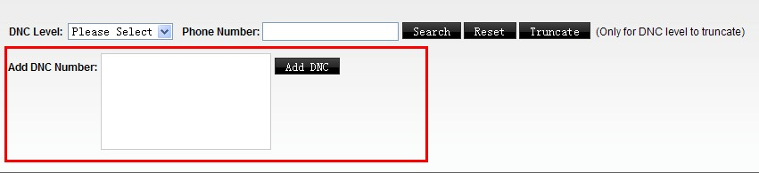

- **Lista negra de entrantes:** bloquea que ciertos números llamen al call center — por equipo, cuenta o dispositivo. Para pocos números se agrega uno por uno desde la pantalla; para volumen alto se carga por importación masiva (tabla "lista negra"). Ver [Listas blanca y negra de llamadas entrantes](../modulos/pbx-funciones-avanzadas.md#listas-blanca-y-negra-de-llamadas-entrantes).

  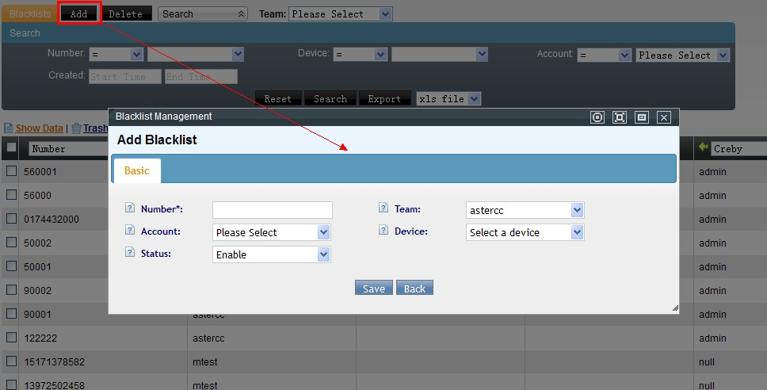

  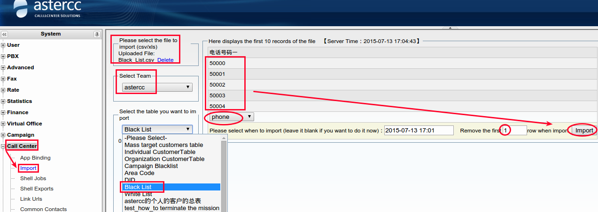

- **Restricción por patrón (no por número exacto):** si en vez de bloquear números puntuales hay que bloquear un patrón completo (por ejemplo, todo un prefijo, como los números que empiezan en `150`), se define en la ruta entrante correspondiente (coincidencia y destino de número que llama, con acción "ocupado" o "colgar") en vez de cargar cada número a la lista negra uno por uno. Ver [Rutas entrantes y salientes](../modulos/pbx-y-telefonia.md#rutas-entrantes-y-salientes).

  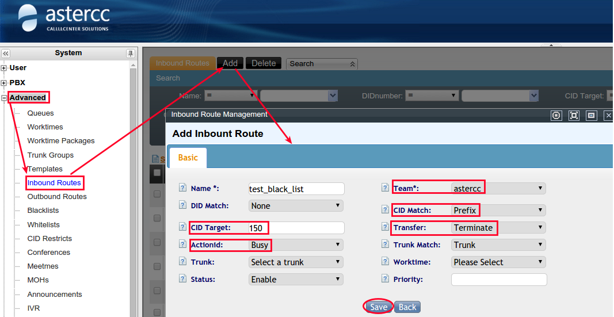

### 19. Monitoreo en tiempo real y reportes útiles

- **Estado de agentes en vivo:** quién está inactivo, timbrando, en llamada, en ACW o en una llamada adicional (conferencia/consulta) — visible para administradores de sistema/equipo sobre todos los grupos, y para un líder de grupo sobre el suyo. Ver [Monitoreo en tiempo real](../modulos/reportes-y-estadisticas.md#monitoreo-en-tiempo-real).

  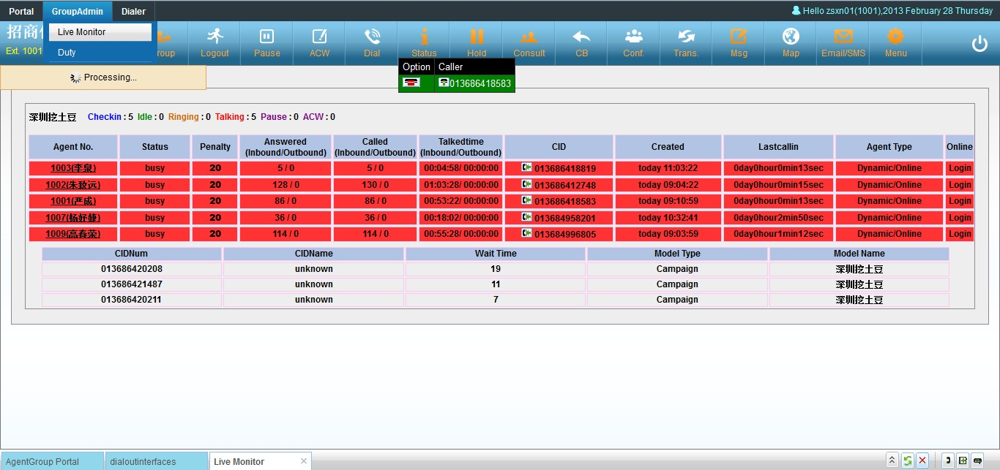
- **Uso de troncales, cuentas conectadas por navegador y uso general del sistema:** vistas complementarias de lo que está pasando en el sistema en este momento, en la misma sección de reportes en tiempo real.
- **Reportes de desempeño de agente:** estadísticas de un agente (o de varios) durante un periodo, cruzando una o varias campañas. Ver [Reportes de desempeño](../modulos/reportes-y-estadisticas.md#reportes-de-desempeno).
- **Reportes de llamadas entrantes/salientes:** detalle de llamadas por agente o por dispositivo, con totales de duración por tipo de llamada.
- **Reportes de campaña, de marcador predictivo y de monitoreo de datos:** resultado de llamada, tasa de éxito, y consumo del paquete de clientes de la campaña — estos son específicos de marketing outbound (ver [Marketing y marcación outbound](marketing-outbound.md)).

### 20. Grabación de llamadas

Todas las llamadas de agente se graban automáticamente en el propio servidor, sin equipo de grabación adicional:

- **Reproducción y descarga:** desde el CDR general de PBX o desde el CDR específico del módulo (atención al cliente, campaña, oficina virtual) — cada uno da una vista más rápida para su tipo de tarea. En campañas, también se puede escuchar la grabación desde la pantalla de control de calidad. El acceso del agente a sus propias grabaciones puede habilitarse o restringirse por equipo. Estas pantallas permiten descarga individual o por lote.

  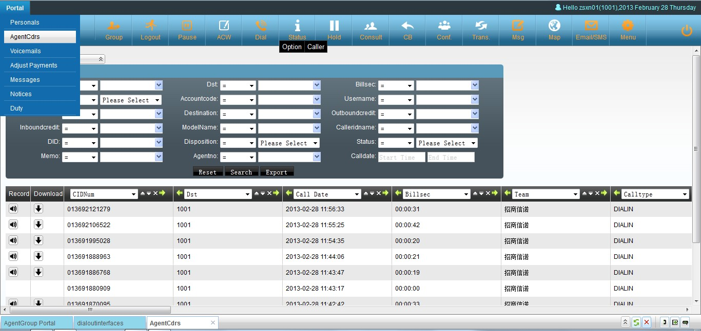
- **Descarga masiva:** al solicitar una exportación de grabaciones, el sistema empaqueta los archivos en un `.tar` y lo deja disponible para descarga en la pantalla de planes de exportación; por seguridad, esta descarga en línea puede desactivarse a nivel de sistema.
- **Respaldo automático:** se puede programar un plan de respaldo de grabaciones con horario de ejecución y ruta de guardado configurables.

Ver [Registro de llamadas (CDR) y retención de datos](../modulos/pbx-y-telefonia.md#registro-de-llamadas-cdr-y-retencion-de-datos).

### 21. Códigos de función y teclas rápidas (feature codes)

Códigos que el agente puede marcar desde su teléfono sin pasar por la interfaz web — los **códigos de función** se marcan con el teléfono colgado (antes de la llamada); las **teclas rápidas (hotkeys)** se marcan durante una llamada en curso:

| Código | Tipo | Acción |
|---|---|---|
| `*61` | Función | Tomar una llamada que está timbrando en otra extensión del mismo grupo de cuentas (o de cualquier extensión del equipo, si no hay grupo configurado) |
| `*62` | Función | Reproducir el número de la propia extensión |
| `*64` | Función | Iniciar sesión como agente (pide número y contraseña de agente, y a qué grupo(s) de cola entra) |
| `*65` | Función | Cerrar sesión de todos los grupos de agente |
| `*67` / `*68` | Función | Activar / desactivar no molestar (DND) |
| `*69` / `*71` / `*72` | Función | Modo de agente normal (entrante+saliente) / solo saliente / solo entrante |
| `*73` | Función | Volver a llamar al último número |
| `*81` | Tecla rápida | Marcar saltando la validación de DNC (requiere conocer el código) |
| `*51` / `*52` | Tecla rápida | Transferencia ciega / transferencia con consulta (modo dispositivo) |
| `*54` / `*55` | Tecla rápida | Consultar por número de agente / consultar por número de teléfono (modo agente) |

Adicionalmente, la interfaz gráfica del agente admite atajos de teclado: `Esc` cierra la ventana activa, `Ctrl+Z` abre el panel de marcación, y en el portal de campaña `Ctrl+Flecha izquierda` pliega/despliega el panel de lista de clientes y `Ctrl+Flecha abajo` pliega/despliega el panel de encuesta.

## Referencia rápida

| Paso | Módulo relacionado |
|---|---|
| Troncal + ruta entrante | [4.1 PBX y telefonía](../modulos/pbx-y-telefonia.md) |
| Grupo de agentes | [4.3 Cuentas, equipos y permisos](../modulos/cuentas-equipos-permisos.md) |
| Servicio de atención al cliente | [4.10 Atención al cliente](../modulos/atencion-cliente-mensajeria-ecommerce.md) |
| Escalar a otro equipo | [4.6 Work Orders](../modulos/base-conocimiento-work-orders.md) |
| Vender durante la llamada | [4.10 E-commerce](../modulos/atencion-cliente-mensajeria-ecommerce.md#e-commerce) |
| IVR con horario laboral / no laboral | [4.1 PBX y telefonía](../modulos/pbx-y-telefonia.md) |
| Transferencia ciega / asistida / de agente | [4.1 PBX y telefonía](../modulos/pbx-y-telefonia.md) |
| Personalizar URL de pantalla emergente | Gestión de enlaces (PBX avanzado) |
| Reglas de marcado, tarifas y grupos de troncal | [4.4 Tarifas y facturación](../modulos/tarifas-y-facturacion.md) |
| Restricciones de número llamado/llamante | [4.1 PBX y telefonía](../modulos/pbx-y-telefonia.md) |
| Subir y usar locuciones de voz | [PBX — Funciones avanzadas](../modulos/pbx-funciones-avanzadas.md#gestion-de-musica-en-espera) |
| Devolución de llamada (callback) | [4.1 PBX y telefonía](../modulos/pbx-y-telefonia.md) / [4.2 Marcador y campañas](../modulos/marcador-y-campanas.md) |
| Filtrar clientes para reciclar a marcación | [4.2 Marcador y campañas](../modulos/marcador-y-campanas.md) |
| Personalizar campos / registro de contacto / importar datos | [4.10 Atención al cliente](../modulos/atencion-cliente-mensajeria-ecommerce.md#campos-personalizados) · [Work Orders](../modulos/base-conocimiento-work-orders.md#work-orders) · [Administración avanzada](../administracion/gestion-avanzada-call-center.md#importacion-y-exportacion-masiva-de-datos) |
| Panorama de funciones de agente / supervisor | [Plataforma del agente](../modulos/plataforma-del-agente.md) · [Cuentas, equipos y permisos](../modulos/cuentas-equipos-permisos.md) |
| DNC y lista negra de entrantes | [4.2 Marcador y campañas](../modulos/marcador-y-campanas.md#dnc-lista-de-no-llamar-en-tres-niveles) · [PBX — Funciones avanzadas](../modulos/pbx-funciones-avanzadas.md#listas-blanca-y-negra-de-llamadas-entrantes) |
| Monitoreo en tiempo real y reportes | [4.8 Reportes y estadísticas](../modulos/reportes-y-estadisticas.md) |
| Grabación de llamadas | [4.1 PBX y telefonía](../modulos/pbx-y-telefonia.md#registro-de-llamadas-cdr-y-retencion-de-datos) |
| Escalar a work order (detalle de flujo) | [4.6 Work Orders](../modulos/base-conocimiento-work-orders.md) |
| Códigos de función y teclas rápidas | Ver sección 21 de este artículo |

---

## Fuentes

- `raw/zh/用途和案例/呼入客服的配置弹屏和简单使用.txt`
- `raw/zh/用途和案例/如何在呼入客服系统中使用电子商务.txt`
- `raw/zh/实际案例指导/为astercc呼入用户设置接收客户来电.txt`
- `raw/zh/实际案例指导/如何使用时间判断ivr转向.txt`
- `raw/zh/实际案例指导/如何自定义弹屏地址.txt`
- `raw/zh/实际案例指导/如何进行电话转接.txt`
- `raw/zh/实际案例指导/如何配置典型的呼叫中心呼入流程.txt`
- `raw/zh/实际案例指导/如何配置pbx的呼入和呼出.txt`
- `raw/zh/实际案例指导/pbx呼入呼出配置.txt`
- `raw/zh/实际案例指导/配置电话系统外呼及呼入流程.txt`
- `raw/zh/实际案例指导/astercc对于被叫号码的处理流程.txt`
- `raw/zh/实际案例指导/如何上传和设置语音.txt`
- `raw/zh/用途和案例/呼叫中心中工单的使用.txt`
- `raw/zh/用途和案例/如何配置用户回呼请求.txt`
- `raw/en/real_case_guidance/settingup_astercc_to_receive_inbound_calls_which_are_presented_to_different_customer_queues.txt`
- `raw/en/use_case/how_to_config_customer_request_call_back.txt`
- `raw/en/how-to/how_to_config_customer_service_module_for_inbound_calls.txt`
- `raw/en/how-to/how_to_use_work_order_in_customer_service_module.txt`
- `raw/en/how-to/how_to_filter.txt`
- `raw/en/how-to/how_to_use_filter.txt`
- `raw/en/real_case_guidance/how_to_add_a_customizefield_to_the_contact_log_table.txt`
- `raw/en/how-to/how_to_customize_customer_information_fields_and_import_data.txt`
- `raw/en/regular_function_description_in_call_center/customization_fields.txt`
- `raw/en/regular_function_description_in_call_center/import_export_data.txt`
- `raw/en/regular_function_description_in_call_center/agent_functions.txt`
- `raw/en/regular_function_description_in_call_center/agent_supervisor_functions.txt`
- `raw/en/regular_function_description_in_call_center/start.txt`
- `raw/en/regular_function_description_in_call_center/do_not_call_and_black_list.txt`
- `raw/en/regular_function_description_in_call_center/how_to_restrict_the_incoming_calls_number.txt`
- `raw/en/regular_function_description_in_call_center/realtime_monitor.txt`
- `raw/en/regular_function_description_in_call_center/useful_reports.txt`
- `raw/en/regular_function_description_in_call_center/call_recordings.txt`
- `raw/en/use_case/features_codes_in_call_center.txt`