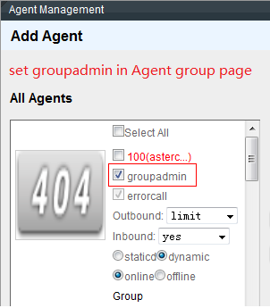
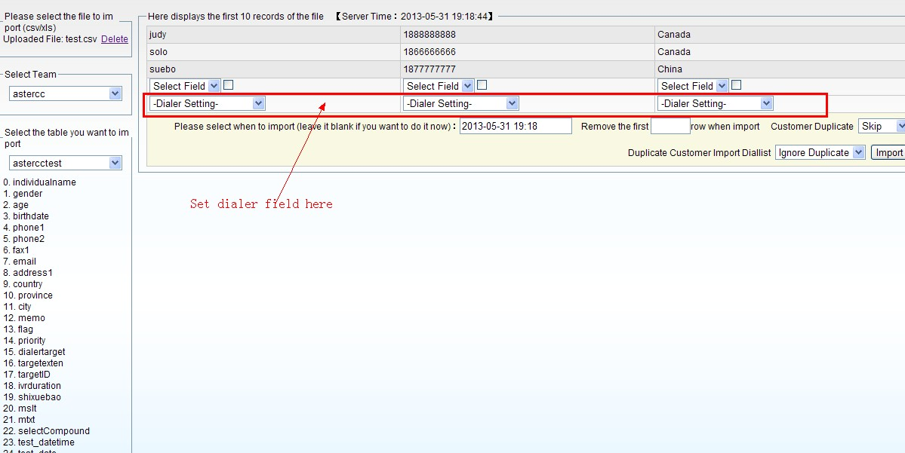
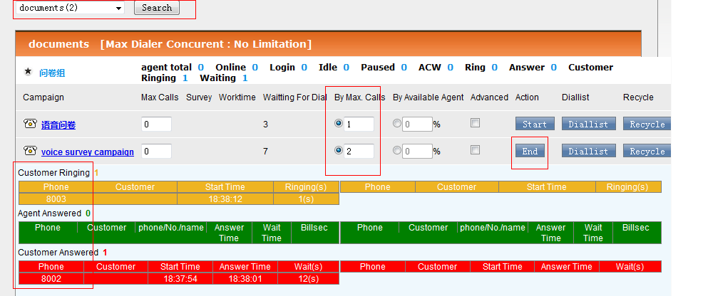
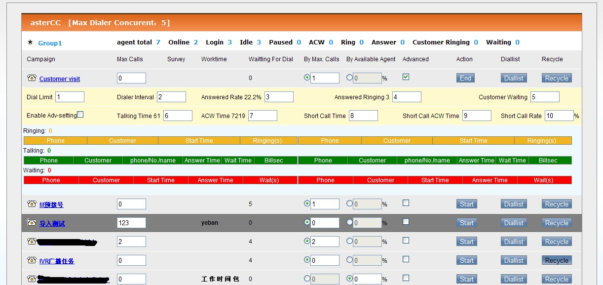
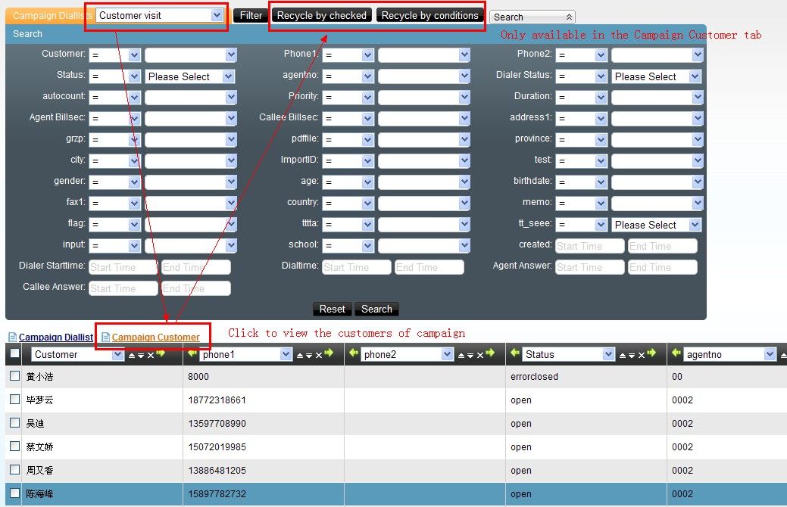
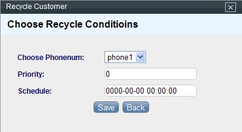
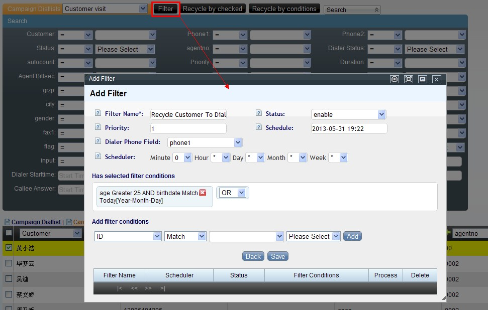
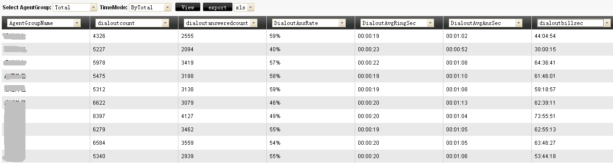
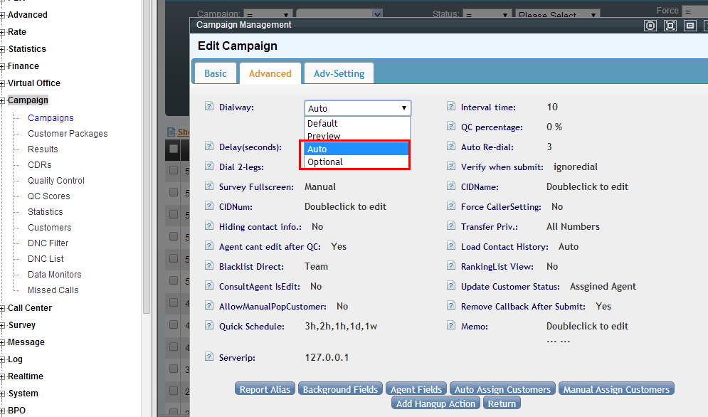
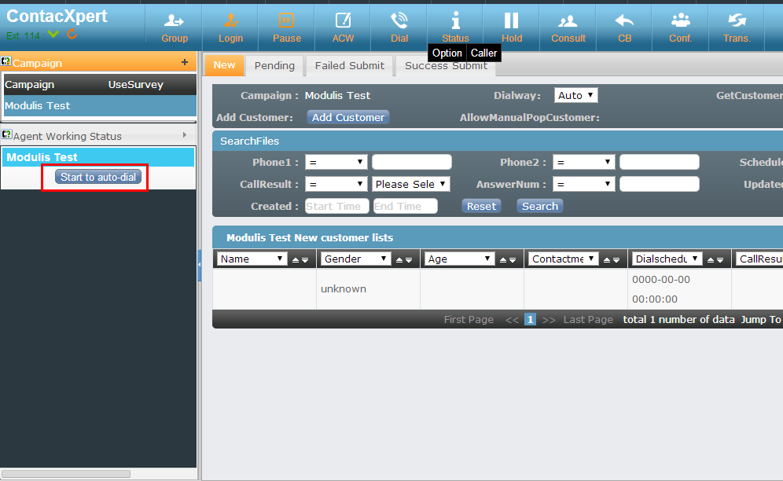

# Marcación predictiva

## Qué es

El marcador predictivo marca automáticamente por el agente, aplicando una estrategia que intenta que, en cuanto un cliente contesta, siempre haya un agente libre esperando — sin que el agente pierda tiempo buscando números o esperando que timbre.

## Cómo se usa

### 1. Crear la tarea de campaña y su lista de marcación

Sigue [4.2 Marcador y campañas](../modulos/marcador-y-campanas.md) para crear la tarea. Si no se especifica un paquete de clientes existente, el sistema crea automáticamente uno con el mismo nombre de la tarea. Importa los números a marcar según [Atención al cliente](../modulos/atencion-cliente-mensajeria-ecommerce.md) → carga de datos, o usando la función de importación de datos del módulo de campañas.

**Importar un rango de números para marcación saliente (manual, automática o predial).** Solo un agente con rol de jefe de grupo puede importar números — se asigna en **Cuentas y permisos → Gestión de equipos de agentes → Agregar agente**, marcando el rol de jefe de grupo, y confirmando que el rol de cuenta del agente sea el adecuado para esa función.

Con esa sesión:

1. Entra a **Administración avanzada del call center → Carga de datos** y sube el archivo de números en CSV o XLS.
2. Elige la tabla destino — la tarea de campaña (ej. "Externas 01") a la que se van a importar los números.
3. Mapea cada columna del archivo a un campo de la tarea; define además cuál columna determina el teléfono, la prioridad y la hora de contacto que va a usar el predial.

   

4. Decide si se limpia la restricción de "agente asignado" para números ya marcados antes por otro agente, y si se reinicia el estado previo del cliente.
5. Quita la primera fila si corresponde al encabezado del archivo original, y confirma la importación.

A partir de esa lista, la tarea admite tres formas de marcar:

- **Marcación manual (vista previa):** el agente ve la lista de números "sin procesar" y decide cuándo marcar cada uno; también puede hacer doble clic sobre un cliente para ir directo a su ficha y marcar desde ahí.
- **Marcación automática:** ver el detalle de prioridades en el paso 6, "Marcador predictivo vs. marcado automático (auto dial)".
- **Predial (marcador predictivo):** ver los pasos 2 y 3 de esta guía.

### 2. Iniciar la sesión de marcado

El jefe de grupo entra al **marcador**, donde ve la tarea con su cantidad de **clientes pendientes de marcar**, y elige una de dos estrategias:

| Estrategia | Cómo calcula cuántas llamadas lanzar |
|---|---|
| Por concurrencia máxima | Un número fijo de llamadas simultáneas para la tarea (ej. 50: si ya hay 30 en curso y 10 timbrando, lanza 10 más para completar 50) |
| Por porcentaje de agentes disponibles | Agentes libres × porcentaje configurado, menos las llamadas que ya están timbrando (ej. 40 agentes libres × 120% − 10 timbrando = 36 nuevas llamadas) |

Al hacer clic en **iniciar**, el marcador comienza a marcar automáticamente los números de la lista.

### 3. Monitorear la sesión en vivo

Mientras la campaña corre, el panel del marcador muestra en tiempo real:

- **Timbrando:** clientes cuya llamada está en curso, esperando respuesta.
- **En conversación:** clientes ya conectados con un agente.
- **Esperando agente:** clientes que contestaron pero aún no hay agente libre asignado — este número debe mantenerse lo más bajo posible; si crece mucho, hay que bajar la agresividad de la estrategia de marcado.
- Duración de timbrado, tiempo de espera, y tiempos entre respuesta del cliente y asignación al agente.

### 4. Recuperar números no completados

Si la lista de marcación se agota antes de terminar la tarea, se puede **recuperar** clientes desde el paquete completo de la tarea de vuelta a la lista de marcación, para reintentarlos.

**Forzar el marcado inmediato de números con hora de cita pendiente.** El predial solo marca un número en seguimiento cuando su hora programada (`schedule`) ya es igual o anterior a la hora actual del sistema — si la cita quedó fijada para más adelante, el botón de inicio no lo tomará todavía. Para marcarlo de inmediato desde la interfaz, sin esperar a que llegue la hora:

1. Entra a **Predial → Ver lista de marcado** y busca los registros por "hora de cita" (`schedule`).
2. Bórralos con **Eliminar por condición de búsqueda** (por ejemplo, "eliminación directa") — solo se pueden eliminar los registros cuyo estado de marcado sea "pendiente".
3. Ve a **Recuperar** y recupera esos mismos clientes de vuelta a la lista de marcado, fijando ahora una hora de cita menor o igual a la hora actual.

   

4. Pulsa **Iniciar** en el predial para que se marquen de inmediato.

(La guía original también documenta un método alternativo por base de datos — actualizar `schedule` a `0000-00-00 00:00:00` y el campo `dialer` de la campaña a `start` directamente en MySQL — que se omite aquí por ser una intervención directa sobre la base de datos, fuera del flujo normal de administración.)

Por defecto, un número de predial que no contesta se marca una sola vez y no se reintenta automáticamente. Para habilitar reintentos, configura **Marketing outbound → Tarea de marketing outbound → Configuración avanzada de predial → Remarcado automático por no respuesta**, indicando los intervalos entre reintentos (ej. `1h,1d,1w` reintenta a la hora, al día y a la semana siguientes; `0,0` reintenta de inmediato con un máximo de 2 reintentos).

También se puede automatizar la recuperación con un filtro por condiciones en vez de repetirla manualmente cada vez — por ejemplo, para reciclar automáticamente a los clientes mayores de cierta edad o con determinada fecha de nacimiento, programando además cada cuánto se ejecuta el filtro:

### 5. Cerrar y revisar resultados

Al finalizar, consulta en [4.8 Reportes](../modulos/reportes-y-estadisticas.md) el desempeño de agente y de grupo para esa sesión — volumen marcado, tasa de contactación, y tiempos promedio.

### 6. Marcador predictivo vs. marcado automático (auto dial)

El marcador predictivo no es la única forma de marcado asistido por sistema dentro de una tarea de campaña. Existe una alternativa, el **marcado automático** (auto dial), pensada para conservar la relación agente-cliente en vez de maximizar la ocupación del agente:

| | Marcador predictivo | Marcado automático (auto dial) |
|---|---|---|
| A quién marca | El siguiente número disponible en la lista, sin importar el agente | Solo los clientes ya asignados a ese agente ("nuevo" o "pendiente") |
| Orden de marcado | Cliente primero; el agente se asigna cuando contesta | Agente primero; solo se marca al cliente si el agente contesta |
| Experiencia del cliente | Puede quedar en espera unos segundos hasta que se le asigna agente | No espera — el agente ya está en línea cuando se marca su número |
| Reintento con múltiples números | Según configuración de recuperación de la lista | Automático: si el primer número del cliente no contesta, marca el siguiente número registrado |
| Llamadas con cita (callback) | No es su función típica | Soporta: al llegar la hora programada (±5 min) el sistema marca automáticamente |

Se activa en **Marcador y campañas → Avanzado**, seleccionando "Automático" u "Opcional" en el modo de marcado (`dialway`) de la tarea:

con esto habilitado, el agente ve un botón "Iniciar marcado automático" en su panel de trabajo:

La prioridad de marcado en este modo es: primero los clientes pendientes con hora programada cercana (±5 min) ordenados por esa hora; luego los pendientes con hora programada más lejana, ordenados por hora y número de intentos; y por último los clientes nuevos, ordenados por número de intentos y por el orden de la lista en la pantalla del agente.

## Encuestas telefónicas con marcación predictiva

**Qué es:** combinar una tarea de campaña con predial/marcador y una encuesta (ver [4.5 Encuestas y cuestionarios](../modulos/encuestas.md)), de forma que al conectar la llamada el agente — o, en encuestas de voz sin agente, el propio IVR — recorre un cuestionario con el cliente. Es el patrón típico de estudios de mercado, medición de satisfacción, y campañas de venta telefónica con guion estructurado.

### 1. Crear el cuestionario

Antes de vincularlo a una tarea, crea la encuesta completa en **Encuestas → Gestión de encuestas**: nombre, saludo y cierre, grupos de preguntas, preguntas (opción única, opción múltiple, combinada o texto libre), sus opciones, el orden y la lógica de salto entre preguntas, y cuotas si aplica. El detalle completo de esta parte está en [4.5 Encuestas y cuestionarios](../modulos/encuestas.md) — aquí solo se resume el punto donde se integra con una tarea de campaña.

Para una **encuesta de voz** (sin agente, ver más abajo), hay dos particularidades adicionales frente a una encuesta de texto normal:

- El tipo de la encuesta debe ser "voz", y el saludo/cierre son archivos de audio en vez de texto.
- Solo admite dos tipos de pregunta: opción única y texto libre. Cada pregunta necesita su propio audio grabado, y cada opción de respuesta corresponde a la tecla numérica que el cliente presiona (la opción 1 se selecciona presionando "1", y así sucesivamente — el orden de grabación de las opciones debe coincidir con ese mapeo). Si el cliente no responde o presiona una tecla inválida, el sistema repite la pregunta una vez; si vuelve a fallar, la encuesta termina en falla si la pregunta era obligatoria, o avanza a la siguiente si no lo era.
- Las grabaciones de las preguntas se suben primero como archivos de audio (**PBX avanzado → Carga masiva de archivos de voz**, o por FTP a la carpeta de sonidos del equipo) y luego se administran como voces del sistema en **PBX avanzado → Gestión de voces de llamada**, antes de poder asignarlas a cada pregunta.

### 2. Vincular la encuesta a la tarea de campaña

1. En **Marketing outbound → Tarea de marketing outbound → Agregar**, en la pestaña de guion (script) selecciona la encuesta ya creada — solo se puede elegir una encuesta libre (no asignada todavía a otra tarea).
2. Completa el resto de la tarea: paquete de clientes, equipo de agentes, campos visibles/editables por el agente, y porcentaje de control de calidad.
3. Asigna los clientes del paquete a los agentes del equipo (reparto automático por porcentaje, o manual).
4. Si el cuestionario debe activarse también en llamadas entrantes hacia esta tarea, configura el enlace de número entrante/saliente en **Administración avanzada del call center → Enlace de aplicación entrante**, con tipo de destino "tarea saliente" y el nombre de la tarea recién creada — así el sistema reconoce el número y abre la pantalla de encuesta correspondiente.

### 3. La pantalla emergente de encuesta durante la llamada

Con la encuesta ya vinculada, cuando el agente marca (o recibe) una llamada de esta tarea, la ficha de cliente se abre junto con la pantalla de la encuesta:

- Si el cliente ya existe en el sistema, se abre su ficha para edición y la encuesta debajo o en una pestaña asociada.
- Si el cliente no existe, se abre primero el formulario de alta de cliente nuevo.
- El agente puede maximizar la encuesta a pantalla completa para facilitar la lectura del guion mientras habla.
- Al colgar, el agente registra el resultado de la llamada, el estado de la gestión (completado, en seguimiento, fallido), y guarda — quedando el resultado de la encuesta asociado a ese contacto.

### 4. Encuestas de voz con predial (sin agente)

Cuando la encuesta es de tipo voz, no participa un agente — el predial marca directamente hacia la encuesta:

1. Sube las voces de las preguntas por FTP a la ruta configurada del equipo (por defecto algo como `/var/www/html/asterCC/data/soundfiles/<equipo>/<idioma>/`) y genera/publica los archivos desde **PBX avanzado → Carga masiva de archivos de voz**.
2. Crea la encuesta de voz con sus preguntas, cada una apuntando a su archivo de audio, y su cuota si corresponde (para encuestas de voz, la cuota solo admite el tipo "por encuesta completada").
3. Crea la tarea de campaña, elige la encuesta de voz en el guion, y en la pestaña de predial define como destino de conexión la propia encuesta — así, al contestar, el cliente entra directo al cuestionario grabado sin pasar por un agente.
4. Importa los números de la tarea igual que en cualquier campaña.
5. Inicia el predial: como no hay agentes involucrados, la única estrategia disponible es por concurrencia máxima (no aplica la estrategia por porcentaje de agentes).
6. Revisa el avance en **Encuestas → Distribución de encuesta** (completadas, porcentaje de cada respuesta) y en **Marketing outbound → Control de calidad** el detalle por cliente — por ejemplo, un cliente que cuelga tras responder solo 2 de 5 preguntas queda como "fallido", mientras uno que responde todas o llega al final por un salto de lógica queda como encuesta válida.

### Caso real: empresa de encuestas telefónicas

Una empresa de estudios de mercado se dedica a realizar encuestas telefónicas por encargo de terceros, y entregarles el resultado tabulado. Necesita gestión de clientes, gestión de encuestas y grabación obligatoria de toda llamada para control de calidad. El flujo con AsterCC queda así:

- **El administrador de la campaña:** importa los datos del cliente encargante a **Administración avanzada del call center → Carga de datos**; crea la encuesta con las preguntas del estudio; crea la tarea de campaña (plan de marcado) y le asocia la encuesta; asigna los clientes del paquete a los agentes en un porcentaje definido (por ejemplo, reparto automático equitativo).
- **El agente:** desde su plataforma de trabajo, llama a los clientes que le fueron asignados, edita la ficha de cliente si hace falta, y completa la encuesta durante la llamada; al finalizar, guarda el resultado de la encuesta, el resultado de la llamada, y el estado de avance de la gestión de ese cliente.
- **Al cerrar la recolección:** el administrador revisa qué cambios de ficha de cliente hechos por los agentes se sincronizan de vuelta a la base principal; hace control de calidad cruzando resultado de encuesta contra la grabación de la llamada; y exporta a Excel únicamente los registros validados como encuesta efectiva, junto con el reporte de tasa de contactación y tasa de finalización por agente y por campaña.

## Validar tarjetas de crédito con IVR durante una campaña

**Qué es:** un IVR que, sin intervención de agente, recibe el número de tarjeta y la fecha de vencimiento por teclado, y consulta un servicio HTTP externo para determinar si la tarjeta es válida — útil como paso de verificación dentro de un flujo de campaña o de atención (por ejemplo, antes de procesar un cobro o confirmar una suscripción).

El flujo completo se construye encadenando un IVR principal y varios IVR secundarios (ver [4.1 PBX e IVR](../modulos/pbx-ivr.md) para la mecánica general de acciones y transferencias entre flujos):

1. **Audio de bienvenida:** en **PBX avanzado → Gestión de voces de llamada**, agrega la voz de bienvenida (por ejemplo, por TTS) que pedirá el número de tarjeta.
2. **IVR principal — capturar y confirmar el número de tarjeta:**
   - Acción "Responder".
   - Acción "Reproducir y capturar dígitos": reproduce la bienvenida y guarda lo capturado en una variable, ej. `CARDNO`.
   - Acción "Reproducir audio" + "Leer número": confirma al cliente el número capturado.
   - Acción "Reproducir y capturar dígitos": "confirmar presione 1, cancelar presione 2", guardado en una variable de confirmación (ej. `OK1`).
   - Transferencia: si `OK1 = 1`, pasa al IVR secundario de fecha de vencimiento; si `OK1 = 2`, vuelve al inicio de este mismo IVR para volver a capturar el número.
3. **IVR secundario 1 — capturar y confirmar la fecha de vencimiento:** mismo patrón que el paso anterior, pero capturando la fecha en formato AAMM (ej. octubre de 2015 = `1510`) en una variable (ej. `DATENO`), con su propia confirmación (`OK2`) que transfiere al siguiente IVR si es correcta, o vuelve a pedir la fecha si no.
4. **IVR secundario 2 — consulta HTTP/webservice:** acción "HTTP", enviando como parámetros el número de tarjeta y la fecha capturados (formato `cardno=CARDNO|validdate=DATENO`) y recibiendo la respuesta del servicio en una variable global en mayúsculas cuyo nombre coincide exactamente con el nombre de retorno definido por el servicio (ej. `R1`). El servicio también devuelve un código (`inputcode`) que indica si la validación fue exitosa (1) o fallida (0).
5. **Transferencia según el código de retorno:**
   - `inputcode = 1` (válido): transfiere al IVR que informa el resultado — por ejemplo, reproduce el cupo disponible de la tarjeta usando el valor recibido en la variable global (`R1`), con opción de repetir el mensaje o colgar.
   - `inputcode = 0` (inválido): transfiere a un IVR que informa que la tarjeta no es válida y ofrece reintentar la captura desde el inicio.

Este patrón de "capturar dato → confirmar → transferir según validación externa" se puede reutilizar para cualquier otra verificación por HTTP dentro de un IVR (por ejemplo, validar un número de socio o un código de cupón), cambiando únicamente los parámetros enviados y las variables de retorno esperadas.

## Difusión de voz masiva (voice broadcasting)

**Qué es:** un modo de marcado automatizado que combina marcador predictivo, IVR y campaña, pero sin agente en la llamada — el sistema marca según ciertas condiciones y, al conectar, transfiere la llamada directamente a un [IVR](../modulos/pbx-ivr.md) que reproduce una grabación y recoge respuestas por tonos del teclado (por ejemplo, avisos masivos, encuestas de voz, o campañas tipo "presione 1 para..."). No hay conversación con un agente: es reproducción de audio pregrabado más navegación por IVR. Se distingue así del marcador predictivo con agente descrito arriba, que siempre conecta al cliente con una persona.

**Cómo se configura (panorama, sin repetir la configuración base de troncal/extensión/agente ya cubierta en [Marketing outbound](marketing-outbound.md)):**

1. Preparar el sistema (servidor, troncal saliente, cuentas y extensiones) igual que para cualquier campaña.
2. Instalar los módulos de campaña y marcador predictivo.
3. Crear el IVR que se va a reproducir (bienvenida, menú de tonos, cierre) — ver [4.1 PBX e IVR](../modulos/pbx-ivr.md).
4. Crear la tarea de campaña con el marcador habilitado y, en **Dial-In-Exten**, apuntar al IVR de difusión en vez de a un grupo de agentes; desactivar la reasignación automática a agente ("check reassign" → no), porque en este modo no se asignan clientes a agentes.
5. Importar el listado de números a marcar, igual que en cualquier tarea de campaña. Si los datos de origen usan valores distintos a los que espera AsterCC (por ejemplo, "M"/"F" en vez de "male"/"female" para el sexo del cliente), define antes un diccionario de datos en **Administración avanzada del call center → Coincidencia de importación de datos**, mapeando cada valor externo a su equivalente interno, y márcalo para usarse durante la importación.
6. Iniciar el marcador desde **Marcador → Marcador**, con el límite de llamadas simultáneas (por defecto hasta 20 concurrentes sin licencia adicional, ajustable según los canales que permita el troncal).
7. Los números no contestados o con error se pueden recuperar y reintentar igual que en cualquier tarea con marcador.
8. Revisar resultados en los reportes de la campaña y en el CDR (**Marketing outbound → CDR de campaña**).

Si la difusión debe transferir a una cola o grupo de agentes en vez de a un IVR puro (por ejemplo, para escalar a un humano si el cliente presiona una opción), se configura igual pero seleccionando el grupo de agentes en Dial-In-Exten; en ese caso el flujo vuelve a ser equivalente al marcador predictivo estándar descrito en este artículo, con el IVR como paso intermedio antes de la cola.

**Escalar a un agente humano dentro de la difusión.** También se puede combinar broadcast y atención humana en el mismo IVR (en vez de transferir toda la tarea a una cola): se crea un equipo de agentes con su cola asociada y, en el IVR de difusión, la opción "servicio con agente" (por ejemplo, presionar 0) se transfiere a esa cola en vez de colgar — así solo el cliente que pide hablar con una persona pasa de la reproducción automática a un agente en línea, mientras el resto de las llamadas del broadcast sigue su curso sin intervención humana.

## Referencia rápida

| Parámetro | Se configura en |
|---|---|
| Límite de concurrencia por equipo | Marcador → Configuración del marcador |
| Estrategia de marcado (concurrencia / % agentes) | Panel del marcador, al iniciar la sesión |
| Destino al contestar (cola / IVR) | Configuración avanzada de predial, dentro de la tarea de campaña |
| Modo de marcado (predictivo / automático / opcional) | Marcador y campañas → Avanzado → `dialway` de la tarea |
| Difusión de voz masiva | Tarea de campaña con Dial-In-Exten apuntando a un IVR |
| Importar rango de números | Administración avanzada del call center → Carga de datos (requiere rol de jefe de grupo) |
| Forzar marcado inmediato de una cita programada | Predial → Ver lista de marcado → eliminar por condición → Recuperar con `schedule` ≤ ahora |
| Remarcado automático de predial sin respuesta | Marketing outbound → Tarea → Configuración avanzada de predial |
| Vincular encuesta a una tarea de campaña | Marketing outbound → Tarea de marketing outbound → pestaña de guion |
| Diccionario de datos para importación | Administración avanzada del call center → Coincidencia de importación de datos |
| Validar dato externo (tarjeta, cupón, etc.) por HTTP dentro de un IVR | PBX avanzado → Electronic call flow (IVR) → acción "HTTP" |

---

## Fuentes

- `raw/zh/用途和案例/如何为在外呼任务中使用预拨号功能.txt`
- `raw/en/how-to/how_to_use_predictive_dialer_in_a_campaign.txt`
- `raw/en/how-to/how_to_build_a_voice_broadcasting_system.txt`
- `raw/en/how-to/how_to_build_a_voice_broadcasting_to_ivr_system.txt`
- `raw/en/regular_function_description_in_call_center/auto_dialing.txt`
- `raw/en/regular_function_description_in_call_center/predictive_dialer.txt`
- `raw/zh/实际案例指导/如何导入电话销售号码段进行外呼拨号_自动拨号和预拨号.txt`
- `raw/zh/实际案例指导/如何立刻拨打预拨号任务中有预约时间的号码.txt`
- `raw/zh/实际案例指导/拨号计划问卷弹屏设置步骤.txt`
- `raw/zh/实际案例指导/某电话问卷调查公司的astercc应用实例.txt`
- `raw/zh/实际案例指导/如何利用ivr功能验证信用卡的有效性.txt`
- `raw/zh/用途和案例/使用预拨号进行语音问卷调查.txt`
- `raw/zh/用途和案例/如何制作问卷.txt`
- `raw/zh/用途和案例/如何结合外呼计划使用问卷进行市场调查.txt`
- `raw/zh/用途和案例/通过电话进行市场调查问卷或销售.txt`
- `raw/zh/用途和案例/如何建立一个语音广播系统.txt`