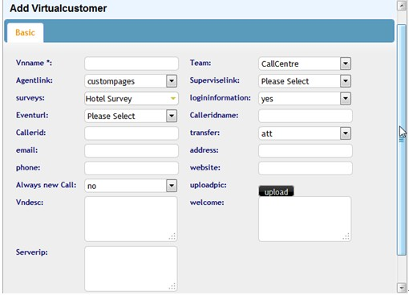
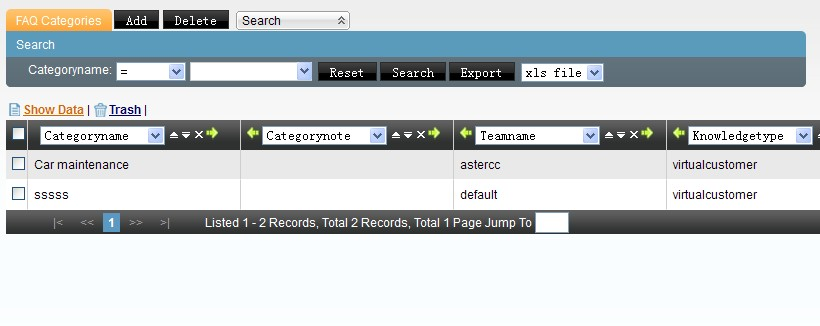
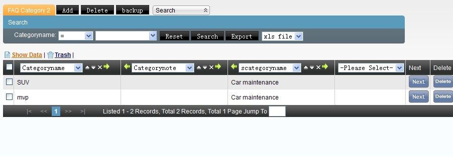
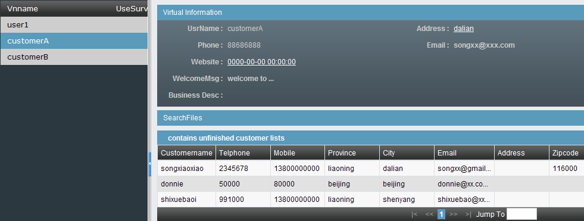
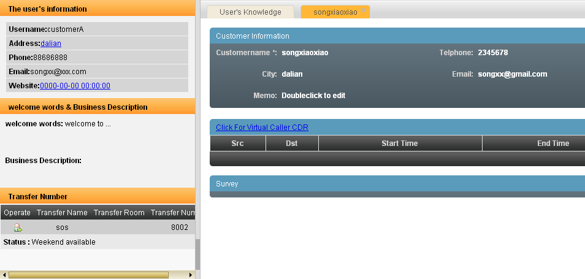
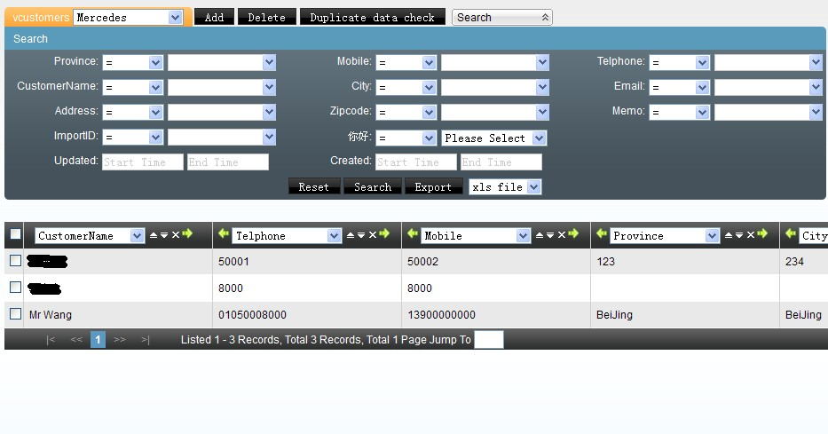
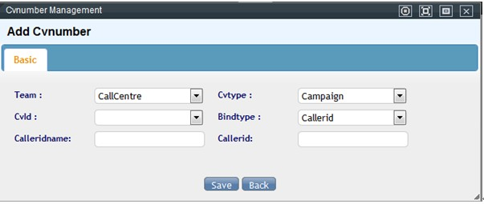
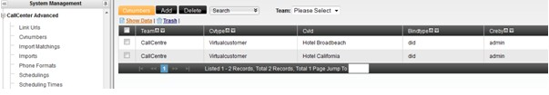

# Oficina virtual

## Qué es

Escenario: la empresa A opera el call center para tres empresas clientes (B, C y D), cada una con su propio número de atención. El objetivo es que cualquier agente disponible pueda atender a un cliente de cualquiera de las tres empresas, viendo en cada llamada la información y el conocimiento de la empresa correspondiente — sin mezclar datos entre ellas.

El detalle de configuración del módulo está en [4.9 Oficina virtual / BPO](../modulos/oficina-virtual-bpo.md); esta página resume el caso aplicado de punta a punta.

## Cómo se usa

1. **Cola y grupo de agentes:** un único grupo de agentes puede atender a las tres empresas cliente, ya que lo que cambia entre ellas es la pantalla y el conocimiento mostrado, no quién contesta.
2. **Un DID por empresa cliente:** B, C y D reciben cada una su propio DID — es la señal que usa el sistema para identificar de qué empresa viene la llamada.
3. **Un usuario virtual por empresa cliente:** se da de alta B, C y D como usuarios virtuales, cada uno con su propio saludo, enlace de pantalla, y base de conocimiento (ver [4.9](../modulos/oficina-virtual-bpo.md#3-dar-de-alta-el-usuario-virtual-empresa-cliente)).

   

   La base de conocimiento de cada usuario virtual se organiza en dos niveles de categoría, para que el agente solo vea el contenido relevante de la empresa que está atendiendo:

   

   

4. **Resultado para el agente:** al entrar una llamada de un cliente de B, el agente ve el nombre de B, su saludo de apertura, los datos del cliente que llama (si ya existía), y puede consultar la base de conocimiento específica de B para resolver la consulta — todo sin salir de la misma plataforma ni conocer de memoria el negocio de B.

   

   

   Los clientes de cada usuario virtual se filtran desde la misma pantalla de gestión de clientes, eligiendo a qué usuario virtual pertenecen:

   

5. **Reportes separados por empresa cliente:** si B, C o D necesitan ver sus propias estadísticas sin acceso al resto del sistema, se les crea una [cuenta BPO](../modulos/oficina-virtual-bpo.md#cuentas-bpo) con acceso acotado a su propio usuario virtual.

## Vínculo técnico entre el DID y la empresa cliente (CvNumber)

Una guía de configuración en inglés documenta este mismo escenario (agentes compartidos atendiendo llamadas de distintas empresas cliente) con el flujo completo desde cero: equipo → cuenta → dispositivo (extensión SIP) → grupo de agentes → agente → DID de entrada → troncal → ruta de entrada → cola → **usuario virtual** (dado de alta con nombre, equipo, URL de eventos, mensaje de bienvenida, imagen del logo, y la opción de contar cada llamada entrante como un contacto nuevo aunque el número ya haya llamado antes) → inicio de sesión del agente para probar el flujo de punta a punta.

El detalle que aporta y que no está explícito en el resto de esta página: el objeto que efectivamente **vincula** el DID (o el número que llama) con el usuario virtual correspondiente se llama, a nivel de base de datos/interfaz, **CvNumber** — se da de alta eligiendo el equipo, el tipo de vínculo ("usuario virtual" o "campaña", según a qué se está vinculando el número) y el tipo de coincidencia (por DID único, entre otros). En la terminología usada en el resto de esta página, este objeto es lo que hace posible el punto "Un DID por empresa cliente" del resumen inicial: permite que el sistema, al recibir la llamada, sepa a cuál usuario virtual (empresa cliente) mostrarle al agente.

## Vincular el equipo de agentes al dominio de la empresa cliente

AsterCC es un sistema multi-tenant: cada empresa (o, en este escenario, cada empresa cliente atendida) se administra como un **equipo**, con un identificador de equipo único que no puede modificarse después de creado. Ese identificador es la pieza que sostiene el punto 3 de "Cómo se usa" (un usuario virtual por empresa cliente): es lo que separa los datos, el saludo y la base de conocimiento de cada empresa dentro de la misma plataforma.

Dos detalles prácticos de esa separación:

- **Nombre de usuario del softphone:** el formato es `identificador-de-equipo-número-de-extensión` (por ejemplo, `astercc-5000`). Esto hace visible, incluso a nivel de registro SIP, a qué equipo pertenece cada extensión.
- **Ruta de login por dominio:** por defecto, al entrar al sistema el usuario tiene que elegir a qué equipo pertenece de una lista con todos los equipos activos — algo que no conviene mostrarle a un agente o a un cliente externo. Activando la función de **enlace de dominio** (ruta de login), cada equipo obtiene su propia URL de acceso:
  - Por identificador de equipo: `http://<servidor>/<identificador-de-equipo>` (ej. `http://192.168.252.134/astercc`).
  - Por subdominio propio, si se resuelve por DNS hacia el mismo servidor: `http://<identificador-de-equipo>.tudominio.com`.

  Con esto activado, la URL genérica del servidor deja de mostrar el selector de equipos y queda restringida solo a administradores del sistema; cada empresa cliente entra por su propia dirección y ve directamente el nombre de su equipo en la pantalla de login.
- **Dónde se activa:** en versiones anteriores a `core-2.4-rc1`, editando `/etc/astercc.conf` y habilitando la línea `login_route = team`. En `core-2.4-rc1` y posteriores, desde `Configuración del sistema → Configuración del sistema`, pestaña "Configuración avanzada del sistema", cambiando **Ruta de login** a "habilitado".

Este mecanismo es lo que permite, en la práctica, dar a B, C y D (del escenario de esta página) una URL de acceso propia y separada, sin que ninguna vea la existencia de las otras.

## Infraestructura técnica de ejemplo

Los siguientes casos documentan variantes reales de la infraestructura de telefonía que sostiene una oficina virtual o un call center con varias líneas de negocio sobre el mismo servidor AsterCC.

### Gateway de voz Xunshi MX8 para call center virtual multiempresa

Caso ilustrativo de una empresa que monta un solo servidor AsterCC para operar simultáneamente:

- Un servicio 400 con traducción telefónica en tiempo real.
- Uso interno como PBX corporativo.
- Servicio de atención entrante subcontratado para dos empresas cliente (A y B).
- Servicio de emisión de llamadas subcontratado para una tercera empresa cliente (C).

El hardware es un gateway de voz Xunshi/迅时 MX8 en dos variantes: un MX8 de 8 puertos FXO conectado a 8 líneas externas (las líneas 1-2 dedicadas al número 400 de solo entrada, las líneas 3-8 para salida) y un MX8 de 8 puertos FXS conectado a los teléfonos internos de 8 agentes.

Pasos de configuración, en orden:

1. **Equipo:** se crea un equipo por empresa (identificador en inglés/números, inmodificable tras crearse).
2. **Cuentas y extensiones:** una cuenta y una extensión SIP por agente, asociadas al equipo.
3. **Gateway FXS (líneas internas):** se registra contra el servidor AsterCC como servidor SIP/proxy, y cada puerto de línea de usuario se asocia una a una con las cuentas SIP creadas en el paso anterior.
4. **Trunk/gateway FXO (líneas externas):** se crea primero el trunk en AsterCC (PBX → Gestión de troncales); el gateway se registra "por gateway" usando el identificador y la clave secreta del trunk. Cada número físico se asocia a su puerto correspondiente, y se define en el propio gateway una tabla de rutas para que las llamadas salientes usen automáticamente una línea libre del rango 3-8.
5. **Tarifas de extensión:** se agregan tarifas (local y larga distancia) para que las extensiones puedan marcar salida por el trunk.
6. **DID y grupos de DID:** los números de las líneas 1 y 2 se agrupan como "grupo de entrada 400"; los de las líneas 3, 4 y 8 se agrupan como "aplicación PBX"; los números 2, 5 y 6 se agrupan individualmente, uno por empresa cliente (A, B, C).
7. **Grupo de timbrado:** las 8 líneas internas se agrupan en un grupo de timbrado para las llamadas de uso interno (aplicación PBX).
8. **Ruta de entrada:** las llamadas por el grupo "aplicación PBX" se enrutan al grupo de timbrado; el resto usa IVR o va directo a cola, según el número marcado.
9. **Colas:** una cola distinta por línea de negocio (traducción 400, entrante para A, entrante para B, saliente para C).
10. **Agentes y grupos de agentes:** un agente por extensión interna; los grupos de agentes se definen por tipo de tarea (llamadas salientes, entrante 400, entrante subcontratado) — cada grupo de agentes tiene su propia página de trabajo por defecto, y un agente puede pertenecer a varios grupos a la vez.
11. **Clientes de entrada (usuarios virtuales):** un cliente de entrada por línea de negocio, cada uno con su propio enlace de pantalla emergente, dirección de eventos y descripción/saludo — el vínculo puede hacerse por DID (identifica la empresa por el número marcado) o por número llamante (identifica la empresa por quién llama).
12. **Rutas finales:** el servicio 400 usa el IVR configurado; el resto de líneas subcontratadas van directo a su cola correspondiente. Se recomienda confirmar el modo de transmisión DTMF como RFC2833 para que la detección de tonos sea confiable.

Con esta configuración, cada llamada entrante muestra al agente la pantalla y el flujo de negocio correspondientes a la empresa de origen, sin que el agente tenga que saber de memoria a qué empresa pertenece cada número.

### Sistema de operación VoIP (reventa mayorista)

Variante mínima: AsterCC puede usarse para revender terminación VoIP a un tercero y cobrarle, sin llegar a dar de alta a los usuarios finales de ese tercero como clientes propios. El caso se resume en dar de alta al operador de este acuerdo como un equipo dentro del sistema, con facturación por postpago sobre ese equipo — es decir, el mismo mecanismo de equipos y tarifas que se usa para separar empresas cliente sirve también para modelar una relación de reventa mayorista de minutos.

### PBX y call center típico para uso interno de una empresa

Caso de referencia de una empresa que usa AsterCC como PBX interno más call center de atención, combinando:

- Cuentas, extensiones y agentes de la empresa (ver [4.3 Cuentas, equipos y permisos](../modulos/cuentas-equipos-permisos.md) y [4.1 PBX y telefonía](../modulos/pbx-y-telefonia.md)).
- Grupos de agentes y colas por línea de negocio.
- IVR de horario laboral y fuera de horario: durante el horario laboral, el menú ofrece opciones de ventas, posventa, precios o buzón de voz con salida automática a la cola de ventas si no hay respuesta; fuera de horario, solo se ofrece la opción de dejar mensaje de voz, que se registra como llamada perdida con posibilidad de devolución.
- **Enrutamiento por franja horaria:** se define un horario laboral y uno no laboral (agrupando, por ejemplo, fines de semana y las horas nocturnas de días de semana partidas en dos tramos alrededor de medianoche) y se crean dos rutas de entrada distintas, una por cada franja, cada una apuntando a su propio IVR.
- Vínculo entre DID y atención al cliente: se asocia cada DID a una aplicación de atención al cliente concreta para que, al entrar la llamada, la pantalla emergente del agente corresponda a esa línea de negocio (y se cree automáticamente la ficha del cliente si no existe).
- Work orders (órdenes de trabajo) enlazados a la naturaleza de la llamada, para que cada consulta quede asignada al grupo de agentes responsable.
- Envío de SMS o correo al colgar (mensaje/correo automático de cierre de llamada), usando plantillas de mensajería masiva más una cuenta SMTP y una cuenta de pasarela SMS.
- Gateway de voz (en este caso, un gateway Dinstar): configuración de red local, servidor SIP, asignación de puertos FXS/FXO, número de marcado saliente (para poder crear el DID correspondiente en AsterCC), ruta IP→teléfono para salida y teléfono→IP para entrada, y códecs soportados (G711U, G711A, G729).
- Un trunk SIP externo (en este caso, VoIP.ms) para larga distancia a bajo costo.
- Alta de teléfonos IP (Yealink, Grandstream) contra las extensiones ya creadas en el sistema.

## Caso real: grupo empresarial en Wuhan

Un grupo empresarial (identidad no publicada en la fuente original) documentó su despliegue completo de AsterCC como caso real de punta a punta, desde la instalación hasta la puesta en producción:

1. Instalación del sistema AsterCC (disco de instalación con CentOS, dos tarjetas de red — una para IP pública y otra para IP interna — y tarjeta de telefonía física).
2. Despliegue físico de líneas: líneas externas conectadas a un conmutador PBX, y ese PBX conectado por línea telefónica al puerto de la tarjeta del servidor AsterCC (documentando qué número de extensión y qué puerto de tarjeta corresponden a esa conexión, para poder configurarlo después).
3. Configuración en AsterCC: troncal nacional (tipo DAHDI, sobre el puerto de la tarjeta usado), troncal internacional SIP contra un proveedor externo (con instalación del códec G729 si el disco de instalación no lo trae), tarifas de extensión para distinguir qué troncal usar por prefijo, grupo de troncales combinando ambas, equipo apuntando a ese grupo de troncales, configuración de la tarjeta de telefonía, un IVR mínimo tipo centralita ("marque su número de extensión") y una ruta de entrada que dirige el tráfico de la troncal nacional a ese IVR.
4. Prueba de extremo a extremo: llamada interna entre extensión conectada al PBX y softphone registrado en AsterCC, llamada interna en el sentido contrario, llamada saliente a línea externa, llamada entrante desde línea externa hacia una extensión de AsterCC, y llamada internacional de larga distancia por la troncal SIP.

El caso concluye con un resumen de beneficios percibidos: extensiones internas ilimitadas sin comprar más conmutadores, conexión sin costo entre sucursales de distintas ciudades o países, ahorro en larga distancia internacional usando troncales IP económicas, conferencias telefónicas, y aprovechamiento del módulo de call center integrado para abrir nuevas líneas de negocio de atención telefónica sobre la misma plataforma.

Es, en esencia, una versión con nombres y pasos concretos del mismo patrón que documenta [4.1 PBX y telefonía](../modulos/pbx-y-telefonia.md) para troncales y rutas de entrada — se incluye aquí, en casos de uso, porque ilustra el punto de partida completo (instalación + primera configuración + prueba) de un despliegue real, no un módulo aislado.

## Solución para call center tercerizado (BPO)

El escenario descrito en esta página corresponde, en términos de la industria, a un **call center tercerizado o BPO** (Business Process Outsourcing): un call center con agentes propios que realiza, por cuenta de otras empresas, sus operaciones de atención entrante o de emisión de llamadas.

**Características típicas del proyecto:**

- Gran cantidad de agentes.
- Gran volumen de datos.
- Generalmente varios proyectos en curso a la vez.
- Cada proyecto suele durar solo un período limitado.
- Cada proyecto necesita su propio número de origen para llamar.
- Distintos clientes (empresas contratantes) necesitan reportes distintos.
- Se requiere función de control de calidad.

**Funciones de AsterCC pensadas para este perfil de negocio:**

- **PBX:** soporte de troncal E1 y troncal SIP, con redundancia de troncales.
- **Agentes:** vínculo automático entre agente y softphone, entrada automática a gestión posterior (ACW), monitoreo en tiempo real.
- **Marketing outbound** (ver [Marketing outbound](marketing-outbound.md)).
- **Marcador predictivo** (ver [Marcación predictiva](marcacion-predictiva.md)), con dos funciones adicionales relevantes para operar varios proyectos BPO a la vez:
  - **Reciclaje automático:** una tarea programada permite devolver a la lista de predial a los clientes que cumplan ciertas condiciones — por ejemplo, reintentar automáticamente a los clientes no contactados el día anterior, o a los que debían transferirse a un agente pero no se logró completar la transferencia.
  - **Estadísticas de predial:** permite analizar los resultados de las llamadas de predial por tarea, para optimizar los parámetros del predictivo y encontrar el mejor equilibrio entre eficiencia del agente y tasa de llamadas perdidas/abandonadas.

## Caso: negocio de tarjetas de traducción telefónica

Una empresa de traducción usa AsterCC como plataforma para un negocio de tarjetas de traducción telefónica: emite tarjetas prepago que dan acceso a traducción en tiempo real por teléfono, apoyándose en la función de conferencia con múltiples participantes (el cliente, la contraparte y el traductor en la misma llamada) más un IVR de atención al cliente.

Requisitos funcionales del caso: conferencia de N participantes, IVR de atención al cliente, registro de emisión de tarjetas, estadísticas y facturación, y tarificación en tiempo real y exacta del consumo de cada tarjeta durante la llamada.

Piezas de configuración usadas: una cola por cada servicio de traducción ofrecido, grupos de agentes, tarifas y DID — es decir, el mismo conjunto de piezas que en los demás casos de esta página (cola, grupo de agentes, tarifa, DID), aplicado a un modelo de negocio de reventa de servicio de traducción por tarjeta prepago en vez de atención por cuenta de una empresa cliente.

## Referencia rápida

| Elemento | Uno por |
|---|---|
| Grupo de agentes / cola | Compartido entre todas las empresas cliente |
| DID | Empresa cliente |
| Usuario virtual (pantalla + conocimiento) | Empresa cliente |
| Cuenta BPO (si aplica) | Empresa cliente que necesita ver sus propios reportes |
| Identificador de equipo (inmodificable) | Empresa cliente / operador mayorista |
| URL de login por dominio o subdominio | Empresa cliente (si se activa el enlace de dominio) |

---

## Fuentes

- `raw/zh/用途和案例/为客户提供虚拟呼叫中心服务.txt`
- `raw/zh/实际案例指导/使用迅时mx8语音网关结合astercc实现虚拟呼叫中心.txt`
- `raw/zh/实际案例指导/建立voip运营系统.txt`
- `raw/zh/实际案例指导/武汉某集团公司astercc应用实例.txt`
- `raw/zh/用途和案例/典型的企业自用pbx和呼叫中心配置.txt`
- `raw/zh/用途和案例/团队和域名的绑定.txt`
- `raw/zh/用途和案例/电话翻译卡业务.txt`
- `raw/en/real_case_guidance/settingup_astercc_to_receive_inbound_callers_for_virtual_customers.txt`
- `raw/zh/解决方案/外包呼叫中心解决方案.txt`