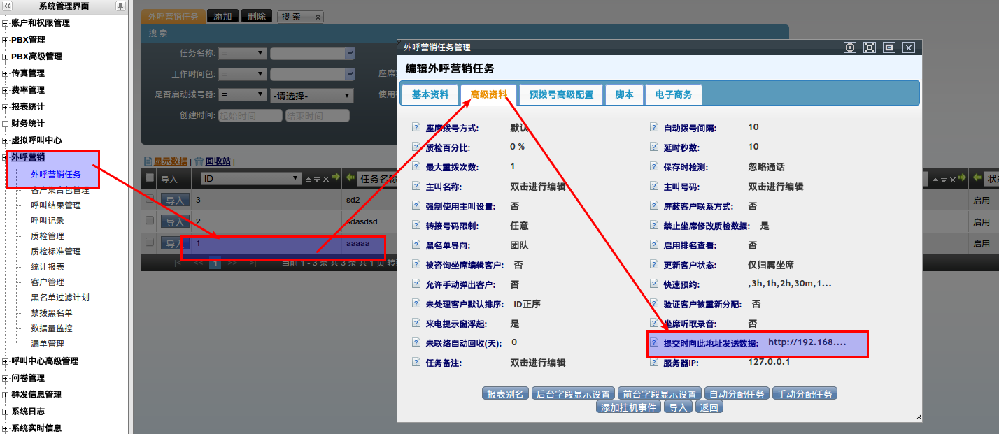

# API y AMI

## Qué es

AsterCC expone una **API HTTP simple** (endpoint `asterccinterfaces`) para que sistemas de terceros disparen acciones — originar una llamada, enviar correo/SMS, o buscar una dirección en el mapa — pasando parámetros por query string. Por debajo, AsterCC usa el [Asterisk AMI](../administracion/asterisk-ami.md) para ejecutar las acciones de telefonía.

!!! warning "Puede estar desactualizado"
    Esta referencia proviene de la guía de desarrollo original (v2.0, ~2018). Antes de integrar en producción, valida contra el manual de API vigente de tu versión de AsterCC — la lista de acciones puede haber cambiado.

## Cómo se usa

### Parámetros comunes a toda acción

| Parámetro | Qué es |
|---|---|
| `EVENT` | Nombre de la acción a ejecutar (obligatorio) |
| `FROM` | Origen del número: `Campaign` (tarea de campaña) o `Virtualcustomer` (usuario virtual / oficina virtual) |
| `FROM_ID` | ID de esa tarea o usuario virtual |
| `AN` | Número de agente que origina la solicitud |
| `APW` | Contraseña de ese agente |
| `AGENT_GROUP_ID` | ID del grupo de agentes del solicitante (requerido en algunas acciones) |

### Acciones disponibles

| `EVENT` | Qué hace | Parámetro adicional |
|---|---|---|
| `DIAL_OUT` | Origina una llamada saliente | `TARGET` (número destino) |
| `EMAIL_SMS` | Abre la interfaz de envío de correo/SMS | — |
| `GMAP` | Busca una dirección en el mapa | `ADDRESS` |

### Ejemplo — originar llamada

```html
<iframe
  src="http://<servidor>/asterccinterfaces?EVENT=DIAL_OUT&TARGET=041139735857&AGENT_GROUP_ID=10&FROM=Virtualcustomer&FROM_ID=27&AN=9000&APW=9000"
  style="display:none;">
</iframe>
```

El patrón general es: un botón o evento en el sistema externo inyecta un `<iframe>` oculto apuntando a esta URL con los parámetros correspondientes; el iframe dispara la acción del lado de AsterCC.

### Ejemplo — enviar correo/SMS

```
EVENT=EMAIL_SMS&FROM=Campaign&FROM_ID=8&AN=admin&APW=123456
```

### Ejemplo — buscar en el mapa

```
EVENT=GMAP&ADDRESS=Dalian&FROM=Virtualcustomer&FROM_ID=11&AN=2000&APW=2000
```

### AMI (nivel más bajo)

Para integraciones que necesitan eventos de telefonía en tiempo real (no solo disparar acciones), la vía es conectarse directamente al [Asterisk AMI](../administracion/asterisk-ami.md) — requiere una cuenta con los permisos `read`/`write` adecuados, ya documentados en esa página.

### Importar datos a una campaña o al predial (`importWS`)

Interfaz para cargar clientes por API directamente al [paquete de clientes de una tarea de campaña](../modulos/marcador-y-campanas.md#6-paquete-de-clientes-en-detalle) y, opcionalmente, a la [lista de marcación predictiva](../modulos/marcador-predictivo-avanzado.md).

```
importWS(orgidentity, usertype, user, pwdtype, password, modeltype, model_id,
         source, context, source_user, source_pwd, exetime, delrow,
         phone_field, priority_field, dialtime_field, emptyagent,
         resetstatus, dupway, dupdiallist, changepackage)
```

Parámetros más relevantes:

| Parámetro | Qué define |
|---|---|
| `orgidentity` | Identificador único del equipo |
| `usertype` / `user` / `pwdtype` / `password` | Credenciales — `usertype` es `agent` o `account`; `pwdtype` es `plaintext` o `md5` |
| `modeltype` / `model_id` | Tipo de módulo (`Campaign`) e ID de la tarea |
| `source` | Origen de los datos: `data` (un registro inmediato, formato `campo1=valor1\|\|campo2=valor2`), `http` o `ftp` (archivo CSV remoto) |
| `context` | El dato en sí, o la URL del archivo, según `source` |
| `delrow` | Cuántas filas iniciales del CSV ignorar (típicamente `1`, para saltar el encabezado) |
| `phone_field` / `priority_field` / `dialtime_field` | Si se quiere que los datos entren también al predial: qué campo es el teléfono, la prioridad, y la hora de marcado |
| `dupway` | Qué hacer si el cliente ya existe: `ignoreDuplicate`, `all`, o `ignoreSuccess` |
| `changepackage` | Si el paquete usa la tabla general y el cliente ya pertenece a otro paquete: `skip`, `unassignToCurrent`, `reassignToCurrent` |

**Respuesta:** string con formato `|Retuen|<código>|Retuen|<mensaje>` — código `1` es éxito (con el ID de la tarea de importación si la fuente fue `http`/`ftp`), código `2` es error.

!!! warning
    Todos los parámetros son obligatorios — los que no apliquen deben enviarse como cadena vacía, no omitirse.

### Recibir datos al guardar una llamada de campaña (webhook saliente)

En la tarea de campaña, el campo **"enviar datos a esta dirección al enviar"** (pestaña avanzada) activa un `POST` automático hacia un sistema externo cada vez que un agente guarda una gestión — útil para sincronizar el resultado de la llamada con un CRM propio.



```javascript
$.ajax({
  type: 'POST',
  url: '<url configurada>',
  dataType: 'json',
  data: /* campos de la gestión + ficha del cliente */
});
```

Campos enviados incluyen, entre otros: `campaignId`, `customerId`, `callresult`, `memo`, `status` (`open`/`pending`/`errorclosed`/`sucessclosed`), `workorder_id`, `diallogid`, `agent_group_id`, y los campos de la ficha del cliente (`customername`, `phone1`, `email`, etc. — varían según los campos personalizados activos).

El endpoint receptor debe:
1. Permitir CORS para el POST entrante.
2. Devolver una respuesta JSON (ej. `{"code": 1, "msg": "success"}`) para evitar que la plataforma del agente muestre un error de red.

## Referencia rápida

| Necesito | Usar |
|---|---|
| Originar una llamada desde un sistema externo | API HTTP → `EVENT=DIAL_OUT` |
| Recibir eventos de llamada en tiempo real | Conexión directa a AMI |
| Enviar correo/SMS desde un botón externo | API HTTP → `EVENT=EMAIL_SMS` |
| Cargar clientes a una campaña por API | `importWS` |
| Sincronizar resultados de llamada hacia mi CRM | Webhook de "enviar datos a esta dirección al enviar" en la tarea |

---

## Fuentes

- `raw/zh/二次开发者指南/方法.txt`
- `raw/zh/二次开发者指南/如何通过api将数据导入到外呼营销任务及预拨号.txt`
- `raw/zh/二次开发者指南/外呼营销弹屏页面保存时如何向远程系统发送数据.txt`