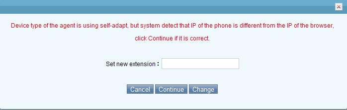
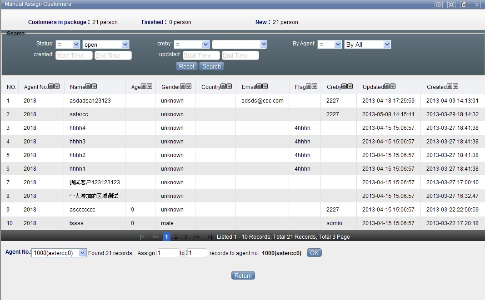
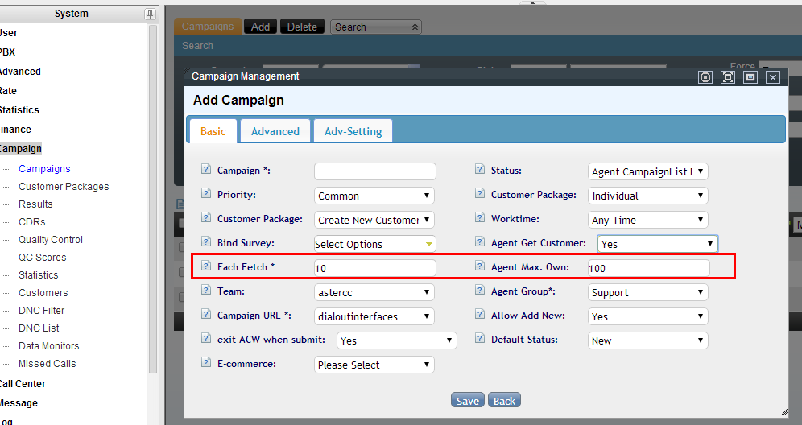
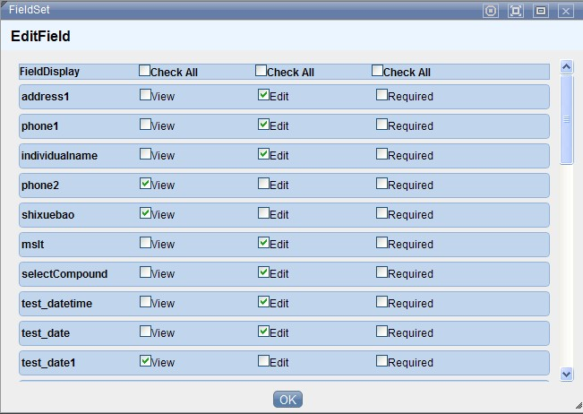
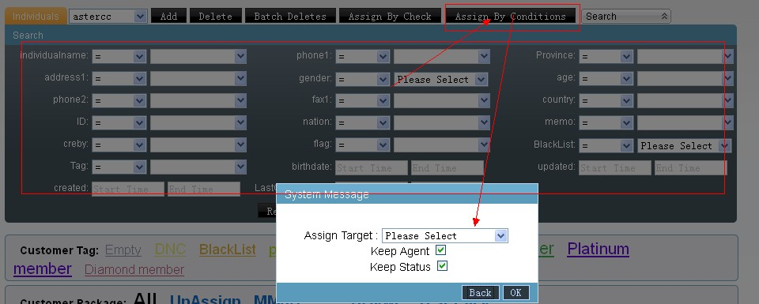
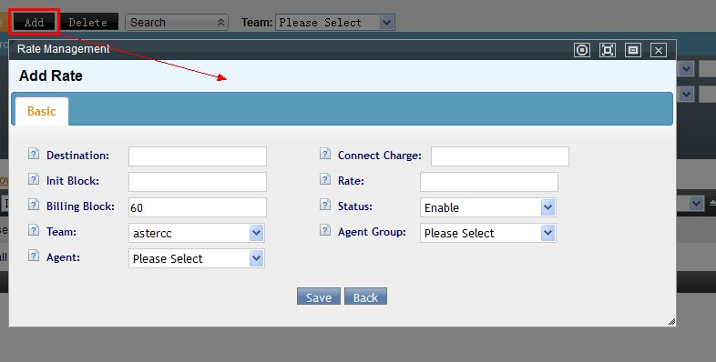

# FAQ: Agentes, cuentas y supervisión

## Conceptos: cuentas, agentes y extensiones

### ¿Cuál es la diferencia entre cuenta, agente y extensión?

- **Cuenta:** unidad de administración. Hay tres tipos: **administrador de sistema** (permiso total sobre todo el sistema), **administrador de equipo** (permiso total dentro de su equipo: cuentas, agentes, PBX) y **usuario** (unidad básica de facturación; puede tener cero o más agentes y dispositivos).
- **Dispositivo (extensión):** puede ser **interno** (SIP, IAX, DAHDI/ZAP — conectado a Asterisk, alcanzable por número de extensión; si marca hacia afuera, el costo se factura al usuario al que pertenece) o **externo** (un teléfono normal — móvil o fijo — que solo puede recibir llamadas del sistema, nunca marcar). Cada dispositivo tiene asociado un número de extensión.
- **Agente:** la unidad operativa de call center. Antes de trabajar se asigna a uno o más **grupos de agentes** y luego a campañas. Al crear un agente se le asocia un dispositivo (o un número externo), con tres modos posibles:
  - **Fija:** el agente siempre usa el mismo número (interno o externo); no puede cambiarlo.
  - **Adaptativa:** el sistema revisa si hay un teléfono IP registrado desde la IP con la que el agente inició sesión, y si lo hay, cambia automáticamente el número asociado a ese teléfono.
  - **Autoseleccionable:** el agente puede cambiar de número en cualquier momento (el sistema valida que ningún otro agente esté usando ya ese número).

## Estados y sesión del agente

### ¿Cuál es la diferencia entre iniciar/cerrar sesión y check-in/check-out?

- **Iniciar sesión (login):** el agente o la cuenta entra al sistema con usuario y contraseña.
- **Cerrar sesión (logout):** el agente o la cuenta sale del sistema — puede ser voluntario o forzado por el sistema por tiempo de inactividad.
- **Check-in:** el agente entra a una **cola**, quedando disponible para que la cola le envíe llamadas según sus reglas.
- **Check-out:** el agente sale de la cola — deja de recibir llamadas de ella.

Por lo general, al cerrar sesión también se hace check-out automáticamente. Excepciones:

- Si dos sesiones (dos navegadores) inician sesión con la **misma cuenta de agente** y ambas hacen check-in, cerrar una no afecta el check-in de la otra — el check-out automático solo ocurre cuando se cierra la última sesión activa.
- Un agente configurado como **estático** (ver modos de trabajo abajo) no hace check-out automático al cerrar sesión.

### ¿Qué significan los cuatro modos de trabajo de un agente (estático/dinámico, en línea/fuera de línea)?

Se configuran por agente dentro de un grupo de agentes:

| Modo | Significado |
|---|---|
| Estático + en línea | El agente queda en check-in permanente por defecto, pero debe estar conectado (en línea) para trabajar |
| Estático + fuera de línea | El agente queda en check-in permanente por defecto y puede trabajar sin estar conectado a la página |
| Dinámico + en línea | El agente debe hacer check-in/check-out manualmente y debe estar conectado |
| Dinámico + fuera de línea | El agente debe hacer check-in/check-out manualmente y puede trabajar sin estar conectado a la página |

### Configuré a un agente como "solo salida" pero sigue recibiendo llamadas entrantes

Dos causas posibles:

- El agente está en **check-in en varios grupos de agentes** y el modo "solo salida" solo se activó en uno de ellos — sigue recibiendo llamadas de los demás grupos.
- El modo "solo salida" solo afecta llamadas **enrutadas por cola**. Si una llamada llega directamente transferida desde un IVR (u otro mecanismo que no pasa por la cola), igual timbra en el teléfono del agente.

### Un agente cambia frecuentemente de puesto de trabajo y su extensión no coincide con el teléfono físico

Cuando el personal rota de escritorio, el número de agente puede quedar vinculado a una extensión distinta a la del teléfono que tiene enfrente. Se corrige con dos ajustes:

1. **Modo de trabajo del agente:** en el grupo de agentes, cambiar a **dinámico + en línea**, y pedir al agente que vuelva a iniciar sesión.
2. **Modo de extensión del agente:** cambiar a **autoseleccionable**. Tras iniciar sesión, el agente hace doble clic sobre el campo de extensión, escribe el número del teléfono que tiene frente a él, confirma, y luego hace check-in normalmente.



### ¿Cómo hago que el sistema sepa para qué aplicación está marcando un agente cuando usa la extensión directamente?

Un mismo grupo de agentes puede corresponder a varias aplicaciones/módulos. Si el agente marca directo desde su extensión (sin pasar por el panel de una tarea), el sistema no sabe a qué aplicación asociar la llamada. Para resolverlo:

1. **Gestión de PBX → Gestión de extensiones:** en la extensión del agente, en **Datos avanzados**, activa **"Modo agente"**.
2. **Gestión de cuentas y permisos → Gestión de agentes:** en el agente, define un **"grupo de agentes de salida actual"**.
3. **Gestión de cuentas y permisos → Gestión de grupos de agentes:** en el grupo, define el **"tipo de aplicación de salida actual"** — esto determina qué aplicación se usa para registrar y mostrar la llamada.

Con esto configurado, al marcar directo desde la extensión el sistema registra la llamada bajo esa aplicación y muestra su página de procesamiento correspondiente.

!!! tip
    Para que el marcado directo desde extensión funcione, el agente debe estar **libre** (no en llamada ni en postprocesamiento). Configurar el agente como **estático + fuera de línea** permite generar registros de llamadas salientes sin que el agente tenga que iniciar sesión en la página.

### Un cliente fue atendido por un agente vía devolución de llamada, pero el sistema no le asigna la propiedad del cliente

Hay cuatro formas por las que un cliente queda asignado a un agente:

1. Asignación manual por el administrador.
2. El agente lo toma activamente (botón de "obtener" en su panel de trabajo).
3. Contesta exitosamente una llamada que el marcador predictivo le asignó.
4. El agente lo agrega él mismo como cliente nuevo.

Si un cliente quedó **sin asignar** (por ejemplo, se importó duplicado sin distribuir, el marcador predictivo lo envió a un agente pero nadie contestó, y luego otro agente le hizo un callback manual guardando los datos vía pop-up), el sistema **no** reasigna automáticamente la propiedad — sigue apareciendo con número de agente `0`.

**Solución:** en **Marketing outbound → Tareas de marketing outbound**, abre la tarea correspondiente, ve a **Datos básicos → Asignación manual de tareas**, busca el número y asígnalo manualmente al agente.



La opción "**Agent Get Customer**" en la configuración avanzada de la tarea es la que habilita el botón de "obtener" con el que un agente toma clientes activamente (la segunda de las cuatro formas de asignación listadas arriba):



### No puedo guardar una extensión o un agente nuevo

Ver [Solución de problemas: "No se puede guardar una extensión o un agente nuevo"](../troubleshooting/index.md#no-se-puede-guardar-una-extension-o-un-agente-nuevo) — la causa es la falta de un equipo creado en el sistema.

## Monitoreo y evaluación de calidad

### ¿Cómo configuro la evaluación (calificación) de llamadas por parte del cliente?

Se construye con tres piezas:

1. **Grabar el audio de la encuesta:** en **PBX avanzado → Gestión de voz de llamadas**, sube un archivo de audio o genéralo con **TTS** (texto a voz). El sistema solo interpreta los dígitos DTMF recibidos — el significado de cada dígito (ej. "1 = satisfecho, 2 = regular, 3 = insatisfecho") lo defines tú al grabar el mensaje.
2. **Crear un IVR de evaluación:** en **PBX avanzado → IVR**, construye un flujo con una acción de **respuesta**, luego **reproducir audio y recibir dígitos** (usando el audio del paso 1, con mínimo/máximo de dígitos a esperar), y finalmente una acción **webservice** que envía el resultado a `http://127.0.0.1/agentcallrate.php?wsdl` (método `saverate`, parámetros `AGENTNO|TEAMID|AGENTGROUPID|sessionid|inputcode|callerid|MODELTYPE|MODELID`).
3. **Vincular el IVR a la cola:** en **PBX avanzado → Gestión de colas**, edita la cola del grupo de agentes a evaluar, ve a **Datos avanzados** y selecciona el IVR de evaluación en el campo **Evaluación**.

Las calificaciones quedan visibles en **Reportes y estadísticas → Registro de evaluaciones**.

### El cliente califica la llamada pero la calificación no aparece en el reporte

Causa típica: falta el paquete **`php-soap`** en el servidor (la acción webservice del IVR de evaluación depende de él). Instálalo desde el repositorio IUS:

```bash
yum install php55u-soap.x86_64
```

### El monitor de un grupo de agentes muestra información de llamadas que no coincide con la realidad

Esto ocurre cuando las tablas de información en tiempo real (`cc10_curpbxcdrs`, `cc10_curqueuecallers` en la base `astercc10`) acumulan datos obsoletos sin limpiar. La solución es depurar manualmente esas tablas desde MySQL, definiendo un punto de corte de fecha:

```sql
-- Limpiar monitoreo de llamadas antiguo
DELETE FROM cc10_curpbxcdrs WHERE calldate < 'AAAA-MM-DD';

-- Limpiar colas de espera antiguas
DELETE FROM cc10_curqueuecallers WHERE created < 'AAAA-MM-DD';
```

Desde la interfaz: **Sistema → Información en tiempo real → Monitoreo de llamadas**.

### ¿Por qué el panel de servicio del agente siempre muestra las mismas columnas, sin importar qué configuré?

La visibilidad de columnas en el detalle de servicio del agente se guarda como una **cookie del navegador**, no como configuración de servidor. Por eso el ajuste "recuerda" el estado solo en ese navegador específico — si el agente cambia de navegador o borra las cookies, vuelve a la configuración por defecto.

### No puedo cambiar qué campos se muestran en la barra de búsqueda de la página de agente

Edita la tarea de marketing outbound específica y ajusta los **campos mostrados en frontend**. En versiones nuevas del sistema este panel está limitado a mostrar como máximo **5 campos** (las versiones antiguas no tenían este límite).



### El pop-up de pantalla (screen pop) no se comporta como se espera

Un causante frecuente y fácil de pasar por alto: verifica que la **zona horaria de PHP** coincida con la **zona horaria del sistema operativo**. Un desfase entre ambas puede alterar el comportamiento del pop-up.

## Transferencia de datos entre equipos

### ¿Cómo transfiero clientes de un grupo de agentes a otro?

Requiere que **ambos** grupos de agentes (origen y destino) usen la **tabla maestra de clientes** — si alguno de los dos no la usa, la transferencia no es posible.

Pasos (ejemplo: mover al agente 8000 del grupo B al grupo A):

1. Agrega el agente 8000 al grupo A.
2. En **Gestión de clientes individual**, selecciona la tarea correspondiente al grupo B y asigna todos los clientes del agente 8000 al grupo A.
3. En el diálogo de confirmación, marca **"conservar estado del agente"** y **"conservar estado de procesamiento"**.



4. Una vez completada la asignación, elimina al agente 8000 del grupo B.

## Tarifas y niveles de facturación

### ¿Para qué sirve cada uno de los cuatro niveles de tarifa?

Ver el detalle completo de configuración en [4.4 Tarifas y facturación](../modulos/tarifas-y-facturacion.md). Resumen conceptual:

| Tarifa | Para qué | Notas |
|---|---|---|
| Sistema | Costo real de compra de cada troncal para el operador — se usa para calcular el costo saliente del propio sistema | El "equipo" que se ve aquí solo agrupa troncales, no representa un equipo real |
| Equipo (Team) | Precio de venta al equipo/cliente — factura al equipo por su consumo | Solo lectura para un administrador de equipo |
| Extensión (Cliente/Device) | Tarifa aplicada al usuario final; si no se selecciona un "grupo de cuentas", aplica a cualquier dispositivo | Determina también qué troncal usar según el número marcado |
| Agente (llamadas entrantes) | Pago al agente por cada llamada entrante atendida — típico para liquidar agentes freelance o part-time | Se define por grupo de agentes, o por agente específico dentro del grupo |



Cada tarifa (salvo la de agente) se puede acotar por **prefijo del número marcado**, **longitud del número**, **destino** (nombre descriptivo), **cargo de conexión**, **duración inicial**, **tarifa por minuto**, **bloque de facturación** y **troncal a facturar**.

---

## Fuentes

- `raw/zh/常见问题及解答/账户_坐席和分机之间有什么区别和联系.txt`
- `raw/en/faq/what_s_the_difference_between_account_agent_and_device.txt`
- `raw/zh/常见问题及解答/登入_登出和签入签出有什么区别.txt`
- `raw/en/faq/what_s_the_difference_between_checkin_checkout_login_logout.txt`
- `raw/zh/常见问题及解答/坐席工作状态.txt`
- `raw/zh/常见问题及解答/设置仅呼出状态后依旧有电话进来问题可能原因.txt`
- `raw/zh/常见问题及解答/如何解决坐席频繁变动导致分机不匹配的问题.txt`
- `raw/zh/常见问题及解答/坐席模式手动回拨具体的操作流程.txt`
- `raw/zh/常见问题及解答/坐席主动回拨客户后通话结果不属于该坐席问题解答.txt`
- `raw/zh/常见问题及解答/为什么无法保存分机_坐席.txt`
- `raw/zh/常见问题及解答/如何配置坐席评分功能.txt`
- `raw/zh/常见问题及解答/关于评分队列的问题_挂机后后台看不到评分.txt`
- `raw/zh/常见问题及解答/坐席组监控显示的通话信息与实际不符.txt`
- `raw/zh/常见问题及解答/系统faq.txt`
- `raw/zh/常见问题及解答/坐席页面搜索栏字段显示更改.txt`
- `raw/zh/常见问题及解答/弹屏相关问题.txt`
- `raw/zh/常见问题及解答/两个坐席组彼此之间转移客户数据.txt`
- `raw/zh/常见问题及解答/费率管理下的四个费率都是做什么用的_如何使用.txt`
- `raw/en/faq/what_s_the_four_rates_under_rate_management_and_how_to_use.txt`
