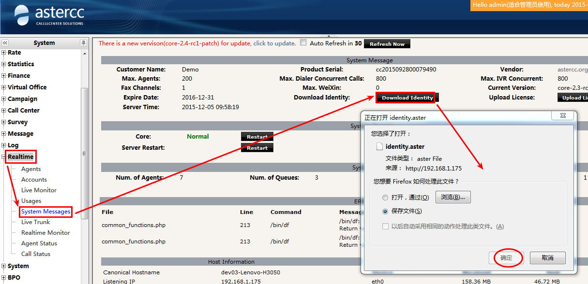

# FAQ: Instalación, migración y actualización

## Versiones y ediciones

### ¿Qué diferencia hay entre AsterCC 0.x y la versión comercial?

AsterCC 0.x es la edición gratuita de código abierto: requiere conocimientos de Asterisk/Linux, se administra editando scripts y archivos de configuración a mano, y cubre solo lo básico (marcar, colgar, facturación simple por extensión). La versión comercial agrega interfaz web completa para IVR, marcador, cuestionarios, reportes profesionales y configuración de Asterisk; soporta múltiples usuarios, roles y equipos; facturación por extensión/troncal/agente con generación automática de facturas; API con todos los eventos de llamada; funciones avanzadas de agente (consulta, transferencia asistida/ciega, conferencia); planes de respaldo con restauración desde la página; y protección/rollback de datos. La edición 0.x se licencia por canales concurrentes de Asterisk y es de código abierto; la comercial se licencia por número de agentes y módulos habilitados, y es de código cerrado. La 0.x sirve para call centers simples; la comercial está pensada para call centers complejos, telemercadeo, BPO, operación de PBX e integración con sistemas de terceros.

### ¿Qué versión de Asterisk usa AsterCC y cómo la cambio?

AsterCC requiere una versión específica de Asterisk (no cualquier versión funciona con todos los módulos). Para cambiar de versión:

1. Respalda los módulos actuales: `mv /usr/lib/asterisk/modules/ /usr/lib/asterisk/modules/.bak`
2. Instala la nueva versión de Asterisk (normalmente compilando desde el código fuente).
3. Actualiza `/etc/asterisk/modules.conf` con la lista de módulos correspondiente a la nueva versión (la lista de módulos a cargar cambia entre versiones de Asterisk, por ejemplo entre 1.6.2.20 y 1.8.x).
4. Reinicia Asterisk y luego `asterccd`.

Si migraste de una versión antigua (ej. 1.2.2) a una beta más reciente (ej. 2.0-beta), los archivos de configuración de Asterisk de la versión anterior quedan respaldados en una ruta con el sufijo `.bak.core-<versión>` (ej. `/etc/asterisk.bak.core-2.0-beta/`).

## Migración y actualización

### ¿Cómo migro una instalación completa de AsterCC a otro servidor?

El procedimiento tiene cinco pasos obligatorios, en este orden:

1. **Instalar AsterCC en el servidor nuevo** — debe ser **exactamente la misma versión** y tener **los mismos módulos** instalados que el servidor original. Instalar módulos distintos es la causa más común de fallos posteriores.
2. **Obtener nueva autorización.** En el servidor nuevo ejecuta `/opt/asterisk/scripts/astercc/asterccc --RNI` y descarga el archivo de identidad. Envía ese archivo junto con el archivo de identidad del servidor original a `support@astercc.org` o `support@sonicwell.com`, explicando el motivo de la migración. Al recibir la licencia, súbela y respalda `license.astercc` (por ejemplo renómbralo a `license.astercc.bak`).

   
3. **Respaldar y restaurar la base de datos:**
   ```bash
   mysqldump -uroot -p astercc10 > astercc_backup.sql
   # copiar el archivo al servidor nuevo, luego:
   mysql -u root -p astercc10 < astercc_backup.sql
   ```
   Si el servidor original no usaba la configuración de base de datos por defecto, hay que editar manualmente tres archivos en el servidor nuevo: `[database]` y `[statistics]` en `/etc/astercc.conf`, y el arreglo `$default` en `/var/www/html/asterCC/app/config/database.php`.
4. **Copiar (sobrescribir) los archivos de configuración del sistema** — los mismos diez elementos seleccionados en un plan de respaldo (**Configuración del sistema → Gestión de planes de respaldo**):
   ```bash
   \cp -rpf /ruta_backup/etc/* /etc
   \cp -rpf /ruta_backup/var/* /var
   \cp -rpf /ruta_backup/opt/* /opt
   \cp -rpf /ruta_backup/usr/* /usr
   ```
   `\cp` evita las confirmaciones de sobrescritura; `-r` copia directorios; `-p` conserva permisos y fecha; `-f` fuerza la operación — úsalo con cuidado.
5. **Recargar el sistema** ejecutando el script de recarga en el servidor nuevo:
   ```bash
   cd /opt/asterisk/scripts/astercc/
   ./reloadconf.sh
   ```

Si al hacer clic en "Recargar" aparece `Permission denied!`, ejecuta:

```bash
chmod 777 /var/www/html/asterCC/cake/console/cake
```

y reinicia `asterccd`. Si persiste, corrige la propiedad de los directorios:

```bash
chown -R asterisk.asterisk /var/www/html/asterCC/
chown -R asterisk.asterisk /etc/asterisk
```

### ¿Cómo subo la versión de AsterCC desde el panel web o por consola?

Cuando hay una nueva versión disponible aparece indicado en **Módulos del sistema**. Para actualizarla:

- **Desde la web:** descarga el paquete de actualización a `/var/www/html/asterCC/data/_cache/` en el servidor (por GUI, o por `wget` si el paquete es grande — el núcleo, por ejemplo, suele pesar mucho):
  ```bash
  cd /var/www/html/asterCC/data/_cache/
  wget http://download1.astercc.org/packages/core/core-2.6-rc1-patch-x86_64.tar.gz
  ```
  Refresca la página: aparecerá el botón "Actualizar". Haz clic para ejecutar la actualización.
- **Por consola (SSH):**
  ```bash
  tar zxf core-2.6-rc1-patch-x86_64.tar.gz
  cd core-2.6-rc1-patch-x86_64
  php install.php
  ```
  Espera con paciencia — si la actualización termina bien, el proceso muestra `successful` al final.

!!! warning "Puede estar desactualizado"
    No inicies la actualización con llamadas en curso en el sistema.

### Después de actualizar a la versión 2.6, el proceso `datamover` deja de funcionar. ¿Por qué?

El error típico al ejecutar `/opt/asterisk/scripts/astercc/astcc_datamover` es:

```
DBD::mysql::db do failed: Unknown column 'seria' in 'field list' at astcc_datamover.pl line 1554.
```

Indica que la tabla correspondiente en la base de datos le falta un campo que la nueva versión espera. Soluciones: reintentar la actualización completa (para que el instalador aplique el cambio de esquema pendiente) o completar manualmente el campo faltante en la tabla afectada.

### Tras migrar el servidor, módulos que no están instalados aparecen como "ya instalados". ¿Cómo lo corrijo?

Sucede porque la base de datos importada conserva la información de instalación del sistema original. Se corrige directamente en la base de datos: revisa la tabla `cc10_upgradelogs`, que es la que le informa a la página qué módulos están "instalados", y elimina las filas que correspondan a módulos que en realidad no están instalados en el servidor nuevo:

```sql
select * from cc10_upgradelogs;
```

## Respaldo y recuperación

### ¿Cómo restauro AsterCC desde un archivo de respaldo?

1. Instala en el servidor nuevo **la misma versión** de AsterCC que generó el respaldo, con los mismos módulos.
2. Sube el archivo de respaldo al servidor nuevo (generado previamente con un plan de respaldo).
3. Descomprime el paquete de respaldo:
   ```bash
   tar -xzvf astercc_files.tar.gz
   ```
4. Restaura la base de datos:
   ```bash
   gunzip -c astercc_db.sql.gz > astercc_db.sql
   mysql -u root -p astercc10 < astercc_db.sql
   ```
   La contraseña por defecto de la base de datos es `astercc`. Si el servidor original no usaba la configuración por defecto, edita manualmente `[database]` y `[statistics]` en `/etc/astercc.conf`, y el bloque `DATABASE_CONFIG` en `/var/www/html/asterCC/app/config/database.php`.
5. Restaura los directorios de configuración:
   ```bash
   \cp -rpf ./etc/* /etc
   \cp -rpf ./opt/* /opt
   \cp -rpf ./var/* /var
   ```
6. Ejecuta el script de recarga:
   ```bash
   /opt/asterisk/scripts/astercc/reloadconf.sh
   ```

Ver el procedimiento de creación del respaldo (no solo la restauración) en [Casos técnicos avanzados](../casos-de-uso/casos-tecnicos-avanzados.md#respaldo-del-sistema-backup).

## Servidores múltiples y alta disponibilidad

### ¿Cómo reparto AsterCC entre varios servidores PHP (CTI, base de datos y balanceo)?

Es una arquitectura de cuatro roles: **CTI** (Asterisk + Nginx), **base de datos** (MySQL), y uno o más **servidores PHP**. Antes de repartir, confirma que todos los servidores tengan la misma versión de AsterCC y los mismos módulos instalados. Pasos principales:

1. Respalda la base de datos en el CTI y restáurala en el servidor MySQL dedicado:
   ```bash
   mysqldump -uroot -p astercc10 > backup.sql
   mysql -uroot -p astercc10 < backup.sql
   ```
2. En el servidor MySQL, otorga privilegios a los demás servidores:
   ```sql
   grant all privileges on astercc10.* to astercc@'192.168.1.%' identified by 'asterccpw';
   ```
3. En CTI y en cada servidor PHP, actualiza `/etc/astercc.conf` (secciones `[database]`, `[statistics]` y `[system] cluster = php`) y `/var/www/html/asterCC/app/config/database.php` con la IP del servidor MySQL.
4. Ajusta `iptables` en cada rol según los puertos que le corresponden (SIP 5060, IAX2 4569, AMI 5038, RTP 10000-20000 en CTI; 3306 en MySQL; 9000 (PHP-FPM) en los servidores PHP).
5. Instala y configura **Samba** en CTI y en el/los servidor(es) PHP para compartir los directorios que ambos roles necesitan leer/escribir (`/var/spool/asterisk`, `/etc/asterisk`, `/var/lib/asterisk`, `/opt/asterisk/scripts/astercc`, `/var/www/html/asterCC/data`, `/var/www/html/asterCC/statistics`), y móntalos por CIFS en cada servidor.
6. Si hay más de un servidor PHP, configura balanceo en Nginx (en el CTI) con un bloque `upstream`, y enruta `login` y `reloadConf` siempre hacia el PHP local del CTI:
   ```nginx
   upstream myphp {
       server 192.168.1.61:9000 weight=2;
       server 192.168.1.70:9000 weight=2;
   }
   ```
7. Comparte los archivos de licencia/autorización (`agentsxindesk.ctp`, `database.php`, `hcdesk.conf`, `astercc.conf`) entre servidores mediante enlaces simbólicos hacia la copia compartida por Samba, respaldando primero los originales en cada servidor PHP.
8. Divide los `crontab` de mantenimiento entre los servidores PHP para que las tareas no se dupliquen, y agrega comprobaciones de montaje CIFS al crontab (reintenta el montaje si se cayó).
9. Al finalizar, regenera la identidad y autoriza cada servidor:
   ```bash
   # en CTI
   /opt/asterisk/scripts/astercc/asterccc --RNI
   # en cada servidor PHP
   /opt/asterisk/scripts/astercc/asterccc --ADI
   ```
   Si todo va bien, el CTI muestra el código `001` y cada PHP muestra `002`, `003`, etc. Tras recibir la licencia, reinicia `asterccd` en el CTI.

### ¿Cómo configuro alta disponibilidad (primario/respaldo) o clúster con el script `clusterconf.sh`?

**Primario/respaldo (HA):** dos servidores; el primario corre todos los servicios (PBX, CTI, WEB, base de datos) tras una IP virtual, y el de respaldo lo monitorea por una IP de heartbeat y toma el control de la IP virtual si el primario falla.

**Clúster / gestión centralizada:** tres o más servidores compartiendo una sola base de datos y la misma configuración de PBX/CTI; el primario corre todos los servicios, el de respaldo corre PBX + CTI + respaldo de base de datos, y el resto corre solo PBX + CTI.

Ambos esquemas se configuran con el mismo script, tras instalar y autorizar AsterCC en todos los servidores involucrados:

```bash
cp /opt/asterisk/scripts/astercc/clusterconf.sh /root
cd /root
chmod +x ./clustercc.sh
./clustercc.sh
```

El script pide elegir el tipo de configuración (`1` = primario/respaldo, `2` = clúster) y luego los datos de red de cada servidor. Al terminar, apaga los servidores secundarios, reinicia el primario y luego enciende los secundarios.

Para verificar que la replicación de base de datos quedó bien, en cada servidor de base de datos:

```sql
show slave status \G;
```

`Slave_IO_Running` y `Slave_SQL_Running` deben mostrar `Yes`. Para verificar la sincronización de archivos, crea un archivo de prueba en el primario y confirma que aparece (y luego desaparece al borrarlo) en los demás servidores:

```bash
cd /home/ccsync && touch abc
ls /home/ccsync/abc   # en el servidor de respaldo
rm /home/ccsync/abc
```

### ¿Cómo elijo el hardware para mi call center?

La elección depende de: número de llamadas concurrentes, número de agentes conectados simultáneamente (por navegador o por teléfono), módulos de negocio usados, tipo de troncal y códec de voz, tamaño de la base de clientes, y requisitos de disponibilidad. El sistema se puede repartir en tres roles con necesidades distintas:

| Rol | Cuello de botella típico |
|---|---|
| PBX | Velocidad de lectura/escritura de disco |
| Base de datos | CPU, memoria y disco — depende del tamaño del proyecto; si se requiere alta disponibilidad, considerar master/master o master/slave |
| WEB | CPU — como referencia, un servidor web adicional por cada ~60 agentes conectados simultáneamente |

Como referencia de dimensionamiento real (no representa el máximo soportado): instalaciones de 20 a 200 agentes en producción han usado desde un solo servidor con CPU Intel Xeon E3 de 4 núcleos y 8 GB de RAM (20 agentes, 50 canales concurrentes) hasta clústeres de 3-4 servidores DELL R710/R720 con Xeon E5 y 8-16 GB de RAM cada uno (150-200 agentes, 120-250 canales concurrentes).

## Licencias y errores de arranque

### ¿Por qué veo "can not found license file" al iniciar los demonios?

Es solo un aviso, no un error — el sistema sigue funcionando con la licencia de prueba por defecto. Ver detalle completo en [Licencias y errores comunes de inicio](../instalacion/licencias-y-errores-comunes.md).

### ¿Qué significan los códigos de error de licencia más comunes?

La tabla completa de códigos vive en el archivo fuente; los más frecuentes en campo son:

| Código | Causa | Acción |
|---|---|---|
| `9301` | El servidor no puede conectarse al servidor de validación de AsterCC | Verificar conectividad a internet; revisar el MTU de la interfaz de red |
| `9903` / `9910` | Cambio en la verificación de licencia invalidó la autorización | Regenerar el archivo de identidad con `asterccc --RNI` (o `--ADI` en servidores PHP adicionales) y volver a solicitar la licencia |
| `9920` | Cambio de hardware invalidó la licencia | Regenerar identidad con `asterccc --RNI` y volver a autorizar |
| `9930` | Tras migrar el sistema, la licencia no coincide con los módulos instalados | Ejecutar `asterccc --SMI <código_de_módulo>` para el módulo afectado (no requiere nueva licencia) |
| `9104` / `9201` / `9937` | Desajuste entre la hora del servidor y la fecha de activación/emisión | Corregir la hora del sistema |
| `403` (frontend) | Cantidad de agentes en el sistema supera el máximo autorizado | Eliminar agentes sobrantes desde la cuenta `admin` |

### Al abrir la página de login aparece "no se puede conectar al servidor de licencias: 9301". ¿Cómo lo resuelvo?

Dos vías, en este orden:

1. **Verificar conectividad:** desde el servidor CTI, ejecuta `ping update.astercc.org`. Si no responde, es un problema de red — revisa la salida a internet del servidor.
2. **Ajustar el MTU** si el ping sí responde pero el error persiste:
   ```bash
   # cambio temporal, efecto inmediato
   echo "1430" > /sys/class/net/eth0/mtu
   ```
   Para hacerlo permanente, agrega `MTU="1430"` al final de `/etc/sysconfig/network-scripts/ifcfg-eth0` y ejecuta `service network restart`.

Un caso relacionado: si `/etc/hosts` tiene una entrada manual para `update.astercc.org` que apunta a una IP obsoleta, `ping` devolverá una dirección de servidor incorrecta y también producirá el error 9301 — corrígela o elimínala del archivo `hosts`.

### El sistema cambió repentinamente al idioma inglés y el login muestra un error 404. ¿Qué pasó?

Casi siempre es porque el disco (o el directorio temporal, `/tmp`) se llenó. Revisa el uso de espacio en los logs del sistema y en los archivos temporales, y libera espacio antes de intentar iniciar sesión de nuevo.

### Falta PHP al instalar AsterCC con el script de instalación. ¿Cómo lo resuelvo?

El instalador por script requiere paquetes de PHP 5.5 (`php55u-*`) específicos que a veces no quedan disponibles en el repositorio del sistema. Instálalos manualmente desde el repositorio de IUS Community, por ejemplo:

```bash
for n in php55u-common php55u-cli php55u-fpm php55u-mysqlnd php55u-gd php55u-pdo \
         php55u-xml php55u-process php55u-mbstring php55u-pear \
         php55u-pecl-jsonc php55u-pecl-igbinary php55u-pecl-redis \
         php55u-ioncube-loader; do
  rpm -ivh https://dl.iuscommunity.org/pub/ius/archive/CentOS/6/x86_64/$n-<version>.ius.el6.x86_64.rpm
done
```

En total son 14 paquetes los que requiere la instalación por script (la versión concreta de cada uno depende del snapshot del repositorio en el momento de instalar).

### Perdí la contraseña de `admin`. ¿Cómo la reseteo?

Para cualquier otro usuario, basta con iniciar sesión como `admin` o como administrador de equipo (`teamadmin`) y restablecer su contraseña desde la interfaz. Para `admin` mismo hay que hacerlo directamente en la base de datos:

1. Ubica las credenciales de MySQL en `/etc/astercc.conf` (sección `[database]`) si no las tienes:
   ```bash
   head /etc/astercc.conf
   ```
2. Conéctate a la base de datos y actualiza la contraseña (almacenada como MD5):
   ```sql
   mysql -uroot -p<password> astercc10
   update cc10_accounts set password=md5('nueva_contraseña') where username='admin';
   ```

### Justo después de instalar, el login con la cuenta `admin` por defecto siempre muestra un error. ¿A qué se debe?

Es el mismo síntoma documentado en la sección de solución de problemas — revisa `error_reporting` en `php.ini`. Ver [Solución de problemas](../troubleshooting/index.md).

---

## Fuentes

- `raw/zh/常见问题及解答/astercc_0.x的版本和astercc商业版有什么区别.txt`
- `raw/en/faq/what_s_the_difference_between_astercc_0.x_and_astercc_commercial_version.txt`
- `raw/en/faq/how_to_change_the_asterisk_version_in_astercc.txt`
- `raw/zh/常见问题及解答/如何在页面迁移astercc系统.txt`
- `raw/en/faq/how_to_migrate_astercc_system.txt`
- `raw/zh/常见问题及解答/如何在服务器后台升级astercc.txt`
- `raw/en/faq/how_to_upgrade_system.txt`
- `raw/zh/常见问题及解答/升级后datamover程序无法运行.txt`
- `raw/zh/常见问题及解答/执行服务器迁移后没安装的模块显示已安装解决办法.txt`
- `raw/zh/常见问题及解答/如何从系统的备份文件中恢复系统.txt`
- `raw/en/faq/how_to_restore_system_from_a_backup_file.txt`
- `raw/zh/常见问题及解答/如何为astercc系统配置多台php服务器.txt`
- `raw/en/faq/how_to_configure_multiple_servers.txt`
- `raw/en/faq/how_to_use_multiple_servers_for_astercc_system.txt`
- `raw/zh/常见问题及解答/如何使用脚本配置主备服务器以及集中管理.txt`
- `raw/en/faq/how_to_use_script_configure_high_available_and_cluster.txt`
- `raw/zh/常见问题及解答/如何选择呼叫中心硬件.txt`
- `raw/en/faq/how_to_choose_hardware_for_your_call_center.txt`
- `raw/zh/常见问题及解答/授权常见错误代码详解.txt`
- `raw/zh/常见问题及解答/ping_update.astercc.org返回的不是服务器地址_返回错误码9301.txt`
- `raw/zh/常见问题及解答/web页面提示9301无法连接服务器错误解决方法.txt`
- `raw/zh/常见问题及解答/系统突然变英文版_登陆提示404错误.txt`
- `raw/zh/常见问题及解答/脚本安装系统缺少php安装方法.txt`
- `raw/en/faq/how_to_reset_admin_password.txt`
- `raw/zh/常见问题及解答/为什么启动进程的时候看到cant_not_found_licnese.txt` (ver [Licencias y errores comunes de inicio](../instalacion/licencias-y-errores-comunes.md))
- `raw/zh/常见问题及解答/安装完毕后使用默认的admin账户登录astercc时总是显示错误.txt` (ver [Solución de problemas](../troubleshooting/index.md))
