# Descargar e instalar AsterCC

## Qué es

El método recomendado para instalar AsterCC hoy es el **script de instalación automática sobre Rocky Linux 9**, que instala y configura Asterisk, Nginx, PHP, MariaDB y Redis en el orden correcto. Existe también un método por **ISO autoinstalable** para versiones anteriores del sistema — se documenta como referencia, pero se recomienda usar el script sobre Rocky 9 salvo que tengas una razón específica para usar la ISO.

## Cómo se usa

### Método recomendado: script sobre Rocky Linux 9

1. Confirma que cumples los [requisitos del sistema](requisitos.md) y que tienes acceso **root** al servidor.
2. Descarga el script de instalación:
   ```bash
   cd /usr/src/
   wget http://download2.astercc.org/install_asterCC_Commercial_Rocky9_php74_lastest.sh
   ```
3. Dale permisos de ejecución:
   ```bash
   chmod +x install_asterCC_Commercial_Rocky9_php74_lastest.sh
   ```
4. Ejecuta el script por primera vez:
   ```bash
   ./install_asterCC_Commercial_Rocky9_php74_lastest.sh
   ```
   Elige el sitio de descarga de dependencias cuando el script lo solicite. Esta primera ejecución actualiza el kernel e instala las dependencias necesarias.

   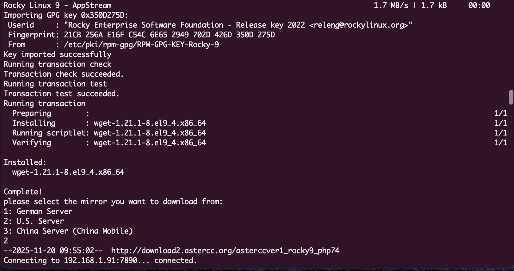

5. Al finalizar, el script pedirá reiniciar el servidor:
   ```bash
   reboot
   ```

   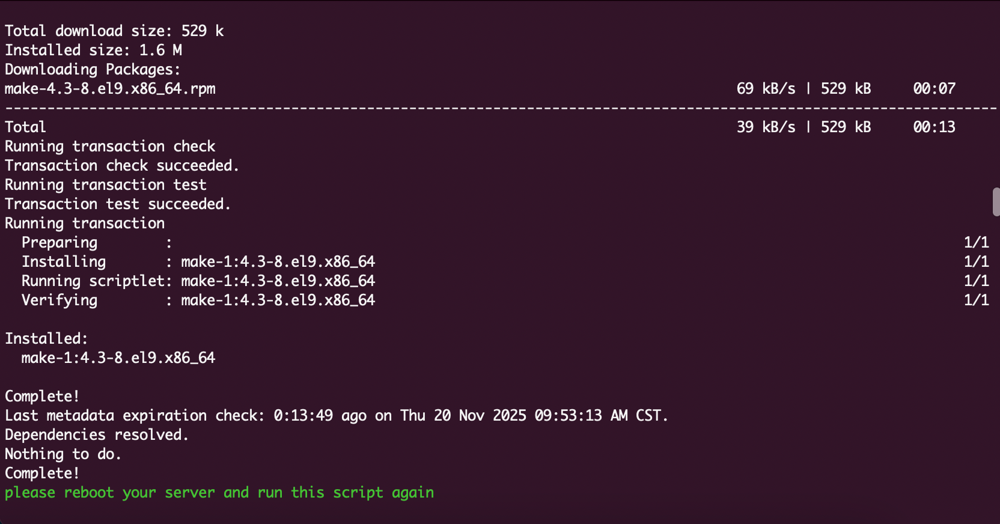

6. Después de reiniciar, ejecuta el script **por segunda vez**:
   ```bash
   cd /usr/src/
   ./install_asterCC_Commercial_Rocky9_php74_lastest.sh
   ```
7. Durante esta segunda ejecución, el script pedirá:
   - Una contraseña para la base de datos.
   - Usuario y contraseña para el [Asterisk AMI](../administracion/asterisk-ami.md).

   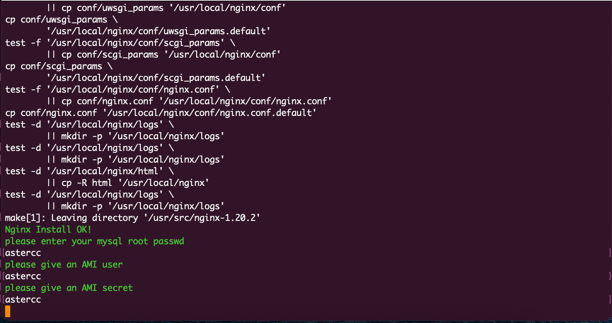

8. Espera a que termine (el tiempo depende de tu conexión y del rendimiento del servidor). Al finalizar, verás un mensaje de instalación completada.

   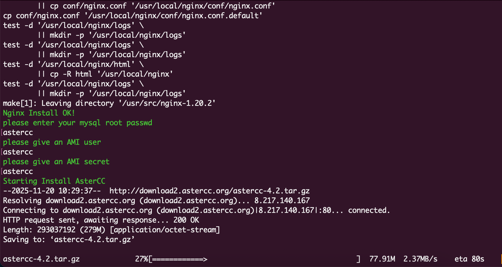
   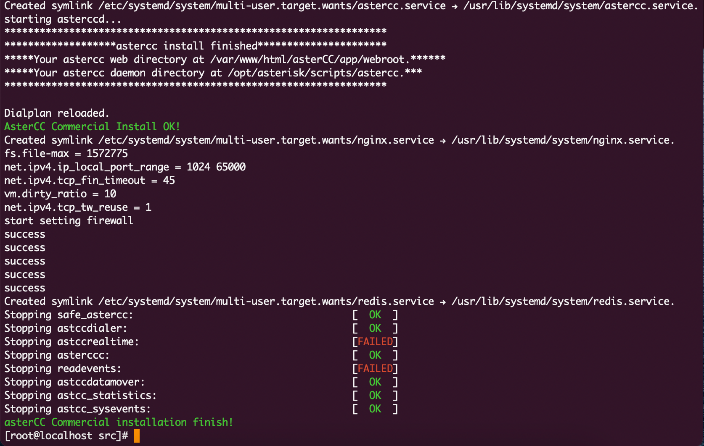

9. Abre un navegador y entra a la IP externa del servidor. Inicia sesión con `admin` / `admin` y **cambia la contraseña inmediatamente**.
10. Sigue las instrucciones en pantalla para completar la inicialización, y continúa con [Configuración post-instalación](configuracion-post-instalacion.md).

### Método alternativo: ISO autoinstalable

!!! warning "Puede estar desactualizado"
    Este método corresponde a versiones anteriores de AsterCC y usa un instalador basado en ISO. Antes de usarlo, confirma con el proveedor si sigue siendo la vía soportada para tu versión.

1. Descarga el archivo ISO de 64 bits desde el sitio oficial de AsterCC.
2. Graba la ISO en un disco (o móntala en una máquina virtual para pruebas).
3. Arranca el servidor desde el disco/ISO. Verás la pantalla inicial del instalador:

   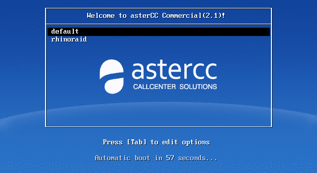

4. Sigue el asistente: selección de red (IPv4 es suficiente; la instalación inicial solo soporta DHCP — configura IP fija después de instalar):

   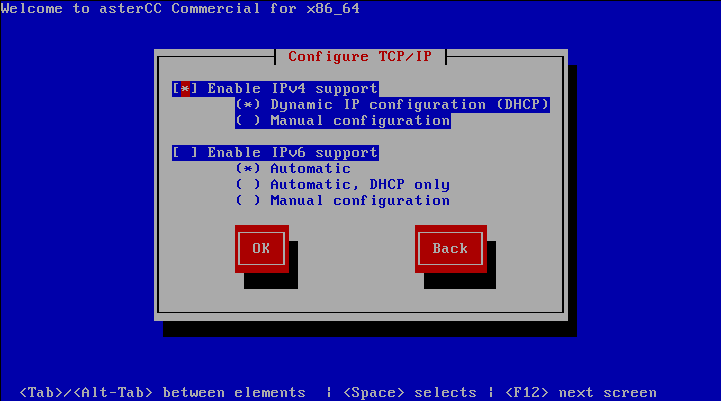

   zona horaria:

   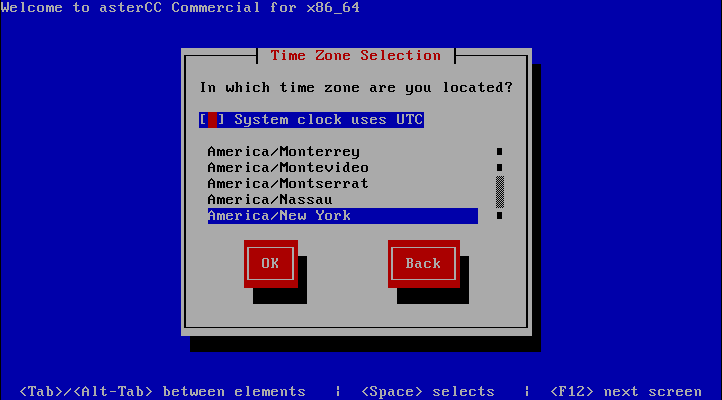

   y contraseña de `root`:

   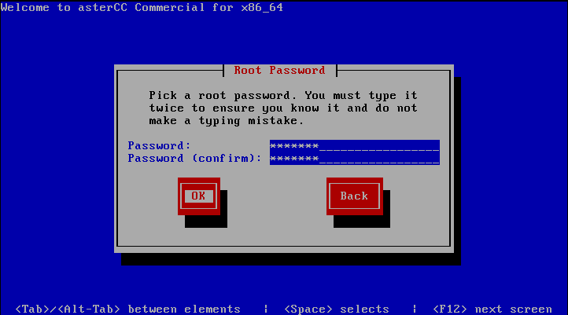

   Si la contraseña elegida es débil, el sistema lo advierte antes de continuar:

   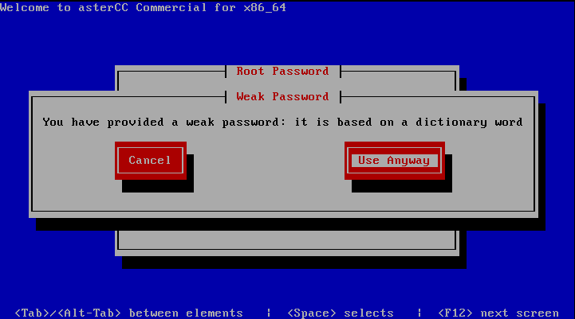

5. La instalación toma unos 10 minutos y reinicia el servidor una vez — asegúrate de que el segundo arranque sea desde el disco duro, no desde el disco de instalación.

   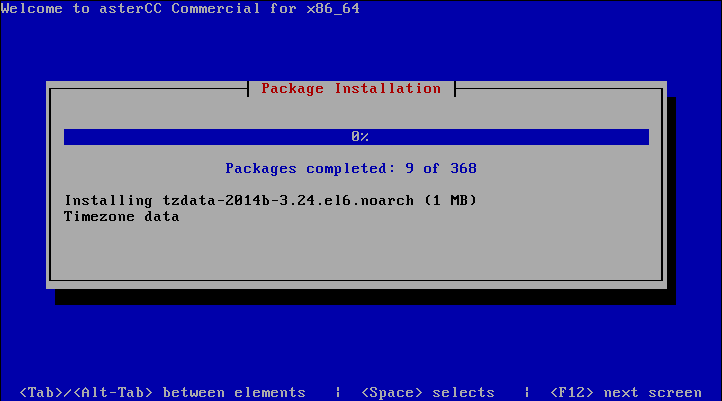

6. Al finalizar verás la pantalla de inicio de sesión de la consola:

   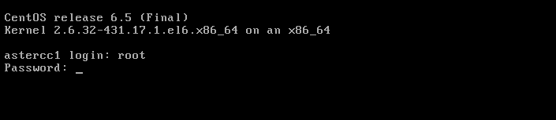

   Inicia sesión como `root` con la contraseña configurada; el sistema mostrará la IP del servidor:

   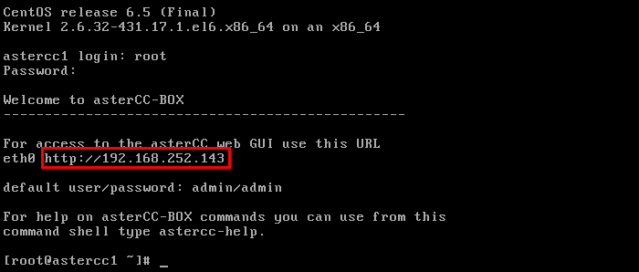

7. Abre esa IP en el navegador para llegar a la pantalla de login de AsterCC.

### Variante histórica del método ISO: script de instalación para CentOS/Ubuntu

!!! warning "Puede estar desactualizado"
    Esta variante corresponde a una versión de AsterCC anterior a la del script sobre Rocky Linux 9 documentado arriba, y usa un dominio de descarga distinto (`download1.astercc.org`). Se conserva como referencia histórica.

Como alternativa a la ISO, la documentación original también ofrecía un script de instalación descargable directamente para CentOS/RedHat o Debian/Ubuntu:

```bash
# CentOS/RedHat
wget http://download1.astercc.org/install_asterCC_Commercial_CentOS.sh
chmod +x ./install_asterCC_Commercial_CentOS.sh
./install_asterCC_Commercial_CentOS.sh

# Debian/Ubuntu
wget http://download1.astercc.org/install_asterCC_Commercial_Ubuntu.sh
chmod +x ./install_asterCC_Commercial_Ubuntu.sh
./install_asterCC_Commercial_Ubuntu.sh
```

Todo el código fuente necesario se descarga a `/usr/src/`; para acelerar la instalación en redes lentas, los paquetes se pueden copiar manualmente a esa ruta antes de ejecutar el script.

### Método histórico: instalación manual sobre CentOS 6 (obsoleto)

!!! warning "Puede estar desactualizado"
    Este procedimiento documenta la preparación manual del sistema operativo (CentOS 6) antes de instalar AsterCC, previa a la existencia de los scripts/ISO automatizados. Se conserva únicamente como referencia histórica — no usar en instalaciones nuevas.

El procedimiento original consistía en: instalar CentOS 6 desde un Live DVD, configurar red y hostname editando directamente `/etc/sysconfig/network-scripts/ifcfg-ethX` y `/etc/sysconfig/network`, cambiar el runlevel a 3 para arrancar sin interfaz gráfica, aplicar actualizaciones (`yum update all`) y, opcionalmente, instalar OpenVPN para permitir que teléfonos IP remotos se conectaran al servidor (ver [Configurar OpenVPN](../administracion/openvpn.md)).

### Actualizar el núcleo (core) y los módulos a core-2.0-beta

!!! warning "Puede estar desactualizado"
    Este procedimiento de actualización corresponde a la versión `core-2.0-beta`, ya superada por versiones más recientes. Se conserva como referencia del mecanismo general de actualización (descarga desde la interfaz + instalación por SSH), que puede seguir aplicando a otras versiones con nombres de paquete distintos.

1. Inicia sesión en el sistema y entra a **Gestión de módulos del sistema**. Si hay una nueva versión del núcleo disponible, aparece un botón **DESCARGAR**.
2. Descarga el paquete de actualización y súbelo al servidor desde la misma página, o cópialo por FTP al directorio `/var/www/html/asterCC/data/_cache`.
3. Al terminar de subir el paquete, refresca la página: el botón **DESCARGAR** cambia a **ACTUALIZAR**.
4. La actualización a `core-2.0-beta` específicamente **no puede completarse con el botón ACTUALIZAR** — debe hacerse por SSH:
   ```bash
   cd /var/www/html/asterCC/data/_cache
   tar zxf core-2.0-beta-patch-x86_64.tar.gz   # ajusta el nombre según arquitectura (i386/x86_64)
   cd core-2.0-beta-patch-x86_64
   php install.php
   ```
5. Espera a que termine — la duración depende del tamaño de la base de datos. Un mensaje de éxito confirma que la actualización se completó; si aparece un mensaje de error, sigue la instrucción indicada para ejecutar manualmente el comando que falló, y si el proceso se interrumpe, corrige la causa indicada y vuelve a ejecutar `php install.php` desde el directorio del paquete.
6. Para actualizar **módulos** (no el núcleo) sobre esta misma versión base, el flujo es análogo desde la misma página de **Gestión de módulos del sistema**: los módulos con actualización disponible muestran su propio botón **DESCARGAR** → subir/FTP al mismo directorio de caché → botón **ACTUALIZAR** (este sí funciona desde la interfaz para módulos), o el mismo procedimiento manual por SSH (`tar zxf` + `php install.php`) dentro del directorio de caché.

!!! tip
    La nomenclatura de los paquetes de actualización sigue el patrón `<version>[-patch][-i386|-x86_64].tar.gz`: `-patch` indica que es un paquete de actualización (si no lo tiene, es un paquete de instalación completa), y el sufijo de arquitectura indica compatibilidad con un tipo de CPU específico (si no lo tiene, es compatible con cualquiera).

## Referencia rápida

| Método | Cuándo usarlo |
|---|---|
| Script sobre Rocky Linux 9 | Instalaciones nuevas (recomendado) |
| ISO autoinstalable | Solo si tu versión de AsterCC lo requiere explícitamente |

| Dato | Valor |
|---|---|
| Usuario inicial | `admin` / `admin` |
| Ruta de dependencias (script) | `/usr/src/` |

---

## Fuentes

- `raw/en/installation_guideline_and_setup/setup.txt`
- `raw/zh/下载和安装/在rocky9中进行安装.txt`
- `raw/en/download_and_install/iinstall_in_rocky9.txt`
- `raw/zh/下载和安装/安装.txt`
- `raw/en/download_and_install/installation.txt`
- `raw/en/installation_guideline_and_setup/serverinstallation.txt`
- `raw/en/download_and_install/upgrade/core-2.0-beta.txt`
- `raw/zh/下载和安装/升级/core-2.0-beta.txt`