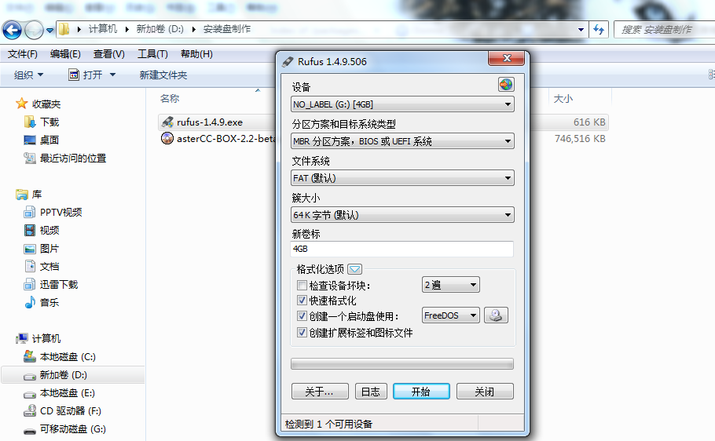
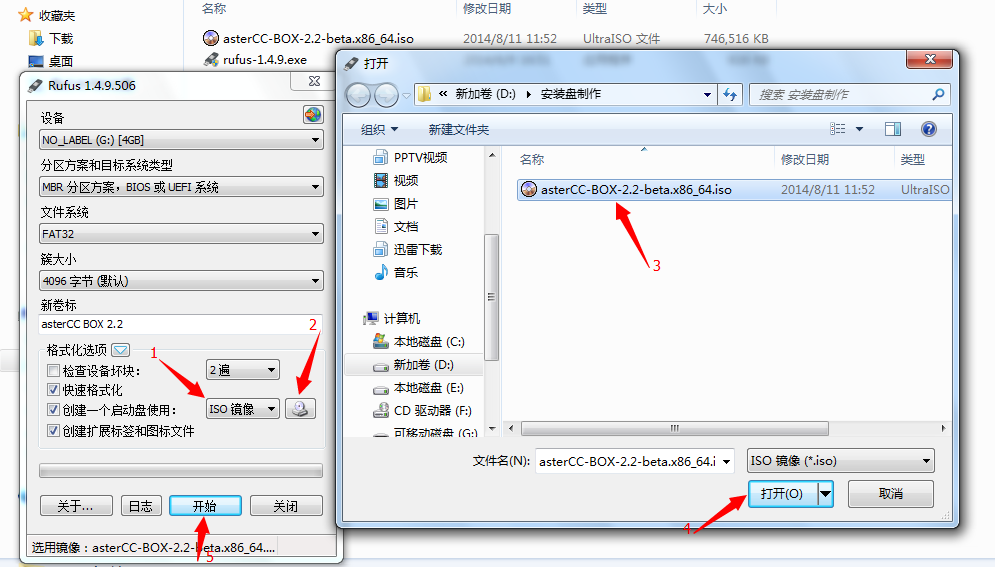
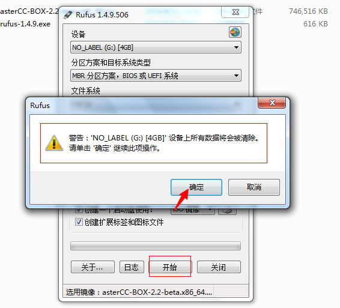
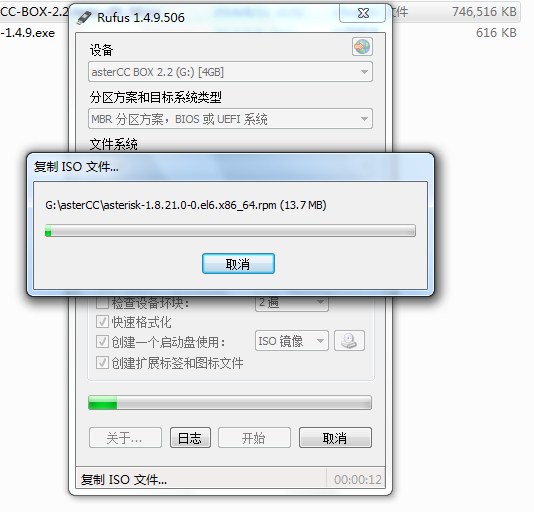
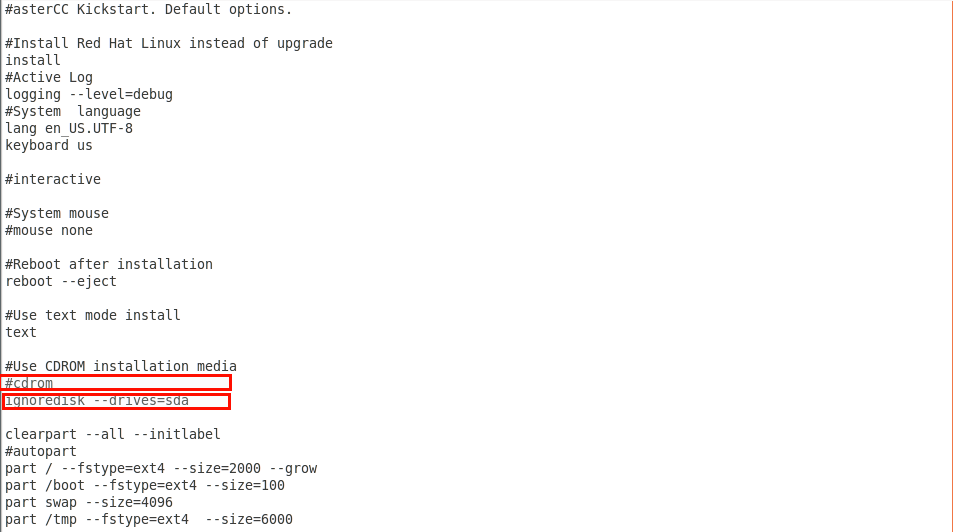
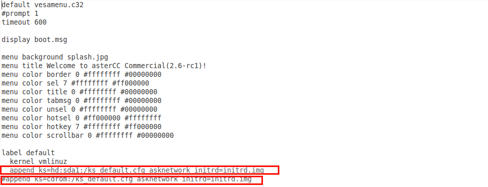

# Instalar desde USB (AsterCC Box)

## Qué es

Cuando el servidor no tiene unidad de disco óptico, se puede instalar AsterCC Box desde una memoria USB booteable, usando la misma ISO de instalación grabada con una herramienta de creación de USB de arranque.

!!! warning "Puede estar desactualizado"
    Este procedimiento referencia herramientas y versiones específicas (Rufus 2.11, ISO de AsterCC Box 2.x) que pueden estar desactualizadas. El método general (grabar ISO en USB y ajustar el archivo kickstart) sigue siendo válido, pero verifica las versiones actuales de las herramientas antes de usarlo.

## Cómo se usa

### 1. Preparación

- Descarga la ISO más reciente de AsterCC Box desde el sitio oficial.
- Descarga una herramienta de creación de USB booteable (por ejemplo, [Rufus](https://rufus.ie)).
- Consigue una memoria USB de al menos 1 GB.

### 2. Crear el USB de instalación

1. Conecta el USB y confirma que la computadora lo reconoce (anota la letra de unidad asignada, por ejemplo `G:`).
2. Abre la herramienta de creación de USB y selecciona la ISO de AsterCC Box descargada.

   

   

3. Antes de continuar, la herramienta advertirá que **todo el contenido del USB será borrado** — respalda cualquier dato importante antes de continuar.

   

4. Inicia la escritura de la imagen al USB y espera a que termine.

   

### 3. Ajustar los archivos de arranque para instalar desde USB

Por defecto, la imagen espera instalarse desde un CD/DVD. Hay que editar dos archivos dentro del USB ya grabado para que apunte al propio USB como origen:

**a. Editar `ks_default.cfg`** (en la raíz del USB, con un editor de texto plano):

Busca la línea que contiene `cdrom`, coméntala anteponiendo `#`, y agrega debajo:
```
ignoredisk --drives=sda
```



**b. Editar `isolinux/isolinux.cfg`** (dentro de la carpeta `isolinux` del USB):

Busca:
```
append ks=cdrom:/ks_default.cfg asknetwork initrd=initrd.img
```
Y reemplázalo por:
```
append ks=hd:sda1:/ks_default.cfg asknetwork initrd=initrd.img
```



!!! tip
    `sda` es el identificador que el propio sistema de arranque le asignará al USB en la máquina destino — puede variar (`sdb`, `sdc`, etc.) según el hardware. Si al arrancar el instalador no encuentra `ks_default.cfg`, prueba cambiando esta letra y repite la edición hasta acertar.

### 4. Instalar

1. Conecta el USB al servidor destino y configura el arranque por USB **antes** que por disco duro en la BIOS/UEFI.
2. Reinicia. Si el USB arranca correctamente, deberías llegar a la pantalla de instalación de AsterCC.

!!! warning "Advertencia"
    La instalación formatea el disco duro completo del servidor. Respalda cualquier información importante antes de continuar.

3. Si el instalador no encuentra `ks_default.cfg`, significa que la letra de unidad (`sda`) no coincide con la que el hardware real asigna al USB. Retira el USB, corrige la letra en los dos archivos editados (paso 3) desde otra computadora, y vuelve a intentar.

## Referencia rápida

| Archivo a editar | Cambio |
|---|---|
| `ks_default.cfg` | Comentar línea `cdrom`, agregar `ignoredisk --drives=sda` |
| `isolinux/isolinux.cfg` | Cambiar `ks=cdrom:/...` por `ks=hd:sda1:/...` |

---

## Fuentes

- `raw/zh/使用u盘安装astercc-box.txt`