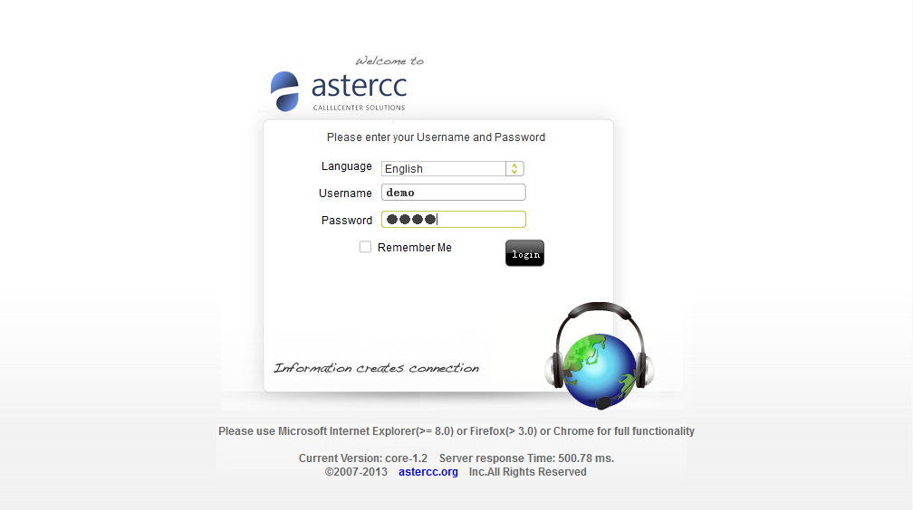
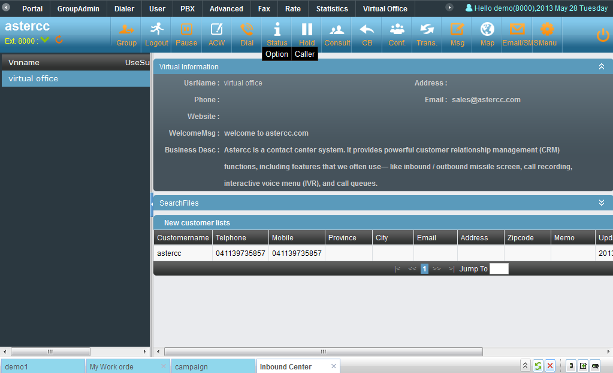
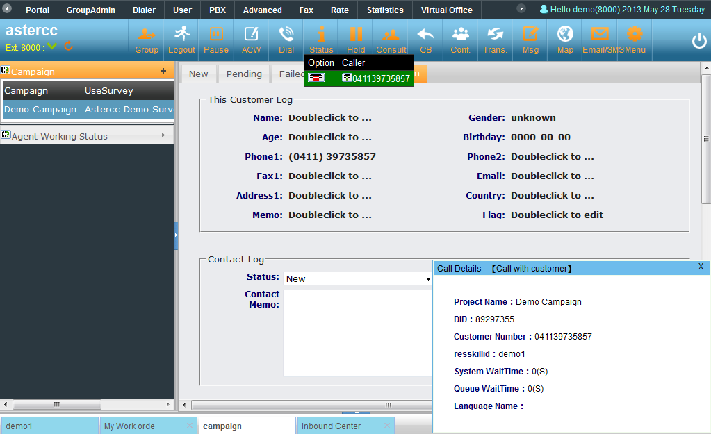
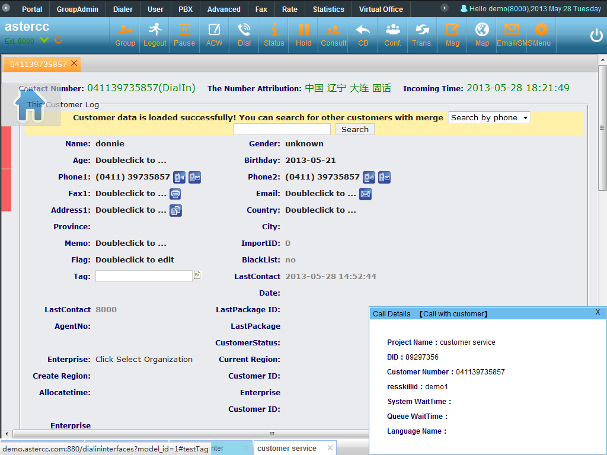
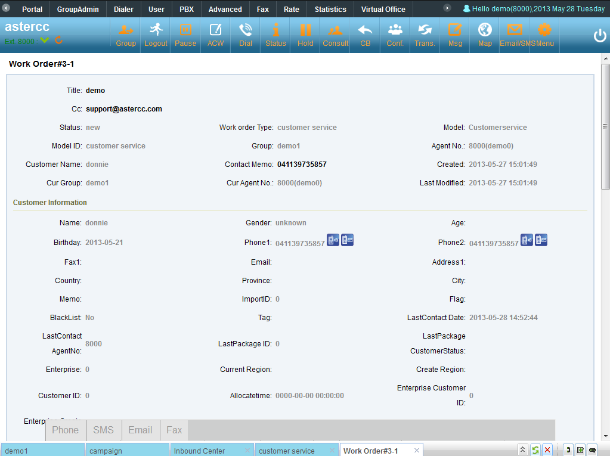
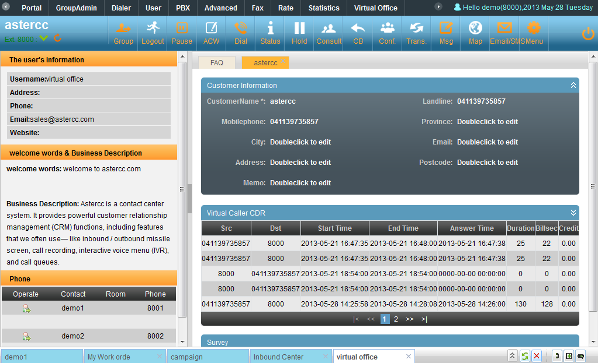
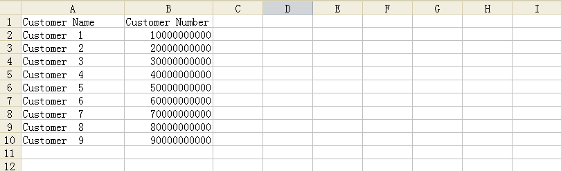
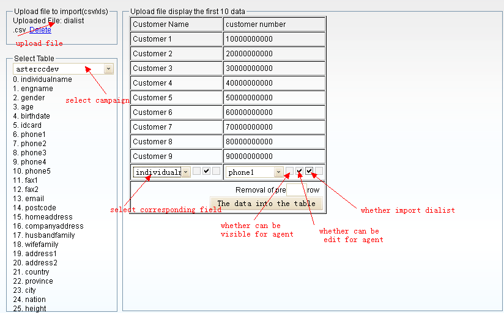
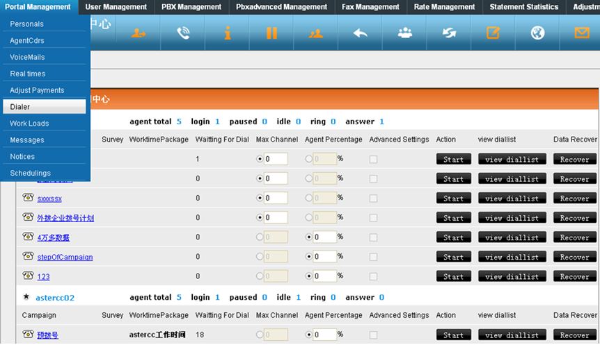

# Demo en línea

## Qué es

AsterCC ofrece un entorno de demostración pública para probar la plataforma sin instalar nada.

!!! warning "Puede estar desactualizado"
    La URL, las credenciales y los números de teléfono de esta página provienen de la documentación original (2018) y no han sido validados contra un entorno actual. Verifica su vigencia antes de usarlos.

## Cómo se usa

1. Abre la URL de la demo: `http://demo.astercc.com` con Internet Explorer 8+, Firefox 3+, o cualquier navegador moderno.
2. Inicia sesión con una cuenta de agente de prueba:
   - `demo` / `demo` — cuenta de jefe de equipo, con más permisos.
   - `demo1` / `demo1` — cuenta de agente normal.

   

3. Tras iniciar sesión, se muestra la **plataforma de trabajo del agente** (ver [4.7 Plataforma de trabajo del agente](../modulos/plataforma-del-agente.md)).

   

### Probar la pantalla emergente (pop-up) de llamadas entrantes

Antes de llamar, confirma en el panel del grupo de agentes que tu estado permite recibir llamadas: modo de trabajo "Todas" o "Solo entrantes", y que no estés en pausa ni en gestión posterior.

Marca alguno de estos números de prueba para ver distintos flujos de negocio:

| Número | Módulo que se demuestra |
|---|---|
| 0311-89297355 | Campaña de marketing saliente (incluye e-commerce y encuesta) |
| 0311-89297356 | Atención al cliente entrante (alta de cliente, registro de contacto, alta de work order, alta de pedido e-commerce) |
| 0311-89297357 | Oficina virtual |

Una vez conectada la llamada, se pueden probar las funciones de [consulta, transferencia, recuperar llamada y conferencia](../glosario.md#consulta-transferencia-recuperar-y-conferencia).

### Probar la marcación predictiva (pre-dial)

La demo también permite probar el [marcador predictivo](../glosario.md) (pre-dial): el sistema llama automáticamente a una lista de clientes según una estrategia configurada y, cuando el cliente contesta, transfiere la llamada de inmediato a un agente disponible — sin que el agente tenga que buscar el número, marcarlo ni esperar el timbrado.

1. Prepara un archivo CSV con la lista de números a marcar.

   

2. Entra a la interfaz de importación de datos y sube el archivo: selecciona la campaña de la demo (`astercc-campaign`), define la correspondencia entre columnas del archivo y campos de la tabla de clientes, y elige qué columna contiene el número de teléfono a usar para el pre-dial.

   

3. Inicia la importación y verifica que los datos se importaron correctamente.
4. Entra a la página del marcador (dialer) y, antes de arrancar, define la estrategia de marcación con uno de estos dos criterios:
   - **Canales máximos (Max Channel):** número máximo de llamadas simultáneas que el sistema puede tener en curso para esa campaña — limitado también por la capacidad del troncal/proveedor. El sistema revisa constantemente el estado de los canales (ocupado, timbrando, disponible) y lanza nuevas llamadas hasta alcanzar ese máximo.
   - **Porcentaje sobre agentes disponibles (Agent Percentage):** el número de llamadas a lanzar se calcula multiplicando este porcentaje por la cantidad de agentes en estado libre, restando las llamadas que ya están timbrando. Por ejemplo, con 40 agentes libres, 10 llamadas timbrando y un porcentaje de 120%, el sistema lanza 36 llamadas nuevas ((40 − 10) × 120%).

   

5. Haz clic en **Iniciar** para arrancar el motor de pre-dial. Mientras corre, se puede dar clic en el nombre de la campaña para ver el progreso del marcado en tiempo real.

## Referencia rápida

| Dato | Valor |
|---|---|
| URL | `http://demo.astercc.com` |
| Usuario supervisor | `demo` / `demo` |
| Usuario agente | `demo1` / `demo1` |

---

## Fuentes

- `raw/zh/在线演示/在线演示.txt`
- `raw/en/online_demo/online_demo.txt`
- `raw/en/online_demo/pre-dial_online_demo.txt`
- `raw/zh/在线演示/预拨号在线演示.txt`