# Base de conocimiento y Work Orders

## Qué es

Dos módulos distintos que suelen usarse juntos: la **base de conocimiento** centraliza el know-how operativo para que los agentes no dependan de la memoria de "expertos" individuales, y los **work orders (órdenes de trabajo)** modelan un flujo de trabajo que pasa de un equipo a otro hasta resolverse — por ejemplo, un pedido que pasa de ventas a finanzas, a almacén, a logística, y de vuelta al agente que originó el caso.

En resumen (según la página de introducción del módulo): el sistema soporta **múltiples tipos de work order**, **múltiples campos personalizados** y **circulación entre múltiples grupos de trabajo**; al crear uno, puede quedar asignado directamente a su creador o pasar sin asignar al grupo correspondiente. El módulo se usa en conjunto con campañas de marketing outbound o con atención al cliente, según el flujo de cada equipo — el mismo resumen aparece tanto en la fuente en inglés como en la china.

## Cómo se usa

### Base de conocimiento

1. Ve a **Base de conocimiento → Base de conocimiento** y selecciona el equipo.

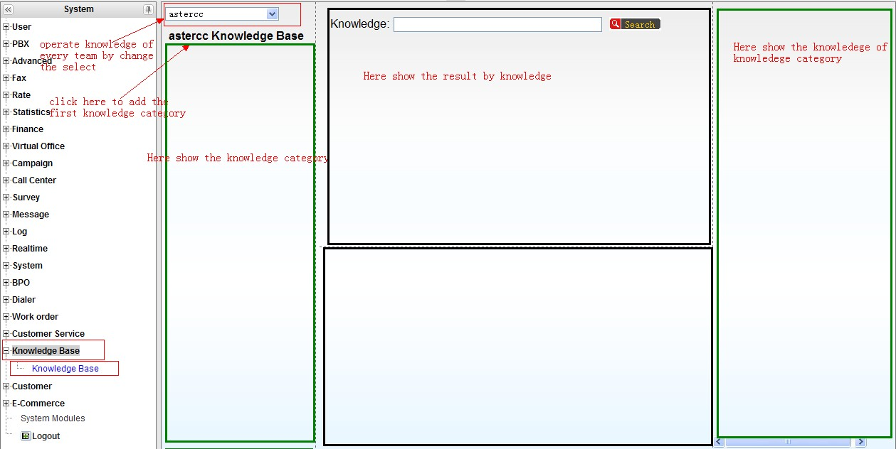

2. Crea **categorías de conocimiento** (y subcategorías, arrastrando para anidar u ordenar).

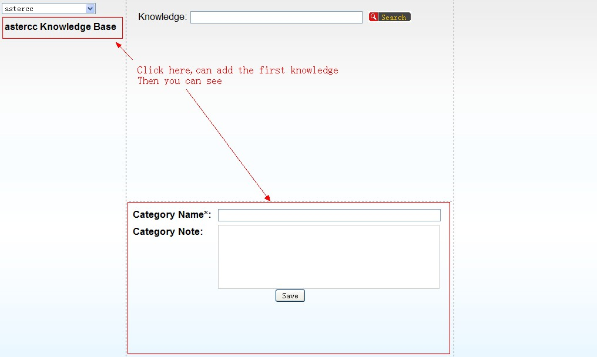

3. Dentro de una categoría, agrega un artículo de conocimiento con:

| Campo | Qué define |
|---|---|
| Nombre | Identifica brevemente el artículo |
| Etiquetas | Para búsqueda rápida por tema |
| Estado | **Borrador** (solo lo ve su creador), **Publicado** (visible para quien tenga permiso de ver la base), **Pendiente de aprobación** (esperando revisión de alguien con permiso de publicar) o **Rechazado** (no pasó la revisión) |
| Archivo adjunto | Material de soporte descargable |
| Contenido con formato / contenido en texto plano | El texto en formato enriquecido se muestra al leer el artículo; el texto plano es lo que se indexa para búsqueda |

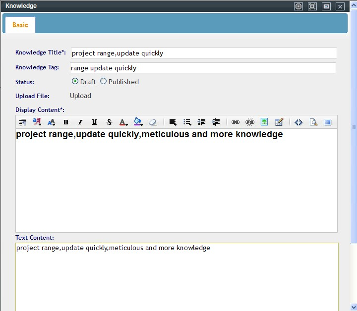

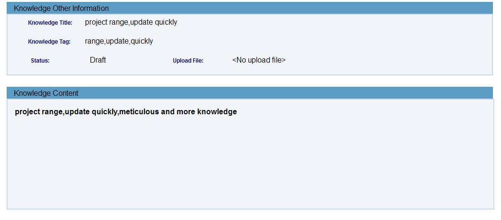

4. Los agentes pueden **buscar por texto libre** o hacer clic en una etiqueta para filtrar artículos relacionados.

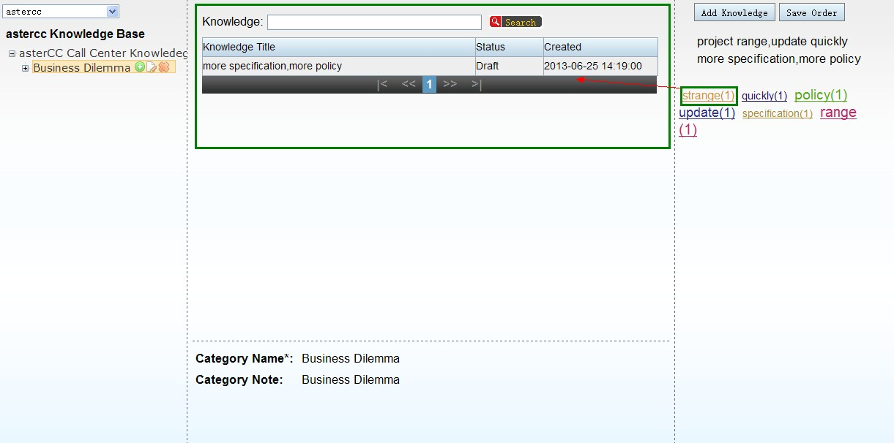

5. El **permiso por rol** controla, para cada cuenta, si puede: agregar categorías, agregar artículos, editar, ver, eliminar, y **publicar** (un artículo enviado por alguien sin permiso de publicar queda pendiente de revisión hasta que alguien con ese permiso lo apruebe).

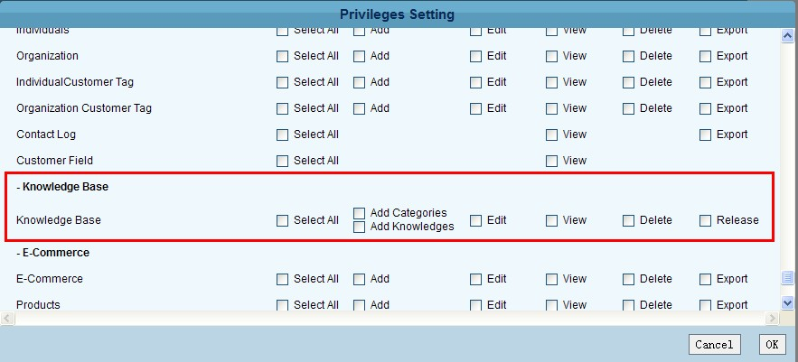

### Work Orders

Antes de usar el módulo, hay que definir una **plantilla de work order** — el flujo que seguirá ese tipo de caso.

1. Ve a **Gestión de work orders → Work order → Agregar** y define:

| Campo | Qué define |
|---|---|
| Equipo | A qué equipo pertenece esta plantilla |
| Alcance de flujo | Entre qué grupos de agentes puede moverse el work order (si no se usa flujo automático) |
| Flujo inicial directo | Si el primer grupo del flujo es el mismo que crea el work order, si se asigna directo a ese grupo o espera asignación manual |
| Permiso de edición | Quién puede modificar contenido, responder, o cambiar el estado — "todos" o "solo el dueño y el jefe de grupo" |
| Retener agente en el flujo | Si al pasar de un grupo a otro, se prioriza asignar al mismo agente que lo creó o que lo tuvo antes, antes de dejarlo en la bandeja general del siguiente grupo |
| Acción de cierre | Qué pasa al cerrar el último nodo: nada, crear automáticamente un work order de seguimiento, o dejar que el agente decida |
| Copia de correo por defecto | Direcciones que se notifican en cada cambio del work order |

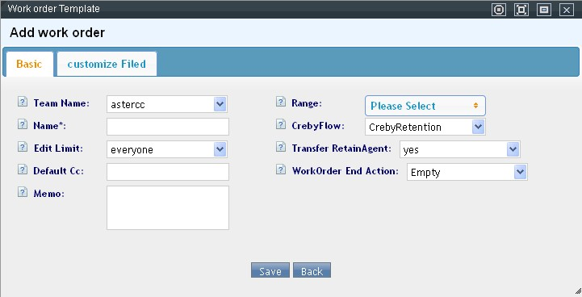

2. Define **campos personalizados** para capturar información específica del proceso (texto corto, selección, texto largo, archivo, fecha, fecha y hora).

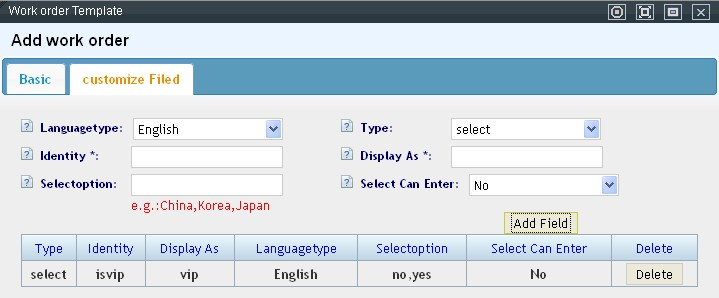

3. Si el proceso siempre sigue el mismo camino, configura el **flujo automático**: al guardar la secuencia de grupos, el work order avanza solo de un grupo al siguiente al completarse cada paso, y se cierra automáticamente al terminar el último.

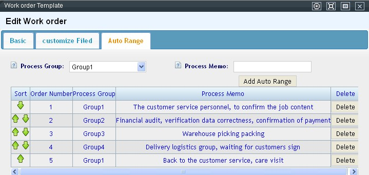

### Pantalla "Mis work orders"

Al entrar con work orders pendientes, el sistema abre automáticamente esta pantalla (también accesible desde el menú). Organiza los casos en cuatro categorías:

| Categoría | Qué muestra |
|---|---|
| Mis work orders | Todos los asignados al agente actual |
| Mis creados | Todos los que el agente creó |
| Work orders del grupo | Solo visible para el jefe de grupo — todos los del grupo |
| Creados por el grupo | Solo visible para el jefe de grupo — todos los que el grupo creó |

Dentro de cada categoría se filtra además por **Nuevo**, **Recién completado** e **Histórico completado** (mismas tres tablas de archivo mencionadas abajo). El jefe de grupo puede asignar o reasignar manualmente desde aquí seleccionando el work order y usando el botón **Asignar** — no se pueden asignar juntos work orders de grupos distintos.

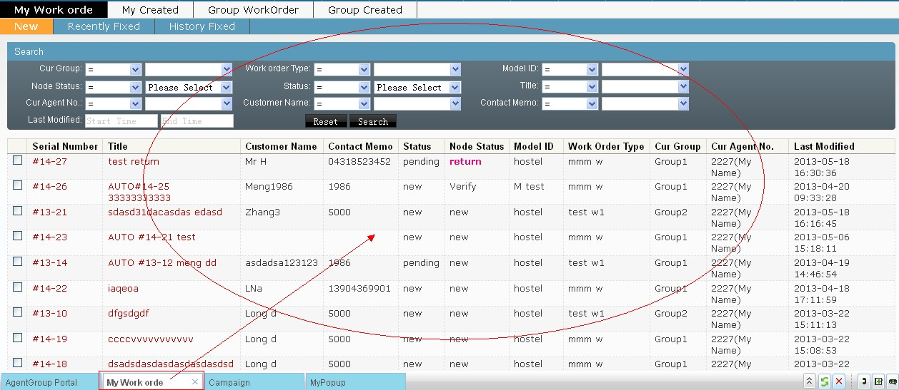

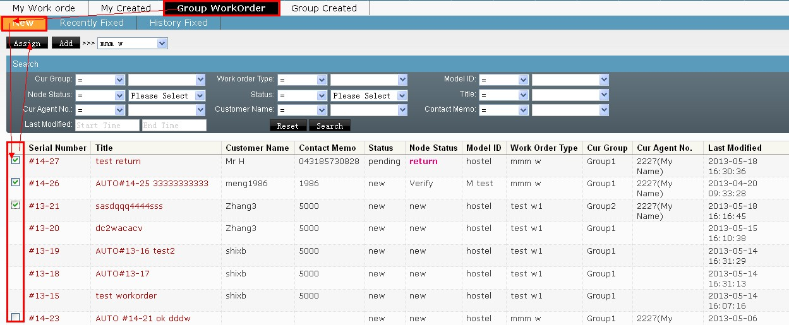

### Dónde se crea un work order

Un work order se puede originar desde cuatro lugares:
1. Pantalla emergente de atención al cliente entrante, si el resultado de la llamada está vinculado a esta plantilla.
2. Gestión de llamadas perdidas, para dar seguimiento a una llamada no atendida.
3. Pantalla emergente de una campaña de marketing saliente, si el resultado de la llamada está vinculado a esta plantilla.
4. La pantalla **"Mis work orders"**, donde un jefe de grupo puede crear uno manualmente para su equipo.

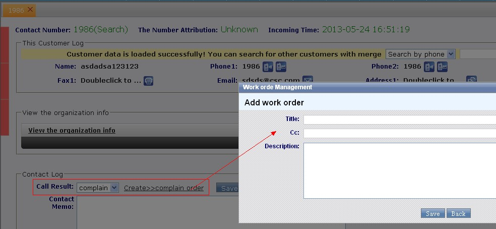

### Reglas de asignación por grupo

Cuando la plantilla usa flujo manual (no automático), cada grupo de agentes involucrado define su propia regla de asignación — solo el jefe de ese grupo puede editarla:

| Regla | Cómo asigna |
|---|---|
| Manual | El jefe de grupo asigna caso por caso desde "Mis work orders" |
| Por orden de número de agente | Automático — reparte a los agentes en orden ascendente de número, solo entre los que tengan work orders nuevos sin asignar |
| Por menor carga | Automático — prioriza al agente con menos work orders sin completar en ese momento |

Ambas reglas automáticas pueden acotarse a **solo agentes conectados** o a **todos los agentes del grupo** (estén o no en línea). También se define si el nodo requiere **aprobación del jefe de grupo** antes de avanzar al siguiente — si no se aprueba, el work order vuelve al agente como "en seguimiento".

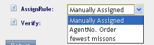

### Estados de un work order

| Estado general | Significado |
|---|---|
| Nuevo | Recién creado, sin procesar |
| En proceso | Alguien lo está trabajando |
| Completo | Cerrado |

| Estado del nodo actual | Significado |
|---|---|
| Nuevo | Recién llegó al nodo, sin agente asignado o sin empezar |
| En proceso | El agente lo está trabajando |
| Devuelto | Rechazado por el siguiente nodo (pide correcciones), o el propio agente lo devolvió a su jefe de grupo por no poder resolverlo |
| En revisión | El agente terminó su parte y espera aprobación del jefe de grupo |

Los work orders se archivan en tres tablas independientes — **sin completar**, **completados recientes**, y **completados históricos** — con migración automática entre ellas: sin completar → completados recientes al cerrarse, y de ahí a históricos tras superar el tiempo de retención configurado (**Sistema → Configuración → Procesamiento de grandes datos → Tiempo de retención de work orders**), medido desde la última modificación.

### Qué puede hacer un agente al procesar un work order

Desde el detalle del work order (accesible por doble clic desde cualquiera de las tres tablas), el agente puede:

- Editar los campos personalizados definidos en la plantilla (si tiene permiso).
- Adjuntar archivos de soporte.
- Ver el historial completo: quién hizo qué y cuándo, con las respuestas anteriores.
- Consultar el historial de contacto y de compras del cliente asociado, sin salir de la pantalla.
- Originar llamada, SMS, correo o fax al cliente desde una barra de accesos rápidos siempre visible.

- Al finalizar su parte, elegir el **estado del nodo**: en proceso, completo, devolver al nodo anterior, devolver a su propio grupo (pedir ayuda al jefe), o —si tiene permiso de aprobación— aprobar/rechazar el trabajo de otro agente.

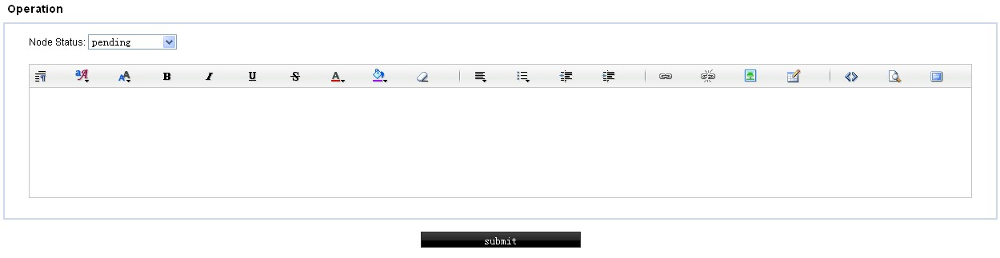

Si el work order ya está completo, nadie puede modificarlo — solo consultar.

## Referencia rápida

| Tarea | Dónde |
|---|---|
| Crear categoría/artículo de conocimiento | Base de conocimiento → Base de conocimiento |
| Controlar permisos de la base de conocimiento | Cuentas y permisos → Gestión de roles → Base de conocimiento |
| Crear plantilla de work order | Gestión de work orders → Work order |
| Vincular resultado de llamada a un work order | Configuración de resultados de llamada (atención al cliente / campaña) |

---

## Fuentes

- `raw/zh/模块使用说明/知识库/知识库.txt`
- `raw/zh/模块使用说明/知识库.txt`
- `raw/zh/工单.txt`
- `raw/zh/模块使用说明/工单管理/工单.txt`
- `raw/zh/模块使用说明/工单管理/分配规则.txt`
- `raw/zh/模块使用说明/工单管理/我的工单.txt`
- `raw/zh/模块使用说明/工单管理/工单记录.txt`
- `raw/en/module_manual/knowledgebase/knowledgebase.txt`
- `raw/en/work_order.txt`
- `raw/en/module_manual/work_order.txt`
- `raw/en/module_manual/work_order/assign_rule.txt`
- `raw/en/module_manual/work_order/my_workorder.txt`
- `raw/en/module_manual/work_order/work_order.txt`
- `raw/en/module_manual/work_order/workorder_log.txt`