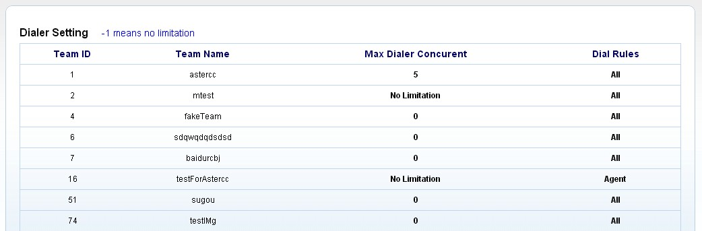
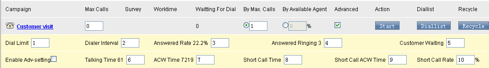
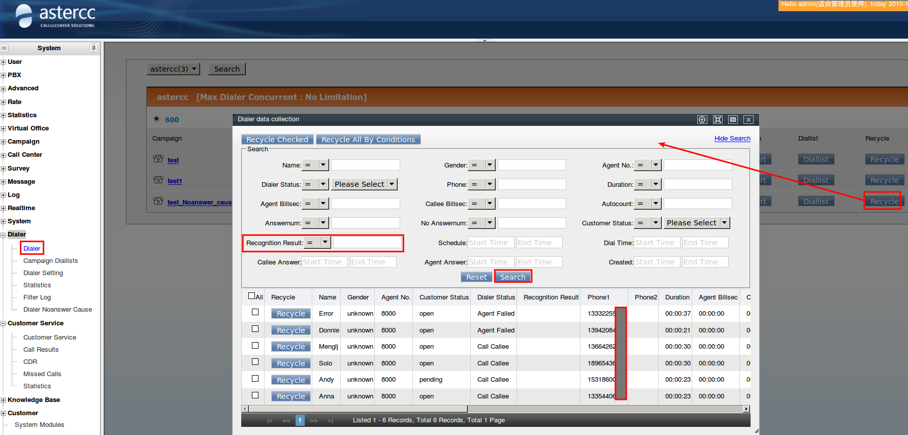
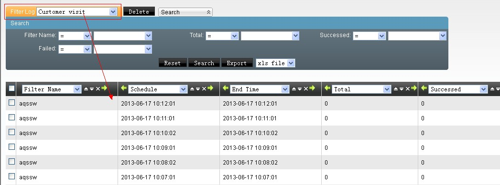
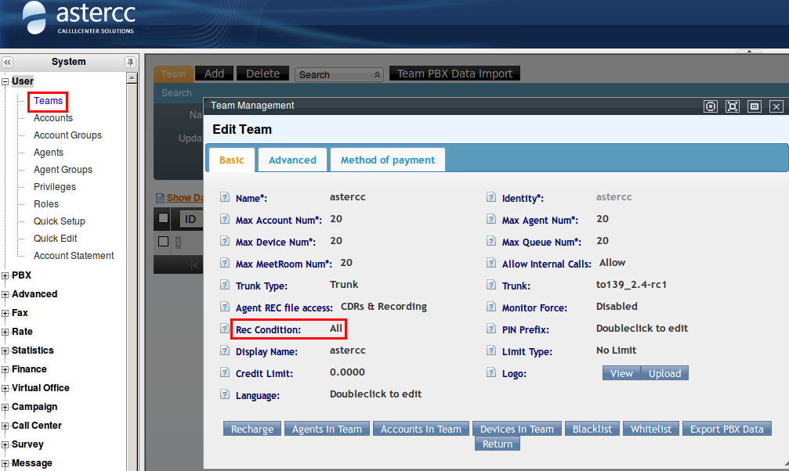
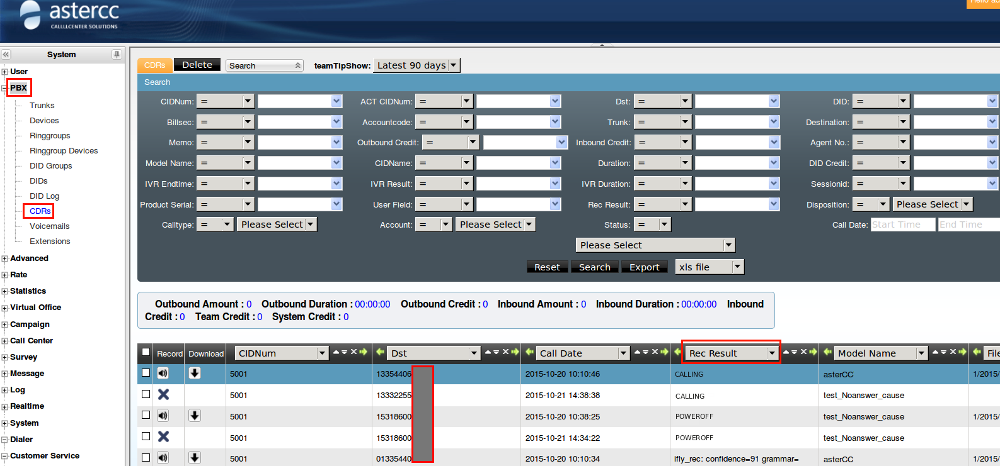
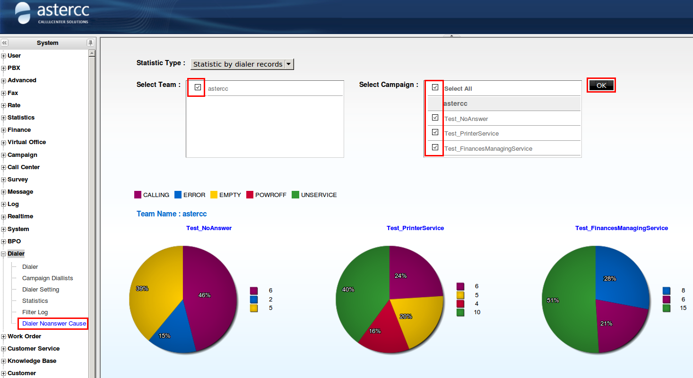
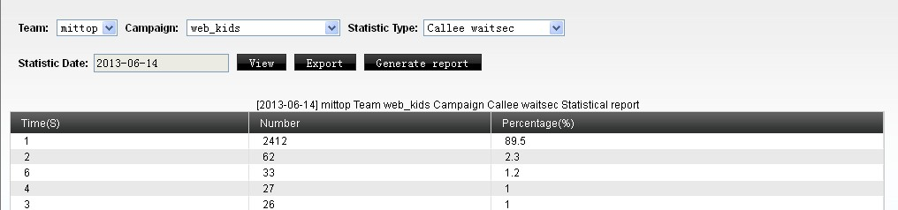
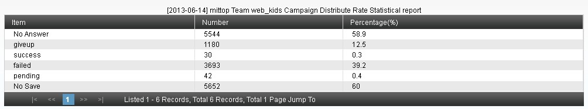

# Marcador predictivo — referencia avanzada

## Qué es

Esta página documenta a fondo el algoritmo del marcador predictivo — qué calcula, qué parámetros lo ajustan, y las herramientas asociadas (lista de marcación, filtros automáticos, motivos de no conexión, y estadísticas específicas de predictivo). Para la configuración básica de campañas, ver [Marcador y campañas](marcador-y-campanas.md); para un caso de uso aplicado, ver [Marcación predictiva](../casos-de-uso/marcacion-predictiva.md).

**Aplicaciones típicas** (según la página de introducción del módulo): telemercadeo, difusión masiva de avisos, cobranza, encuestas de mercado, concertación de citas, televenta, venta por TV, seguros, y seguimiento posventa. La misma introducción resume las **estrategias de conexión** al contestar el cliente — IVR, cola, otra aplicación de telefonía personalizada, o un agente específico — y las **estrategias de marcado** — por cantidad máxima de llamadas simultáneas, por cantidad de agentes disponibles, o por una estrategia personalizada basada en duración promedio de timbrado, tasa de conexión o duración promedio de llamada; estas últimas corresponden a los mismos parámetros documentados en las fórmulas de predicción de esta página.

## Cómo se usa

### Panel del marcador

El panel muestra, por tarea con predictivo activo: nombre de la tarea, estado de los agentes del grupo asignado, cuántos clientes quedan por marcar en la lista, y controles para iniciar la marcación.

| Campo | Qué define |
|---|---|
| Límite de concurrencia máxima (equipo) | El total de llamadas en curso (en conversación + esperando + timbrando) de todo el equipo no puede superar este valor, sin importar cuántos agentes libres haya |
| Límite de concurrencia (tarea) | Igual, pero acotado a una tarea específica — solo aplica en modo "por concurrencia máxima" |
| Horario de trabajo | Fuera de este rango, el marcador no marca (en modo "por porcentaje de agentes" además requiere agentes conectados) |
| Clientes pendientes | Cuántos quedan en la lista de marcación de esa tarea |

### Las dos estrategias de marcado

| Estrategia | Fórmula base |
|---|---|
| Por concurrencia máxima | `llamadas a lanzar = límite de concurrencia − (en curso + timbrando + esperando)` |
| Por porcentaje de agentes disponibles | `llamadas a lanzar = agentes libres × porcentaje configurado` |

!!! tip
    Los agentes marcados como "solo saliente manual" no cuentan como "agentes libres" para la estrategia por porcentaje — el marcador predictivo los excluye del cálculo.

En ambos casos, el resultado nunca puede superar la jerarquía de límites: **licencia del sistema ≥ límite de equipo ≥ límite de tarea ≥ valor calculado**. Si el valor calculado excede cualquiera de los niveles superiores, se recorta automáticamente al límite más bajo aplicable.

### Configuración del marcador (por equipo)

En **Marcador → Configuración del marcador**, el administrador define, por equipo:
- El **límite de concurrencia máxima** de ese equipo (`-1` = sin límite propio, hereda el de licencia; `0` = concurrencia deshabilitada para ese equipo).
- La **regla de marcado** permitida en el panel: ambas estrategias disponibles a elección del operador, o forzar únicamente una de las dos.



!!! tip
    La suma de los límites de concurrencia de todos los equipos no puede superar el límite de licencia del sistema — si todos los equipos se dejan en `-1`, el sistema reparte dinámicamente hasta el máximo de licencia.

### Parámetros avanzados (ajuste fino de la predicción)

Disponibles al marcar "configuración avanzada" en una tarea. El objetivo de todos ellos es el mismo: que, en el momento exacto en que un agente cuelga, ya haya un cliente contestado esperándolo — ni antes (agentes ociosos por sobra de llamadas) ni después (clientes esperando de más, o abandonando).

| Parámetro | Qué ajusta |
|---|---|
| Límite por lanzamiento | Máximo de llamadas que el marcador origina en una sola pasada — sirve para distribuir el timbrado en el tiempo en vez de lanzar todo de golpe |
| Intervalo entre lanzamientos | Segundos mínimos entre una pasada de marcado y la siguiente para la misma tarea |
| Tasa de contactación del cliente | Referencia calculada por el sistema (contestadas ÷ marcadas); el administrador puede ajustar el valor usado por la fórmula de predicción |
| Duración promedio de timbrado hasta contestar | Usado para decidir qué llamadas timbrando aún "cuentan" como futuras conexiones válidas — las que ya timbran más que este valor se descartan del cálculo |
| Tiempo promedio de espera del cliente en cola | Clientes ya contestados con menos tiempo de espera que este valor se consideran "todavía viables" y se restan de la próxima tanda a marcar |
| Duración promedio de llamada / gestión posterior | Predicen cuándo un agente en llamada o en ACW estará libre |
| Umbral y proporción de "llamada corta" | Define qué se considera una llamada corta (cliente poco cooperativo) y su proporción esperada sobre el total — refina la predicción de cuándo un agente vuelve a estar libre |



### Fórmulas de predicción

**Por concurrencia máxima:**
```
llamadas a marcar = límite de concurrencia − (en curso + timbrando + esperando)
```

**Por porcentaje de agentes (sin parámetros avanzados):**
```
clientes válidos timbrando = (timbrando ≤ duración promedio de timbrado) × tasa de contactación
clientes válidos esperando  = (espera actual < espera promedio)
llamadas a marcar = (agentes libres − válidos timbrando − válidos esperando) / tasa de contactación × %agentes
```

**Por porcentaje de agentes (con parámetros avanzados activados):** además de lo anterior, suma a "agentes libres" una estimación de:
- Agentes en ACW cuyo tiempo transcurrido ya supera *(ACW promedio − timbrado promedio)*.
- Agentes en llamada corta cuyo tiempo ya supera el umbral correspondiente.
- Agentes en llamada larga cuyo tiempo ya supera *(duración promedio + ACW promedio − timbrado promedio)*.

```
llamadas a marcar = (libres + ACW próximos + cortas próximas + largas próximas − válidos timbrando − válidos esperando) / tasa de contactación × %agentes
```

!!! warning
    El resultado de cualquiera de las fórmulas anteriores siempre queda acotado por el límite de concurrencia de la tarea y por el límite por lanzamiento — si el cálculo da un número mayor, se usa el menor de todos los límites aplicables.

### Lista de marcación y recuperación de datos

La **lista de marcación** es una copia de trabajo del paquete de clientes, exclusiva para que el marcador la consuma — cada intento de marcado mueve al cliente de vuelta al paquete y lo borra de la lista (con un margen de ~1 minuto tras colgar antes de limpiarse). Para volver a intentar esos números, hay que **recuperarlos** de regreso a la lista.

- **Recuperación manual:** por selección puntual o por condición de búsqueda (ej. estado = pendiente + estado de marcado = contestado por el cliente) — con campo de teléfono a usar, prioridad, y hora de marcado.
- **Filtro de recuperación automática:** programa una recuperación recurrente con condiciones guardadas (ej. "estado = sin procesar Y estado de marcado = timbrando cliente Y intentos ∈ {1,2}"), con horario tipo cron y ejecución inmediata opcional (útil si la lista se vació antes de la hora programada). El **log de filtros** registra cada corrida: inicio, fin, SQL generado, y cantidad recuperada — útil para auditar por qué la lista se vació o se llenó en cierto momento.



!!! warning
    Solo se puede eliminar de la lista de marcación un cliente cuyo estado de marcado sea "pendiente" (aún no intentado) — el resto se depura automáticamente. Para depuraciones o recuperaciones masivas, se recomienda acotar la condición de búsqueda para procesar en tandas de no más de ~5,000 registros por operación, evitando timeouts.



### Motivos de no conexión (detección de números inválidos)

Con la **grabación de llamadas en "todas"** activada a nivel de equipo, el sistema puede clasificar por qué un número no conectó (apagado, fuera de servicio, número inexistente, etc.) — útil para depurar bases de datos de baja calidad. Se consulta por tarea, y también aparece en el registro de llamadas de PBX para marcaciones manuales.







### Estadísticas específicas de predictivo

Reporte generado una vez al día (00:00, sobre el día anterior) por tarea, o bajo demanda para el día en curso. Distribuciones incluidas:



| Distribución | Qué mide |
|---|---|
| Tiempo de espera del cliente contestado | Cuánto espera un cliente ya conectado hasta que un agente lo atiende |
| Tiempo de abandono | Cuánto espera un cliente antes de colgar sin ser atendido (incluye el caso "colgó justo cuando el agente contestó") |
| Tiempo de timbrado hasta contestar | Cuánto tarda un cliente en contestar la llamada |
| Duración de llamadas exitosas / fallidas / en seguimiento | Por estado final asignado por el agente |
| Duración de gestión posterior (ACW) por estado final | Igual, pero el tiempo de trabajo posterior a colgar |
| Sin guardar | Llamadas conectadas donde el agente no guardó resultado |
| Distribución global | Porcentaje de: no conectadas, abandonadas, exitosas, fallidas, en seguimiento, sin guardar — todas sobre el total de marcaciones |



## Referencia rápida

| Necesito | Dónde |
|---|---|
| Límite de concurrencia por equipo | Marcador → Configuración del marcador |
| Ajustar parámetros de predicción | Tarea de campaña → Configuración avanzada de predial |
| Recuperar clientes a la lista de marcación | Predial → Lista de marcación → Recuperación (manual o por filtro) |
| Ver por qué un número no conectó | Predial → Motivos de no conexión |
| Auditar corridas de un filtro automático | Predial → Log de filtros |
| Estadísticas de predictivo | Predial → Estadísticas |

---

## Fuentes

- `raw/zh/预拨号.txt`
- `raw/zh/模块使用说明/预拨号.txt`
- `raw/zh/模块使用说明/预拨号/拨号器.txt`
- `raw/zh/模块使用说明/预拨号/预拨号列表.txt`
- `raw/zh/模块使用说明/预拨号/预拨号统计.txt`
- `raw/zh/模块使用说明/预拨号/预拨号未接通原因.txt`
- `raw/zh/模块使用说明/预拨号/预拨号过滤器日志.txt`
- `raw/en/module_manual/dialer/campaign_diallists.txt`
- `raw/en/module_manual/dialer/dialer.txt`
- `raw/en/module_manual/dialer/dialer_noanswer_cause.txt`
- `raw/en/module_manual/dialer/dialer_setting.txt`
- `raw/en/module_manual/dialer/filter_log.txt`
- `raw/en/module_manual/dialer/statistics.txt`