# Marcador y campañas

## Qué es

Este módulo configura las **tareas de marketing saliente** (campañas): a qué [paquete de clientes](../glosario.md#paquete-de-clientes-para-marcacion-saliente) llama la campaña, qué agentes participan, qué modo de marcación usan, y —opcionalmente— el **marcador predictivo** que automatiza el proceso de llamar antes de que el agente lo pida.

**Aplicaciones típicas** de marketing outbound (según la página de introducción del módulo): encuestas de mercado, concertación de citas telefónicas, televenta, televenta vía TV, venta de seguros, y seguimiento posventa. El módulo también resume sus características principales — múltiples formas de asignar clientes al agente (automática, manual, o a petición del propio agente), filtros que mueven datos del paquete de clientes a la lista de marcado según condiciones, clasificación automática de clientes (sin completar / en seguimiento / enviado con éxito / enviado con error), control de calidad con porcentaje de muestreo configurable, reversión (rollback) de datos ya trabajados, ocultar el contacto del cliente al agente, y control granular de qué campos ve/edita cada quien — todas ya cubiertas en detalle en las secciones anteriores de este artículo.

## Cómo se usa

### 1. Crear una tarea de campaña

En **Marketing outbound → Tareas de campaña**, al crear una nueva tarea defines, entre otros:

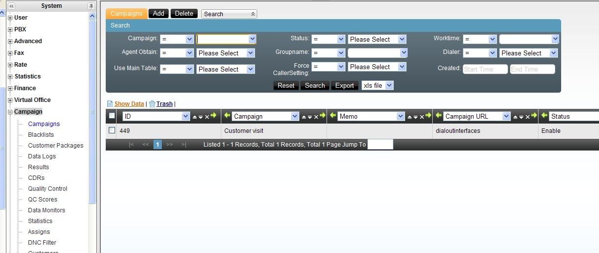

| Campo | Qué controla |
|---|---|
| Tipo de paquete de clientes | Cliente individual o cliente institucional |
| Paquete de clientes | Uno nuevo, la tabla general del equipo, o un paquete ya existente |
| Paquete de horario de trabajo | En qué horario está activa la campaña |
| Encuesta asociada | Encuesta que se dispara al abrir la ficha del cliente |
| Equipo y grupo de agentes | Quién ejecuta la tarea |
| Obtención de datos por el agente | Si el agente puede pedir manualmente un cliente, o solo recibe lo asignado |
| Permitir agregar clientes nuevos | Si el agente puede dar de alta clientes durante la llamada |
| E-commerce asociado | Vincula un catálogo para generar pedidos desde la ficha del cliente |

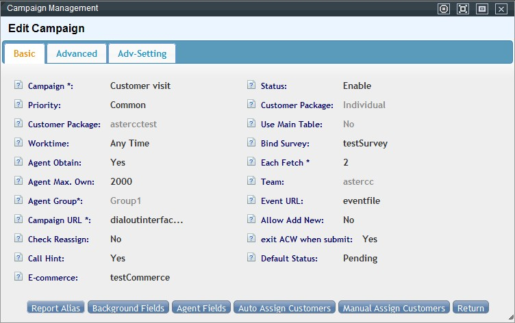

### 2. Elegir el modo de marcación

| Modo | Cómo funciona |
|---|---|
| Manual (por defecto) | El agente hace doble clic en el cliente, ve su ficha, y marca manualmente |
| Preview | El agente ve la ficha y el sistema marca automáticamente |
| Automático | El agente inicia su turno; el sistema muestra la ficha y marca sin intervención, avanzando al siguiente cliente tras cada llamada según un intervalo configurable |
| A elección del agente | El agente puede alternar entre los tres modos anteriores |

Parámetros asociados al modo automático: **intervalo entre llamadas**, **cantidad de reintentos**, y **segundos de prórroga** (para cuando el agente necesita más tiempo antes de la siguiente llamada).

### 2.1 Opciones avanzadas de comportamiento de la tarea

En la pestaña **Avanzado** de la tarea (más allá del modo de marcación) se controlan comportamientos finos del agente y de la llamada:

| Opción | Qué controla |
|---|---|
| Marcar en dos tramos | Por defecto el sistema llama primero al teléfono del agente y, al contestar, marca al cliente; con esta opción activa marca ambos tramos a la vez, acelerando el proceso (a costa de que el agente pueda esperar en línea) |
| Verificar al enviar (`ignoredial` / `checkdial` / `checkstart`) | Define cuándo puede el agente guardar el resultado de llamada y responder la encuesta: en cualquier momento, solo mientras habla con el cliente (para evitar encuestas falsas), o solo puede *iniciar* la encuesta mientras habla pero completarla después |
| Identificador de llamada (nombre/número) y "Forzar caller ID de la campaña" | Qué identificador se muestra al cliente; si se fuerza, sobrescribe el caller ID configurado en el agente o el dispositivo |
| Ocultar información de contacto | El agente no puede leer el teléfono, fax, correo o dirección del cliente en pantalla |
| Privilegio de transferencia | Si el agente puede transferir la llamada a cualquier número |
| Agente no puede editar tras control de calidad | Bloquea la edición de un cliente ya revisado en control de calidad |
| Carga de historial de contacto | Manual (el agente hace clic para cargarlo), automática al abrir la ficha, o deshabilitada |
| Destino directo a lista negra | Cuando el agente marca el resultado "DNC", el número se bloquea a nivel de todo el equipo, o solo dentro de la tarea actual |
| Ranking de agentes en pantalla | Muestra un ranking de desempeño a los agentes — consume recursos, usar solo con pocos agentes/clientes |
| Edición por agente consultado | Si al hacer una consulta a otro agente, ese agente también puede editar la ficha del cliente |
| Actualizar estado del cliente | Si cualquier agente puede cambiar el estado del cliente, o solo el agente asignado |
| Ver/buscar cliente manualmente (pop-up manual) | Si el agente tiene un botón para pedir un cliente nuevo o buscarlo por teléfono |
| Quitar callback al enviar | Si al cambiar el estado del cliente a "fallido" o "exitoso" se cancelan automáticamente los callbacks programados |
| Llamada prioritaria | Si la llamada entrante intenta primero al último agente que atendió a ese cliente (o al agente asignado) antes de enviarla a la cola |
| Programación rápida (callback) | Notación abreviada para reprogramar contacto: `h` = hora, `d` = día, `w` = semana (ej. `3h`, `1d`, `1w`) |
| Orden por defecto en la pestaña "Nuevo" | Orden de clasificación de los clientes sin procesar |
| Verificar reasignación | Si el cliente que llama no pertenece al agente que recibe la llamada, no se abre la ficha — solo un aviso, y el agente transfiere o consulta |
| Aviso de llamada entrante | Si aparece un recordatorio en la esquina inferior derecha cuando entra una llamada |
| IP del servidor de origen | Necesaria si se va a operar la tarea desde un sistema externo vía API |

Dos ejemplos de estas opciones vistas desde la pantalla emergente del agente: al **ocultar información de contacto**, los campos de teléfono, dirección y correo del cliente aparecen enmascarados u ocultos en vez de mostrar el dato real —

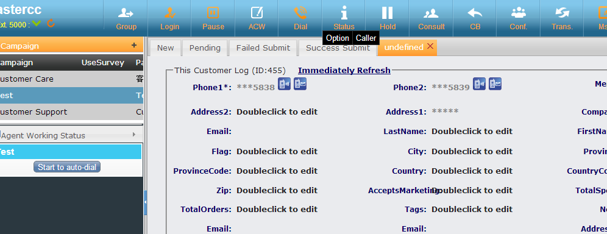

— y al usar la notación de **programación rápida de callback**, el agente elige la reprogramación desde una lista desplegable en vez de escribir una fecha manualmente:

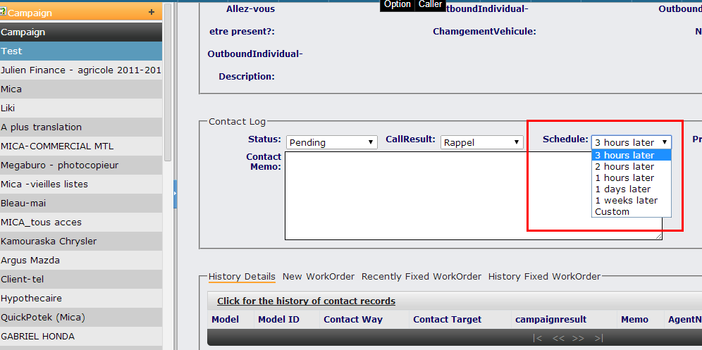

!!! tip
    **Alias de reporte:** desde la pantalla de edición de la tarea, el botón "Alias de reporte" permite renombrar el título de cada campo en los reportes exportados (registro de llamadas y control de calidad) sin tocar el nombre interno del campo.

    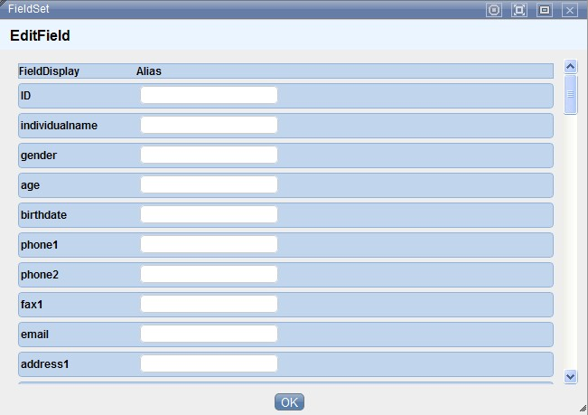

### 3. Configurar el marcador predictivo (opcional)

Si la tarea usa marcación predictiva, se configura por separado en **Marcador → Configuración del marcador**:

- **Cuentas y límites de concurrencia:** existen tres niveles de límite — licencia del sistema, límite por equipo (configurado aquí), y límite por tarea de campaña. Ningún nivel puede superar al que está por encima.
- **Regla de marcación:** define si el operador del marcador puede elegir libremente entre "por concurrencia" y "por agentes disponibles", o si se fuerza una de las dos.
- **Destino al contestar:** a qué se transfiere la llamada cuando el cliente contesta — al grupo de agentes directamente, o a un IVR primero.
- **Parámros de predicción:** duración promedio de timbrado, duración promedio de llamada, tasa de contactación esperada, tiempo de gestión posterior, y definición de "llamada corta" (para ajustar el algoritmo de predicción y evitar que sobren o falten llamadas para los agentes disponibles).

Ver también [Marcación predictiva](../casos-de-uso/marcacion-predictiva.md) para un caso de uso aplicado.

### 4. Asignar clientes a los agentes

Dos formas de asignar el paquete de clientes de una tarea a los agentes del grupo:

- **Asignación automática:** ideal para lotes grandes — se define qué porcentaje del total recibe cada agente (o se reparte por "pendientes" o "sin asignar"), y el sistema ejecuta la asignación en segundo plano.

  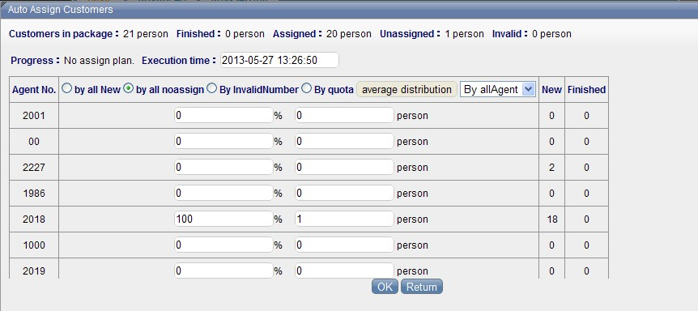

- **Asignación manual:** ideal para ajustes puntuales — por ejemplo, mover una parte de los clientes de un agente a otro con mejor desempeño, o aislar un segmento específico para un agente en particular.

  

### 5. Configurar qué ve el agente

Desde la tarea ya creada, dos botones controlan la visibilidad de campos:

- **Configuración de campos para el agente (frontend):** qué campos del cliente puede ver, editar, y cuáles son obligatorios.
- **Configuración de campos para administración (backend):** qué campos ve el equipo de operaciones y cuáles se usan al exportar.

### Pantalla emergente del agente (resumen)

Al abrir la ficha de un cliente durante una campaña, el agente ve pestañas de **historial de contacto**, y si la tarea usa la tabla general de clientes, también **work orders no completados**, **completados recientemente** y **completados históricos** — igual mecánica que en [atención al cliente entrante](atencion-cliente-mensajeria-ecommerce.md#atencion-al-cliente-entrante). Si el resultado de llamada elegido está vinculado a una plantilla de work order, aparece un enlace para crear uno sin salir de la ficha. Si el cliente es individual y pertenece a una organización, también puede consultarse la ficha de esa organización desde la misma pantalla. Si la tarea tiene e-commerce asociado, la ficha muestra además la sección de catálogo/pedido descrita en el [caso de uso de e-commerce](../casos-de-uso/e-commerce.md).

Desde el panel de tareas del agente, la lista de clientes de la campaña activa se clasifica en cuatro pestañas: **no completados** (pendientes de llamar), **en seguimiento** (contacto iniciado pero sin cerrar), **enviado con error** (cerrado sin cumplir el objetivo) y **enviado con éxito** (cerrado cumpliendo el objetivo) — los mismos estados que luego alimentan el control de calidad y las estadísticas de campaña. Los campos en negro son editables por el agente y los campos en gris no, según la configuración de "campos para el agente" del paso 5.

En modo automático, tras colgar cada llamada arranca una cuenta regresiva (configurada en la tarea) para que el agente complete la información de contacto antes de que el sistema marque al siguiente cliente; si el agente termina antes, puede forzar el avance con el botón **siguiente** sin esperar a que se agote el temporizador. Si la tarea tiene encuesta asociada, esta aparece debajo de la ficha del cliente con botones **iniciar**, **pregunta anterior** y **confirmar respuesta de esta pregunta** (o tecla `Tab`) para avanzar, mostrando en gris una vista previa de la siguiente pregunta; las respuestas de texto libre quedan visibles y editables sin necesidad de retroceder.

### 6. Paquete de clientes en detalle

El [paquete de clientes](../glosario.md#paquete-de-clientes-para-marcacion-saliente) es una tabla independiente generada al crear la tarea (o reutilizada, si se elige un paquete existente).

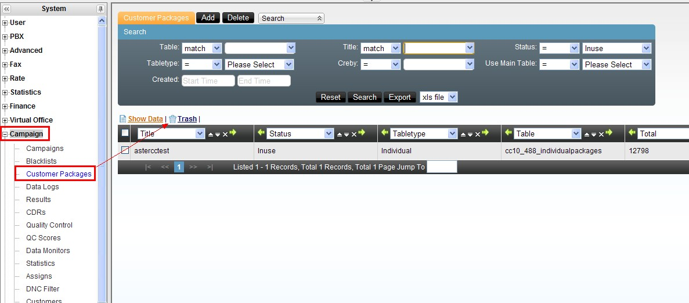

| Campo | Qué define |
|---|---|
| Estado | "Sin tarea asignada" o "en progreso con una tarea" |
| Tipo de paquete | Cliente individual o institucional — determina la estructura de la tabla y de dónde toma los datos |
| Usar tabla general del cliente | Si el paquete refleja la tabla general del equipo en vez de ser una copia independiente |
| Total de clientes / completados | Contadores informativos del paquete |
| Clave única | Campo(s) que evitan duplicados al importar o agregar manualmente (por defecto, "teléfono uno") |
| Índice | Campos de búsqueda frecuente marcados para acelerar consultas (por defecto, "teléfono uno" y "teléfono dos") |
| Equipo | Solo ese equipo puede usar este paquete en una tarea |

!!! tip
    Si "usar tabla general" está activo, no se puede seleccionar clientes manualmente desde el paquete (se nutre automáticamente de la tabla general). Si está inactivo, se puede usar "seleccionar clientes" para copiar registros puntuales — o todos — desde la tabla general del equipo hacia este paquete.

No se puede cambiar la clave única si ya existen duplicados en el paquete — hay que depurarlos primero desde **Gestión de clientes** de la tarea.

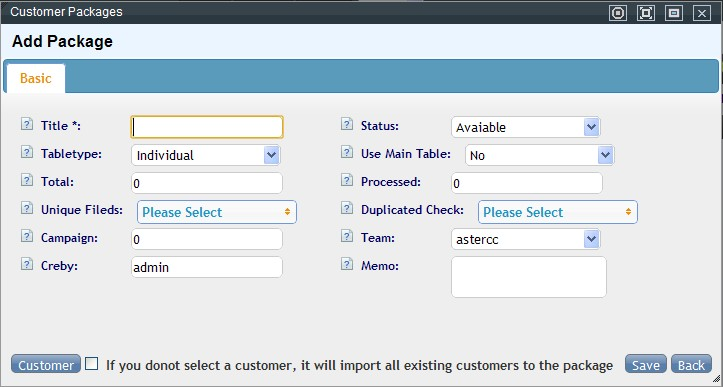

### 7. Registro de llamadas de la campaña

Cada llamada de la tarea queda en su propio registro, con campos como número de teléfono usado, marca de tiempo de solicitud de marcado (solo aplica a predictivo), tiempo de respuesta del cliente vs. del agente, ruta que siguió la llamada dentro del sistema (ej. `entersystem,queue3,AGENT:8000`), destino de entrada (cola, IVR, dispositivo) y su extensión, tipo de llamada (entrante o saliente), y el estado de marcación en el momento de colgar (pendiente, timbrando cliente, timbrando agente, etc.). Permite escuchar/descargar grabación individualmente, o exportar en lote por rango de búsqueda (con la opción de borrar el archivo original del servidor tras exportarlo, para liberar espacio).

### 8. Gestión de clientes de la tarea

Pantalla para buscar, agregar, editar y eliminar clientes dentro del paquete de una tarea específica — los campos visibles siguen la configuración de "campos para administración" del paso 5. Incluye una función de **detección de duplicados** por el campo que se elija, y dos modos de eliminación:
- Eliminar solo de la lista de marcación (predial) — el cliente permanece en el paquete.
- Eliminar del paquete completo (predial + tabla base).

## Otras funciones del módulo

### Gestión de resultados de llamada

Catálogo de resultados que el agente asigna tras cada contacto (ej. "no coopera", "sin tiempo", "número equivocado"). Cada resultado se puede asociar a:

- Un **estado de procesamiento** (todos / sin procesar / en seguimiento / fallido / exitoso) — el resultado solo aparece en pantalla cuando el agente elige ese estado.
- Si la llamada fue **contestada o no** — la lista de resultados disponibles cambia según esto.
- Un **equipo** y/o **tarea específica** — para acotar qué resultados ve cada quien.
- Una **plantilla de work order** — si se asocia, el agente puede crear directamente un work order al elegir ese resultado (solo disponible si la tarea usa la tabla general de clientes).

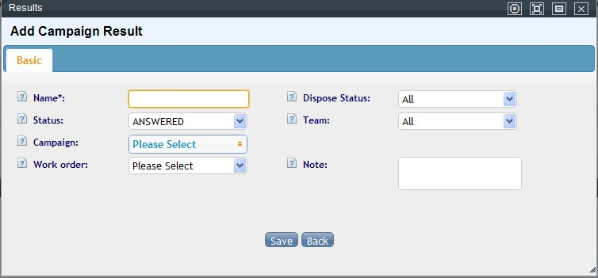

### DNC — lista de no llamar, en tres niveles

Un número marcado como DNC (do-not-call) se filtra automáticamente del paquete de clientes en el nivel correspondiente:

| Nivel | Alcance |
|---|---|
| Sistema | Filtra a todos los equipos |
| Equipo | Filtra solo dentro de ese equipo |
| Tarea de campaña | Filtra solo dentro de esa tarea |

La carga de números al DNC se hace por importación (en **Administración avanzada del call center → Importación**), eligiendo el nivel según se seleccione equipo y/o tarea. También se pueden agregar números manualmente (uno por línea) o vaciar por completo un nivel de lista.

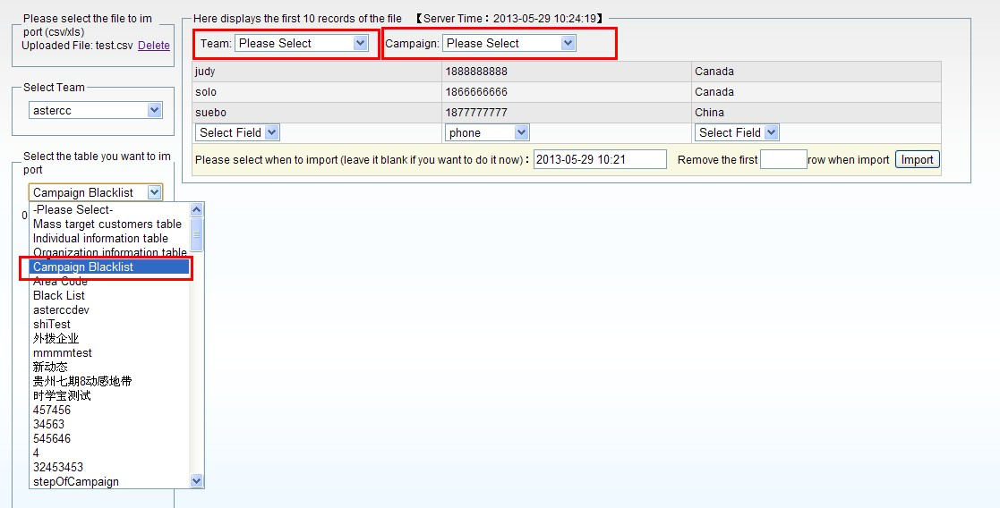

### Plan de filtrado de lista negra (automatización del DNC)

En vez de importar manualmente, se puede programar que el sistema filtre periódicamente el paquete de una tarea contra el DNC vigente — define equipo, tarea, y horario de ejecución (se puede editar y reactivar). Cada corrida deja disponible para descarga el listado de clientes que fueron filtrados esa vez.

### Control de calidad

En **Gestión de control de calidad**, se elige la tarea (y encuesta, si aplica) para revisar contactos uno por uno: escuchar la grabación, ver la ficha y las respuestas de encuesta, y marcar el contacto como aprobado o no — con opción de **calificar** con puntaje si hay estándares de calidad definidos.

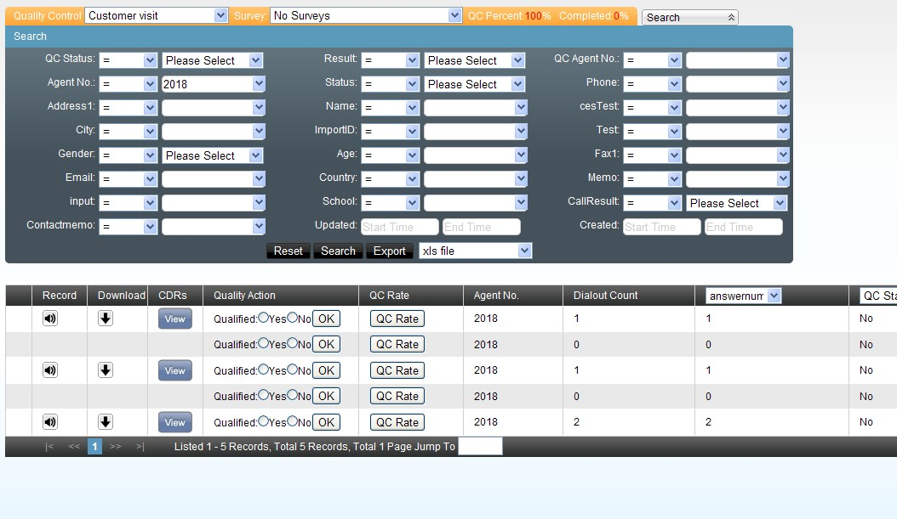

**Estándares de control de calidad:** catálogo de criterios de puntaje (suma o resta), acotable por equipo y/o tarea — por ejemplo, una rúbrica de 100 puntos donde cada criterio aprobado suma.

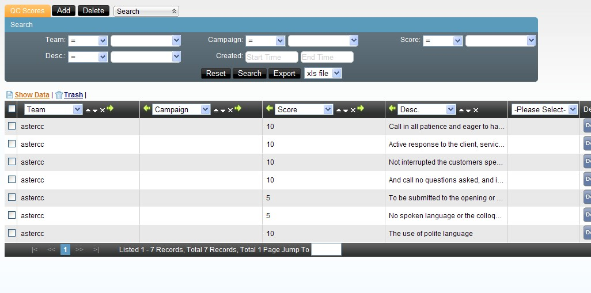

**Exportar grabaciones en lote:** desde control de calidad, filtrando por tarea + estado "enviado con éxito" (el caso típico cuando un cliente externo pide auditar solo las llamadas exitosas), se puede generar un paquete descargable de audios — con la misma opción de descarga vía web o FTP que el registro de llamadas.

### Monitoreo de volumen de datos

Vista rápida por tarea: total de clientes, cuántos se importaron, cuántos ya se marcaron, cuántos resultaron en éxito, cuántos faltan por marcar, cuántos quedan en la lista de marcación predictiva (0 si la tarea no usa predictivo), cuándo fue la última vez que se recuperaron datos hacia esa lista, y cuántas veces se ha ejecutado esa recuperación.

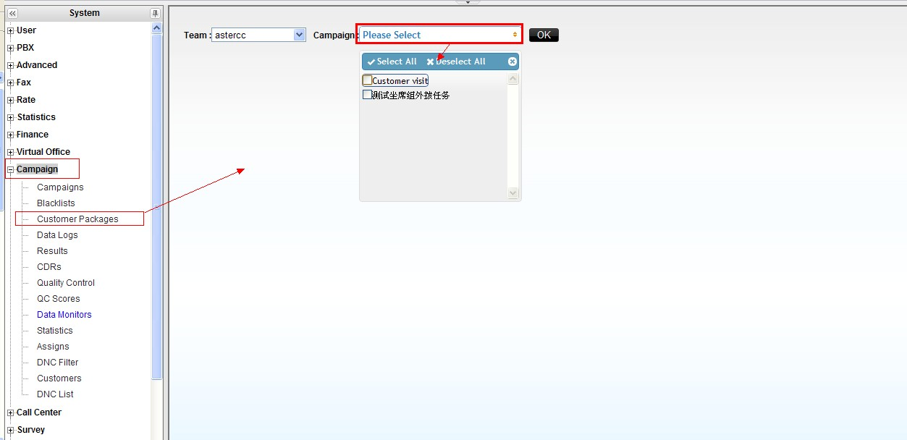

### Estadísticas de la campaña

Reporte agregable por tarea o por agente, en un rango de fechas, con salida por total, año, trimestre, mes, semana, día u hora. Al crear el reporte el sistema lo procesa en segundo plano (por el volumen de datos) — se consulta el estado en la lista de reportes y se abre cuando queda "cerrado".

| Indicador | Cómo se calcula |
|---|---|
| Clientes llamados / veces llamado | Clientes distintos contactados vs. total de intentos (llamar 10 veces al mismo cliente cuenta 1 y 10 respectivamente) |
| Clientes que contestaron / veces contestada | Igual distinción, pero sobre las llamadas contestadas |
| Tasa de contactación por cliente / por intento | Contestados ÷ llamados, y contestadas ÷ intentos |
| Resultados de llamada | Frecuencia de cada resultado configurado, guardado por los agentes |
| Sin guardar | Contactos sin resultado de llamada registrado |
| Duración / tiempo en llamada | Total en el teléfono (incluye timbrado) vs. solo tiempo de conversación |
| Números inválidos / tasa de inválidos | Llamadas no contestadas ÷ total de clientes |
| Callbacks / tasa de callback | Clientes guardados en estado "pendiente" ÷ clientes llamados |
| Éxito real (post-QC) | Clientes exitosos que además pasaron control de calidad |
| Tasa de conversación / tasa de éxito | Éxito real ÷ contestados, y éxito real ÷ llamados |
| Éxito en control de calidad | Clientes revisados en QC, sin importar su estado |
| Enviado con éxito (agente) | Clientes que el agente marcó como "enviado con éxito" |
| Enviado con éxito + revisado / + aprobado / + rechazado en QC | Cruces del estado "enviado con éxito" contra el resultado de control de calidad |

## Referencia rápida

| Tarea | Dónde |
|---|---|
| Crear/editar tarea de campaña | Marketing outbound → Tareas de campaña |
| Configurar marcador predictivo | Marcador → Configuración del marcador (ver también [Marcador predictivo — referencia avanzada](marcador-predictivo-avanzado.md)) |
| Asignar clientes | Dentro de la tarea → Asignación automática / manual |
| Resultados de llamada | Marketing outbound → Gestión de resultados |
| Gestionar el paquete de clientes | Marketing outbound → Gestión de paquetes de clientes |
| Cargar/gestionar DNC | Marketing outbound → Lista negra de marcación / Plan de filtrado |
| Control de calidad | Marketing outbound → Gestión de control de calidad |
| Ver registro de llamadas de la tarea | Marketing outbound → Registro de llamadas |
| Estadísticas de campaña | Marketing outbound → Reportes estadísticos |

---

## Fuentes

- `raw/zh/外呼营销.txt`
- `raw/en/module_manual/campaign.txt`
- `raw/zh/模块使用说明/外呼营销.txt`
- `raw/zh/模块使用说明/外呼营销/外呼营销任务.txt`
- `raw/zh/模块使用说明/外呼营销/客户集合包管理.txt`
- `raw/zh/模块使用说明/外呼营销/呼叫结果管理.txt`
- `raw/zh/模块使用说明/外呼营销/禁拨黑名单.txt`
- `raw/zh/模块使用说明/外呼营销/黑名单过滤计划.txt`
- `raw/zh/模块使用说明/外呼营销/质检管理.txt`
- `raw/zh/模块使用说明/外呼营销/质检标准管理.txt`
- `raw/zh/模块使用说明/外呼营销/数据量监控.txt`
- `raw/zh/模块使用说明/外呼营销/统计报表.txt`
- `raw/zh/模块使用说明/外呼营销/呼叫记录.txt`
- `raw/zh/模块使用说明/外呼营销/客户管理.txt`
- `raw/zh/模块使用说明/外呼营销/坐席界面.txt`
- `raw/zh/模块使用说明/预拨号/拨号器设置.txt`
- `raw/en/module_manual/campaign/black_lists.txt`
- `raw/en/module_manual/campaign/campaign_customers.txt`
- `raw/en/module_manual/campaign/campaigndata_monitors.txt`
- `raw/en/module_manual/campaign/campaignresults.txt`
- `raw/en/module_manual/campaign/campaigns.txt`
- `raw/en/module_manual/campaign/cdrs.txt`
- `raw/en/module_manual/campaign/customerpackages.txt`
- `raw/en/module_manual/campaign/outboundstatistics.txt`
- `raw/en/module_manual/campaign/qcpages.txt`
- `raw/en/module_manual/campaign/qcrates.txt`
- `raw/en/module_manual/campaign/shell_blacklists.txt`
- `raw/en/module_manual/agent_work_page/agent_work_portal.txt`