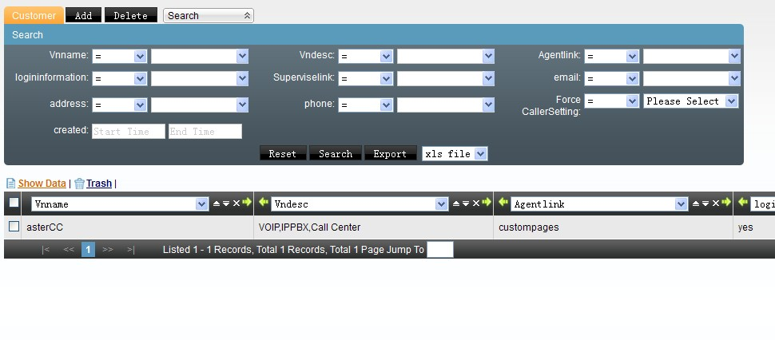
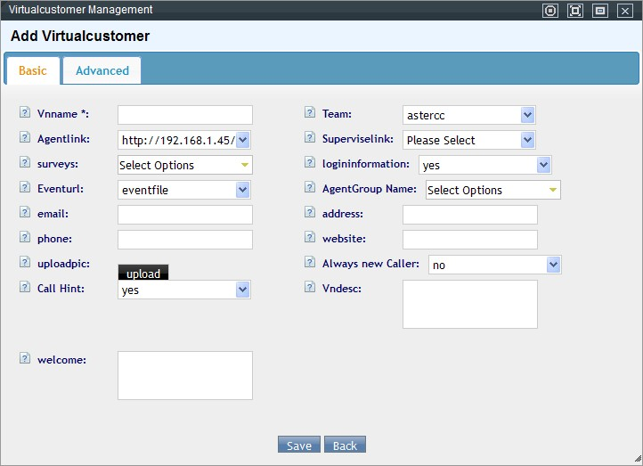
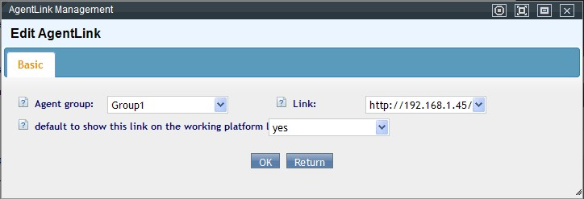
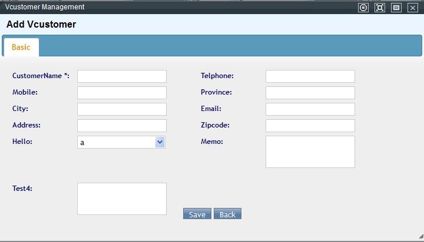
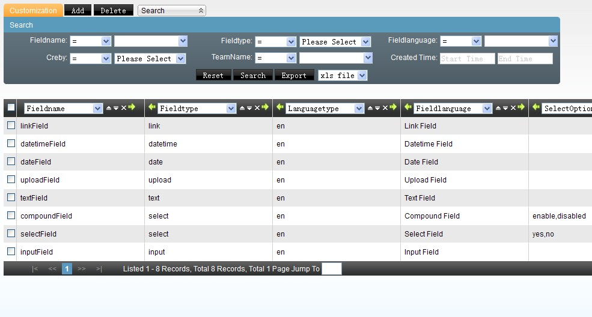
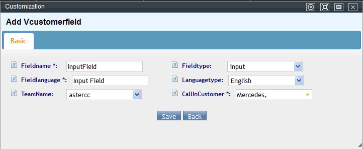
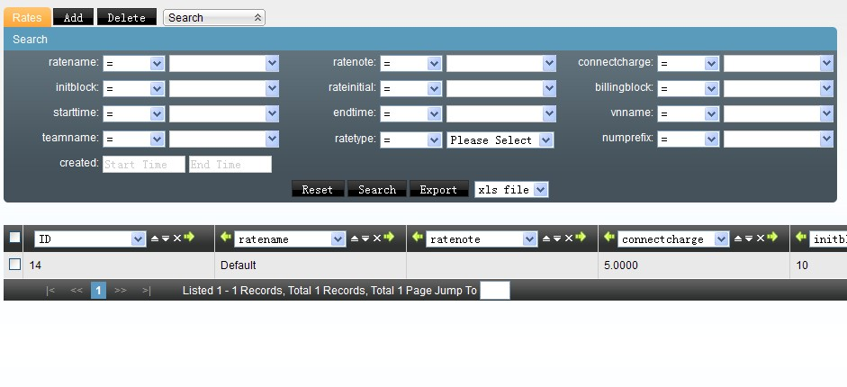
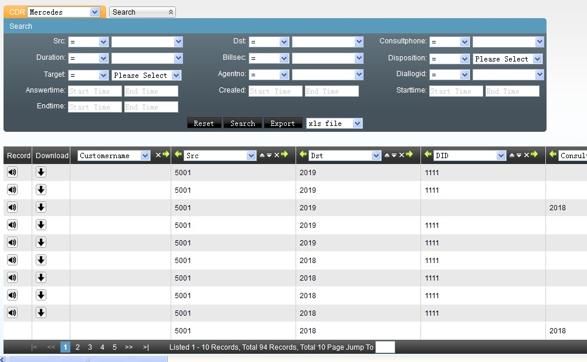
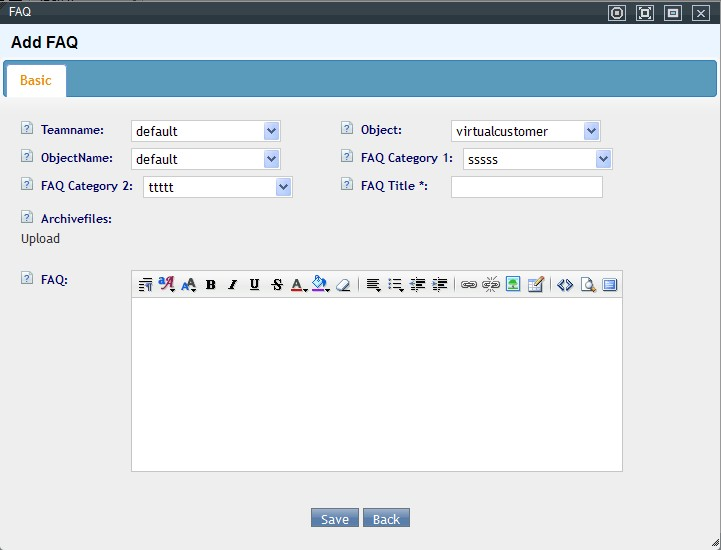

# Oficina virtual / BPO

## Qué es

Este módulo permite que un mismo equipo de agentes atienda, de forma indistinta, las llamadas de **varias empresas cliente** ("usuarios virtuales"), manteniendo la información, el conocimiento y las reglas de negocio de cada una completamente separadas. Es el mecanismo típico para ofrecer servicios de call center tercerizado (BPO) o de oficina virtual.

## Cómo se usa

### Ámbito de aplicación

Este módulo aplica cuando el mismo grupo de agentes atiende, al mismo tiempo, a varios proyectos entrantes distintos — no solo el escenario de BPO multiempresa, sino también, por ejemplo, una **recepción de hotel virtual** que atiende a huéspedes de varias propiedades desde el mismo pool de agentes.

Características del sistema relevantes en este ámbito:

- **Facturación por tiempo de servicio:** puede cobrarse al cliente según la duración del servicio prestado por el agente.
- **Lista de transferencia:** permite definir, por cada cliente (usuario virtual), una lista de números de transferencia — al necesitar transferir, el agente hace clic directamente sobre el contacto para consultar o transferir.
- **Registro de llamadas y contactos.**
- **Fax.**

### Caso de referencia

Una empresa A opera el call center para tres empresas clientes (B, C y D). Cada una tiene su propio número de atención. Cuando un cliente llama a B, la llamada se desvía hacia el sistema de A; A identifica —por el DID que recibió la llamada— que se trata de un cliente de B, y muestra al agente la pantalla, el saludo y la base de conocimiento correspondientes a B, sin que el agente necesite saber de memoria el negocio de cada empresa cliente.

### 1. Crear la cola y el grupo de agentes

Igual que en cualquier otro flujo entrante (ver [4.1 PBX y telefonía](pbx-y-telefonia.md#colas)): se crea una cola y un grupo de agentes que la atienda.

### 2. Crear el DID que identifica a cada usuario virtual

Cada empresa cliente (usuario virtual) recibe su propio DID, para que el sistema pueda distinguir de cuál empresa proviene cada llamada entrante.

### 3. Dar de alta el usuario virtual (empresa cliente)

En **Oficina virtual → Gestión de usuarios entrantes**, cada usuario virtual define:

| Campo | Qué define |
|---|---|
| Nombre del usuario virtual | Identifica a la empresa cliente |
| Equipo | A qué equipo pertenece |
| Enlace de pantalla del agente (por defecto) | Página que se muestra al agente cuando entra una llamada de este usuario |
| Enlace de administración | Página de gestión del negocio de este usuario virtual |
| Encuesta asociada | Puede elegirse más de una — si hay varias, el agente elige cuál abrir en la pantalla del cliente |
| Enviar datos de login | Si la página embebida (posiblemente externa) recibe automáticamente usuario/contraseña del agente |
| Modo de transferencia | Por agente, transferencia ciega, o ambos disponibles — se refleja en cómo se comporta cada contacto de la libreta de contactos frecuentes de este usuario |
| Dirección de recepción de eventos | A dónde se envían los eventos de llamada de este usuario virtual |
| Grupo de agentes | Qué grupo atiende a este usuario virtual |
| Correo / dirección / teléfono de contacto, sitio web | Datos de la empresa cliente |
| Forzar alta de cliente nuevo | Si cada llamada entrante debe generar un registro de cliente nuevo, incluso si podría coincidir con uno existente |
| Imagen | Logo o imagen mostrada en la pantalla del agente |
| Ventana de aviso de llamada flotante | Si se muestra un aviso emergente en la esquina al recibir una llamada |
| Descripción del negocio | Notas para orientar al agente |
| Saludo | Frase de apertura que el agente debe usar al contestar |

**Datos avanzados:** número/nombre que llama (para telefonía IP), forzar uso de ese número/nombre, modo de transferencia avanzado (agente/ciega/libre elección), restricción de números de transferencia (cualquiera vs. solo contactos frecuentes), IPs de confianza (si un sistema externo va a invocar eventos de este usuario virtual), y si un agente consultado puede editar los datos del cliente que ve durante la consulta.

Un mismo usuario virtual puede tener **distintos enlaces de pantalla por grupo de agentes** (vía "agregar enlace de grupo" en la edición) — útil si ese negocio, a su vez, se subdivide en líneas (ej. soporte técnico, verificación, comercial) enrutadas por IVR a distintos grupos.

### Clientes del usuario virtual

Los clientes de cada usuario virtual se gestionan en **Oficina virtual → Gestión de clientes**, filtrando por usuario virtual. Comparten estructura con el resto del sistema, más los **campos personalizados** definidos específicamente para ese usuario virtual (ver más abajo).

### Campos personalizados por usuario virtual

En **Oficina virtual → Campos personalizados**, cada campo se asocia a uno o varios usuarios virtuales del equipo, y puede ser de tipo:

| Tipo | Comportamiento |
|---|---|
| `input` | Texto corto de una línea |
| `select` | Lista desplegable — opciones separadas por coma; puede permitirse además texto libre si se activa "select editable" |
| `textarea` | Texto largo |
| `date` / `datetime` | Selector de fecha (con o sin hora), con calendario emergente |
| `upload` | Subida de archivo |
| `link` | Enlace clickeable — se abre en una pestaña de la plataforma del agente o en una ventana de navegador aparte, según se configure |

### Tarifa del usuario virtual

Ver [4.4 Tarifas y facturación](tarifas-y-facturacion.md#tarifa-de-usuario-virtual) — cada usuario virtual puede tener su propia tarifa de llamadas entrantes y de transferencias.

### Registro de llamadas del usuario virtual

**Oficina virtual → Registro de llamadas** centraliza el historial de todos los usuarios virtuales del equipo, con reproducción y descarga de grabación cuando existe.

### Contactos frecuentes (opcional)

Además de la base de conocimiento, se puede armar una **libreta de contactos frecuentes** por usuario virtual — como una guía telefónica interna para que el agente consulte o transfiera sin salir de la pantalla.

1. En **Call center → Contactos frecuentes → Agregar**, define equipo, alcance (grupo/tipo de módulo/ID de módulo — para acotar quién ve este contacto), nombre, teléfono, si el teléfono se muestra al agente (o solo permite marcar/transferir sin revelarlo, por privacidad), descripción, y un texto de estado libre (ej. "disponible de 9 a 18h" — visible al agente para saber cuándo tiene sentido contactarlo).
2. En la edición del usuario virtual, agrega el enlace a esta lista de contactos.
3. Desde la pantalla del agente, la lista de contactos frecuentes de ese usuario virtual queda visible, y un clic sobre un contacto dispara la transferencia o consulta.

### 4. Base de conocimiento por usuario virtual

Se organiza en **dos niveles de categoría** (categoría → subcategoría → artículo de conocimiento) — análoga por concepto a [4.6 Base de conocimiento](base-conocimiento-work-orders.md#base-de-conocimiento), pero con su propia pantalla dentro de Oficina virtual y acotada al usuario virtual correspondiente:

1. En **Oficina virtual → Categorías de conocimiento**, crea la categoría de primer nivel.

    

2. Desde esa categoría, entra a "subcategorías" (o usa el botón "nivel siguiente") para crear la de segundo nivel.

    

3. Desde la subcategoría, entra a "artículos de conocimiento" y agrega el artículo (nombre, archivo adjunto opcional, contenido).

    

Así el agente solo ve el conocimiento relevante para la empresa que está atendiendo en ese momento, sin mezclar contenido de otros usuarios virtuales.

!!! note
    En la documentación en inglés este mismo mecanismo se llama **FAQ** (`FAQ Category 1` / `FAQ Category 2` / `FAQ`) en vez de "base de conocimiento" — es la misma pantalla y el mismo modelo de dos niveles, solo con otro nombre. El artículo puede acotarse por equipo (`default` = todos los equipos) y por usuario virtual (`default` = todos los usuarios virtuales de ese equipo), y admite un archivo adjunto descargable además del contenido de texto.

### 5. Que el agente entre directo a la pantalla de oficina virtual (opcional)

Para que un grupo de agentes, al iniciar sesión, entre directamente a la vista de oficina virtual (en vez de la vista por defecto del grupo):

1. Edita el grupo de agentes y activa "Mostrar página de oficina virtual por defecto".
2. En el usuario virtual, agrega el enlace de grupo y activa "Mostrar este enlace en el menú de configuración de la plataforma del agente" — así el agente puede acceder manualmente al negocio de esa empresa cliente en cualquier momento, no solo cuando recibe una llamada.

### Cuentas BPO

Cuando terceros (las propias empresas B, C, D del ejemplo) necesitan ver sus propios reportes y tareas sin acceder al resto del sistema, se les crea una **cuenta BPO**:

- Se define a qué **tareas de campaña** y a qué **usuarios virtuales (oficina virtual)** tiene acceso esa cuenta.
- Se le asigna un **rol BPO** que controla qué puede ver y hacer.
- Las cuentas BPO inician sesión desde una URL separada (`<servidor>/bpologin/`), distinta del login administrativo normal.

**Roles BPO:** se definen en **BPO → Gestión de roles**, con permisos (ver, agregar, editar, eliminar, exportar) acotados específicamente a las páginas de **tareas de campaña** y de **oficina virtual** — un rol BPO no puede alcanzar ninguna otra parte del sistema. La cuenta BPO hereda automáticamente esos permisos sobre cualquier tarea/usuario virtual al que tenga acceso.

## Referencia rápida

| Tarea | Dónde |
|---|---|
| Crear usuario virtual (empresa cliente) | Oficina virtual → Gestión de usuarios entrantes |
| Configurar enlaces por grupo de agentes | Dentro del usuario virtual → Enlaces de grupo |
| Gestionar clientes de un usuario virtual | Oficina virtual → Gestión de clientes |
| Crear campos personalizados | Oficina virtual → Campos personalizados |
| Configurar tarifa por usuario virtual | Tarifas → Tarifa de usuario virtual |
| Base de conocimiento por usuario virtual | Oficina virtual → Categorías de conocimiento |
| Ver registro de llamadas | Oficina virtual → Registro de llamadas |
| Crear cuenta BPO para el cliente final | BPO → Gestión de cuentas BPO |
| Login de cuentas BPO | `<servidor>/bpologin/` |

---

## Fuentes

- `raw/zh/用途和案例/为客户提供虚拟呼叫中心服务.txt`
- `raw/zh/模块使用说明/bpo/bpo帐号管理.txt`
- `raw/en/how-to/how_to_build_a_common_contacts.txt`
- `raw/zh/模块使用说明/虚拟呼叫中心/用户管理.txt`
- `raw/zh/模块使用说明/虚拟呼叫中心/客户管理.txt`
- `raw/zh/模块使用说明/虚拟呼叫中心/知识库.txt`
- `raw/zh/模块使用说明/虚拟呼叫中心/知识类别.txt`
- `raw/zh/模块使用说明/虚拟呼叫中心/自定义字段.txt`
- `raw/zh/模块使用说明/虚拟呼叫中心/费率管理.txt`
- `raw/zh/模块使用说明/虚拟呼叫中心/通话记录.txt`
- `raw/zh/模块使用说明/虚拟呼叫中心/模块流程.txt`
- `raw/zh/模块使用说明/虚拟呼叫中心.txt`
- `raw/zh/模块使用说明/bpo/bpo角色管理.txt`
- `raw/en/module_manual/virtual_office.txt`
- `raw/en/module_manual/virtual_office/caller.txt`
- `raw/en/module_manual/virtual_office/cdr.txt`
- `raw/en/module_manual/virtual_office/customer.txt`
- `raw/en/module_manual/virtual_office/customization.txt`
- `raw/en/module_manual/virtual_office/faq.txt`
- `raw/en/module_manual/virtual_office/faq_categories.txt`
- `raw/en/module_manual/virtual_office/rates.txt`
- `raw/zh/虚拟办公室.txt`