# Plataforma de trabajo del agente

## Qué es

Esta es la referencia completa de la plataforma web que usa el agente para trabajar. Para una guía paso a paso de inicio, ver [Guía rápida para agentes](../primeros-pasos/guia-agentes.md); esta página cubre cada control en detalle.

## Cómo se usa

### Inicio de sesión

- Navegadores soportados: Firefox 3.0+ (recomendado), Internet Explorer 8.0+, Chrome.
- Se elige idioma, se ingresan usuario y contraseña, y el equipo al que pertenece la cuenta.

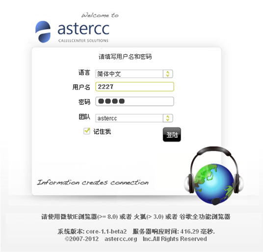

Antes de que un agente pueda iniciar sesión debe existir: una cuenta con un [agente asociado](cuentas-equipos-permisos.md), y ese agente debe pertenecer a al menos un [grupo de agentes](cuentas-equipos-permisos.md) — un agente aislado, sin grupo, no puede trabajar (ver más abajo). Un mismo agente puede pertenecer a varios grupos a la vez.

### Layout general

La pantalla se divide en: lista de páginas disponibles, botones de función, área de contenido (donde se cargan las páginas de negocio embebidas), y barra de pestañas de páginas abiertas en la parte inferior. Todos los agentes tienen un menú de **gestión básica** (datos personales, historial de llamadas propio, buzón de voz, mensajes internos y anuncios); los jefes de grupo tienen además menús de **jefe de grupo** y de **marcador predictivo**. El resto de los menús depende del rol asignado a la cuenta.

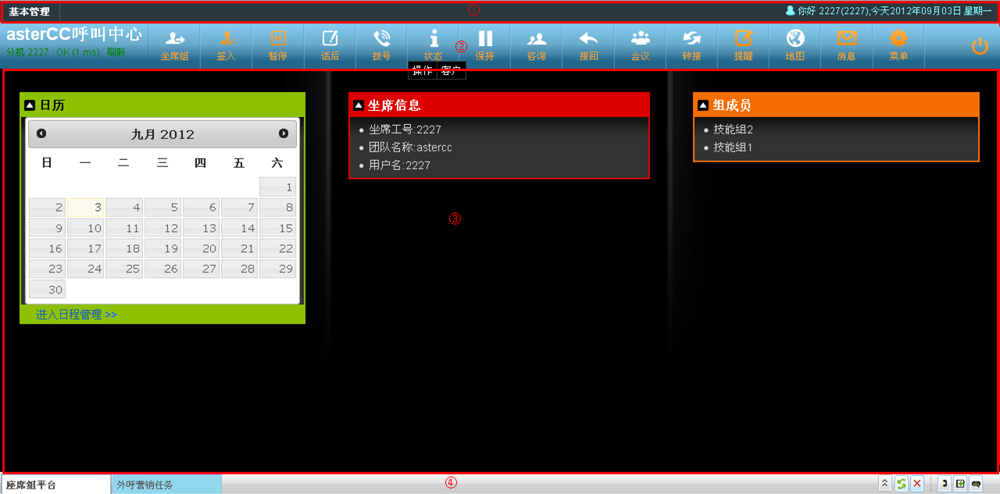

Junto al saludo (nombre de usuario, número de agente y fecha) se muestra el estado de vínculo de la extensión: si la extensión asignada es una interna del sistema y no se detecta su registro, aparece el aviso "teléfono no conectado" — al actualizar tras registrar el teléfono, el aviso desaparece.

### Barra de herramientas del agente

Además de la barra de funciones (check-in, pausa, marcación, etc.), la plataforma incluye una barra de herramientas de agente con utilidades para manejar las páginas de negocio abiertas:

| Herramienta | Qué hace |
|---|---|
| Selección rápida de mesa de trabajo | Lista todas las páginas de negocio disponibles para el agente, para abrirlas o cambiar entre ellas |
| Refrescar página actual | Vuelve a cargar la página de negocio activa |
| Cerrar todas las páginas | Cierra de una vez todas las pestañas de trabajo que admiten cierre |
| Detalle de la llamada actual | Ventana con: nombre del proyecto, número de acceso (por cuál número entró el cliente), número del cliente (identificador de llamada), grupo de agentes real que atendió, e idioma (si se configuró antes de entrar al grupo) |
| Control de la barra de funciones | Oculta o muestra la barra de funciones del agente |
| Control de archivo de configuración | Recarga la configuración del sistema sin salir de la sesión, cuando es necesario |

### Check-in / check-out y posibles avisos

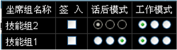

Al conectarte a tus colas pueden aparecer distintos avisos según el estado de tu extensión:

| Situación | Qué significa | Qué hacer |
|---|---|---|
| El sistema corrige tu extensión automáticamente | Tu extensión configurada no está registrada desde tu IP, pero otra sí | Nada — el sistema ya ajustó la extensión por ti |
| "Extensión en uso por otro agente" | Otro agente ya está usando esa extensión | Cambia de extensión o coordina con esa persona |
| IP de login no coincide con la IP registrada del teléfono | Tu extensión es de tipo autoadaptable/autoseleccionable y no hay registro desde tu IP | Continúa el check-in o corrige la extensión — si usas un teléfono IP fijo, pide que tu extensión se configure como "fija" |
| Conexión telefónica anómala | El sistema no detecta tu dispositivo | Verifica tu teléfono; si confirmas que sí está conectado, puedes ignorar el aviso y avisar al administrador |

### Modo de trabajo y modo de gestión posterior

Se configuran por grupo de agentes (pueden venir fijados por el administrador, en cuyo caso aparecen deshabilitados para el agente):

- **Modo de trabajo:** solo entrantes, solo salientes, o ambos.
- **Modo de gestión posterior (ACW):** al timbrar, al contestar, o deshabilitado.

### Pausa y bloqueo de pantalla

Al pausar, dejas de recibir llamadas entrantes (pero puedes seguir marcando si tienes permiso). Toda pausa requiere seleccionar un **motivo** — esto permite luego analizar el comportamiento del agente por tipo de pausa. Al confirmar el motivo se puede elegir además la acción resultante: solo pausar, bloquear la pantalla, o pausar y bloquear a la vez. Para salir del bloqueo de pantalla se pide la contraseña del agente.

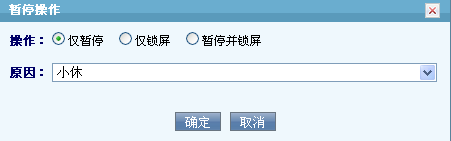

### Panel de grupos de colas (vista del agente)

Al hacer clic en el botón de grupo de agentes se abre un panel con la lista de colas a las que el agente puede conectarse — no confundir con el panel de [monitoreo de grupo de agentes](reportes-y-estadisticas.md#monitoreo-de-grupo-de-agentes-detallado), que es una vista de supervisión con el estado de todos los agentes del equipo; este panel es personal, solo del agente que lo abre.

| Control | Qué hace |
|---|---|
| Check-in de todo | Conecta al agente a todas sus colas de una vez |
| Check-out de todo | Desconecta al agente de todas sus colas de una vez |
| Pausar todo | Pausa al agente en todas sus colas |
| Reanudar todo | Quita la pausa en todas sus colas |
| Check-in / check-out por cola | Conecta o desconecta solo la cola seleccionada |
| Pausar / reanudar por cola | Pausa o reanuda solo la cola seleccionada |

Cada cola listada puede mostrar uno de estos estados: **inactivo** (idle), **ocupado al timbrar** (busy on ring) u **ocupado al contestar** (busy on answer) — estos dos últimos corresponden al modo de gestión posterior (ver "Modo de trabajo y modo de gestión posterior" más arriba) configurado para esa cola.

### Panel de marcación

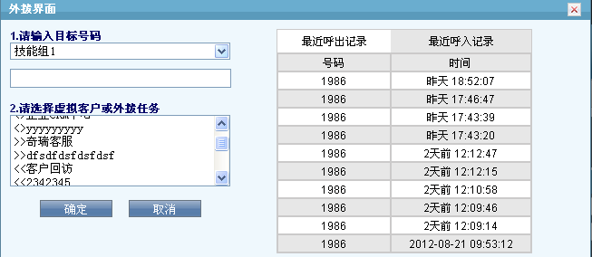

Al abrir el panel de marcación se listan tus grupos conectados; eligiendo uno se muestran su historial reciente de llamadas y sus destinos disponibles, distinguidos por prefijo:

| Prefijo | Tipo de destino |
|---|---|
| `>>` | Cliente virtual |
| `<<` | Tarea de campaña saliente |
| `<>` | Aplicación / programa |

Si el grupo tiene restricción de marcación saliente, el campo de número se deshabilita y debes elegir un número desde el historial de llamadas.

El panel separa el historial en dos listas independientes — **llamadas salientes recientes** y **llamadas entrantes recientes** — además de un botón de **marcación estadística** (stat dial) para volver a marcar según las estadísticas de contacto acumuladas del destino.

### Estado de la llamada

El panel de estado usa un código de color por cada número involucrado en la llamada:

| Color | Significado |
|---|---|
| Rojo | Timbrando |
| Verde | En conversación con el agente |
| Amarillo | Dentro de una sala de conferencia |
| Gris (parpadeo breve) | Colgó y sale de la llamada |

El panel puede mostrar más de una llamada activa a la vez (por ejemplo, cliente + consulta) — cada llamada aparece en su propia fila, con una columna para el número del cliente y otra para el número consultado, y distingue si ese consultado está **en consulta** o **ya integrado a una conferencia**.

### Controles durante una llamada activa

| Control | Disponible cuando | Qué hace |
|---|---|---|
| Retener / Continuar | Llamada en curso | Pone al cliente en espera con música; retoma la conversación al continuar |
| [Consulta](../glosario.md#consulta-transferencia-recuperar-y-conferencia) | En llamada, sin consulta activa | Llama a otro agente o a un número externo mientras el cliente espera |
| Recuperar | Con consulta timbrando o activa | Cuelga al tercero y retoma con el cliente |
| Conferencia | 3 o más participantes en línea | Une a todos en una sala |
| Transferencia | En consulta con cliente + tercero | Deja al cliente hablando con el tercero y libera al agente |
| Subir / bajar volumen | Llamada en curso | Ajusta el volumen de audio de la llamada |
| Colgar cliente | Llamada en curso | Cuelga solo la pierna del cliente |
| Colgar consultado | Con consulta activa | Cuelga solo la pierna del tercero consultado, sin afectar al cliente |
| Colgar todo | Llamada(s) en curso | Cuelga de una vez todas las piernas de la llamada activa |

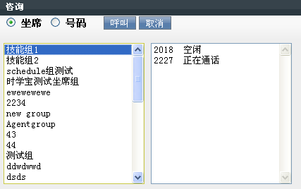
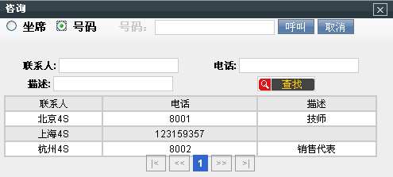

### Recordatorios, mapa y mensajería

- **Recordatorios:** siempre visible; muestra anuncios, mensajes, tareas y agenda — las últimas 5 entradas de cada categoría. El panel de tareas, en detalle, resume: el total de tareas del agente, cuántas ya comenzaron, cuántas están por comenzar, y un contador aparte de mensajes internos (total, no leídos y leídos). Desde ahí también se puede marcar una tarea como **gestionada** (dispuesta).

  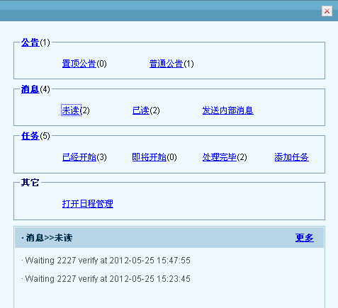

- **Mapa:** integración con Google Maps (API v3) para ubicar una dirección y calcular una ruta entre dos puntos — se ingresa la dirección a consultar y se pulsa el botón de búsqueda para ubicarla en el área de mapa; para una ruta se ingresan punto de inicio y punto final y se consulta, mostrando el trazado en el área de mapa. Requiere una clave de API de Google Maps activada en Sistema → Configuración del sistema → Configuración básica.

  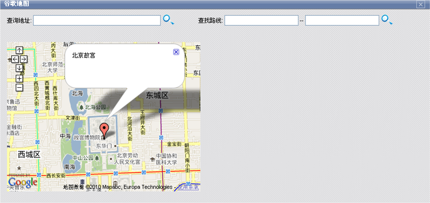

  !!! warning
      Si el servidor no tiene salida a internet, no se debe activar el mapa — provoca que la carga de la plataforma del agente al iniciar sesión se vuelva muy lenta.

- **Mensajería (correo / SMS):** envío de SMS o correo a un destino desde la misma plataforma. El envío de SMS requiere tener configurado el script `astcc_smsmail.pl`; el envío de correo requiere un servidor SMTP configurado. Campos del panel: asunto (solo aplica a correo), destinatario(s), plantilla (opcional — al elegir una plantilla se puede definir su idioma, tipo de objeto y nombre de objeto para prellenar el contenido), contenido, enviar y cerrar panel.

  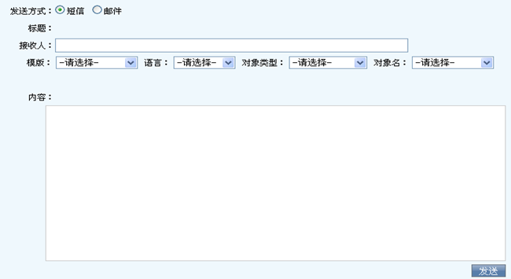

### Tarifas y selección de troncal (referencia)

El menú de gestión de tarifas accesible desde la plataforma (tarifa de cliente/extensión y tarifa de sistema) es el mismo mecanismo de facturación y selección de troncal documentado en [Tarifas y facturación](tarifas-y-facturacion.md) — ver ahí el detalle completo de campos y orden de coincidencia; no se duplica aquí.

### Menú de mantenimiento

- **Actualizar telefonía:** sincroniza el estado del teléfono/llamada si la pantalla queda desincronizada del estado real.
- **Procesar datos de llamada con error:** limpia registros de llamada "atascados" (llamadas activas o recién colgadas hace más de 1 minuto con datos inconsistentes) — requiere permiso o autorización de un jefe de grupo.
- **Procesar errores de marcación:** igual que el anterior, pero para números que quedaron atascados en la lista de marcación sin haberse llegado a marcar.

### Páginas de negocio embebidas

El área central de la plataforma muestra la página de negocio configurada para el grupo o la tarea activa. Las tres páginas por defecto del sistema:

1. **Página de trabajo del grupo de agentes:** calendario/agenda, información del agente, y miembros del grupo.

   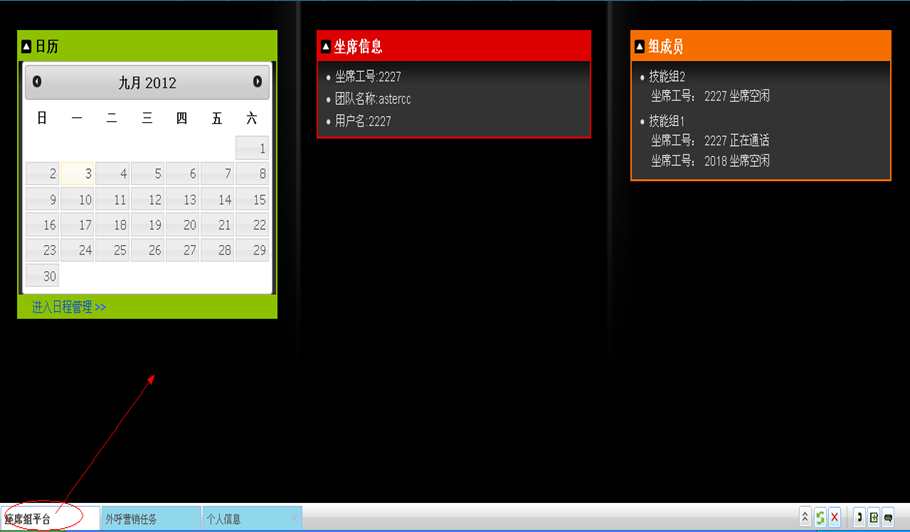

2. **Página de campaña de marketing saliente:** lista de tareas a la izquierda, detalle de clientes a la derecha (clasificados en pendientes, en seguimiento, enviado con error, enviado con éxito), y el área de encuesta abajo si la tarea tiene una asociada. Aquí también se ve si el modo de marcación es manual, preview o automático — y si el modo automático está activo, un contador de llamadas realizadas y el tiempo transcurrido en la sesión de marcado.

   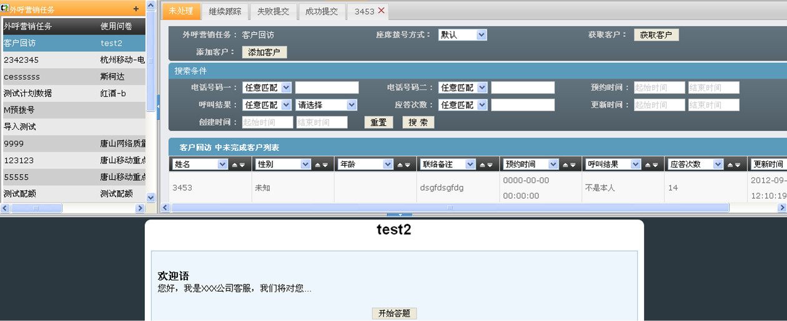

3. **Página de oficina virtual / BPO:** al recibir una llamada enrutada desde un cliente virtual, se muestra la información de esa empresa (datos, saludo, contactos frecuentes) y su base de conocimiento específica para que el agente pueda resolver la consulta sin conocer el negocio del cliente virtual de antemano.

   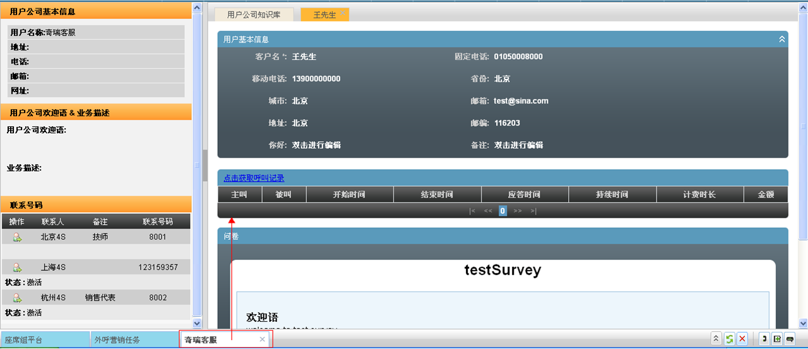

Qué página de negocio se carga lo decide el parámetro **enlace de trabajo** del grupo de agentes, no una configuración por agente. Dos casos frecuentes de "pantalla en blanco":

- El agente no pertenece a ningún grupo: solo ve su información personal, sin ninguna página de negocio.
- El grupo del agente no tiene un enlace de trabajo configurado: la página central queda en blanco aunque el agente sí esté conectado a colas. AsterCC trae un enlace de trabajo por defecto, pero cada equipo puede definir su propia página de negocio personalizada.

## Referencia rápida

| Necesito | Control |
|---|---|
| Conectarme a mis colas | Botón de check-in |
| Dejar de recibir llamadas temporalmente | Pausa (con motivo) |
| Ver mis llamadas o descargar una grabación | Historial de llamadas |
| Consultar antes de transferir | Consulta → Recuperar / Transferir / Conferencia |
| Ver mensajes y tareas pendientes | Recordatorios |
| Marcar manualmente hacia un cliente/campaña | Panel de marcación |
| Ver o colgar mis llamadas activas | Panel de estado de llamada |
| Conectarme/pausar todas mis colas de una vez | Panel de grupos de colas |
| Ubicar una dirección o calcular una ruta | Panel de mapa |
| Enviar un correo o SMS desde la plataforma | Panel de mensajería |

---

## Fuentes

- `raw/zh/模块使用说明/坐席平台/坐席平台基本介绍.txt`
- `raw/zh/坐席工作平台/首页.txt`
- `raw/zh/界面简介.txt`
- `raw/zh/界面简介/地图面板.txt`
- `raw/zh/界面简介/点击出现坐席组面板.txt`
- `raw/zh/界面简介/通话面板.txt`
- `raw/zh/界面简介/邮件短信面板.txt`
- `raw/en/function/anget_work_platform.txt`
- `raw/en/function/customer_rate.txt`
- `raw/en/function/dial_panel.txt`
- `raw/en/function/live_calls_panel.txt`
- `raw/en/function/mail_sms_panel.txt`
- `raw/en/function/map_panel.txt`
- `raw/en/function/queue_panel.txt`
- `raw/en/function/system_rates.txt`
- `raw/en/function/task_panel.txt`