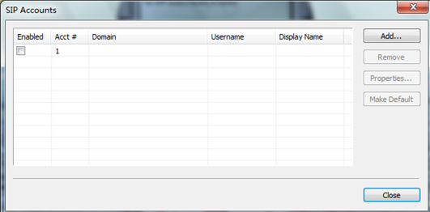
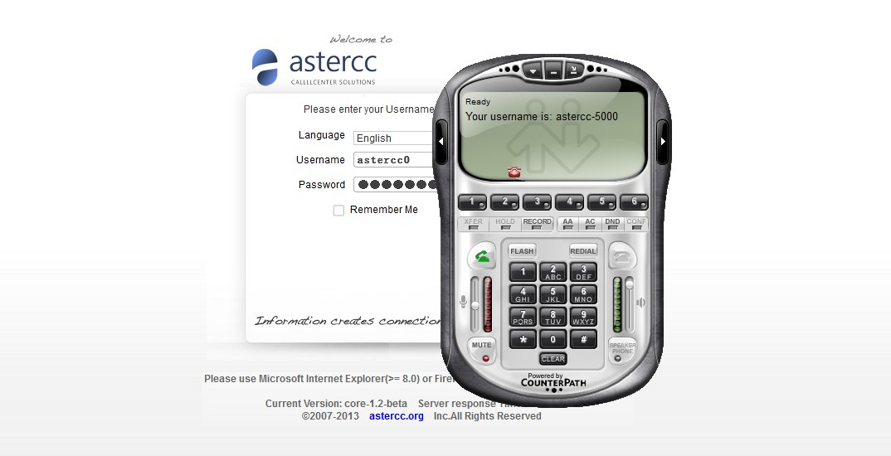
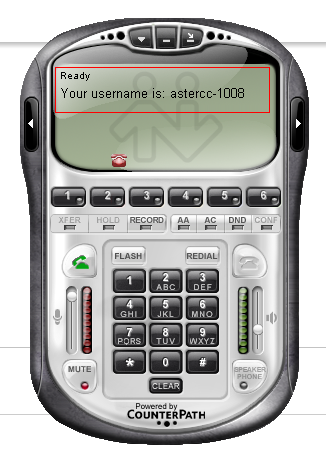
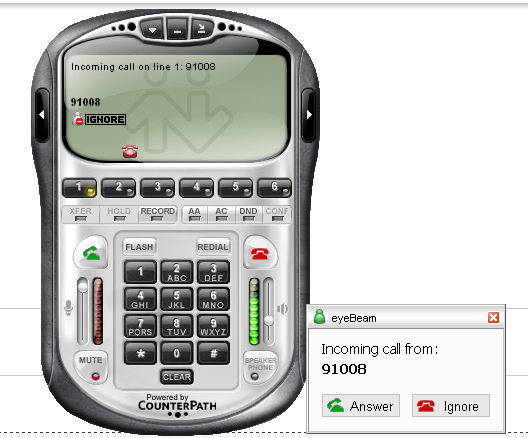
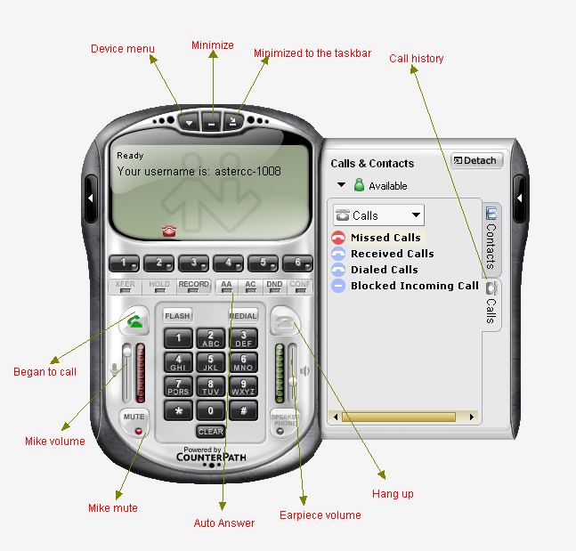
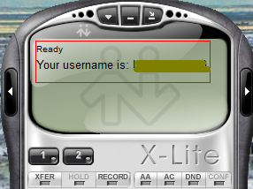
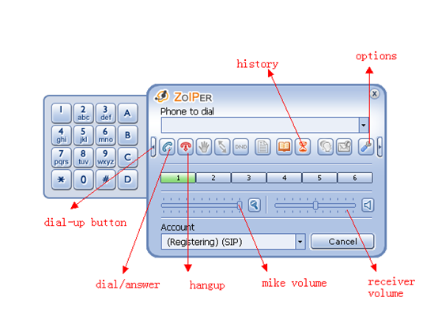

# Configurar softphones: Eyebeam, X-Lite y Zoiper

## Qué es

AsterCC acepta cualquier softphone, gateway o teléfono IP compatible con SIP 2.0. Esta página detalla la descarga, instalación y configuración de cuenta SIP de los tres softphones que el equipo de AsterCC usa como referencia: **Eyebeam**, **X-Lite** y **Zoiper**. Para el paso previo (crear la extensión en el sistema), ver [Guía rápida para administradores](guia-administradores.md#3-configurar-un-softphone).

## Cómo se usa

### Correspondencia de campos (válida para los tres softphones)

Antes de configurar cualquier softphone, abre en AsterCC **PBX → Gestión de dispositivos**, haz doble clic en la extensión y ubica estos cuatro datos — son los que se transcriben al formulario de cuenta SIP del softphone:

| Campo en AsterCC | Uso en el softphone |
|---|---|
| Identificador (`equipo-extensión`, ej. `astercc-1008`) | `User Name` / `User ID` / `Username`, según el softphone |
| Contraseña de registro | `Password` |
| Nombre para mostrar (nombre de quien llama) | `Display Name` |
| IP interna del servidor AsterCC | `Domain` |

### Eyebeam

1. Descarga e instala Eyebeam (el sitio del fabricante lo distribuye como parte de sus productos SIP).
2. Clic derecho sobre la ventana de Eyebeam → **SIP Account Settings** → botón **Add** para crear una cuenta SIP nueva.

   

3. Completa el formulario con los cuatro datos de la tabla anterior (`Display Name`, `User Name`, `Password`, `Domain`) y confirma.

   

4. Marca la casilla de la cuenta para activarla — a diferencia de X-Lite, Eyebeam soporta **múltiples cuentas SIP simultáneas** y puedes agregar más en cualquier momento con **Add**. También soporta el códec **g729**.
5. Si el registro fue exitoso, el softphone muestra el estado **Ready**.

   

6. Ya puedes marcar otras extensiones directamente y recibir llamadas — la información del llamante aparece en pantalla al timbrar.

   

   

### X-Lite

1. Descarga X-Lite desde el sitio de CounterPath. Nota: la versión más reciente eliminó la función de auto-respuesta; si la necesitas, usa una versión anterior.
2. Ejecuta el instalador y sigue el asistente (Next → aceptar términos → elegir carpeta de instalación → Install → Finish).
3. Al iniciar X-Lite por primera vez se abre automáticamente la ventana de **SIP Account Settings** (o ábrela manualmente).
4. Completa el formulario: `User ID` y `Authorization` (ambos con el identificador `equipo-extensión`), `Domain` (IP interna del servidor), `Password` y `Display Name`.
5. Confirma con **OK**. Si el registro fue exitoso, el softphone se muestra disponible para llamar.

   

6. A diferencia de Eyebeam, X-Lite solo soporta **una cuenta SIP** activa a la vez.

### Zoiper

1. Descarga Zoiper (versión Classic) desde el sitio oficial, eligiendo la plataforma correspondiente.
2. Instala siguiendo el asistente (Next → aceptar términos → carpeta de instalación → Install → Finish).
3. Abre la configuración de cuenta con el botón de ajustes del teléfono, o clic derecho → **Options** → **Add new SIP account**. Dale un nombre a la cuenta para identificarla.
4. Completa el formulario: `Domain` (IP interna del servidor), `Username` (identificador `equipo-extensión`), `Password`, y `Caller ID Name` (número de extensión).
5. Confirma. Si el registro fue exitoso, el estado pasa a **Registered**.
6. Ya puedes recibir llamadas de otras extensiones, marcar directamente por número, y ver la información de quien llama.

   

## Referencia rápida

| Softphone | Múltiples cuentas SIP | Notas |
|---|---|---|
| Eyebeam | Sí | Soporta g729 |
| X-Lite | No | Versión reciente sin auto-respuesta — prefiere una versión anterior |
| Zoiper | No | Selector de idioma disponible en el sitio de descarga |

---

## Fuentes

- `raw/zh/新手上路/配置eyebeam软电话.txt`
- `raw/zh/新手上路/配置x-lite软电话.txt`
- `raw/zh/新手上路/配置zoiper软电话.txt`
- `raw/en/newbie/configuration_eyebeam_softphone.txt`
- `raw/en/newbie/configure_the_x-lite_softphone.txt`
- `raw/en/newbie/configuration_zoiper_softphone.txt`
