# Guía rápida para administradores

## Qué es

Esta guía cubre el camino más corto entre una instalación recién inicializada y la primera llamada funcionando: crear cuentas y extensiones en lote, agrupar agentes en un grupo con cola, configurar un softphone, dar de alta un troncal, y enrutar una llamada entrante hacia la cola.

## Cómo se usa

### 1. Crear cuentas, extensiones y agentes en lote

1. Ve a **Cuentas y permisos → Configuración rápida**.
2. Esta pantalla genera en una sola operación cuentas de sistema, extensiones y agentes. Define:
   - **Cantidad a generar** (ej. 5).
   - **Prefijo de usuario** (ej. `astercc`).
   - **Extensión inicial** (ej. `5000` — las siguientes se numeran consecutivamente).
   - **Número de agente inicial** (ej. `5000`).
   - **Longitud de contraseña** (ej. 7 caracteres).
   - **Prefijo de contraseña** (ej. `temp12` — si el prefijo y la longitud coinciden, todas las cuentas comparten la misma contraseña).
   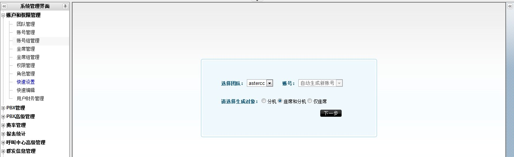

3. Haz clic en **Vista previa** para revisar lo que se va a crear, ajusta si hace falta, y luego en **Guardar**.

   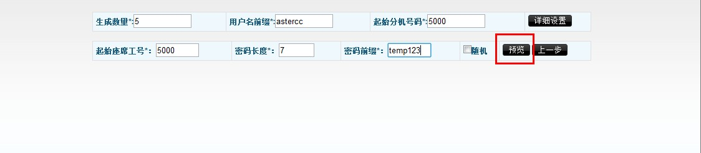

4. El sistema pregunta si quieres exportar el resultado a CSV — útil para no perder las contraseñas generadas.

   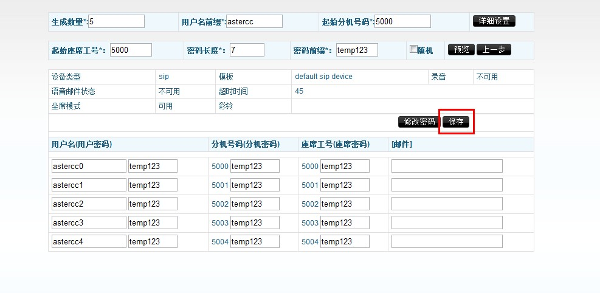

5. Aparecerá una barra de **recarga** en la parte superior: haz clic en ella para que los cambios tomen efecto.

   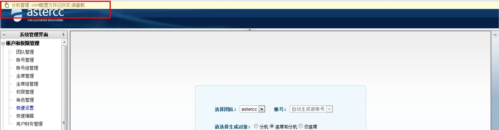

### 1.1 Alternativa: crear equipo, cuenta, permisos y agente uno por uno

La configuración rápida del paso 1 genera todo en lote. Si prefieres (o necesitas) crear cada pieza manualmente, la jerarquía y el orden recomendado son:

**Equipo → cuenta (+ grupo de cuentas) → permisos y roles → extensión → agente (+ grupo de agentes).**

- Un **equipo** (`Cuentas y permisos → Gestión de equipos`) representa una organización o línea de negocio independiente — puede ser una empresa cliente completa (si administras varios clientes) o una unidad de negocio dentro de tu propia empresa. Cada equipo tiene un identificador único (ej. `astercc`), límites máximos configurables (cuentas, agentes, dispositivos, colas, salas de conferencia), su propio troncal/grupo de troncales por defecto, y listas negra/blanca de números. El identificador de equipo es el prefijo que después se usa en el usuario SIP (`equipo-extensión`).
- Una **cuenta** (`Cuentas y permisos → Gestión de cuentas`) es la unidad de inicio de sesión y de facturación dentro de un equipo. El tipo de cuenta puede ser **administrador del sistema** (gestiona todos los equipos), **administrador de equipo** (gestiona solo su equipo) o **usuario** (solo ve lo que su rol le permite). Al guardar una cuenta nueva aparece un asistente para agregarle extensiones de inmediato.
- Un **grupo de cuentas** (`Cuentas y permisos → Gestión de grupos de cuentas`) agrupa cuentas de un mismo equipo para aplicarles tarifas de forma unificada (ver [tarifas por grupo de cuentas](#9-configurar-tarifas)) — no es obligatorio, pero simplifica administrar muchas cuentas.
- **Permisos y roles** (`Cuentas y permisos → Gestión de permisos` y `→ Gestión de roles`): primero se activan los permisos de cada pantalla del sistema; después se crea un **rol** (de tipo usuario o de tipo agente) y se le asignan los permisos activados. Cada cuenta o agente se vincula finalmente a un rol, que determina qué pantallas puede ver y qué puede hacer en cada una.
- Una **extensión** (`PBX → Gestión de dispositivos`) es el dispositivo (softphone, gateway, teléfono IP, o incluso una línea externa) que usa una cuenta para llamar. Puede crearse desde el asistente al guardar la cuenta, desde el botón "Agregar dispositivo" en la edición de la cuenta, o directamente en Gestión de dispositivos. Campos clave: nombre del dispositivo, número de extensión (interno), identificador de registro (`equipo-extensión`, generado automáticamente — se usa como `user name` del softphone) y contraseña de registro (se usa como `password` del softphone). Cada extensión admite lista negra y lista blanca de números propia.
- Un **agente** (`Cuentas y permisos → Gestión de agentes`) es la unidad de trabajo de call center: un número de agente (numérico, de 2+ dígitos), una contraseña de agente (solo dígitos, se usa para iniciar sesión en modo agente o hacer check-in por teléfono), y una extensión asociada (puede ser fija, elegible por el propio agente al conectarse, o adaptativa — el sistema detecta automáticamente el softphone registrado desde la misma IP). Cada agente pertenece exactamente a una cuenta.
- Un **grupo de agentes** (ver paso 2 más abajo) agrupa agentes y se corresponde uno a uno con una cola.

Para una prueba rápida de dos extensiones sin pasar por todo el flujo anterior: inicia sesión como `admin`/`admin`, abre la extensión en **PBX → Gestión de dispositivos** para obtener su identificador y contraseña de registro, y regístralos directamente en dos softphones (ver [Configurar softphones](configurar-softphones.md)) — así puedes marcar entre ambas extensiones para validar que la instalación funciona antes de configurar nada más.

### 2. Crear un grupo de agentes (cola)

Un agente necesita pertenecer a un [grupo de agentes](../glosario.md#cola-grupo-de-agentes) para poder trabajar.

1. Ve a **Cuentas y permisos → Gestión de grupos de agentes** y haz clic en **Agregar**.

   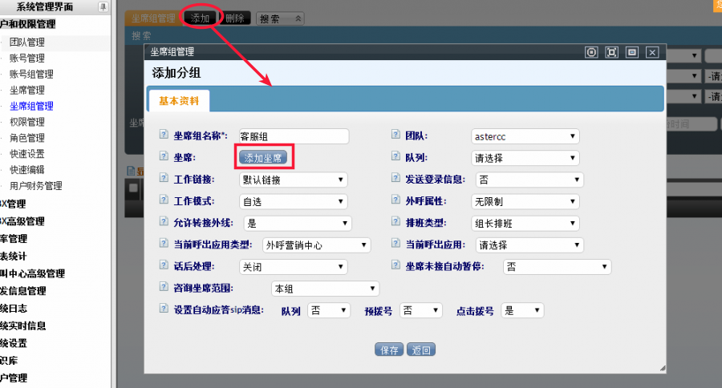

2. Agrega los agentes creados en el paso anterior al grupo (puedes usar "Seleccionar todos").

   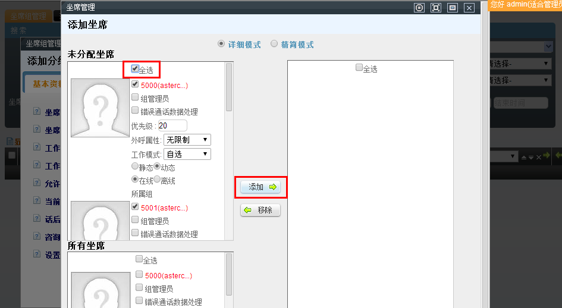

3. Designa a uno de los agentes como **administrador del grupo** (jefe de equipo).

   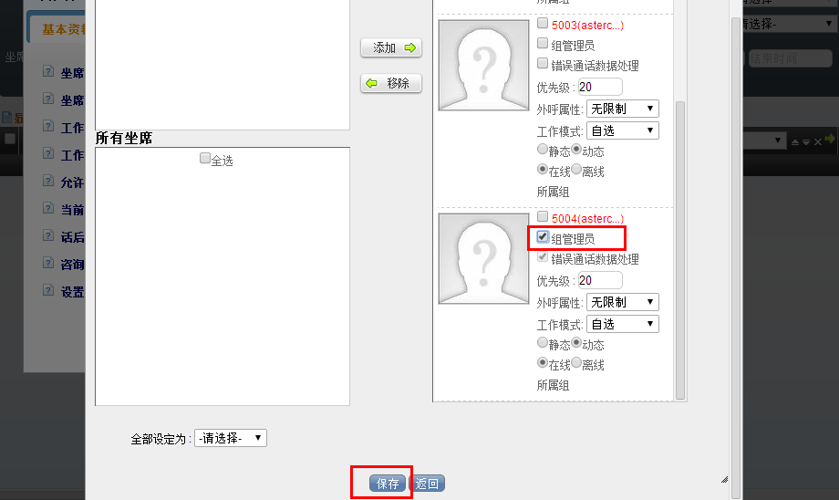

4. Al guardar, el sistema pregunta si quieres crear automáticamente una cola asociada — acepta. Un grupo de agentes y su cola tienen relación uno a uno.

   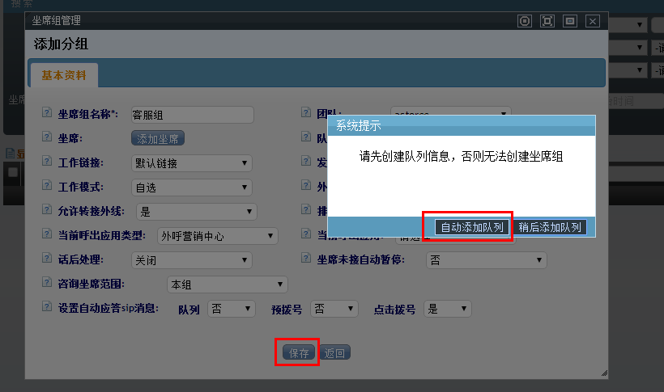

5. Recarga el sistema (barra de recarga) para aplicar el cambio.

   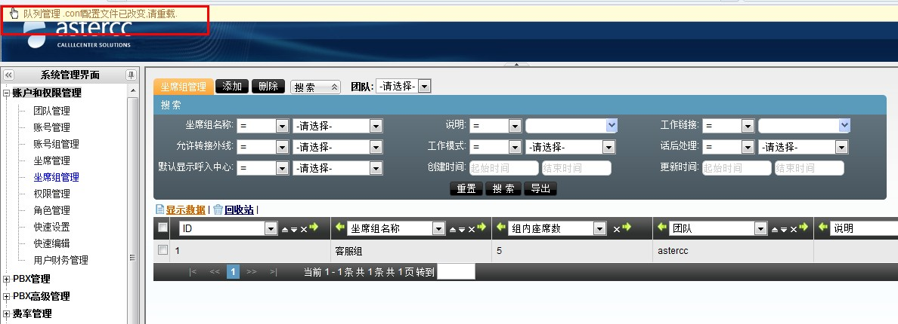

!!! tip "Agregar solo extensiones, o extensiones y agentes juntos, en lote"
    **Cuentas y permisos → Configuración rápida** también permite generar en lote **solo extensiones** (sin cuenta ni agente nuevos — útil para ampliar dispositivos de una cuenta existente) o **agentes y sus extensiones asociadas juntos** en un solo paso (extensión y agente quedan vinculados automáticamente). Elige el objeto a generar (extensión / agente y extensión / agente) antes de definir cantidad, prefijo y numeración inicial — el resto de los campos es igual al del paso 1.

### 3. Configurar un softphone

1. Descarga un softphone compatible con SIP 2.0 (X-Lite, Zoiper o eyeBeam).
2. Configura la cuenta SIP usando el formato `<equipo>-<extensión>` como usuario (ej. `astercc-5000`, **no** `5000` solo), y la contraseña generada en el paso 1.

   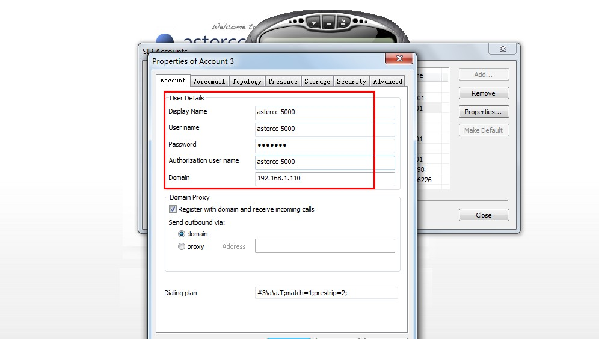

3. Puedes confirmar usuario/contraseña de registro en **Módulos → PBX → Gestión de extensiones**.

   
4. Si el registro falla, los códigos de error más comunes son:
   - **403 Forbidden:** usuario o contraseña incorrectos — confirma el formato `equipo-extensión`.
   - **408 Request Timeout:** el softphone no encuentra el servidor — revisa firewall y red.

Para las instrucciones exactas de configuración de cuenta SIP en Eyebeam, X-Lite y Zoiper (con captura de cada campo), ver [Configurar softphones: Eyebeam, X-Lite y Zoiper](configurar-softphones.md).

### 4. Configurar un troncal

1. Ve a **PBX → Troncales** y haz clic en **Agregar**.
2. Completa los datos según lo que te dé tu proveedor SIP (ITSP). Configuración típica por usuario/contraseña:
   ```
   username=<usuario>
   fromuser=<usuario>
   host=<ip-del-troncal>
   fromdomain=<ip-del-troncal>
   secret=<contraseña>
   port=5060
   ```

   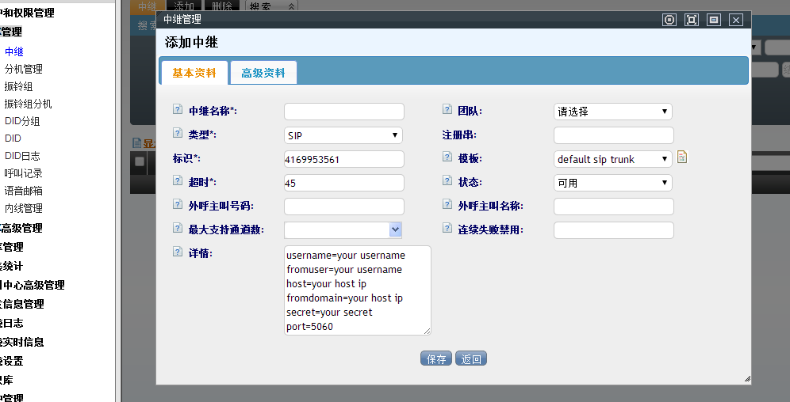

   Configuración típica por IP (sin registro):
   ```
   host=<ip-del-troncal>
   fromdomain=<ip-del-troncal>
   port=5060
   ```

   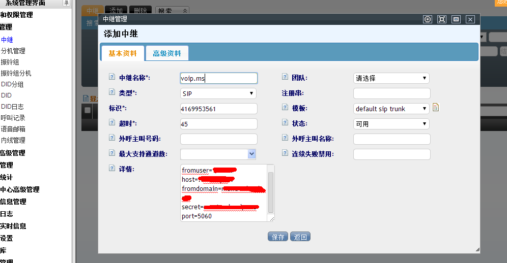

3. Al guardar, si el equipo no tiene un troncal saliente por defecto, el sistema pregunta si quieres asignar este troncal como predeterminado para las llamadas salientes del equipo.

   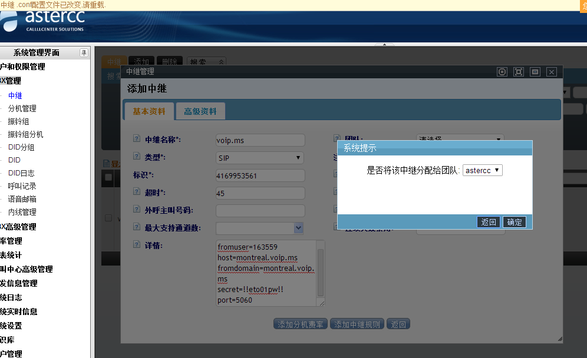

4. Recarga el sistema. Si todo está bien, la columna **Estado** del troncal se muestra en verde.
5. Prueba una llamada saliente desde el softphone. Códigos de error comunes:
   - **486 Not Acceptable Here:** códec de voz incompatible entre el troncal y el softphone (revisa soporte de g729 si aplica).
   - **603 Declined:** normalmente autenticación del troncal — revisa si el troncal exige verificación del número que llama. Si el troncal lo exige, puedes forzar un Caller ID específico para ese troncal.

#### Recibir llamadas por el troncal: cadena de registro

Lo anterior habilita llamadas **salientes**. Para que el troncal también pueda **recibir** llamadas (por ejemplo, un número DID comprado a un proveedor VoIP), el troncal necesita registrarse contra la central del proveedor mediante una **cadena de registro** (registry string), con el formato:

```
usuario:contraseña@ip:puerto
```

El proveedor VoIP es quien entrega el usuario, la contraseña y la IP/puerto de la línea. Se escribe en el campo de registro del troncal (edición del troncal); una vez registrado, las llamadas entrantes hacia ese número llegan al sistema y pueden enrutarse a una extensión o a un grupo de timbrado (ver siguiente sección) o a una ruta entrante (paso 6).

### 5. Configurar un grupo de timbrado (ring group)

Un **grupo de timbrado** agrupa varias extensiones para que timbren juntas ante una llamada entrante, según una estrategia de timbrado.

1. Ve a **PBX → Grupos de timbrado** y haz clic en **Agregar**.
2. Completa los campos:
   - **Nombre del grupo de timbrado** y **extensión interna** (para llamadas internas hacia el grupo).
   - **Estrategia de timbrado** — el sistema ofrece cinco:
     | Estrategia | Comportamiento |
     |---|---|
     | Timbrar todas | Todas las extensiones timbran simultáneamente. |
     | Timbrado secuencial | Timbran una por una en el orden configurado hasta que alguna responda; la siguiente llamada repite el mismo orden desde el inicio. |
     | Timbrado rotativo | Como el secuencial, pero la siguiente llamada empieza en la extensión posterior a la que respondió la última vez. |
     | Timbrado incremental | Empiezan a timbrar de una en una y se van sumando extensiones sin dejar de timbrar las anteriores, hasta que todas timbran. |
     | Timbrado a la libre | Se busca al azar una extensión disponible y solo esa timbra. |
   - **Equipo** al que aplica el grupo.
3. Mueve las extensiones deseadas de la lista izquierda a la derecha para incluirlas en el grupo.
4. Guarda. El grupo de timbrado ya puede usarse como destino de una ruta entrante o de la cadena de registro de un troncal.

### 6. Configurar una ruta entrante

1. Primero da de alta un **DID** — el número público que anuncias a tus clientes — en **PBX → DID → Agregar**: ingresa el número, el equipo y la cuenta a la que pertenece.
2. Ve a **PBX avanzado → Rutas entrantes** y haz clic en **Agregar**.
3. Define el destino de transferencia (por ejemplo, transferir a la cola creada en el paso 2, a un grupo de timbrado del paso 5, o a una extensión) y un nombre descriptivo para esa transferencia; en **Coincidencia de DID** elige coincidencia simple e indica el DID del paso 1; en **Coincidencia de troncal** elige el troncal configurado en el paso 4.

   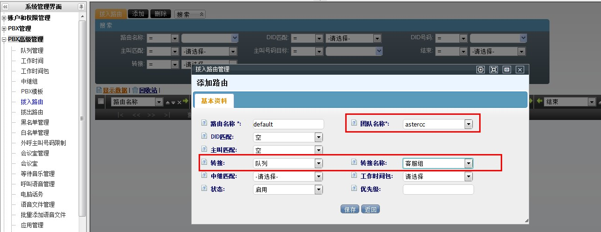

4. Guarda y recarga. A partir de ahora, las llamadas que entren por el DID configurado se enrutan según lo definido.

### 7. Buzón de voz y transferencia de llamadas

**Buzón de voz:** se activa por extensión. Edita la extensión (**PBX → Gestión de dispositivos**), abre **Información avanzada** y pon el **estado del buzón de voz** en disponible. Cuando una llamada no es contestada, el sistema la transfiere automáticamente al buzón; el mensaje puede escucharse en línea, descargarse o eliminarse desde **PBX → Gestión de buzones de voz**, o por teléfono marcando el código rápido del buzón (por defecto `*97`, configurable en **Configuración del sistema → Códigos rápidos**).

**Transferencia de llamadas (call forwarding):** se configura y se dispara con **códigos rápidos** (teclas que el propio usuario marca desde su teléfono) y **teclas de acceso rápido en llamada** (hot keys, que se presionan durante una llamada activa):

| Función | Cómo se activa | Efecto |
|---|---|---|
| Reenvío de llamadas | Marcar el código rápido de reenvío (por defecto `*91`) y luego el número destino seguido de `#` | Todas las llamadas entrantes a esa extensión se reenvían al número indicado |
| Transferencia ciega | Durante la llamada, marcar la tecla de transferencia ciega (por defecto `*51`) | La llamada se transfiere de inmediato; si nadie contesta, se cuelga |
| Transferencia asistida (transferencia a agente) | Durante la llamada, marcar la tecla correspondiente (por defecto `#00`) | Se marca al destino y solo se completa la transferencia si el destino contesta y acepta; si no contesta, la llamada original se mantiene |

Tanto los códigos rápidos como las teclas de acceso rápido pueden configurarse por equipo (valores distintos por equipo) o dejarse en los valores predeterminados del sistema (aplican a todos los equipos que no tengan valores propios).

### 8. Instalar un módulo de negocio

1. Inicia sesión como administrador y entra a **Sistema → Gestión de módulos**.

   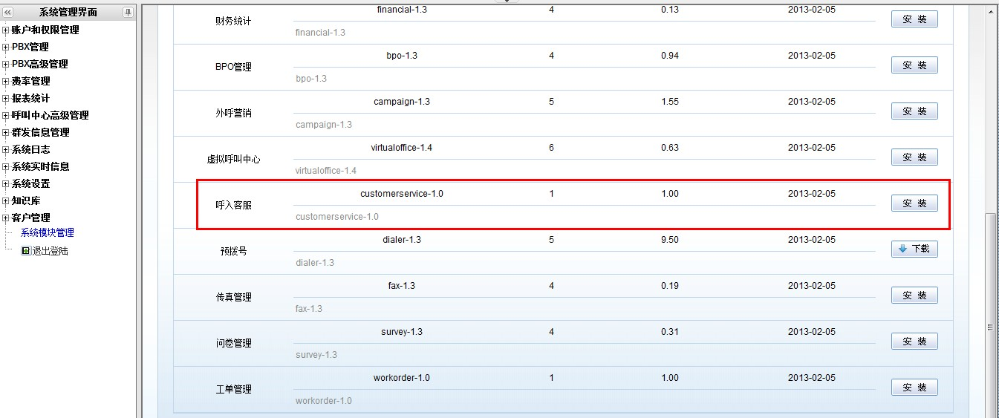

2. Elige el módulo que necesites (por ejemplo, Atención al cliente) y haz clic en **Instalar**.

   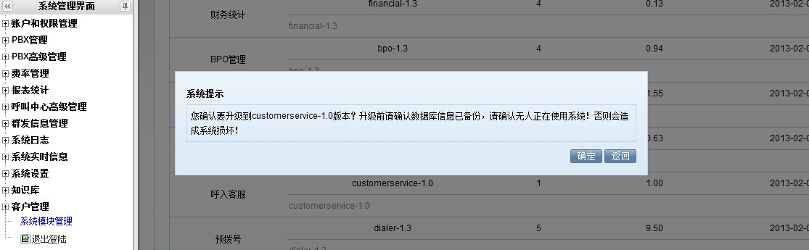

3. Confirma la instalación; al terminar, haz clic en **Finalizar**.

   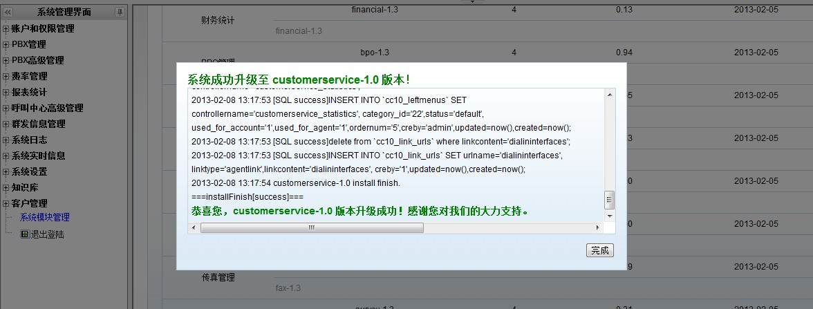

4. Configura el módulo (por ejemplo, en Atención al cliente: crea una tarea y asígnale el grupo de agentes del paso 2).

   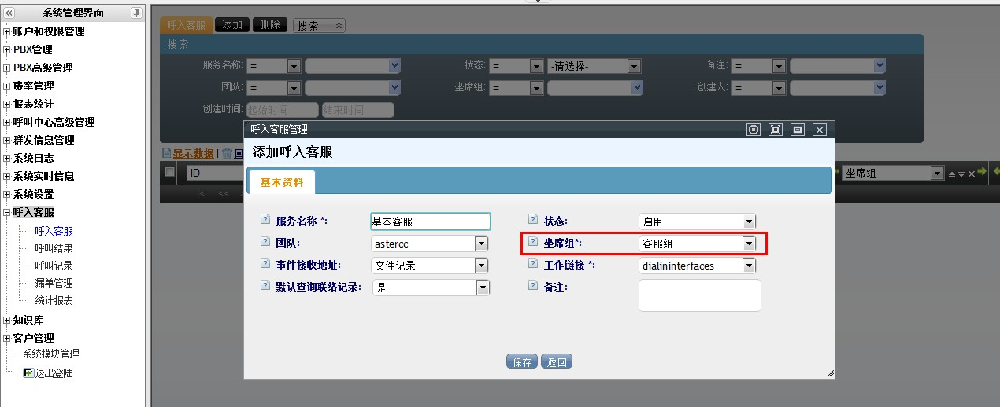
5. En **Cuentas y permisos → Grupos de agentes**, confirma que el grupo tenga vinculada la aplicación de negocio recién configurada como su flujo por defecto para llamadas entrantes/salientes.

   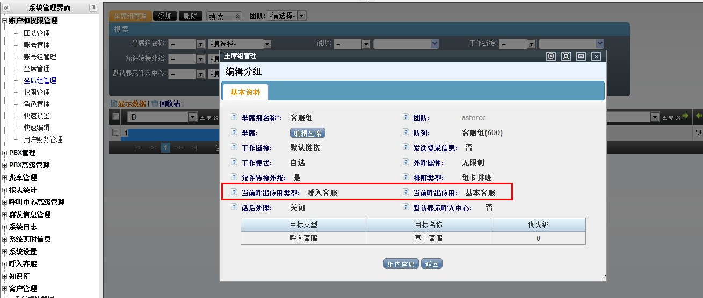

Además del módulo de atención al cliente usado como ejemplo, dos módulos de negocio frecuentes en la etapa inicial:

- **Electrónico comercio (e-commerce):** confirma primero que el módulo esté instalado (**Sistema → Gestión de módulos**). Después se da de alta el catálogo (**Electrónico comercio → Electrónico comercio** y **→ Gestión de productos**). Al usarlo dentro de una tarea de marcación saliente (ver abajo), la tarea muestra una pestaña de e-commerce donde el agente busca productos por nombre, tipo o código de barras, los agrega al carrito y guarda el pedido.
- **Marcación saliente (outbound):** un **plan de marcación** define quiénes participan (grupo de agentes), a quién llaman (paquete de clientes) y qué pueden ver/editar del cliente. Se crea en **Marcación saliente → Gestión de tareas de marcación**, elige primero el tipo de paquete de clientes — **individual** o **empresa** — y luego el paquete concreto (subconjunto de la tabla maestra de clientes, aislado para no afectar los datos originales). El paquete en sí se crea en **Marcación saliente → Paquetes de clientes**. Entre las funciones que trae de fábrica un plan de marcación: número de llamante configurable, campos de cliente personalizables, exportación con columnas y orden a elección, distintos horarios de trabajo por tarea, asignación automática o manual de clientes, varios modos de gestión posterior, devolución programada, calificación de agente, resultados de llamada personalizados, lista de no llamar, devolución de llamadas perdidas, marcación directa, marcación con vista previa y **marcación automática** (ver abajo). Referencia completa en la futura página de [Marcador y campañas](../modulos/index.md).
- **Marcación automática (auto-dial):** dentro de un plan de marcación, en información avanzada elige el modo de marcación del agente **"automático"** (o "a elección del agente"). A diferencia del predial (ver abajo), la marcación automática solo llama a clientes de la lista personal del agente marcados como "sin procesar" o "seguimiento continuo", contacta primero al agente y solo después al cliente (sin tiempos de espera para el cliente), y respeta la hora de reintento programada y los números alternativos del cliente.
- **Predial (pre-dial):** requiere una tarea de marcación saliente y no está disponible si la tarea usa la tabla maestra de clientes. El sistema marca de antemano un lote de clientes; solo cuando un cliente contesta se le asigna un agente disponible — así el agente nunca espera un tono de "ocupado" o "no contesta". Los clientes se agregan a la lista de predial **reciclando** datos desde el paquete de clientes (manual, por filtro programado, o al importar) — el reciclado cambia el **estado de predial** del cliente a "por marcar"; los estados "por marcar" y "conectado con agente" no necesitan reciclarse de nuevo.
- **Campos personalizados:** cuando los campos estándar de cliente no bastan, se agregan campos personalizados por **paquete de clientes**, por **tabla maestra de clientes**, por **usuario de call center virtual**, o por **orden de trabajo**, cada uno desde la pantalla de gestión de campos personalizados del módulo correspondiente.
- **Lista de no llamar y lista negra:** la **lista de no llamar** filtra clientes de un paquete que no deben ser contactados (**Marcación saliente → Lista de no llamar**); la **lista negra** de llamadas entrantes bloquea números para que no puedan llamar al sistema, a un equipo, a una cuenta o a una extensión (**PBX avanzado → Lista negra de entrada**). Ambas se pueden dar de alta una por una o importarlas en lote (ver paso 11).
- **Grabaciones — respaldo y descarga:** todas las llamadas de agentes quedan grabadas en el propio servidor, sin equipo adicional. Se escuchan en línea desde el historial de llamadas (**PBX → Historial de llamadas** y el historial propio de cada módulo de negocio), y desde la pantalla de control de calidad. Las descargas grandes se hacen como tarea en segundo plano desde **Administración avanzada del call center**, descargable una vez procesada — el administrador puede desactivar la descarga web por seguridad. El respaldo automático (cuándo se ejecuta y en qué ruta se guarda) se configura en **Configuración del sistema → Gestión de archivos de grabación**.

### 9. Configurar tarifas

AsterCC calcula el costo de cada llamada saliente con un mecanismo de tarifas en tres niveles, que se evalúan en este orden: **grupo de cuentas → equipo → sistema**. Dentro de un mismo nivel, la coincidencia se busca primero por prefijo + longitud exactos, luego por longitud, luego por prefijo, y por último por la tarifa `default`.

- **Tarifa de sistema** (**Tarifas → Tarifa de sistema**, solo administrador del sistema): representa el costo real de comprar la llamada — se usa para calcular el costo por troncal y el costo total del sistema.
- **Tarifa de equipo** (**Tarifas → Tarifa de equipo**): lo que el sistema le cobra al equipo — de solo lectura para el administrador de equipo.
- **Tarifa de extensión** (**Tarifas → Tarifa de extensión**): además de facturar, decide **qué troncal usar** para la llamada saliente — si no se asigna un grupo de cuentas, la tarifa aplica a todo el equipo.

Campos comunes a las tres tarifas: **prefijo del número** (ej. `0` nacional, `00` internacional, `default` cualquier número), **longitud del número** (`0` = sin límite), **destino** (nombre descriptivo, ej. "llamada local"), **tarifa de conexión** (costo dentro del tiempo inicial configurado), **tarifa por minuto**, **ciclo de facturación**, **estado** (activa/inactiva) y **troncal** a cobrar. Si no seleccionas un troncal en la tarifa de sistema, el costo se registra igual pero no se suma al costo de ningún troncal en particular.

### 10. Usar los estados de cuenta (facturación)

1. Activa la facturación periódica en **Configuración del sistema → Configuración del sistema → pestaña de facturación**: día del mes en que se genera el estado de cuenta, ciclo de facturación (qué período cubre), día de pago y porcentaje de interés sobre saldos vencidos.
2. Con la facturación activa, el sistema genera automáticamente tres niveles de estado de cuenta, todos consultables y enviables por correo desde **Financiero**:
   - **Estado de cuenta del sistema** (**Financiero → Estado de cuenta del sistema**): el total de todos los equipos.
   - **Estado de cuenta de equipo** (**Financiero → Estado de cuenta de equipo**): el total de todas las cuentas de un equipo.
   - **Estado de cuenta de cuenta** (**Financiero → Estado de cuenta de cuenta**): el detalle de una cuenta individual.
3. En cada nivel, el botón **Ver** abre el detalle y **Enviar** lo manda por correo al contacto registrado, usando la plantilla configurada en **Mensajería masiva → Gestión de plantillas** (hay una plantilla por tipo de estado de cuenta).

### 11. Importar y exportar datos en lote

- **Importar:** en **Administración avanzada del call center → Importación de datos**, sube un archivo `.csv` o `.xls`, elige el equipo y la tabla destino (paquete de clientes, tabla maestra de clientes, lista negra de llamadas entrantes, o tabla de destinatarios de mensajería masiva), y mapea cada columna del archivo a un campo del sistema — los campos obligatorios se marcan en rojo. Al confirmar se crea una tarea de importación que corre en segundo plano. También se puede importar la **ubicación geográfica de números** (prefijo → país/provincia/ciudad/operador) para no tener que darla de alta manualmente prefijo por prefijo.
- **Exportar:** el botón de exportar en cualquier pantalla de listado exporta de inmediato los resultados filtrados (`.xls` o `.csv`, configurable en **Configuración del sistema**). Para volúmenes grandes, el sistema crea en cambio una **tarea de exportación** (**Administración avanzada del call center → Gestión de archivos de exportación**) que corre en un horario permitido — por defecto solo después de las 20:00, para no competir con la actividad de los agentes ni bloquear las tablas de clientes en horario laboral; el horario límite se ajusta en **Configuración del sistema**.

## Referencia rápida

| Tarea | Dónde |
|---|---|
| Crear cuentas/extensiones/agentes en lote | Cuentas y permisos → Configuración rápida |
| Crear equipo / cuenta / agente uno por uno | Cuentas y permisos → Gestión de equipos / cuentas / agentes |
| Activar permisos y crear roles | Cuentas y permisos → Gestión de permisos / Gestión de roles |
| Crear grupo de agentes (cola) | Cuentas y permisos → Gestión de grupos de agentes |
| Configurar troncal | PBX → Troncales |
| Configurar grupo de timbrado | PBX → Grupos de timbrado |
| Configurar DID y ruta entrante | PBX → DID; PBX avanzado → Rutas entrantes |
| Buzón de voz | PBX → Gestión de dispositivos (Información avanzada) |
| Configurar tarifas | Tarifas → Tarifa de sistema / equipo / extensión |
| Ver y enviar estados de cuenta | Financiero → Estado de cuenta del sistema / equipo / cuenta |
| Importar o exportar datos en lote | Administración avanzada del call center → Importación de datos |
| Instalar módulo de negocio | Sistema → Gestión de módulos |
| Formato de usuario SIP | `equipo-extensión` (ej. `astercc-5000`) |

---

## Fuentes

- `raw/zh/新手上路/快速配置手册.txt`
- `raw/zh/新手上路/模块创建说明.txt`
- `raw/zh/新手上路/添加团队.txt`
- `raw/zh/新手上路/添加账号.txt`
- `raw/zh/新手上路/添加账号组.txt`
- `raw/zh/新手上路/权限和角色的管理.txt`
- `raw/zh/新手上路/添加分机.txt`
- `raw/zh/新手上路/添加分机和内线呼叫.txt`
- `raw/zh/新手上路/添加坐席.txt`
- `raw/zh/新手上路/添加坐席组.txt`
- `raw/zh/新手上路/如何快速批量添加分机.txt`
- `raw/zh/新手上路/如何快速批量添加坐席和分机.txt`
- `raw/zh/新手上路/快速设置.txt`
- `raw/zh/新手上路/快速注册两个分机进行互拨测试.txt`
- `raw/zh/新手上路/配置中继.txt`
- `raw/zh/新手上路/配置呼入和路由.txt`
- `raw/zh/新手上路/配置振铃组.txt`
- `raw/zh/新手上路/语音邮箱和呼叫转接.txt`
- `raw/zh/新手上路/设置费率.txt`
- `raw/zh/新手上路/账单的使用.txt`
- `raw/zh/新手上路/如何使用电子商务模块.txt`
- `raw/zh/新手上路/建立一个外呼计划.txt`
- `raw/zh/新手上路/数据回收.txt`
- `raw/en/newbie/quick_start.txt`
- `raw/en/newbie/add_a_team.txt`
- `raw/en/newbie/add_account.txt`
- `raw/en/newbie/add_an_agent.txt`
- `raw/en/newbie/add_an_agent_group.txt`
- `raw/en/newbie/add_the_extension.txt`
- `raw/en/newbie/configuring_a_trunk.txt`
- `raw/en/newbie/configure_incoming_and_routing.txt`
- `raw/en/newbie/configure_the_ring_group.txt`
- `raw/en/newbie/voicemail_and_call_forwarding.txt`
- `raw/en/newbie/set_rates.txt`
- `raw/zh/呼叫中心常用功能简介/外呼功能.txt`
- `raw/zh/呼叫中心常用功能简介/自动拨号.txt`
- `raw/zh/呼叫中心常用功能简介/预拨号.txt`
- `raw/zh/呼叫中心常用功能简介/自定义字段.txt`
- `raw/zh/呼叫中心常用功能简介/禁拨列表和黑名单.txt`
- `raw/zh/呼叫中心常用功能简介/数据导入和导出.txt`
- `raw/zh/呼叫中心常用功能简介/录音的收听_下载和备份.txt`