# Guía rápida para agentes

## Qué es

Esta guía cubre lo mínimo que un agente necesita saber para empezar a trabajar en AsterCC: iniciar sesión, conectarse a su grupo de agentes, y las funciones básicas del día a día.

## Cómo se usa

### 0. Cómo se relacionan tu cuenta, tu número de agente y tu extensión

- Tu **cuenta** es con la que inicias sesión (usuario y contraseña que te dio tu administrador).
- Tu **número de agente** identifica tu trabajo dentro del call center (por ejemplo, para el check-in por teléfono o para que se anuncie tu número antes de una llamada). Cada cuenta tiene como máximo un agente.
- Tu **extensión** es el dispositivo con el que realmente hablas — un softphone, un teléfono IP, o incluso un número externo. La extensión puede estar fija para tu agente, o puede ser de las que eliges tú mismo al conectarte, o adaptativa (el sistema detecta el softphone registrado desde tu misma IP y lo usa automáticamente).

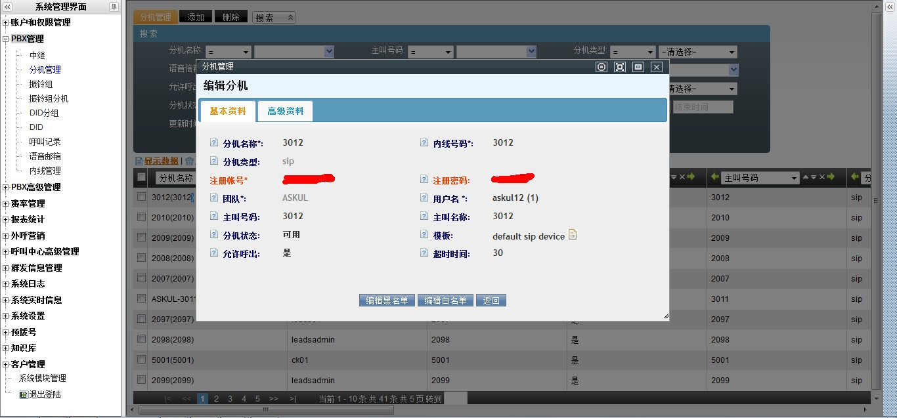

### 1. Iniciar sesión

Entra a la plataforma con tu cuenta de agente (usuario y contraseña que te dio tu administrador).

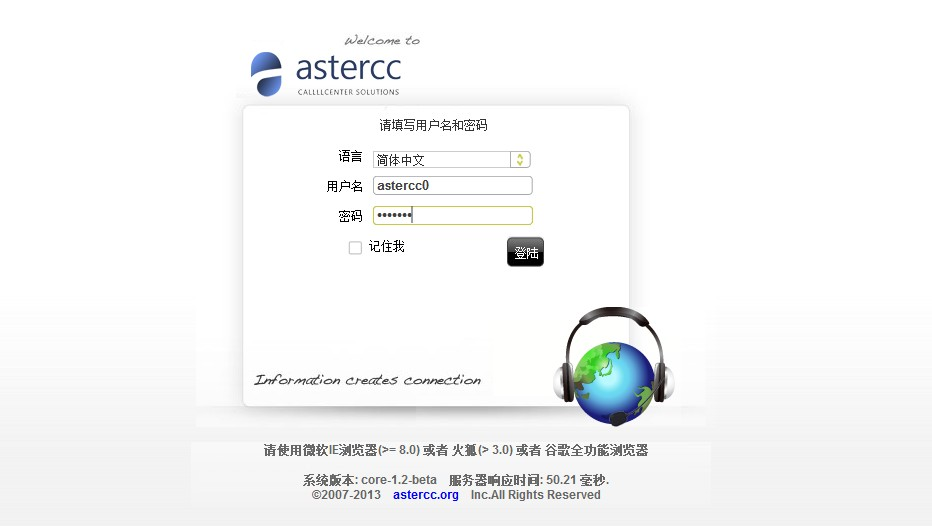

### 2. Conectarte a tu(s) cola(s)

Un agente debe [iniciar sesión en su cola](../glosario.md#iniciar-cerrar-sesion-en-cola-check-in-check-out) antes de poder recibir llamadas.

1. Haz clic en el botón **Iniciar sesión** de la barra de herramientas — quedarás conectado a todos los grupos de agentes a los que perteneces.

   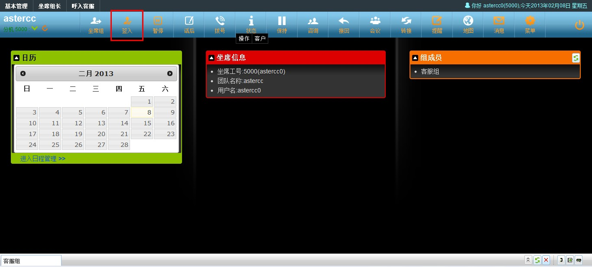

2. Si perteneces a más de un grupo y quieres elegir en cuáles conectarte, abre el panel de **grupo de agentes** y marca las casillas de las colas donde quieres iniciar sesión, seleccionando también tu modo de trabajo y modo de gestión posterior para cada una.

   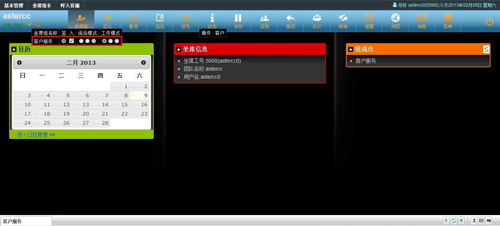

### 3. Hacer y recibir llamadas

- Para marcar, usa el panel de marcación: elige la cola de salida (si aplica), ingresa el número, y confirma.
- El panel de llamadas muestra el estado de la llamada en curso: **rojo** significa que el destino está timbrando, **verde** que ya contestó.

   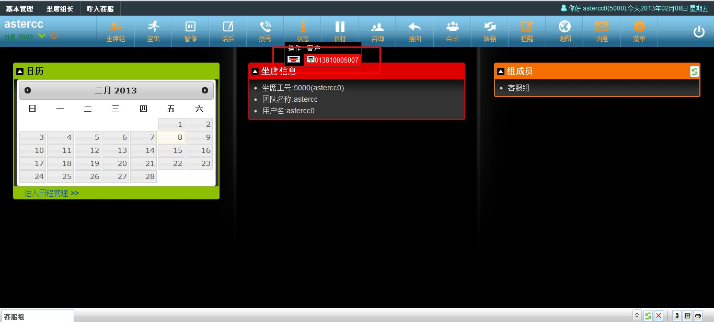

   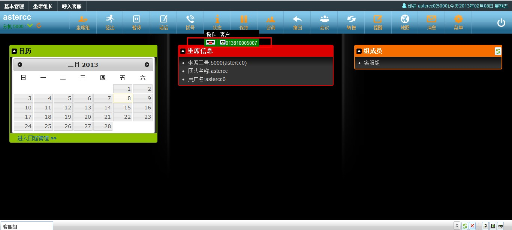

- Durante una llamada activa puedes usar [consulta, transferencia, recuperar llamada o conferencia](../glosario.md#consulta-transferencia-recuperar-y-conferencia) desde los botones correspondientes, o poner la llamada en **espera** (el cliente escucha música de espera mientras tanto) y reanudarla con un clic.

   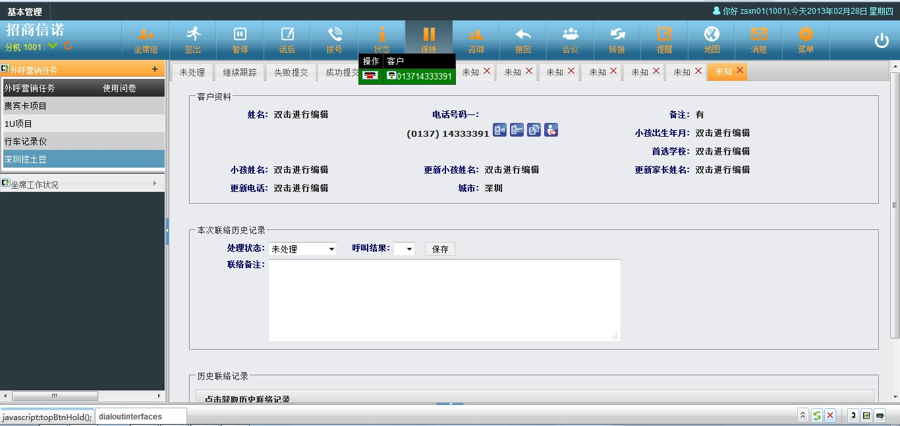

- Para marcar sin usar el teclado del panel, puedes hacer **clic para llamar** desde la ficha del cliente en el módulo de negocio que uses — el sistema te llama primero a ti (conviene tener el softphone en auto-respuesta) y, cuando contestas, marca al cliente.

   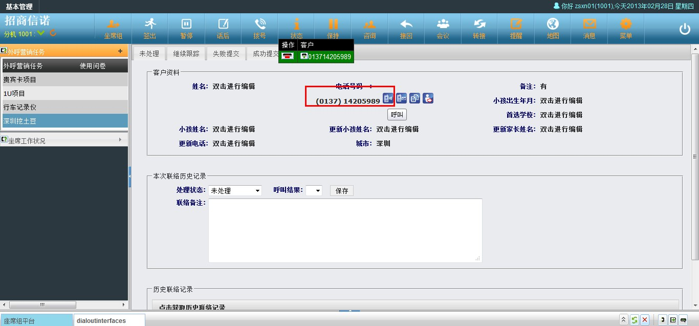

- Solo puedes llamar desde la plataforma si estás conectado a un grupo de agentes que tenga una aplicación de negocio vinculada; si no, marca directamente desde tu softphone.

### 4. La ficha emergente (pantalla de contexto)

Cuando tu teléfono timbra o contestas, el sistema puede mostrarte automáticamente una **ficha emergente** con los datos relevantes de esa llamada — por ejemplo la ficha del cliente (buscada por su número) o la ruta que siguió en el IVR. Qué ficha se muestra depende de cómo llegó la llamada:

| Tipo de llamada | Qué determina la ficha |
|---|---|
| Llamada saliente directa (marcada desde tu teléfono) | El grupo de agentes que tengas seleccionado como grupo actual |
| Clic para llamar | El grupo de agentes y la aplicación de negocio activos en ese momento |
| Llamada entrante directa (DID, grupo de timbrado) | La vinculación de aplicación configurada para esa ruta de entrada |
| Llamada de cola (ACD) — la más común | La aplicación de negocio vinculada al grupo de agentes por el que entró la llamada |

Para que la ficha aparezca, tu extensión debe tener activado el **modo agente** y tú debes estar conectado (check-in) — por panel o marcando `*64` desde tu teléfono.

### 5. Funciones básicas del día a día

| Función | Para qué sirve |
|---|---|
| Llamadas perdidas | Ver llamadas que entraron a una cola y no fueron atendidas por ningún agente; puedes devolver la llamada o generar una orden de trabajo. |
| Historial de llamadas | Consultar tus propias llamadas y sus grabaciones. |
| Pausa | Marcarte como no disponible temporalmente, indicando un motivo — el motivo y el tiempo total en pausa se reflejan en los reportes. Solo puedes pausarte cuando estás libre o en gestión posterior, no durante una llamada. |
| Recordatorios | Avisos de tareas o mensajes pendientes — el ícono parpadea cuando hay algo nuevo. |
| Correo, SMS y fax | Si tu equipo tiene estos canales configurados, se gestionan desde la misma plataforma, junto con las llamadas. |

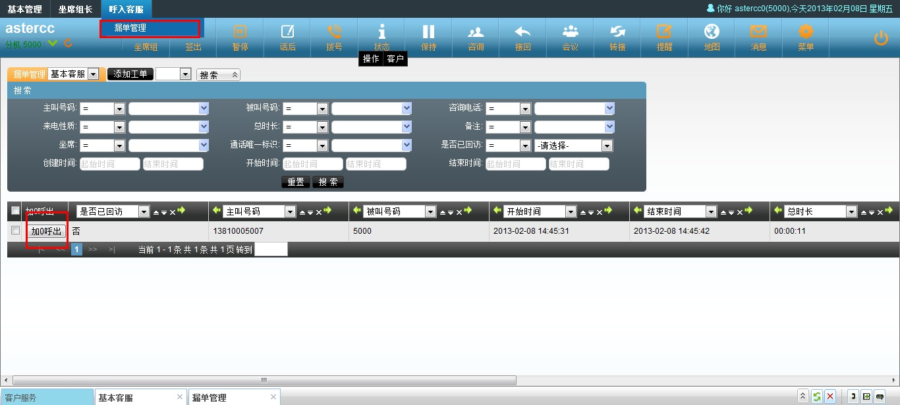

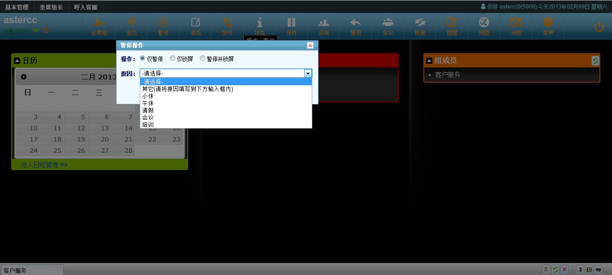

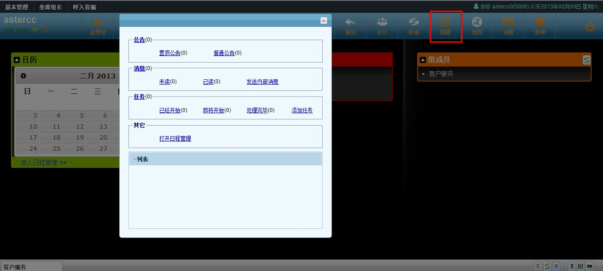

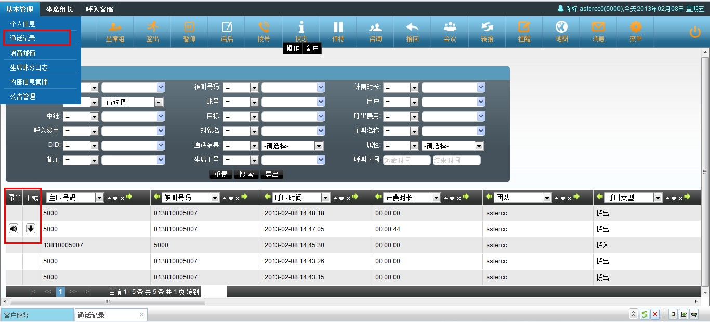

### 6. Panel de grupo de agentes, modo de trabajo y gestión posterior

Cada grupo de agentes al que perteneces aparece como una columna en este panel:

- El botón de selección marca cuál es tu **grupo actual** — las llamadas que hagas directamente desde tu extensión quedan asociadas a ese grupo.
- La casilla de verificación indica si estás conectado (check-in) a ese grupo.
- El **modo de gestión posterior** (ACW) define qué pasa después de colgar — mientras estás en gestión posterior, la cola no te asigna llamadas nuevas:
  - **Al timbrar:** entras en gestión posterior en cuanto tu teléfono deja de timbrar, hayas contestado o no.
  - **Al contestar:** solo entras en gestión posterior si llegaste a contestar la llamada.
  - **Deshabilitado:** nunca entras en gestión posterior automáticamente.
- El **modo de trabajo** define qué llamadas recibes en ese grupo:
  - **Todas:** puedes recibir asignaciones de la cola y hacer llamadas salientes.
  - **Solo entrantes:** únicamente recibes las llamadas que la cola te asigna.
  - **Solo salientes:** la cola no te asigna llamadas, pero puedes marcar salientes libremente.

## Referencia rápida

| Acción | Dónde |
|---|---|
| Conectarte a todas tus colas | Botón "Iniciar sesión" en la barra de herramientas |
| Elegir colas específicas | Panel de grupo de agentes |
| Ver llamadas perdidas | Panel de llamadas perdidas |
| Marcarte en pausa | Botón de pausa, con motivo |
| Poner una llamada en espera | Botón de espera en el panel de llamada activa |
| Clic para llamar | Ficha del cliente en el módulo de negocio |

---

## Fuentes

- `raw/zh/新手上路/快速配置手册.txt`
- `raw/zh/呼叫中心常用功能简介/坐席功能.txt`
- `raw/zh/呼叫中心常用功能简介/弹屏功能.txt`